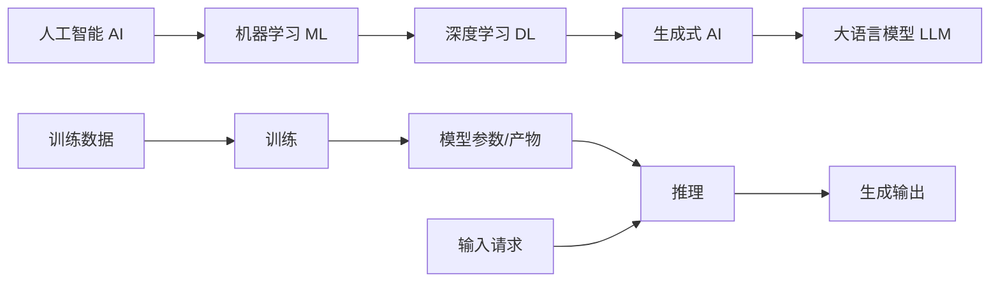
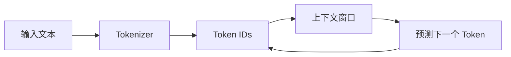

<!-- 本文件由 scripts/generate_course_tutorials.py 生成，请修改阶段计划或生成器后重新生成。 -->

# 第 01 周教程：LLM 工程基础

> 计划来源：[01-ai-tools-and-engineering.md](../stages/01-ai-tools-and-engineering.md)。阶段文档决定课程任务和验收，本文件解释逐节学习方法；学习状态仍只记录在[第 01 周成果](../../deliverables/week-01/README.md)。

## 本周先理解

### 为什么学

建立不把模型当数据库、搜索引擎或确定性函数的工程直觉，后续才能正确解释质量、成本和失败。

### 这是什么

LLM 工程基础是把训练、推理、Token、Embedding、采样和幻觉变成可观察实验的心智模型，不要求推导数学公式。

### 本周语言定位

默认使用 Python 3.11+，以较少样板观察 AI 原理和原生协议；记录虚拟环境、依赖版本、pytest 命令和失败结果。完整职责、切换桥接和替代规则见[开发语言路线](../01-language-roadmap.md)。

### 本周学习策略

- 每天只完成下面一节，控制在约 1 小时，不提前堆叠下一节的新概念。
- 先预测再实验；先保存原始证据，再写结论；失败样例与正常结果同等重要。
- 首次遇到术语时补齐：一句话定义、输入输出、开发类比、类比边界、反例和“不是什么”。
- 使用 H1→H4 提示阶梯；若使用完整参考答案，必须额外完成一个不同输入或约束的变体。

## 逐节教程

### 周一 · 第 1 节：AI、机器学习、深度学习、生成式 AI 与 LLM；训练和推理

**为什么学**

本周要建立不把模型当数据库、搜索引擎或确定性函数的工程直觉，后续才能正确解释质量、成本和失败。本节把“AI、机器学习、深度学习、生成式 AI 与 LLM；训练和推理”推进为可检查成果；如果跳过，后续会缺少“一张概念关系图和训练/推理输入输出说明”这项关键证据。

**这个是什么**

本周核心概念是：LLM 工程基础是把训练、推理、Token、Embedding、采样和幻觉变成可观察实验的心智模型，不要求推导数学公式。今天的“AI、机器学习、深度学习、生成式 AI 与 LLM；训练和推理”是这个核心能力的最小学习单元：你会通过“先画概念包含关系，再用“开发阶段构建产物、运行阶段处理请求”类比训练与推理；注明类比的局限”观察输入如何转化为“一张概念关系图和训练/推理输入输出说明”。它既包含可观察结果，也包含至少一个失败或不适用边界。只读完资料或只跑通正常路径，都不能证明已经掌握。

**怎么学（约 60 分钟）**

1. `0–5 分钟`：不查资料，写下你对本节主题的一句话解释、预期输入输出和一个疑问。
2. `5–15 分钟`：只阅读下方资料中与当前任务直接相关的部分，记录一个关键约束和版本信息。
3. `15–45 分钟`：执行专项任务：先画概念包含关系，再用“开发阶段构建产物、运行阶段处理请求”类比训练与推理；注明类比的局限
4. `45–55 分钟`：主动制造一个错误输入、边界条件、依赖失败或反例，保存现象并解释原因。
5. `55–60 分钟`：整理命令、输入、输出、Diff、图表或访谈证据，并用自己的语言完成 Teach-back。

专项资料：[Google 机器学习术语表](https://developers.google.com/machine-learning/glossary)

**怎么验证学会了**

- 必交证据：一张概念关系图和训练/推理输入输出说明。
- Teach-back：不看资料解释“AI、机器学习、深度学习、生成式 AI 与 LLM；训练和推理”解决什么问题、主要输入输出、一个边界，以及它不是什么。
- 失败证据：展示一个非正常场景，指出失败发生在哪一层，不能只贴错误截图。
- 变体任务：改变一个输入、参数、角色、权限或失败条件，在不照抄原步骤的情况下重新完成。
- 通过标准：以上四项均有证据，且能解释关键取舍；只能照步骤运行时最高算 L1，不能判定本节通过。

**参考答案（独立尝试至少 20 分钟后再看）**

> 这是一份合格答案骨架，不是唯一实现。看完后必须关闭参考答案，换一个输入或约束独立重做。

#### 步骤 1 参考：先写预测

- 一句话解释：LLM 工程基础是把训练、推理、Token、Embedding、采样和幻觉变成可观察实验的心智模型，不要求推导数学公式。
- 预测：完成“AI、机器学习、深度学习、生成式 AI 与 LLM；训练和推理”后，应能观察到“一张概念关系图和训练/推理输入输出说明”；失败输入不应产生假成功。

#### 步骤 2 参考：阅读资料

- 链接：[Google 机器学习术语表](https://developers.google.com/machine-learning/glossary)
- 指定章节/条目：术语条目 → artificial intelligence、machine learning、deep learning、generative AI、large language model、training、inference
- 阅读方法：只摘录一个定义、一个输入输出约束和一个失败边界；记录页面日期、协议版本或依赖版本。

#### 步骤 3 参考：按专项动作完成产出

- 专项动作：先画概念包含关系，再用“开发阶段构建产物、运行阶段处理请求”类比训练与推理；注明类比的局限
- 参考图（按实际角色、字段和状态修改）：



#### 步骤 4 参考：制造失败并解释

- 失败注入：加入无答案、非法 Schema、超时或工具失败输入，正确结果应是拒答或稳定失败状态；如果输出看似正常但证据缺失，应判为失败。
- 参考判断：失败必须映射为明确状态、错误、拒答、人工路径或未验证假设；日志和界面不得显示成功。

#### 步骤 5 参考：整理交付与 Teach-back

- 当天交付：一张概念关系图和训练/推理输入输出说明。
- 完整字段：范围与参与者；输入；主路径；异常/拒绝路径；输出；信任或责任边界；版本与图例。
- Teach-back 参考：本节输入是什么、经过了什么处理、输出如何验证、哪种失败最危险、为什么当前方案没有越过课程边界。
- 完成后变体：更换一个输入、参数、角色、权限或失败条件，不看上述样例重新完成。


### 周二 · 第 2 节：Token、Tokenizer、上下文与逐 Token 生成

**为什么学**

本周要建立不把模型当数据库、搜索引擎或确定性函数的工程直觉，后续才能正确解释质量、成本和失败。本节把“Token、Tokenizer、上下文与逐 Token 生成”推进为可检查成果；如果跳过，后续会缺少“Token 对比脚本、逐 Token 生成图和上下文限制说明”这项关键证据。

**这个是什么**

本周核心概念是：LLM 工程基础是把训练、推理、Token、Embedding、采样和幻觉变成可观察实验的心智模型，不要求推导数学公式。今天的“Token、Tokenizer、上下文与逐 Token 生成”是这个核心能力的最小学习单元：你会通过“先观察文本如何变成 Token，再用最小图解释 Transformer/Attention 如何利用上下文预测下一个 Token；不推导公式，不把字符数当 Token 数”观察输入如何转化为“Token 对比脚本、逐 Token 生成图和上下文限制说明”。它既包含可观察结果，也包含至少一个失败或不适用边界。只读完资料或只跑通正常路径，都不能证明已经掌握。

**怎么学（约 60 分钟）**

1. `0–5 分钟`：不查资料，写下你对本节主题的一句话解释、预期输入输出和一个疑问。
2. `5–15 分钟`：只阅读下方资料中与当前任务直接相关的部分，记录一个关键约束和版本信息。
3. `15–45 分钟`：执行专项任务：先观察文本如何变成 Token，再用最小图解释 Transformer/Attention 如何利用上下文预测下一个 Token；不推导公式，不把字符数当 Token 数
4. `45–55 分钟`：主动制造一个错误输入、边界条件、依赖失败或反例，保存现象并解释原因。
5. `55–60 分钟`：整理命令、输入、输出、Diff、图表或访谈证据，并用自己的语言完成 Teach-back。

专项资料：[Hugging Face Tokenizer 概览](https://huggingface.co/docs/transformers/main/tokenizer_summary)

**怎么验证学会了**

- 必交证据：Token 对比脚本、逐 Token 生成图和上下文限制说明。
- Teach-back：不看资料解释“Token、Tokenizer、上下文与逐 Token 生成”解决什么问题、主要输入输出、一个边界，以及它不是什么。
- 失败证据：展示一个非正常场景，指出失败发生在哪一层，不能只贴错误截图。
- 变体任务：改变一个输入、参数、角色、权限或失败条件，在不照抄原步骤的情况下重新完成。
- 通过标准：以上四项均有证据，且能解释关键取舍；只能照步骤运行时最高算 L1，不能判定本节通过。

**参考答案（独立尝试至少 20 分钟后再看）**

> 这是一份合格答案骨架，不是唯一实现。看完后必须关闭参考答案，换一个输入或约束独立重做。

#### 步骤 1 参考：先写预测

- 一句话解释：LLM 工程基础是把训练、推理、Token、Embedding、采样和幻觉变成可观察实验的心智模型，不要求推导数学公式。
- 预测：完成“Token、Tokenizer、上下文与逐 Token 生成”后，应能观察到“Token 对比脚本、逐 Token 生成图和上下文限制说明”；失败输入不应产生假成功。

#### 步骤 2 参考：阅读资料

- 链接：[Hugging Face Tokenizer 概览](https://huggingface.co/docs/transformers/main/tokenizer_summary)
- 指定章节/条目：Tokenizer summary → Tokenization pipeline、Encoding / Decoding
- 阅读方法：只摘录一个定义、一个输入输出约束和一个失败边界；记录页面日期、协议版本或依赖版本。

#### 步骤 3 参考：按专项动作完成产出

- 专项动作：先观察文本如何变成 Token，再用最小图解释 Transformer/Attention 如何利用上下文预测下一个 Token；不推导公式，不把字符数当 Token 数
- 参考图（按实际角色、字段和状态修改）：



#### 步骤 4 参考：制造失败并解释

- 失败注入：删掉一个必填输入或让依赖失败，系统应返回可解释的失败结果且不产生假成功；再根据日志、Diff 或流程证据定位原因。
- 参考判断：失败必须映射为明确状态、错误、拒答、人工路径或未验证假设；日志和界面不得显示成功。

#### 步骤 5 参考：整理交付与 Teach-back

- 当天交付：Token 对比脚本、逐 Token 生成图和上下文限制说明。
- 完整字段：范围与参与者；输入；主路径；异常/拒绝路径；输出；信任或责任边界；版本与图例。
- Teach-back 参考：本节输入是什么、经过了什么处理、输出如何验证、哪种失败最危险、为什么当前方案没有越过课程边界。
- 完成后变体：更换一个输入、参数、角色、权限或失败条件，不看上述样例重新完成。


### 周三 · 第 3 节：Embedding 与语义相似度

**为什么学**

本周要建立不把模型当数据库、搜索引擎或确定性函数的工程直觉，后续才能正确解释质量、成本和失败。本节把“Embedding 与语义相似度”推进为可检查成果；如果跳过，后续会缺少“可复现实验和失败解释”这项关键证据。

**这个是什么**

本周核心概念是：LLM 工程基础是把训练、推理、Token、Embedding、采样和幻觉变成可观察实验的心智模型，不要求推导数学公式。今天的“Embedding 与语义相似度”是这个核心能力的最小学习单元：你会通过“用 8–10 句自建样本计算相似度，加入一个词相近但语义相反的干扰项”观察输入如何转化为“可复现实验和失败解释”。它既包含可观察结果，也包含至少一个失败或不适用边界。只读完资料或只跑通正常路径，都不能证明已经掌握。

**怎么学（约 60 分钟）**

1. `0–5 分钟`：不查资料，写下你对本节主题的一句话解释、预期输入输出和一个疑问。
2. `5–15 分钟`：只阅读下方资料中与当前任务直接相关的部分，记录一个关键约束和版本信息。
3. `15–45 分钟`：执行专项任务：用 8–10 句自建样本计算相似度，加入一个词相近但语义相反的干扰项
4. `45–55 分钟`：主动制造一个错误输入、边界条件、依赖失败或反例，保存现象并解释原因。
5. `55–60 分钟`：整理命令、输入、输出、Diff、图表或访谈证据，并用自己的语言完成 Teach-back。

专项资料：[Sentence Transformers 语义相似度](https://www.sbert.net/docs/sentence_transformer/usage/semantic_textual_similarity.html)

**怎么验证学会了**

- 必交证据：可复现实验和失败解释。
- Teach-back：不看资料解释“Embedding 与语义相似度”解决什么问题、主要输入输出、一个边界，以及它不是什么。
- 失败证据：展示一个非正常场景，指出失败发生在哪一层，不能只贴错误截图。
- 变体任务：改变一个输入、参数、角色、权限或失败条件，在不照抄原步骤的情况下重新完成。
- 通过标准：以上四项均有证据，且能解释关键取舍；只能照步骤运行时最高算 L1，不能判定本节通过。

**参考答案（独立尝试至少 20 分钟后再看）**

> 这是一份合格答案骨架，不是唯一实现。看完后必须关闭参考答案，换一个输入或约束独立重做。

#### 步骤 1 参考：先写预测

- 一句话解释：LLM 工程基础是把训练、推理、Token、Embedding、采样和幻觉变成可观察实验的心智模型，不要求推导数学公式。
- 预测：完成“Embedding 与语义相似度”后，应能观察到“可复现实验和失败解释”；失败输入不应产生假成功。

#### 步骤 2 参考：阅读资料

- 链接：[Sentence Transformers 语义相似度](https://www.sbert.net/docs/sentence_transformer/usage/semantic_textual_similarity.html)
- 指定章节/条目：Semantic Textual Similarity → Usage / Similarity calculation
- 阅读方法：只摘录一个定义、一个输入输出约束和一个失败边界；记录页面日期、协议版本或依赖版本。

#### 步骤 3 参考：按专项动作完成产出

- 专项动作：用 8–10 句自建样本计算相似度，加入一个词相近但语义相反的干扰项
- 参考资料/文档产出：

- 主题：Embedding 与语义相似度
- 建议字段：一句话定义；输入；操作；可观察输出；失败/反例；工程意义；证据位置
- 示例结论：已按统一口径产出“可复现实验和失败解释”；证据不足的部分标记为假设或未验证。

#### 步骤 4 参考：制造失败并解释

- 失败注入：加入无答案、非法 Schema、超时或工具失败输入，正确结果应是拒答或稳定失败状态；如果输出看似正常但证据缺失，应判为失败。
- 参考判断：失败必须映射为明确状态、错误、拒答、人工路径或未验证假设；日志和界面不得显示成功。

#### 步骤 5 参考：整理交付与 Teach-back

- 当天交付：可复现实验和失败解释。
- 完整字段：一句话定义；输入；操作；可观察输出；失败/反例；工程意义；证据位置。
- Teach-back 参考：本节输入是什么、经过了什么处理、输出如何验证、哪种失败最危险、为什么当前方案没有越过课程边界。
- 完成后变体：更换一个输入、参数、角色、权限或失败条件，不看上述样例重新完成。


### 周四 · 第 4 节：Temperature、Top-p 与随机性

**为什么学**

本周要建立不把模型当数据库、搜索引擎或确定性函数的工程直觉，后续才能正确解释质量、成本和失败。本节把“Temperature、Top-p 与随机性”推进为可检查成果；如果跳过，后续会缺少“参数—质量—稳定性对比表”这项关键证据。

**这个是什么**

本周核心概念是：LLM 工程基础是把训练、推理、Token、Embedding、采样和幻觉变成可观察实验的心智模型，不要求推导数学公式。今天的“Temperature、Top-p 与随机性”是这个核心能力的最小学习单元：你会通过“固定 Prompt 分别运行多组参数，每组至少 5 次；区分模型随机性和提示不完整”观察输入如何转化为“参数—质量—稳定性对比表”。它既包含可观察结果，也包含至少一个失败或不适用边界。只读完资料或只跑通正常路径，都不能证明已经掌握。

**怎么学（约 60 分钟）**

1. `0–5 分钟`：不查资料，写下你对本节主题的一句话解释、预期输入输出和一个疑问。
2. `5–15 分钟`：只阅读下方资料中与当前任务直接相关的部分，记录一个关键约束和版本信息。
3. `15–45 分钟`：执行专项任务：固定 Prompt 分别运行多组参数，每组至少 5 次；区分模型随机性和提示不完整
4. `45–55 分钟`：主动制造一个错误输入、边界条件、依赖失败或反例，保存现象并解释原因。
5. `55–60 分钟`：整理命令、输入、输出、Diff、图表或访谈证据，并用自己的语言完成 Teach-back。

专项资料：[Hugging Face 生成策略](https://huggingface.co/docs/transformers/main/generation_strategies)

**怎么验证学会了**

- 必交证据：参数—质量—稳定性对比表。
- Teach-back：不看资料解释“Temperature、Top-p 与随机性”解决什么问题、主要输入输出、一个边界，以及它不是什么。
- 失败证据：展示一个非正常场景，指出失败发生在哪一层，不能只贴错误截图。
- 变体任务：改变一个输入、参数、角色、权限或失败条件，在不照抄原步骤的情况下重新完成。
- 通过标准：以上四项均有证据，且能解释关键取舍；只能照步骤运行时最高算 L1，不能判定本节通过。

**参考答案（独立尝试至少 20 分钟后再看）**

> 这是一份合格答案骨架，不是唯一实现。看完后必须关闭参考答案，换一个输入或约束独立重做。

#### 步骤 1 参考：先写预测

- 一句话解释：LLM 工程基础是把训练、推理、Token、Embedding、采样和幻觉变成可观察实验的心智模型，不要求推导数学公式。
- 预测：完成“Temperature、Top-p 与随机性”后，应能观察到“参数—质量—稳定性对比表”；失败输入不应产生假成功。

#### 步骤 2 参考：阅读资料

- 链接：[Hugging Face 生成策略](https://huggingface.co/docs/transformers/main/generation_strategies)
- 指定章节/条目：Generation strategies → Multinomial sampling / Decoding strategies
- 阅读方法：只摘录一个定义、一个输入输出约束和一个失败边界；记录页面日期、协议版本或依赖版本。

#### 步骤 3 参考：按专项动作完成产出

- 专项动作：固定 Prompt 分别运行多组参数，每组至少 5 次；区分模型随机性和提示不完整
- 参考资料/文档产出：

- 主题：Temperature、Top-p 与随机性
- 建议字段：对象；Owner/角色；输入或来源；规则/约束；风险；证据；状态；下一步
- 示例结论：已按统一口径产出“参数—质量—稳定性对比表”；证据不足的部分标记为假设或未验证。

#### 步骤 4 参考：制造失败并解释

- 失败注入：加入无答案、非法 Schema、超时或工具失败输入，正确结果应是拒答或稳定失败状态；如果输出看似正常但证据缺失，应判为失败。
- 参考判断：失败必须映射为明确状态、错误、拒答、人工路径或未验证假设；日志和界面不得显示成功。

#### 步骤 5 参考：整理交付与 Teach-back

- 当天交付：参数—质量—稳定性对比表。
- 完整字段：对象；Owner/角色；输入或来源；规则/约束；风险；证据；状态；下一步。
- Teach-back 参考：本节输入是什么、经过了什么处理、输出如何验证、哪种失败最危险、为什么当前方案没有越过课程边界。
- 完成后变体：更换一个输入、参数、角色、权限或失败条件，不看上述样例重新完成。


### 周五 · 第 5 节：上下文污染与幻觉

**为什么学**

本周要建立不把模型当数据库、搜索引擎或确定性函数的工程直觉，后续才能正确解释质量、成本和失败。本节把“上下文污染与幻觉”推进为可检查成果；如果跳过，后续会缺少“三类失败样例和归因”这项关键证据。

**这个是什么**

本周核心概念是：LLM 工程基础是把训练、推理、Token、Embedding、采样和幻觉变成可观察实验的心智模型，不要求推导数学公式。今天的“上下文污染与幻觉”是这个核心能力的最小学习单元：你会通过“设计有答案、无答案、冲突资料三类问题；要求模型引用输入证据并观察错误模式”观察输入如何转化为“三类失败样例和归因”。它既包含可观察结果，也包含至少一个失败或不适用边界。只读完资料或只跑通正常路径，都不能证明已经掌握。

**怎么学（约 60 分钟）**

1. `0–5 分钟`：不查资料，写下你对本节主题的一句话解释、预期输入输出和一个疑问。
2. `5–15 分钟`：只阅读下方资料中与当前任务直接相关的部分，记录一个关键约束和版本信息。
3. `15–45 分钟`：执行专项任务：设计有答案、无答案、冲突资料三类问题；要求模型引用输入证据并观察错误模式
4. `45–55 分钟`：主动制造一个错误输入、边界条件、依赖失败或反例，保存现象并解释原因。
5. `55–60 分钟`：整理命令、输入、输出、Diff、图表或访谈证据，并用自己的语言完成 Teach-back。

专项资料：[NIST 生成式 AI 风险框架](https://nvlpubs.nist.gov/nistpubs/ai/NIST.AI.600-1.pdf)

**怎么验证学会了**

- 必交证据：三类失败样例和归因。
- Teach-back：不看资料解释“上下文污染与幻觉”解决什么问题、主要输入输出、一个边界，以及它不是什么。
- 失败证据：展示一个非正常场景，指出失败发生在哪一层，不能只贴错误截图。
- 变体任务：改变一个输入、参数、角色、权限或失败条件，在不照抄原步骤的情况下重新完成。
- 通过标准：以上四项均有证据，且能解释关键取舍；只能照步骤运行时最高算 L1，不能判定本节通过。

**参考答案（独立尝试至少 20 分钟后再看）**

> 这是一份合格答案骨架，不是唯一实现。看完后必须关闭参考答案，换一个输入或约束独立重做。

#### 步骤 1 参考：先写预测

- 一句话解释：LLM 工程基础是把训练、推理、Token、Embedding、采样和幻觉变成可观察实验的心智模型，不要求推导数学公式。
- 预测：完成“上下文污染与幻觉”后，应能观察到“三类失败样例和归因”；失败输入不应产生假成功。

#### 步骤 2 参考：阅读资料

- 链接：[NIST 生成式 AI 风险框架](https://nvlpubs.nist.gov/nistpubs/ai/NIST.AI.600-1.pdf)
- 指定章节/条目：该链接指向的“NIST 生成式 AI 风险框架”整篇专题/章节；重点阅读与“上下文污染与幻觉”直接对应的段落，页面更新时使用课程标题中的英文术语或 API 名页内搜索
- 阅读方法：只摘录一个定义、一个输入输出约束和一个失败边界；记录页面日期、协议版本或依赖版本。

#### 步骤 3 参考：按专项动作完成产出

- 专项动作：设计有答案、无答案、冲突资料三类问题；要求模型引用输入证据并观察错误模式
- 参考资料/文档产出：

- 主题：上下文污染与幻觉
- 建议字段：一句话定义；输入；操作；可观察输出；失败/反例；工程意义；证据位置
- 示例结论：已按统一口径产出“三类失败样例和归因”；证据不足的部分标记为假设或未验证。

#### 步骤 4 参考：制造失败并解释

- 失败注入：加入无答案、非法 Schema、超时或工具失败输入，正确结果应是拒答或稳定失败状态；如果输出看似正常但证据缺失，应判为失败。
- 参考判断：失败必须映射为明确状态、错误、拒答、人工路径或未验证假设；日志和界面不得显示成功。

#### 步骤 5 参考：整理交付与 Teach-back

- 当天交付：三类失败样例和归因。
- 完整字段：一句话定义；输入；操作；可观察输出；失败/反例；工程意义；证据位置。
- Teach-back 参考：本节输入是什么、经过了什么处理、输出如何验证、哪种失败最危险、为什么当前方案没有越过课程边界。
- 完成后变体：更换一个输入、参数、角色、权限或失败条件，不看上述样例重新完成。


### 周六 · 第 6 节：延迟、Token 和成本测量

**为什么学**

本周要建立不把模型当数据库、搜索引擎或确定性函数的工程直觉，后续才能正确解释质量、成本和失败。本节把“延迟、Token 和成本测量”推进为可检查成果；如果跳过，后续会缺少“最小基准脚本和原始记录”这项关键证据。

**这个是什么**

本周核心概念是：LLM 工程基础是把训练、推理、Token、Embedding、采样和幻觉变成可观察实验的心智模型，不要求推导数学公式。今天的“延迟、Token 和成本测量”是这个核心能力的最小学习单元：你会通过“记录首 Token 延迟、总延迟、输入输出 Token；不要用一次结果代表性能”观察输入如何转化为“最小基准脚本和原始记录”。它既包含可观察结果，也包含至少一个失败或不适用边界。重点边界来自课程原计划：不要用一次结果代表性能。

**怎么学（约 60 分钟）**

1. `0–5 分钟`：不查资料，写下你对本节主题的一句话解释、预期输入输出和一个疑问。
2. `5–15 分钟`：只阅读下方资料中与当前任务直接相关的部分，记录一个关键约束和版本信息。
3. `15–45 分钟`：执行专项任务：记录首 Token 延迟、总延迟、输入输出 Token；不要用一次结果代表性能
4. `45–55 分钟`：主动制造一个错误输入、边界条件、依赖失败或反例，保存现象并解释原因。
5. `55–60 分钟`：整理命令、输入、输出、Diff、图表或访谈证据，并用自己的语言完成 Teach-back。

专项资料：[OpenAI 延迟优化](https://platform.openai.com/docs/guides/latency-optimization)

**怎么验证学会了**

- 必交证据：最小基准脚本和原始记录。
- Teach-back：不看资料解释“延迟、Token 和成本测量”解决什么问题、主要输入输出、一个边界，以及它不是什么。
- 失败证据：展示一个非正常场景，指出失败发生在哪一层，不能只贴错误截图。
- 变体任务：改变一个输入、参数、角色、权限或失败条件，在不照抄原步骤的情况下重新完成。
- 通过标准：以上四项均有证据，且能解释关键取舍；只能照步骤运行时最高算 L1，不能判定本节通过。

**参考答案（独立尝试至少 20 分钟后再看）**

> 这是一份合格答案骨架，不是唯一实现。看完后必须关闭参考答案，换一个输入或约束独立重做。

#### 步骤 1 参考：先写预测

- 一句话解释：LLM 工程基础是把训练、推理、Token、Embedding、采样和幻觉变成可观察实验的心智模型，不要求推导数学公式。
- 预测：完成“延迟、Token 和成本测量”后，应能观察到“最小基准脚本和原始记录”；失败输入不应产生假成功。

#### 步骤 2 参考：阅读资料

- 链接：[OpenAI 延迟优化](https://platform.openai.com/docs/guides/latency-optimization)
- 指定章节/条目：Tokenizer summary → Tokenization pipeline、Encoding / Decoding
- 阅读方法：只摘录一个定义、一个输入输出约束和一个失败边界；记录页面日期、协议版本或依赖版本。

#### 步骤 3 参考：按专项动作完成产出

- 专项动作：记录首 Token 延迟、总延迟、输入输出 Token；不要用一次结果代表性能
- 样例代码（先核对课程链接中的当前 API，再按本仓库边界修改）：

```python
def run_case(input_data: dict) -> dict:
    if not input_data:
        return {"status": "FAILED", "error": "EMPTY_INPUT"}
    # Replace this line with the lesson-specific call.
    result = {"observed": input_data, "status": "SUCCEEDED"}
    return result

print(run_case({"case": "normal"}))
print(run_case({}))  # failure case
```

#### 步骤 4 参考：制造失败并解释

- 失败注入：删掉一个必填输入或让依赖失败，系统应返回可解释的失败结果且不产生假成功；再根据日志、Diff 或流程证据定位原因。
- 参考判断：失败必须映射为明确状态、错误、拒答、人工路径或未验证假设；日志和界面不得显示成功。

#### 步骤 5 参考：整理交付与 Teach-back

- 当天交付：最小基准脚本和原始记录。
- 完整字段：指标名称；计算公式；数据来源；样本与时间窗；当前值；目标/阈值；限制与未验证项。
- Teach-back 参考：本节输入是什么、经过了什么处理、输出如何验证、哪种失败最危险、为什么当前方案没有越过课程边界。
- 完成后变体：更换一个输入、参数、角色、权限或失败条件，不看上述样例重新完成。


### 周日 · 第 7 节：整理 LLM 工程心智模型

**为什么学**

本周要建立不把模型当数据库、搜索引擎或确定性函数的工程直觉，后续才能正确解释质量、成本和失败。本节把“整理 LLM 工程心智模型”推进为可检查成果；如果跳过，后续会缺少“完成本周提交”这项关键证据。

**这个是什么**

本周核心概念是：LLM 工程基础是把训练、推理、Token、Embedding、采样和幻觉变成可观察实验的心智模型，不要求推导数学公式。今天的“整理 LLM 工程心智模型”是这个核心能力的最小学习单元：你会通过“用自己的语言解释模型能做什么、不能保证什么；把尚未验证的观点标为假设”观察输入如何转化为“完成本周提交”。它既包含可观察结果，也包含至少一个失败或不适用边界。只读完资料或只跑通正常路径，都不能证明已经掌握。

**怎么学（约 60 分钟）**

1. `0–5 分钟`：不查资料，写下你对本节主题的一句话解释、预期输入输出和一个疑问。
2. `5–15 分钟`：只阅读下方资料中与当前任务直接相关的部分，记录一个关键约束和版本信息。
3. `15–45 分钟`：执行专项任务：用自己的语言解释模型能做什么、不能保证什么；把尚未验证的观点标为假设
4. `45–55 分钟`：主动制造一个错误输入、边界条件、依赖失败或反例，保存现象并解释原因。
5. `55–60 分钟`：整理命令、输入、输出、Diff、图表或访谈证据，并用自己的语言完成 Teach-back。

专项资料：[成果与提交标准](../06-deliverable-standards.md)

**怎么验证学会了**

- 必交证据：完成本周提交。
- Teach-back：不看资料解释“整理 LLM 工程心智模型”解决什么问题、主要输入输出、一个边界，以及它不是什么。
- 失败证据：展示一个非正常场景，指出失败发生在哪一层，不能只贴错误截图。
- 变体任务：改变一个输入、参数、角色、权限或失败条件，在不照抄原步骤的情况下重新完成。
- 通过标准：以上四项均有证据，且能解释关键取舍；只能照步骤运行时最高算 L1，不能判定本节通过。

**参考答案（独立尝试至少 20 分钟后再看）**

> 这是一份合格答案骨架，不是唯一实现。看完后必须关闭参考答案，换一个输入或约束独立重做。

#### 步骤 1 参考：先写预测

- 一句话解释：LLM 工程基础是把训练、推理、Token、Embedding、采样和幻觉变成可观察实验的心智模型，不要求推导数学公式。
- 预测：完成“整理 LLM 工程心智模型”后，应能观察到“完成本周提交”；失败输入不应产生假成功。

#### 步骤 2 参考：阅读资料

- 链接：[成果与提交标准](../06-deliverable-standards.md)
- 指定章节/条目：该链接指向的“成果与提交标准”整篇专题/章节；重点阅读与“整理 LLM 工程心智模型”直接对应的段落，页面更新时使用课程标题中的英文术语或 API 名页内搜索
- 阅读方法：只摘录一个定义、一个输入输出约束和一个失败边界；记录页面日期、协议版本或依赖版本。

#### 步骤 3 参考：按专项动作完成产出

- 专项动作：用自己的语言解释模型能做什么、不能保证什么；把尚未验证的观点标为假设
- 参考资料/文档产出：

- 主题：整理 LLM 工程心智模型
- 建议字段：指标名称；计算公式；数据来源；样本与时间窗；当前值；目标/阈值；限制与未验证项
- 示例结论：已按统一口径产出“完成本周提交”；证据不足的部分标记为假设或未验证。

#### 步骤 4 参考：制造失败并解释

- 失败注入：加入无答案、非法 Schema、超时或工具失败输入，正确结果应是拒答或稳定失败状态；如果输出看似正常但证据缺失，应判为失败。
- 参考判断：失败必须映射为明确状态、错误、拒答、人工路径或未验证假设；日志和界面不得显示成功。

#### 步骤 5 参考：整理交付与 Teach-back

- 当天交付：完成本周提交。
- 完整字段：指标名称；计算公式；数据来源；样本与时间窗；当前值；目标/阈值；限制与未验证项。
- Teach-back 参考：本节输入是什么、经过了什么处理、输出如何验证、哪种失败最危险、为什么当前方案没有越过课程边界。
- 完成后变体：更换一个输入、参数、角色、权限或失败条件，不看上述样例重新完成。


## 本周收尾

按[成果与提交标准](../06-deliverable-standards.md)整理本周成果，再由讲师按[监督与掌握度规范](../07-instructor-supervision.md)给出“通过、部分通过、未通过”。教程完成不代表学习者已经掌握，必须以独立运行、排错、Teach-back 和变体证据为准。
