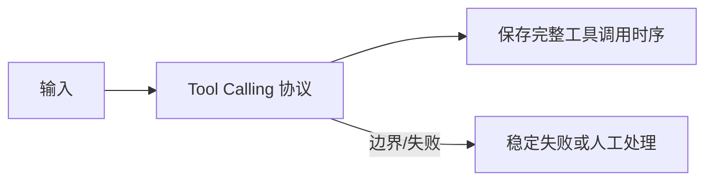

<!-- 本文件由 scripts/generate_course_tutorials.py 生成，请修改阶段计划或生成器后重新生成。 -->

# 第 02 周教程：原生模型 API

> 计划来源：[01-ai-tools-and-engineering.md](../stages/01-ai-tools-and-engineering.md)。阶段文档决定课程任务和验收，本文件解释逐节学习方法；学习状态仍只记录在[第 02 周成果](../../deliverables/week-02/README.md)。

## 本周先理解

### 为什么学

先看清 HTTP、流式事件、结构化输出和 Tool Loop 的原生协议，之后使用框架时才知道它隐藏了什么。

### 这是什么

原生模型 API 是直接围绕请求、响应、事件和工具调用协议构建最小闭环；Tool Loop 是应用执行工具、回填结果并控制停止的普通代码循环。

### 本周学习策略

- 每天只完成下面一节，控制在约 1 小时，不提前堆叠下一节的新概念。
- 先预测再实验；先保存原始证据，再写结论；失败样例与正常结果同等重要。
- 首次遇到术语时补齐：一句话定义、输入输出、开发类比、类比边界、反例和“不是什么”。
- 使用 H1→H4 提示阶梯；若使用完整参考答案，必须额外完成一个不同输入或约束的变体。

## 逐节教程

### 周一 · 第 1 节：从 HTTP/JSON 映射到模型 API

**为什么学**

本周要先看清 HTTP、流式事件、结构化输出和 Tool Loop 的原生协议，之后使用框架时才知道它隐藏了什么。本节把“从 HTTP/JSON 映射到模型 API”推进为可检查成果；如果跳过，后续会缺少“原生调用可运行、字段映射清楚且无密钥入库”这项关键证据。

**这个是什么**

本周核心概念是：原生模型 API 是直接围绕请求、响应、事件和工具调用协议构建最小闭环；Tool Loop 是应用执行工具、回填结果并控制停止的普通代码循环。今天的“从 HTTP/JSON 映射到模型 API”是这个核心能力的最小学习单元：你会通过“先标出 endpoint、headers、请求消息、模型参数、响应和错误，再实现一次非流式请求；保存请求 ID、模型版本和 Usage”观察输入如何转化为“原生调用可运行、字段映射清楚且无密钥入库”。它既包含可观察结果，也包含至少一个失败或不适用边界。只读完资料或只跑通正常路径，都不能证明已经掌握。

**怎么学（约 60 分钟）**

1. `0–5 分钟`：不查资料，写下你对本节主题的一句话解释、预期输入输出和一个疑问。
2. `5–15 分钟`：只阅读下方资料中与当前任务直接相关的部分，记录一个关键约束和版本信息。
3. `15–45 分钟`：执行专项任务：先标出 endpoint、headers、请求消息、模型参数、响应和错误，再实现一次非流式请求；保存请求 ID、模型版本和 Usage
4. `45–55 分钟`：主动制造一个错误输入、边界条件、依赖失败或反例，保存现象并解释原因。
5. `55–60 分钟`：整理命令、输入、输出、Diff、图表或访谈证据，并用自己的语言完成 Teach-back。

专项资料：[OpenAI API Quickstart](https://platform.openai.com/docs/quickstart)

**怎么验证学会了**

- 必交证据：原生调用可运行、字段映射清楚且无密钥入库。
- Teach-back：不看资料解释“从 HTTP/JSON 映射到模型 API”解决什么问题、主要输入输出、一个边界，以及它不是什么。
- 失败证据：展示一个非正常场景，指出失败发生在哪一层，不能只贴错误截图。
- 变体任务：改变一个输入、参数、角色、权限或失败条件，在不照抄原步骤的情况下重新完成。
- 通过标准：以上四项均有证据，且能解释关键取舍；只能照步骤运行时最高算 L1，不能判定本节通过。

**参考答案（独立尝试至少 20 分钟后再看）**

> 这是一份合格答案骨架，不是唯一实现。看完后必须关闭参考答案，换一个输入或约束独立重做。

#### 步骤 1 参考：先写预测

- 一句话解释：原生模型 API 是直接围绕请求、响应、事件和工具调用协议构建最小闭环；Tool Loop 是应用执行工具、回填结果并控制停止的普通代码循环。
- 预测：完成“从 HTTP/JSON 映射到模型 API”后，应能观察到“原生调用可运行、字段映射清楚且无密钥入库”；失败输入不应产生假成功。

#### 步骤 2 参考：阅读资料

- 链接：[OpenAI API Quickstart](https://platform.openai.com/docs/quickstart)
- 指定章节/条目：该链接指向的“OpenAI API Quickstart”整篇专题/章节；重点阅读与“从 HTTP/JSON 映射到模型 API”直接对应的段落，页面更新时使用课程标题中的英文术语或 API 名页内搜索
- 阅读方法：只摘录一个定义、一个输入输出约束和一个失败边界；记录页面日期、协议版本或依赖版本。

#### 步骤 3 参考：按专项动作完成产出

- 专项动作：先标出 endpoint、headers、请求消息、模型参数、响应和错误，再实现一次非流式请求；保存请求 ID、模型版本和 Usage
- 样例代码（先核对课程链接中的当前 API，再按本仓库边界修改）：

```python
def run_case(input_data: dict) -> dict:
    if not input_data:
        return {"status": "FAILED", "error": "EMPTY_INPUT"}
    # Replace this line with the lesson-specific call.
    result = {"observed": input_data, "status": "SUCCEEDED"}
    return result

print(run_case({"case": "normal"}))
print(run_case({}))  # failure case
```

#### 步骤 4 参考：制造失败并解释

- 失败注入：加入无答案、非法 Schema、超时或工具失败输入，正确结果应是拒答或稳定失败状态；如果输出看似正常但证据缺失，应判为失败。
- 参考判断：失败必须映射为明确状态、错误、拒答、人工路径或未验证假设；日志和界面不得显示成功。

#### 步骤 5 参考：整理交付与 Teach-back

- 当天交付：原生调用可运行、字段映射清楚且无密钥入库。
- 完整字段：版本；请求字段；成功响应；稳定错误码；状态变化；traceId；幂等/并发约束；兼容性说明。
- Teach-back 参考：本节输入是什么、经过了什么处理、输出如何验证、哪种失败最危险、为什么当前方案没有越过课程边界。
- 完成后变体：更换一个输入、参数、角色、权限或失败条件，不看上述样例重新完成。


### 周二 · 第 2 节：从逐 Token 生成映射到流式事件和取消

**为什么学**

本周要先看清 HTTP、流式事件、结构化输出和 Tool Loop 的原生协议，之后使用框架时才知道它隐藏了什么。本节把“从逐 Token 生成映射到流式事件和取消”推进为可检查成果；如果跳过，后续会缺少“可按事件类型流式输出并主动取消”这项关键证据。

**这个是什么**

本周核心概念是：原生模型 API 是直接围绕请求、响应、事件和工具调用协议构建最小闭环；Tool Loop 是应用执行工具、回填结果并控制停止的普通代码循环。今天的“从逐 Token 生成映射到流式事件和取消”是这个核心能力的最小学习单元：你会通过“先区分 SSE/事件边界、内容增量、Usage 和结束事件；不要把网络数据块直接当完整消息”观察输入如何转化为“可按事件类型流式输出并主动取消”。它既包含可观察结果，也包含至少一个失败或不适用边界。重点边界来自课程原计划：不要把网络数据块直接当完整消息。

**怎么学（约 60 分钟）**

1. `0–5 分钟`：不查资料，写下你对本节主题的一句话解释、预期输入输出和一个疑问。
2. `5–15 分钟`：只阅读下方资料中与当前任务直接相关的部分，记录一个关键约束和版本信息。
3. `15–45 分钟`：执行专项任务：先区分 SSE/事件边界、内容增量、Usage 和结束事件；不要把网络数据块直接当完整消息
4. `45–55 分钟`：主动制造一个错误输入、边界条件、依赖失败或反例，保存现象并解释原因。
5. `55–60 分钟`：整理命令、输入、输出、Diff、图表或访谈证据，并用自己的语言完成 Teach-back。

专项资料：[OpenAI Streaming Events](https://platform.openai.com/docs/api-reference/responses-streaming)

**怎么验证学会了**

- 必交证据：可按事件类型流式输出并主动取消。
- Teach-back：不看资料解释“从逐 Token 生成映射到流式事件和取消”解决什么问题、主要输入输出、一个边界，以及它不是什么。
- 失败证据：展示一个非正常场景，指出失败发生在哪一层，不能只贴错误截图。
- 变体任务：改变一个输入、参数、角色、权限或失败条件，在不照抄原步骤的情况下重新完成。
- 通过标准：以上四项均有证据，且能解释关键取舍；只能照步骤运行时最高算 L1，不能判定本节通过。

**参考答案（独立尝试至少 20 分钟后再看）**

> 这是一份合格答案骨架，不是唯一实现。看完后必须关闭参考答案，换一个输入或约束独立重做。

#### 步骤 1 参考：先写预测

- 一句话解释：原生模型 API 是直接围绕请求、响应、事件和工具调用协议构建最小闭环；Tool Loop 是应用执行工具、回填结果并控制停止的普通代码循环。
- 预测：完成“从逐 Token 生成映射到流式事件和取消”后，应能观察到“可按事件类型流式输出并主动取消”；失败输入不应产生假成功。

#### 步骤 2 参考：阅读资料

- 链接：[OpenAI Streaming Events](https://platform.openai.com/docs/api-reference/responses-streaming)
- 指定章节/条目：Tokenizer summary → Tokenization pipeline、Encoding / Decoding
- 阅读方法：只摘录一个定义、一个输入输出约束和一个失败边界；记录页面日期、协议版本或依赖版本。

#### 步骤 3 参考：按专项动作完成产出

- 专项动作：先区分 SSE/事件边界、内容增量、Usage 和结束事件；不要把网络数据块直接当完整消息
- 样例代码（先核对课程链接中的当前 API，再按本仓库边界修改）：

```python
def run_case(input_data: dict) -> dict:
    if not input_data:
        return {"status": "FAILED", "error": "EMPTY_INPUT"}
    # Replace this line with the lesson-specific call.
    result = {"observed": input_data, "status": "SUCCEEDED"}
    return result

print(run_case({"case": "normal"}))
print(run_case({}))  # failure case
```

#### 步骤 4 参考：制造失败并解释

- 失败注入：删掉一个必填输入或让依赖失败，系统应返回可解释的失败结果且不产生假成功；再根据日志、Diff 或流程证据定位原因。
- 参考判断：失败必须映射为明确状态、错误、拒答、人工路径或未验证假设；日志和界面不得显示成功。

#### 步骤 5 参考：整理交付与 Teach-back

- 当天交付：可按事件类型流式输出并主动取消。
- 完整字段：版本；请求字段；成功响应；稳定错误码；状态变化；traceId；幂等/并发约束；兼容性说明。
- Teach-back 参考：本节输入是什么、经过了什么处理、输出如何验证、哪种失败最危险、为什么当前方案没有越过课程边界。
- 完成后变体：更换一个输入、参数、角色、权限或失败条件，不看上述样例重新完成。


### 周三 · 第 3 节：结构化输出与 Schema 校验

**为什么学**

本周要先看清 HTTP、流式事件、结构化输出和 Tool Loop 的原生协议，之后使用框架时才知道它隐藏了什么。本节把“结构化输出与 Schema 校验”推进为可检查成果；如果跳过，后续会缺少“成功与校验失败均可复现”这项关键证据。

**这个是什么**

本周核心概念是：原生模型 API 是直接围绕请求、响应、事件和工具调用协议构建最小闭环；Tool Loop 是应用执行工具、回填结果并控制停止的普通代码循环。今天的“结构化输出与 Schema 校验”是这个核心能力的最小学习单元：你会通过“使用 JSON Schema 或类型模型校验；故意诱导缺字段、错误类型和额外字段”观察输入如何转化为“成功与校验失败均可复现”。它既包含可观察结果，也包含至少一个失败或不适用边界。只读完资料或只跑通正常路径，都不能证明已经掌握。

**怎么学（约 60 分钟）**

1. `0–5 分钟`：不查资料，写下你对本节主题的一句话解释、预期输入输出和一个疑问。
2. `5–15 分钟`：只阅读下方资料中与当前任务直接相关的部分，记录一个关键约束和版本信息。
3. `15–45 分钟`：执行专项任务：使用 JSON Schema 或类型模型校验；故意诱导缺字段、错误类型和额外字段
4. `45–55 分钟`：主动制造一个错误输入、边界条件、依赖失败或反例，保存现象并解释原因。
5. `55–60 分钟`：整理命令、输入、输出、Diff、图表或访谈证据，并用自己的语言完成 Teach-back。

专项资料：[OpenAI Structured Outputs](https://platform.openai.com/docs/guides/structured-outputs)

**怎么验证学会了**

- 必交证据：成功与校验失败均可复现。
- Teach-back：不看资料解释“结构化输出与 Schema 校验”解决什么问题、主要输入输出、一个边界，以及它不是什么。
- 失败证据：展示一个非正常场景，指出失败发生在哪一层，不能只贴错误截图。
- 变体任务：改变一个输入、参数、角色、权限或失败条件，在不照抄原步骤的情况下重新完成。
- 通过标准：以上四项均有证据，且能解释关键取舍；只能照步骤运行时最高算 L1，不能判定本节通过。

**参考答案（独立尝试至少 20 分钟后再看）**

> 这是一份合格答案骨架，不是唯一实现。看完后必须关闭参考答案，换一个输入或约束独立重做。

#### 步骤 1 参考：先写预测

- 一句话解释：原生模型 API 是直接围绕请求、响应、事件和工具调用协议构建最小闭环；Tool Loop 是应用执行工具、回填结果并控制停止的普通代码循环。
- 预测：完成“结构化输出与 Schema 校验”后，应能观察到“成功与校验失败均可复现”；失败输入不应产生假成功。

#### 步骤 2 参考：阅读资料

- 链接：[OpenAI Structured Outputs](https://platform.openai.com/docs/guides/structured-outputs)
- 指定章节/条目：Structured Outputs → JSON Schema、Handling mistakes / Validation
- 阅读方法：只摘录一个定义、一个输入输出约束和一个失败边界；记录页面日期、协议版本或依赖版本。

#### 步骤 3 参考：按专项动作完成产出

- 专项动作：使用 JSON Schema 或类型模型校验；故意诱导缺字段、错误类型和额外字段
- 样例代码（先核对课程链接中的当前 API，再按本仓库边界修改）：

```json
{
  "schemaVersion": "v1",
  "task": "结构化输出与 Schema 校验",
  "input": {"requestId": "req-001"},
  "expected": "成功与校验失败均可复现",
  "onError": {"code": "VALIDATION_FAILED", "retryable": false}
}
```

#### 步骤 4 参考：制造失败并解释

- 失败注入：加入无答案、非法 Schema、超时或工具失败输入，正确结果应是拒答或稳定失败状态；如果输出看似正常但证据缺失，应判为失败。
- 参考判断：失败必须映射为明确状态、错误、拒答、人工路径或未验证假设；日志和界面不得显示成功。

#### 步骤 5 参考：整理交付与 Teach-back

- 当天交付：成功与校验失败均可复现。
- 完整字段：版本；请求字段；成功响应；稳定错误码；状态变化；traceId；幂等/并发约束；兼容性说明。
- Teach-back 参考：本节输入是什么、经过了什么处理、输出如何验证、哪种失败最危险、为什么当前方案没有越过课程边界。
- 完成后变体：更换一个输入、参数、角色、权限或失败条件，不看上述样例重新完成。


### 周四 · 第 4 节：Tool Calling 协议

**为什么学**

本周要先看清 HTTP、流式事件、结构化输出和 Tool Loop 的原生协议，之后使用框架时才知道它隐藏了什么。本节把“Tool Calling 协议”推进为可检查成果；如果跳过，后续会缺少“保存完整工具调用时序”这项关键证据。

**这个是什么**

本周核心概念是：原生模型 API 是直接围绕请求、响应、事件和工具调用协议构建最小闭环；Tool Loop 是应用执行工具、回填结果并控制停止的普通代码循环。今天的“Tool Calling 协议”是这个核心能力的最小学习单元：你会通过“打印模型提出的工具名、参数和 call ID；明确模型只提出请求，应用负责执行”观察输入如何转化为“保存完整工具调用时序”。它既包含可观察结果，也包含至少一个失败或不适用边界。只读完资料或只跑通正常路径，都不能证明已经掌握。

**怎么学（约 60 分钟）**

1. `0–5 分钟`：不查资料，写下你对本节主题的一句话解释、预期输入输出和一个疑问。
2. `5–15 分钟`：只阅读下方资料中与当前任务直接相关的部分，记录一个关键约束和版本信息。
3. `15–45 分钟`：执行专项任务：打印模型提出的工具名、参数和 call ID；明确模型只提出请求，应用负责执行
4. `45–55 分钟`：主动制造一个错误输入、边界条件、依赖失败或反例，保存现象并解释原因。
5. `55–60 分钟`：整理命令、输入、输出、Diff、图表或访谈证据，并用自己的语言完成 Teach-back。

专项资料：[OpenAI Function Calling](https://platform.openai.com/docs/guides/function-calling)

**怎么验证学会了**

- 必交证据：保存完整工具调用时序。
- Teach-back：不看资料解释“Tool Calling 协议”解决什么问题、主要输入输出、一个边界，以及它不是什么。
- 失败证据：展示一个非正常场景，指出失败发生在哪一层，不能只贴错误截图。
- 变体任务：改变一个输入、参数、角色、权限或失败条件，在不照抄原步骤的情况下重新完成。
- 通过标准：以上四项均有证据，且能解释关键取舍；只能照步骤运行时最高算 L1，不能判定本节通过。

**参考答案（独立尝试至少 20 分钟后再看）**

> 这是一份合格答案骨架，不是唯一实现。看完后必须关闭参考答案，换一个输入或约束独立重做。

#### 步骤 1 参考：先写预测

- 一句话解释：原生模型 API 是直接围绕请求、响应、事件和工具调用协议构建最小闭环；Tool Loop 是应用执行工具、回填结果并控制停止的普通代码循环。
- 预测：完成“Tool Calling 协议”后，应能观察到“保存完整工具调用时序”；失败输入不应产生假成功。

#### 步骤 2 参考：阅读资料

- 链接：[OpenAI Function Calling](https://platform.openai.com/docs/guides/function-calling)
- 指定章节/条目：Function/Tool Calling → Defining tools、Tool execution、Returning tool results
- 阅读方法：只摘录一个定义、一个输入输出约束和一个失败边界；记录页面日期、协议版本或依赖版本。

#### 步骤 3 参考：按专项动作完成产出

- 专项动作：打印模型提出的工具名、参数和 call ID；明确模型只提出请求，应用负责执行
- 参考图（按实际角色、字段和状态修改）：



#### 步骤 4 参考：制造失败并解释

- 失败注入：加入无答案、非法 Schema、超时或工具失败输入，正确结果应是拒答或稳定失败状态；如果输出看似正常但证据缺失，应判为失败。
- 参考判断：失败必须映射为明确状态、错误、拒答、人工路径或未验证假设；日志和界面不得显示成功。

#### 步骤 5 参考：整理交付与 Teach-back

- 当天交付：保存完整工具调用时序。
- 完整字段：版本；请求字段；成功响应；稳定错误码；状态变化；traceId；幂等/并发约束；兼容性说明。
- Teach-back 参考：本节输入是什么、经过了什么处理、输出如何验证、哪种失败最危险、为什么当前方案没有越过课程边界。
- 完成后变体：更换一个输入、参数、角色、权限或失败条件，不看上述样例重新完成。


### 周五 · 第 5 节：手写最小 Agent Loop

**为什么学**

本周要先看清 HTTP、流式事件、结构化输出和 Tool Loop 的原生协议，之后使用框架时才知道它隐藏了什么。本节把“手写最小 Agent Loop”推进为可检查成果；如果跳过，后续会缺少“两工具循环可正常停止”这项关键证据。

**这个是什么**

本周核心概念是：原生模型 API 是直接围绕请求、响应、事件和工具调用协议构建最小闭环；Tool Loop 是应用执行工具、回填结果并控制停止的普通代码循环。今天的“手写最小 Agent Loop”是这个核心能力的最小学习单元：你会通过“加入最大步数、未知工具、参数错误和工具异常；不要使用 Agent 框架”观察输入如何转化为“两工具循环可正常停止”。它既包含可观察结果，也包含至少一个失败或不适用边界。重点边界来自课程原计划：不要使用 Agent 框架。

**怎么学（约 60 分钟）**

1. `0–5 分钟`：不查资料，写下你对本节主题的一句话解释、预期输入输出和一个疑问。
2. `5–15 分钟`：只阅读下方资料中与当前任务直接相关的部分，记录一个关键约束和版本信息。
3. `15–45 分钟`：执行专项任务：加入最大步数、未知工具、参数错误和工具异常；不要使用 Agent 框架
4. `45–55 分钟`：主动制造一个错误输入、边界条件、依赖失败或反例，保存现象并解释原因。
5. `55–60 分钟`：整理命令、输入、输出、Diff、图表或访谈证据，并用自己的语言完成 Teach-back。

专项资料：[OpenAI Function Calling](https://platform.openai.com/docs/guides/function-calling)

**怎么验证学会了**

- 必交证据：两工具循环可正常停止。
- Teach-back：不看资料解释“手写最小 Agent Loop”解决什么问题、主要输入输出、一个边界，以及它不是什么。
- 失败证据：展示一个非正常场景，指出失败发生在哪一层，不能只贴错误截图。
- 变体任务：改变一个输入、参数、角色、权限或失败条件，在不照抄原步骤的情况下重新完成。
- 通过标准：以上四项均有证据，且能解释关键取舍；只能照步骤运行时最高算 L1，不能判定本节通过。

**参考答案（独立尝试至少 20 分钟后再看）**

> 这是一份合格答案骨架，不是唯一实现。看完后必须关闭参考答案，换一个输入或约束独立重做。

#### 步骤 1 参考：先写预测

- 一句话解释：原生模型 API 是直接围绕请求、响应、事件和工具调用协议构建最小闭环；Tool Loop 是应用执行工具、回填结果并控制停止的普通代码循环。
- 预测：完成“手写最小 Agent Loop”后，应能观察到“两工具循环可正常停止”；失败输入不应产生假成功。

#### 步骤 2 参考：阅读资料

- 链接：[OpenAI Function Calling](https://platform.openai.com/docs/guides/function-calling)
- 指定章节/条目：该链接指向的“OpenAI Function Calling”整篇专题/章节；重点阅读与“手写最小 Agent Loop”直接对应的段落，页面更新时使用课程标题中的英文术语或 API 名页内搜索
- 阅读方法：只摘录一个定义、一个输入输出约束和一个失败边界；记录页面日期、协议版本或依赖版本。

#### 步骤 3 参考：按专项动作完成产出

- 专项动作：加入最大步数、未知工具、参数错误和工具异常；不要使用 Agent 框架
- 样例代码（先核对课程链接中的当前 API，再按本仓库边界修改）：

```python
def run_case(input_data: dict) -> dict:
    if not input_data:
        return {"status": "FAILED", "error": "EMPTY_INPUT"}
    # Replace this line with the lesson-specific call.
    result = {"observed": input_data, "status": "SUCCEEDED"}
    return result

print(run_case({"case": "normal"}))
print(run_case({}))  # failure case
```

#### 步骤 4 参考：制造失败并解释

- 失败注入：加入无答案、非法 Schema、超时或工具失败输入，正确结果应是拒答或稳定失败状态；如果输出看似正常但证据缺失，应判为失败。
- 参考判断：失败必须映射为明确状态、错误、拒答、人工路径或未验证假设；日志和界面不得显示成功。

#### 步骤 5 参考：整理交付与 Teach-back

- 当天交付：两工具循环可正常停止。
- 完整字段：入口；输入类型；输出类型；依赖版本；校验与权限；超时/错误；日志字段；最小测试命令。
- Teach-back 参考：本节输入是什么、经过了什么处理、输出如何验证、哪种失败最危险、为什么当前方案没有越过课程边界。
- 完成后变体：更换一个输入、参数、角色、权限或失败条件，不看上述样例重新完成。


### 周六 · 第 6 节：超时、重试、限流和幂等

**为什么学**

本周要先看清 HTTP、流式事件、结构化输出和 Tool Loop 的原生协议，之后使用框架时才知道它隐藏了什么。本节把“超时、重试、限流和幂等”推进为可检查成果；如果跳过，后续会缺少“四类故障测试通过”这项关键证据。

**这个是什么**

本周核心概念是：原生模型 API 是直接围绕请求、响应、事件和工具调用协议构建最小闭环；Tool Loop 是应用执行工具、回填结果并控制停止的普通代码循环。今天的“超时、重试、限流和幂等”是这个核心能力的最小学习单元：你会通过“只重试可安全重试的错误，记录退避；用幂等键避免写工具重复副作用”观察输入如何转化为“四类故障测试通过”。它既包含可观察结果，也包含至少一个失败或不适用边界。只读完资料或只跑通正常路径，都不能证明已经掌握。

**怎么学（约 60 分钟）**

1. `0–5 分钟`：不查资料，写下你对本节主题的一句话解释、预期输入输出和一个疑问。
2. `5–15 分钟`：只阅读下方资料中与当前任务直接相关的部分，记录一个关键约束和版本信息。
3. `15–45 分钟`：执行专项任务：只重试可安全重试的错误，记录退避；用幂等键避免写工具重复副作用
4. `45–55 分钟`：主动制造一个错误输入、边界条件、依赖失败或反例，保存现象并解释原因。
5. `55–60 分钟`：整理命令、输入、输出、Diff、图表或访谈证据，并用自己的语言完成 Teach-back。

专项资料：[RFC 9110：幂等方法](https://www.rfc-editor.org/rfc/rfc9110.html#name-idempotent-methods)

**怎么验证学会了**

- 必交证据：四类故障测试通过。
- Teach-back：不看资料解释“超时、重试、限流和幂等”解决什么问题、主要输入输出、一个边界，以及它不是什么。
- 失败证据：展示一个非正常场景，指出失败发生在哪一层，不能只贴错误截图。
- 变体任务：改变一个输入、参数、角色、权限或失败条件，在不照抄原步骤的情况下重新完成。
- 通过标准：以上四项均有证据，且能解释关键取舍；只能照步骤运行时最高算 L1，不能判定本节通过。

**参考答案（独立尝试至少 20 分钟后再看）**

> 这是一份合格答案骨架，不是唯一实现。看完后必须关闭参考答案，换一个输入或约束独立重做。

#### 步骤 1 参考：先写预测

- 一句话解释：原生模型 API 是直接围绕请求、响应、事件和工具调用协议构建最小闭环；Tool Loop 是应用执行工具、回填结果并控制停止的普通代码循环。
- 预测：完成“超时、重试、限流和幂等”后，应能观察到“四类故障测试通过”；失败输入不应产生假成功。

#### 步骤 2 参考：阅读资料

- 链接：[RFC 9110：幂等方法](https://www.rfc-editor.org/rfc/rfc9110.html#name-idempotent-methods)
- 指定章节/条目：RFC 9110 → 9.2.2 Idempotent Methods
- 阅读方法：只摘录一个定义、一个输入输出约束和一个失败边界；记录页面日期、协议版本或依赖版本。

#### 步骤 3 参考：按专项动作完成产出

- 专项动作：只重试可安全重试的错误，记录退避；用幂等键避免写工具重复副作用
- 参考资料/文档产出：

- 主题：超时、重试、限流和幂等
- 建议字段：用例 ID；前置条件；输入/故障；预期状态；关键断言；实际结果；日志或 Trace；是否通过
- 示例结论：已按统一口径产出“四类故障测试通过”；证据不足的部分标记为假设或未验证。

#### 步骤 4 参考：制造失败并解释

- 失败注入：删除身份、Scope 或审批后再次执行，正确结果应是执行路径明确拒绝且留下脱敏审计；如果仍成功，就是权限边界失效。
- 参考判断：失败必须映射为明确状态、错误、拒答、人工路径或未验证假设；日志和界面不得显示成功。

#### 步骤 5 参考：整理交付与 Teach-back

- 当天交付：四类故障测试通过。
- 完整字段：用例 ID；前置条件；输入/故障；预期状态；关键断言；实际结果；日志或 Trace；是否通过。
- Teach-back 参考：本节输入是什么、经过了什么处理、输出如何验证、哪种失败最危险、为什么当前方案没有越过课程边界。
- 完成后变体：更换一个输入、参数、角色、权限或失败条件，不看上述样例重新完成。


### 周日 · 第 7 节：对比框架将要隐藏的能力

**为什么学**

本周要先看清 HTTP、流式事件、结构化输出和 Tool Loop 的原生协议，之后使用框架时才知道它隐藏了什么。本节把“对比框架将要隐藏的能力”推进为可检查成果；如果跳过，后续会缺少“完成本周提交”这项关键证据。

**这个是什么**

本周核心概念是：原生模型 API 是直接围绕请求、响应、事件和工具调用协议构建最小闭环；Tool Loop 是应用执行工具、回填结果并控制停止的普通代码循环。今天的“对比框架将要隐藏的能力”是这个核心能力的最小学习单元：你会通过“列出模型客户端、Tool Loop、错误处理和观测接口，作为后续框架对比基线”观察输入如何转化为“完成本周提交”。它既包含可观察结果，也包含至少一个失败或不适用边界。只读完资料或只跑通正常路径，都不能证明已经掌握。

**怎么学（约 60 分钟）**

1. `0–5 分钟`：不查资料，写下你对本节主题的一句话解释、预期输入输出和一个疑问。
2. `5–15 分钟`：只阅读下方资料中与当前任务直接相关的部分，记录一个关键约束和版本信息。
3. `15–45 分钟`：执行专项任务：列出模型客户端、Tool Loop、错误处理和观测接口，作为后续框架对比基线
4. `45–55 分钟`：主动制造一个错误输入、边界条件、依赖失败或反例，保存现象并解释原因。
5. `55–60 分钟`：整理命令、输入、输出、Diff、图表或访谈证据，并用自己的语言完成 Teach-back。

专项资料：[成果与提交标准](../06-deliverable-standards.md)

**怎么验证学会了**

- 必交证据：完成本周提交。
- Teach-back：不看资料解释“对比框架将要隐藏的能力”解决什么问题、主要输入输出、一个边界，以及它不是什么。
- 失败证据：展示一个非正常场景，指出失败发生在哪一层，不能只贴错误截图。
- 变体任务：改变一个输入、参数、角色、权限或失败条件，在不照抄原步骤的情况下重新完成。
- 通过标准：以上四项均有证据，且能解释关键取舍；只能照步骤运行时最高算 L1，不能判定本节通过。

**参考答案（独立尝试至少 20 分钟后再看）**

> 这是一份合格答案骨架，不是唯一实现。看完后必须关闭参考答案，换一个输入或约束独立重做。

#### 步骤 1 参考：先写预测

- 一句话解释：原生模型 API 是直接围绕请求、响应、事件和工具调用协议构建最小闭环；Tool Loop 是应用执行工具、回填结果并控制停止的普通代码循环。
- 预测：完成“对比框架将要隐藏的能力”后，应能观察到“完成本周提交”；失败输入不应产生假成功。

#### 步骤 2 参考：阅读资料

- 链接：[成果与提交标准](../06-deliverable-standards.md)
- 指定章节/条目：该链接指向的“成果与提交标准”整篇专题/章节；重点阅读与“对比框架将要隐藏的能力”直接对应的段落，页面更新时使用课程标题中的英文术语或 API 名页内搜索
- 阅读方法：只摘录一个定义、一个输入输出约束和一个失败边界；记录页面日期、协议版本或依赖版本。

#### 步骤 3 参考：按专项动作完成产出

- 专项动作：列出模型客户端、Tool Loop、错误处理和观测接口，作为后续框架对比基线
- 参考资料/文档产出：

- 主题：对比框架将要隐藏的能力
- 建议字段：指标名称；计算公式；数据来源；样本与时间窗；当前值；目标/阈值；限制与未验证项
- 示例结论：已按统一口径产出“完成本周提交”；证据不足的部分标记为假设或未验证。

#### 步骤 4 参考：制造失败并解释

- 失败注入：加入无答案、非法 Schema、超时或工具失败输入，正确结果应是拒答或稳定失败状态；如果输出看似正常但证据缺失，应判为失败。
- 参考判断：失败必须映射为明确状态、错误、拒答、人工路径或未验证假设；日志和界面不得显示成功。

#### 步骤 5 参考：整理交付与 Teach-back

- 当天交付：完成本周提交。
- 完整字段：指标名称；计算公式；数据来源；样本与时间窗；当前值；目标/阈值；限制与未验证项。
- Teach-back 参考：本节输入是什么、经过了什么处理、输出如何验证、哪种失败最危险、为什么当前方案没有越过课程边界。
- 完成后变体：更换一个输入、参数、角色、权限或失败条件，不看上述样例重新完成。


## 本周收尾

按[成果与提交标准](../06-deliverable-standards.md)整理本周成果，再由讲师按[监督与掌握度规范](../07-instructor-supervision.md)给出“通过、部分通过、未通过”。教程完成不代表学习者已经掌握，必须以独立运行、排错、Teach-back 和变体证据为准。
