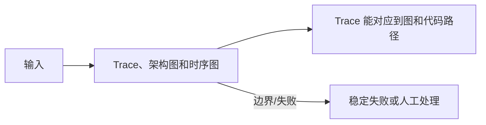

<!-- 本文件由 scripts/generate_course_tutorials.py 生成，请修改阶段计划或生成器后重新生成。 -->

# 第 04 周教程：测试、排错与架构表达

> 计划来源：[01-ai-tools-and-engineering.md](../stages/01-ai-tools-and-engineering.md)。阶段文档决定课程任务和验收，[第 04 周公共成果要求](../../deliverables/week-04/README.md)定义门禁；学习状态只记录在个人学习仓库。

## 本周先理解

### 为什么学

建立无真实模型也能测试、出错时能分类定位、换人后能复现的工程基线。

### 这是什么

AI 工程测试用 Fake、固定样例和稳定错误契约隔离随机性；架构表达用与实现一致的图、接口和运行说明呈现边界。

### 本周语言定位

默认使用 Python 3.11+，以较少样板观察 AI 原理和原生协议；记录虚拟环境、依赖版本、pytest 命令和失败结果。完整职责、切换桥接和替代规则见[开发语言路线](../01-language-roadmap.md)。

### 本周学习策略

- 每天只完成下面一节，控制在约 1 小时，不提前堆叠下一节的新概念。
- 先预测再实验；先保存原始证据，再写结论；失败样例与正常结果同等重要。
- 首次遇到术语时补齐：一句话定义、输入输出、开发类比、类比边界、反例和“不是什么”。
- 使用 H1→H4 提示阶梯；若使用完整参考答案，必须额外完成一个不同输入或约束的变体。

## 逐节教程

### 周一 · 第 1 节：区分确定性代码与不确定模型并设计 Fake

**为什么学**

本周要建立无真实模型也能测试、出错时能分类定位、换人后能复现的工程基线。本节把“区分确定性代码与不确定模型并设计 Fake”推进为可检查成果；如果跳过，后续会缺少“无密钥也能运行核心测试”这项关键证据。

**这个是什么**

本周核心概念是：AI 工程测试用 Fake、固定样例和稳定错误契约隔离随机性；架构表达用与实现一致的图、接口和运行说明呈现边界。今天的“区分确定性代码与不确定模型并设计 Fake”是这个核心能力的最小学习单元：你会通过“先列出可精确断言的 Schema、路由、工具和停止条件，再为模型边界定义 Fake 响应”观察输入如何转化为“无密钥也能运行核心测试”。它既包含可观察结果，也包含至少一个失败或不适用边界。只读完资料或只跑通正常路径，都不能证明已经掌握。

**怎么学（约 60 分钟）**

1. `0–5 分钟`：不查资料，写下你对本节主题的一句话解释、预期输入输出和一个疑问。
2. `5–15 分钟`：只阅读下方资料中与当前任务直接相关的部分，记录一个关键约束和版本信息。
3. `15–45 分钟`：执行专项任务：先列出可精确断言的 Schema、路由、工具和停止条件，再为模型边界定义 Fake 响应
4. `45–55 分钟`：主动制造一个错误输入、边界条件、依赖失败或反例，保存现象并解释原因。
5. `55–60 分钟`：整理命令、输入、输出、Diff、图表或访谈证据，并用自己的语言完成 Teach-back。

专项资料：[Martin Fowler：Mocks Aren't Stubs](https://martinfowler.com/articles/mocksArentStubs.html)

**怎么验证学会了**

- 必交证据：无密钥也能运行核心测试。
- Teach-back：不看资料解释“区分确定性代码与不确定模型并设计 Fake”解决什么问题、主要输入输出、一个边界，以及它不是什么。
- 失败证据：展示一个非正常场景，指出失败发生在哪一层，不能只贴错误截图。
- 变体任务：改变一个输入、参数、角色、权限或失败条件，在不照抄原步骤的情况下重新完成。
- 通过标准：以上四项均有证据，且能解释关键取舍；只能照步骤运行时最高算 L1，不能判定本节通过。

**参考答案（独立尝试至少 20 分钟后再看）**

> 这是一份合格答案骨架，不是唯一实现。看完后必须关闭参考答案，换一个输入或约束独立重做。

#### 步骤 1 参考：先写预测

- 一句话解释：AI 工程测试用 Fake、固定样例和稳定错误契约隔离随机性；架构表达用与实现一致的图、接口和运行说明呈现边界。
- 预测：完成“区分确定性代码与不确定模型并设计 Fake”后，应能观察到“无密钥也能运行核心测试”；失败输入不应产生假成功。

#### 步骤 2 参考：阅读资料

- 链接：[Martin Fowler：Mocks Aren't Stubs](https://martinfowler.com/articles/mocksArentStubs.html)
- 指定章节/条目：该链接指向的“Martin Fowler：Mocks Aren't Stubs”整篇专题/章节；重点阅读与“区分确定性代码与不确定模型并设计 Fake”直接对应的段落，页面更新时使用课程标题中的英文术语或 API 名页内搜索
- 阅读方法：只摘录一个定义、一个输入输出约束和一个失败边界；记录页面日期、协议版本或依赖版本。

#### 步骤 3 参考：按专项动作完成产出

- 专项动作：先列出可精确断言的 Schema、路由、工具和停止条件，再为模型边界定义 Fake 响应
- 样例代码（先核对课程链接中的当前 API，再按本仓库边界修改）：

```python
def run_case(input_data: dict) -> dict:
    if not input_data:
        return {"status": "FAILED", "error": "EMPTY_INPUT"}
    # Replace this line with the lesson-specific call.
    result = {"observed": input_data, "status": "SUCCEEDED"}
    return result

print(run_case({"case": "normal"}))
print(run_case({}))  # failure case
```

#### 步骤 4 参考：制造失败并解释

- 失败注入：加入无答案、非法 Schema、超时或工具失败输入，正确结果应是拒答或稳定失败状态；如果输出看似正常但证据缺失，应判为失败。
- 参考判断：失败必须映射为明确状态、错误、拒答、人工路径或未验证假设；日志和界面不得显示成功。

#### 步骤 5 参考：整理交付与 Teach-back

- 当天交付：无密钥也能运行核心测试。
- 完整字段：用例 ID；前置条件；输入/故障；预期状态；关键断言；实际结果；日志或 Trace；是否通过。
- Teach-back 参考：本节输入是什么、经过了什么处理、输出如何验证、哪种失败最危险、为什么当前方案没有越过课程边界。
- 完成后变体：更换一个输入、参数、角色、权限或失败条件，不看上述样例重新完成。


### 周二 · 第 2 节：基于证据的系统排错

**为什么学**

本周要建立无真实模型也能测试、出错时能分类定位、换人后能复现的工程基线。本节把“基于证据的系统排错”推进为可检查成果；如果跳过，后续会缺少“完成一份排错时间线”这项关键证据。

**这个是什么**

本周核心概念是：AI 工程测试用 Fake、固定样例和稳定错误契约隔离随机性；架构表达用与实现一致的图、接口和运行说明呈现边界。今天的“基于证据的系统排错”是这个核心能力的最小学习单元：你会通过“按输入、模型、检索、工具、流程、环境分类；一次只验证一个假设”观察输入如何转化为“完成一份排错时间线”。它既包含可观察结果，也包含至少一个失败或不适用边界。只读完资料或只跑通正常路径，都不能证明已经掌握。

**怎么学（约 60 分钟）**

1. `0–5 分钟`：不查资料，写下你对本节主题的一句话解释、预期输入输出和一个疑问。
2. `5–15 分钟`：只阅读下方资料中与当前任务直接相关的部分，记录一个关键约束和版本信息。
3. `15–45 分钟`：执行专项任务：按输入、模型、检索、工具、流程、环境分类；一次只验证一个假设
4. `45–55 分钟`：主动制造一个错误输入、边界条件、依赖失败或反例，保存现象并解释原因。
5. `55–60 分钟`：整理命令、输入、输出、Diff、图表或访谈证据，并用自己的语言完成 Teach-back。

专项资料：[Google SRE：Effective Troubleshooting](https://sre.google/sre-book/effective-troubleshooting/)

**怎么验证学会了**

- 必交证据：完成一份排错时间线。
- Teach-back：不看资料解释“基于证据的系统排错”解决什么问题、主要输入输出、一个边界，以及它不是什么。
- 失败证据：展示一个非正常场景，指出失败发生在哪一层，不能只贴错误截图。
- 变体任务：改变一个输入、参数、角色、权限或失败条件，在不照抄原步骤的情况下重新完成。
- 通过标准：以上四项均有证据，且能解释关键取舍；只能照步骤运行时最高算 L1，不能判定本节通过。

**参考答案（独立尝试至少 20 分钟后再看）**

> 这是一份合格答案骨架，不是唯一实现。看完后必须关闭参考答案，换一个输入或约束独立重做。

#### 步骤 1 参考：先写预测

- 一句话解释：AI 工程测试用 Fake、固定样例和稳定错误契约隔离随机性；架构表达用与实现一致的图、接口和运行说明呈现边界。
- 预测：完成“基于证据的系统排错”后，应能观察到“完成一份排错时间线”；失败输入不应产生假成功。

#### 步骤 2 参考：阅读资料

- 链接：[Google SRE：Effective Troubleshooting](https://sre.google/sre-book/effective-troubleshooting/)
- 指定章节/条目：该链接指向的“Google SRE：Effective Troubleshooting”整篇专题/章节；重点阅读与“基于证据的系统排错”直接对应的段落，页面更新时使用课程标题中的英文术语或 API 名页内搜索
- 阅读方法：只摘录一个定义、一个输入输出约束和一个失败边界；记录页面日期、协议版本或依赖版本。

#### 步骤 3 参考：按专项动作完成产出

- 专项动作：按输入、模型、检索、工具、流程、环境分类；一次只验证一个假设
- 参考资料/文档产出：

- 主题：基于证据的系统排错
- 建议字段：一句话定义；输入；操作；可观察输出；失败/反例；工程意义；证据位置
- 示例结论：已按统一口径产出“完成一份排错时间线”；证据不足的部分标记为假设或未验证。

#### 步骤 4 参考：制造失败并解释

- 失败注入：加入无答案、非法 Schema、超时或工具失败输入，正确结果应是拒答或稳定失败状态；如果输出看似正常但证据缺失，应判为失败。
- 参考判断：失败必须映射为明确状态、错误、拒答、人工路径或未验证假设；日志和界面不得显示成功。

#### 步骤 5 参考：整理交付与 Teach-back

- 当天交付：完成一份排错时间线。
- 完整字段：一句话定义；输入；操作；可观察输出；失败/反例；工程意义；证据位置。
- Teach-back 参考：本节输入是什么、经过了什么处理、输出如何验证、哪种失败最危险、为什么当前方案没有越过课程边界。
- 完成后变体：更换一个输入、参数、角色、权限或失败条件，不看上述样例重新完成。


### 周三 · 第 3 节：错误契约与失败状态

**为什么学**

本周要建立无真实模型也能测试、出错时能分类定位、换人后能复现的工程基线。本节把“错误契约与失败状态”推进为可检查成果；如果跳过，后续会缺少“错误类型和映射测试”这项关键证据。

**这个是什么**

本周核心概念是：AI 工程测试用 Fake、固定样例和稳定错误契约隔离随机性；架构表达用与实现一致的图、接口和运行说明呈现边界。今天的“错误契约与失败状态”是这个核心能力的最小学习单元：你会通过“区分可重试、不可重试、业务拒绝、人工介入；错误响应不泄露内部信息”观察输入如何转化为“错误类型和映射测试”。它既包含可观察结果，也包含至少一个失败或不适用边界。只读完资料或只跑通正常路径，都不能证明已经掌握。

**怎么学（约 60 分钟）**

1. `0–5 分钟`：不查资料，写下你对本节主题的一句话解释、预期输入输出和一个疑问。
2. `5–15 分钟`：只阅读下方资料中与当前任务直接相关的部分，记录一个关键约束和版本信息。
3. `15–45 分钟`：执行专项任务：区分可重试、不可重试、业务拒绝、人工介入；错误响应不泄露内部信息
4. `45–55 分钟`：主动制造一个错误输入、边界条件、依赖失败或反例，保存现象并解释原因。
5. `55–60 分钟`：整理命令、输入、输出、Diff、图表或访谈证据，并用自己的语言完成 Teach-back。

专项资料：[RFC 9457：Problem Details](https://www.rfc-editor.org/rfc/rfc9457.html)

**怎么验证学会了**

- 必交证据：错误类型和映射测试。
- Teach-back：不看资料解释“错误契约与失败状态”解决什么问题、主要输入输出、一个边界，以及它不是什么。
- 失败证据：展示一个非正常场景，指出失败发生在哪一层，不能只贴错误截图。
- 变体任务：改变一个输入、参数、角色、权限或失败条件，在不照抄原步骤的情况下重新完成。
- 通过标准：以上四项均有证据，且能解释关键取舍；只能照步骤运行时最高算 L1，不能判定本节通过。

**参考答案（独立尝试至少 20 分钟后再看）**

> 这是一份合格答案骨架，不是唯一实现。看完后必须关闭参考答案，换一个输入或约束独立重做。

#### 步骤 1 参考：先写预测

- 一句话解释：AI 工程测试用 Fake、固定样例和稳定错误契约隔离随机性；架构表达用与实现一致的图、接口和运行说明呈现边界。
- 预测：完成“错误契约与失败状态”后，应能观察到“错误类型和映射测试”；失败输入不应产生假成功。

#### 步骤 2 参考：阅读资料

- 链接：[RFC 9457：Problem Details](https://www.rfc-editor.org/rfc/rfc9457.html)
- 指定章节/条目：该链接指向的“RFC 9457：Problem Details”整篇专题/章节；重点阅读与“错误契约与失败状态”直接对应的段落，页面更新时使用课程标题中的英文术语或 API 名页内搜索
- 阅读方法：只摘录一个定义、一个输入输出约束和一个失败边界；记录页面日期、协议版本或依赖版本。

#### 步骤 3 参考：按专项动作完成产出

- 专项动作：区分可重试、不可重试、业务拒绝、人工介入；错误响应不泄露内部信息
- 参考资料/文档产出：

- 主题：错误契约与失败状态
- 建议字段：版本；请求字段；成功响应；稳定错误码；状态变化；traceId；幂等/并发约束；兼容性说明
- 示例结论：已按统一口径产出“错误类型和映射测试”；证据不足的部分标记为假设或未验证。

#### 步骤 4 参考：制造失败并解释

- 失败注入：当样本、Owner 或数据来源不足时，把结论标为假设并给出验证计划；不能把模拟结果写成真实业务收益。
- 参考判断：失败必须映射为明确状态、错误、拒答、人工路径或未验证假设；日志和界面不得显示成功。

#### 步骤 5 参考：整理交付与 Teach-back

- 当天交付：错误类型和映射测试。
- 完整字段：版本；请求字段；成功响应；稳定错误码；状态变化；traceId；幂等/并发约束；兼容性说明。
- Teach-back 参考：本节输入是什么、经过了什么处理、输出如何验证、哪种失败最危险、为什么当前方案没有越过课程边界。
- 完成后变体：更换一个输入、参数、角色、权限或失败条件，不看上述样例重新完成。


### 周四 · 第 4 节：Trace、架构图和时序图

**为什么学**

本周要建立无真实模型也能测试、出错时能分类定位、换人后能复现的工程基线。本节把“Trace、架构图和时序图”推进为可检查成果；如果跳过，后续会缺少“Trace 能对应到图和代码路径”这项关键证据。

**这个是什么**

本周核心概念是：AI 工程测试用 Fake、固定样例和稳定错误契约隔离随机性；架构表达用与实现一致的图、接口和运行说明呈现边界。今天的“Trace、架构图和时序图”是这个核心能力的最小学习单元：你会通过“用 traceId 串起请求、模型和工具事件；图中只画已实现边界，并标出信任、数据和控制流”观察输入如何转化为“Trace 能对应到图和代码路径”。它既包含可观察结果，也包含至少一个失败或不适用边界。只读完资料或只跑通正常路径，都不能证明已经掌握。

**怎么学（约 60 分钟）**

1. `0–5 分钟`：不查资料，写下你对本节主题的一句话解释、预期输入输出和一个疑问。
2. `5–15 分钟`：只阅读下方资料中与当前任务直接相关的部分，记录一个关键约束和版本信息。
3. `15–45 分钟`：执行专项任务：用 traceId 串起请求、模型和工具事件；图中只画已实现边界，并标出信任、数据和控制流
4. `45–55 分钟`：主动制造一个错误输入、边界条件、依赖失败或反例，保存现象并解释原因。
5. `55–60 分钟`：整理命令、输入、输出、Diff、图表或访谈证据，并用自己的语言完成 Teach-back。

专项资料：[OpenTelemetry Traces](https://opentelemetry.io/docs/concepts/signals/traces/)

**怎么验证学会了**

- 必交证据：Trace 能对应到图和代码路径。
- Teach-back：不看资料解释“Trace、架构图和时序图”解决什么问题、主要输入输出、一个边界，以及它不是什么。
- 失败证据：展示一个非正常场景，指出失败发生在哪一层，不能只贴错误截图。
- 变体任务：改变一个输入、参数、角色、权限或失败条件，在不照抄原步骤的情况下重新完成。
- 通过标准：以上四项均有证据，且能解释关键取舍；只能照步骤运行时最高算 L1，不能判定本节通过。

**参考答案（独立尝试至少 20 分钟后再看）**

> 这是一份合格答案骨架，不是唯一实现。看完后必须关闭参考答案，换一个输入或约束独立重做。

#### 步骤 1 参考：先写预测

- 一句话解释：AI 工程测试用 Fake、固定样例和稳定错误契约隔离随机性；架构表达用与实现一致的图、接口和运行说明呈现边界。
- 预测：完成“Trace、架构图和时序图”后，应能观察到“Trace 能对应到图和代码路径”；失败输入不应产生假成功。

#### 步骤 2 参考：阅读资料

- 链接：[OpenTelemetry Traces](https://opentelemetry.io/docs/concepts/signals/traces/)
- 指定章节/条目：Trace/Log semantic conventions → Span、Attributes、Context propagation
- 阅读方法：只摘录一个定义、一个输入输出约束和一个失败边界；记录页面日期、协议版本或依赖版本。

#### 步骤 3 参考：按专项动作完成产出

- 专项动作：用 traceId 串起请求、模型和工具事件；图中只画已实现边界，并标出信任、数据和控制流
- 参考图（按实际角色、字段和状态修改）：



#### 步骤 4 参考：制造失败并解释

- 失败注入：加入无答案、非法 Schema、超时或工具失败输入，正确结果应是拒答或稳定失败状态；如果输出看似正常但证据缺失，应判为失败。
- 参考判断：失败必须映射为明确状态、错误、拒答、人工路径或未验证假设；日志和界面不得显示成功。

#### 步骤 5 参考：整理交付与 Teach-back

- 当天交付：Trace 能对应到图和代码路径。
- 完整字段：范围与参与者；输入；主路径；异常/拒绝路径；输出；信任或责任边界；版本与图例。
- Teach-back 参考：本节输入是什么、经过了什么处理、输出如何验证、哪种失败最危险、为什么当前方案没有越过课程边界。
- 完成后变体：更换一个输入、参数、角色、权限或失败条件，不看上述样例重新完成。


### 周五 · 第 5 节：README 与可复现运行

**为什么学**

本周要建立无真实模型也能测试、出错时能分类定位、换人后能复现的工程基线。本节把“README 与可复现运行”推进为可检查成果；如果跳过，后续会缺少“新环境可运行核心示例”这项关键证据。

**这个是什么**

本周核心概念是：AI 工程测试用 Fake、固定样例和稳定错误契约隔离随机性；架构表达用与实现一致的图、接口和运行说明呈现边界。今天的“README 与可复现运行”是这个核心能力的最小学习单元：你会通过“从干净环境按文档执行；记录所有隐式前置条件，不写“自行配置””观察输入如何转化为“新环境可运行核心示例”。它既包含可观察结果，也包含至少一个失败或不适用边界。只读完资料或只跑通正常路径，都不能证明已经掌握。

**怎么学（约 60 分钟）**

1. `0–5 分钟`：不查资料，写下你对本节主题的一句话解释、预期输入输出和一个疑问。
2. `5–15 分钟`：只阅读下方资料中与当前任务直接相关的部分，记录一个关键约束和版本信息。
3. `15–45 分钟`：执行专项任务：从干净环境按文档执行；记录所有隐式前置条件，不写“自行配置”
4. `45–55 分钟`：主动制造一个错误输入、边界条件、依赖失败或反例，保存现象并解释原因。
5. `55–60 分钟`：整理命令、输入、输出、Diff、图表或访谈证据，并用自己的语言完成 Teach-back。

专项资料：[Make a README](https://www.makeareadme.com/)

**怎么验证学会了**

- 必交证据：新环境可运行核心示例。
- Teach-back：不看资料解释“README 与可复现运行”解决什么问题、主要输入输出、一个边界，以及它不是什么。
- 失败证据：展示一个非正常场景，指出失败发生在哪一层，不能只贴错误截图。
- 变体任务：改变一个输入、参数、角色、权限或失败条件，在不照抄原步骤的情况下重新完成。
- 通过标准：以上四项均有证据，且能解释关键取舍；只能照步骤运行时最高算 L1，不能判定本节通过。

**参考答案（独立尝试至少 20 分钟后再看）**

> 这是一份合格答案骨架，不是唯一实现。看完后必须关闭参考答案，换一个输入或约束独立重做。

#### 步骤 1 参考：先写预测

- 一句话解释：AI 工程测试用 Fake、固定样例和稳定错误契约隔离随机性；架构表达用与实现一致的图、接口和运行说明呈现边界。
- 预测：完成“README 与可复现运行”后，应能观察到“新环境可运行核心示例”；失败输入不应产生假成功。

#### 步骤 2 参考：阅读资料

- 链接：[Make a README](https://www.makeareadme.com/)
- 指定章节/条目：该链接指向的“Make a README”整篇专题/章节；重点阅读与“README 与可复现运行”直接对应的段落，页面更新时使用课程标题中的英文术语或 API 名页内搜索
- 阅读方法：只摘录一个定义、一个输入输出约束和一个失败边界；记录页面日期、协议版本或依赖版本。

#### 步骤 3 参考：按专项动作完成产出

- 专项动作：从干净环境按文档执行；记录所有隐式前置条件，不写“自行配置”
- 样例代码（先核对课程链接中的当前 API，再按本仓库边界修改）：

```python
def run_case(input_data: dict) -> dict:
    if not input_data:
        return {"status": "FAILED", "error": "EMPTY_INPUT"}
    # Replace this line with the lesson-specific call.
    result = {"observed": input_data, "status": "SUCCEEDED"}
    return result

print(run_case({"case": "normal"}))
print(run_case({}))  # failure case
```

#### 步骤 4 参考：制造失败并解释

- 失败注入：删掉一个必填输入或让依赖失败，系统应返回可解释的失败结果且不产生假成功；再根据日志、Diff 或流程证据定位原因。
- 参考判断：失败必须映射为明确状态、错误、拒答、人工路径或未验证假设；日志和界面不得显示成功。

#### 步骤 5 参考：整理交付与 Teach-back

- 当天交付：新环境可运行核心示例。
- 完整字段：目标；事实与证据；关键决定；备选方案；失败与风险；限制；后续动作；负责人/时间。
- Teach-back 参考：本节输入是什么、经过了什么处理、输出如何验证、哪种失败最危险、为什么当前方案没有越过课程边界。
- 完成后变体：更换一个输入、参数、角色、权限或失败条件，不看上述样例重新完成。


### 周六 · 第 6 节：综合小练习

**为什么学**

本周要建立无真实模型也能测试、出错时能分类定位、换人后能复现的工程基线。本节把“综合小练习”推进为可检查成果；如果跳过，后续会缺少“最小 AI 服务闭环可运行”这项关键证据。

**这个是什么**

本周核心概念是：AI 工程测试用 Fake、固定样例和稳定错误契约隔离随机性；架构表达用与实现一致的图、接口和运行说明呈现边界。今天的“综合小练习”是这个核心能力的最小学习单元：你会通过“将原生模型调用、Tool Loop、测试、Trace 和错误处理组合；保留失败场景”观察输入如何转化为“最小 AI 服务闭环可运行”。它既包含可观察结果，也包含至少一个失败或不适用边界。只读完资料或只跑通正常路径，都不能证明已经掌握。

**怎么学（约 60 分钟）**

1. `0–5 分钟`：不查资料，写下你对本节主题的一句话解释、预期输入输出和一个疑问。
2. `5–15 分钟`：只阅读下方资料中与当前任务直接相关的部分，记录一个关键约束和版本信息。
3. `15–45 分钟`：执行专项任务：将原生模型调用、Tool Loop、测试、Trace 和错误处理组合；保留失败场景
4. `45–55 分钟`：主动制造一个错误输入、边界条件、依赖失败或反例，保存现象并解释原因。
5. `55–60 分钟`：整理命令、输入、输出、Diff、图表或访谈证据，并用自己的语言完成 Teach-back。

专项资料：[Google SRE：Testing for Reliability](https://sre.google/sre-book/testing-reliability/)

**怎么验证学会了**

- 必交证据：最小 AI 服务闭环可运行。
- Teach-back：不看资料解释“综合小练习”解决什么问题、主要输入输出、一个边界，以及它不是什么。
- 失败证据：展示一个非正常场景，指出失败发生在哪一层，不能只贴错误截图。
- 变体任务：改变一个输入、参数、角色、权限或失败条件，在不照抄原步骤的情况下重新完成。
- 通过标准：以上四项均有证据，且能解释关键取舍；只能照步骤运行时最高算 L1，不能判定本节通过。

**参考答案（独立尝试至少 20 分钟后再看）**

> 这是一份合格答案骨架，不是唯一实现。看完后必须关闭参考答案，换一个输入或约束独立重做。

#### 步骤 1 参考：先写预测

- 一句话解释：AI 工程测试用 Fake、固定样例和稳定错误契约隔离随机性；架构表达用与实现一致的图、接口和运行说明呈现边界。
- 预测：完成“综合小练习”后，应能观察到“最小 AI 服务闭环可运行”；失败输入不应产生假成功。

#### 步骤 2 参考：阅读资料

- 链接：[Google SRE：Testing for Reliability](https://sre.google/sre-book/testing-reliability/)
- 指定章节/条目：该链接指向的“Google SRE：Testing for Reliability”整篇专题/章节；重点阅读与“综合小练习”直接对应的段落，页面更新时使用课程标题中的英文术语或 API 名页内搜索
- 阅读方法：只摘录一个定义、一个输入输出约束和一个失败边界；记录页面日期、协议版本或依赖版本。

#### 步骤 3 参考：按专项动作完成产出

- 专项动作：将原生模型调用、Tool Loop、测试、Trace 和错误处理组合；保留失败场景
- 样例代码（先核对课程链接中的当前 API，再按本仓库边界修改）：

```python
def run_case(input_data: dict) -> dict:
    if not input_data:
        return {"status": "FAILED", "error": "EMPTY_INPUT"}
    # Replace this line with the lesson-specific call.
    result = {"observed": input_data, "status": "SUCCEEDED"}
    return result

print(run_case({"case": "normal"}))
print(run_case({}))  # failure case
```

#### 步骤 4 参考：制造失败并解释

- 失败注入：当样本、Owner 或数据来源不足时，把结论标为假设并给出验证计划；不能把模拟结果写成真实业务收益。
- 参考判断：失败必须映射为明确状态、错误、拒答、人工路径或未验证假设；日志和界面不得显示成功。

#### 步骤 5 参考：整理交付与 Teach-back

- 当天交付：最小 AI 服务闭环可运行。
- 完整字段：入口；输入类型；输出类型；依赖版本；校验与权限；超时/错误；日志字段；最小测试命令。
- Teach-back 参考：本节输入是什么、经过了什么处理、输出如何验证、哪种失败最危险、为什么当前方案没有越过课程边界。
- 完成后变体：更换一个输入、参数、角色、权限或失败条件，不看上述样例重新完成。


### 周日 · 第 7 节：阶段复盘和框架学习准备

**为什么学**

本周要建立无真实模型也能测试、出错时能分类定位、换人后能复现的工程基线。本节把“阶段复盘和框架学习准备”推进为可检查成果；如果跳过，后续会缺少“完成阶段提交”这项关键证据。

**这个是什么**

本周核心概念是：AI 工程测试用 Fake、固定样例和稳定错误契约隔离随机性；架构表达用与实现一致的图、接口和运行说明呈现边界。今天的“阶段复盘和框架学习准备”是这个核心能力的最小学习单元：你会通过“列出哪些能力应交给框架、哪些安全和业务规则必须保留在代码中”观察输入如何转化为“完成阶段提交”。它既包含可观察结果，也包含至少一个失败或不适用边界。只读完资料或只跑通正常路径，都不能证明已经掌握。

**怎么学（约 60 分钟）**

1. `0–5 分钟`：不查资料，写下你对本节主题的一句话解释、预期输入输出和一个疑问。
2. `5–15 分钟`：只阅读下方资料中与当前任务直接相关的部分，记录一个关键约束和版本信息。
3. `15–45 分钟`：执行专项任务：列出哪些能力应交给框架、哪些安全和业务规则必须保留在代码中
4. `45–55 分钟`：主动制造一个错误输入、边界条件、依赖失败或反例，保存现象并解释原因。
5. `55–60 分钟`：整理命令、输入、输出、Diff、图表或访谈证据，并用自己的语言完成 Teach-back。

专项资料：[成果与提交标准](../06-deliverable-standards.md)

**怎么验证学会了**

- 必交证据：完成阶段提交。
- Teach-back：不看资料解释“阶段复盘和框架学习准备”解决什么问题、主要输入输出、一个边界，以及它不是什么。
- 失败证据：展示一个非正常场景，指出失败发生在哪一层，不能只贴错误截图。
- 变体任务：改变一个输入、参数、角色、权限或失败条件，在不照抄原步骤的情况下重新完成。
- 通过标准：以上四项均有证据，且能解释关键取舍；只能照步骤运行时最高算 L1，不能判定本节通过。

**参考答案（独立尝试至少 20 分钟后再看）**

> 这是一份合格答案骨架，不是唯一实现。看完后必须关闭参考答案，换一个输入或约束独立重做。

#### 步骤 1 参考：先写预测

- 一句话解释：AI 工程测试用 Fake、固定样例和稳定错误契约隔离随机性；架构表达用与实现一致的图、接口和运行说明呈现边界。
- 预测：完成“阶段复盘和框架学习准备”后，应能观察到“完成阶段提交”；失败输入不应产生假成功。

#### 步骤 2 参考：阅读资料

- 链接：[成果与提交标准](../06-deliverable-standards.md)
- 指定章节/条目：该链接指向的“成果与提交标准”整篇专题/章节；重点阅读与“阶段复盘和框架学习准备”直接对应的段落，页面更新时使用课程标题中的英文术语或 API 名页内搜索
- 阅读方法：只摘录一个定义、一个输入输出约束和一个失败边界；记录页面日期、协议版本或依赖版本。

#### 步骤 3 参考：按专项动作完成产出

- 专项动作：列出哪些能力应交给框架、哪些安全和业务规则必须保留在代码中
- 参考资料/文档产出：

- 主题：阶段复盘和框架学习准备
- 建议字段：目标；事实与证据；关键决定；备选方案；失败与风险；限制；后续动作；负责人/时间
- 示例结论：已按统一口径产出“完成阶段提交”；证据不足的部分标记为假设或未验证。

#### 步骤 4 参考：制造失败并解释

- 失败注入：删除身份、Scope 或审批后再次执行，正确结果应是执行路径明确拒绝且留下脱敏审计；如果仍成功，就是权限边界失效。
- 参考判断：失败必须映射为明确状态、错误、拒答、人工路径或未验证假设；日志和界面不得显示成功。

#### 步骤 5 参考：整理交付与 Teach-back

- 当天交付：完成阶段提交。
- 完整字段：目标；事实与证据；关键决定；备选方案；失败与风险；限制；后续动作；负责人/时间。
- Teach-back 参考：本节输入是什么、经过了什么处理、输出如何验证、哪种失败最危险、为什么当前方案没有越过课程边界。
- 完成后变体：更换一个输入、参数、角色、权限或失败条件，不看上述样例重新完成。


## 本周收尾

按[成果与提交标准](../06-deliverable-standards.md)整理本周成果，再由讲师按[监督与掌握度规范](../07-instructor-supervision.md)给出“通过、部分通过、未通过”。教程完成不代表学习者已经掌握，必须以独立运行、排错、Teach-back 和变体证据为准。
