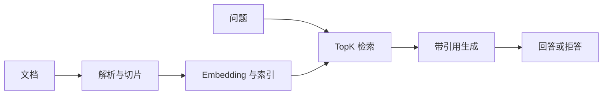

<!-- 本文件由 scripts/generate_course_tutorials.py 生成，请修改阶段计划或生成器后重新生成。 -->

# 第 06 周教程：Spring AI RAG

> 计划来源：[02-java-llm-rag-agent.md](../stages/02-java-llm-rag-agent.md)。阶段文档决定课程任务和验收，本文件解释逐节学习方法；学习状态仍只记录在[第 06 周成果](../../deliverables/week-06/README.md)。

## 本周先理解

### 为什么学

让回答基于可追溯资料，并用检索和拒答证据区分知识问题与生成问题。

### 这是什么

RAG 是先检索外部资料再把受控上下文交给模型生成答案的模式；它不等于训练模型，也不能自动保证事实正确。

### 本周语言定位

必须使用 Java 21、Maven、Spring Boot/Spring AI，并把前四周的原生能力映射到 Java 实现、测试和错误处理。完整职责、切换桥接和替代规则见[开发语言路线](../01-language-roadmap.md)。

### 本周学习策略

- 每天只完成下面一节，控制在约 1 小时，不提前堆叠下一节的新概念。
- 先预测再实验；先保存原始证据，再写结论；失败样例与正常结果同等重要。
- 首次遇到术语时补齐：一句话定义、输入输出、开发类比、类比边界、反例和“不是什么”。
- 使用 H1→H4 提示阶梯；若使用完整参考答案，必须额外完成一个不同输入或约束的变体。

## 逐节教程

### 周一 · 第 1 节：理解解析、切片、索引、检索和生成

**为什么学**

本周要让回答基于可追溯资料，并用检索和拒答证据区分知识问题与生成问题。本节把“理解解析、切片、索引、检索和生成”推进为可检查成果；如果跳过，后续会缺少“绘制 RAG 流程图”这项关键证据。

**这个是什么**

本周核心概念是：RAG 是先检索外部资料再把受控上下文交给模型生成答案的模式；它不等于训练模型，也不能自动保证事实正确。今天的“理解解析、切片、索引、检索和生成”是这个核心能力的最小学习单元：你会通过“为每一步写清输入输出和可能失败点，区分检索质量与生成质量”观察输入如何转化为“绘制 RAG 流程图”。它既包含可观察结果，也包含至少一个失败或不适用边界。只读完资料或只跑通正常路径，都不能证明已经掌握。

**怎么学（约 60 分钟）**

1. `0–5 分钟`：不查资料，写下你对本节主题的一句话解释、预期输入输出和一个疑问。
2. `5–15 分钟`：只阅读下方资料中与当前任务直接相关的部分，记录一个关键约束和版本信息。
3. `15–45 分钟`：执行专项任务：为每一步写清输入输出和可能失败点，区分检索质量与生成质量
4. `45–55 分钟`：主动制造一个错误输入、边界条件、依赖失败或反例，保存现象并解释原因。
5. `55–60 分钟`：整理命令、输入、输出、Diff、图表或访谈证据，并用自己的语言完成 Teach-back。

专项资料：[Spring AI RAG](https://docs.spring.io/spring-ai/reference/api/retrieval-augmented-generation.html)

**怎么验证学会了**

- 必交证据：绘制 RAG 流程图。
- Teach-back：不看资料解释“理解解析、切片、索引、检索和生成”解决什么问题、主要输入输出、一个边界，以及它不是什么。
- 失败证据：展示一个非正常场景，指出失败发生在哪一层，不能只贴错误截图。
- 变体任务：改变一个输入、参数、角色、权限或失败条件，在不照抄原步骤的情况下重新完成。
- 通过标准：以上四项均有证据，且能解释关键取舍；只能照步骤运行时最高算 L1，不能判定本节通过。

**参考答案（独立尝试至少 20 分钟后再看）**

> 这是一份合格答案骨架，不是唯一实现。看完后必须关闭参考答案，换一个输入或约束独立重做。

#### 步骤 1 参考：先写预测

- 一句话解释：RAG 是先检索外部资料再把受控上下文交给模型生成答案的模式；它不等于训练模型，也不能自动保证事实正确。
- 预测：完成“理解解析、切片、索引、检索和生成”后，应能观察到“绘制 RAG 流程图”；失败输入不应产生假成功。

#### 步骤 2 参考：阅读资料

- 链接：[Spring AI RAG](https://docs.spring.io/spring-ai/reference/api/retrieval-augmented-generation.html)
- 指定章节/条目：Retrieval Augmented Generation → Advisors / ETL Pipeline / Retrieval flow
- 阅读方法：只摘录一个定义、一个输入输出约束和一个失败边界；记录页面日期、协议版本或依赖版本。

#### 步骤 3 参考：按专项动作完成产出

- 专项动作：为每一步写清输入输出和可能失败点，区分检索质量与生成质量
- 参考图（按实际角色、字段和状态修改）：



#### 步骤 4 参考：制造失败并解释

- 失败注入：加入无答案、非法 Schema、超时或工具失败输入，正确结果应是拒答或稳定失败状态；如果输出看似正常但证据缺失，应判为失败。
- 参考判断：失败必须映射为明确状态、错误、拒答、人工路径或未验证假设；日志和界面不得显示成功。

#### 步骤 5 参考：整理交付与 Teach-back

- 当天交付：绘制 RAG 流程图。
- 完整字段：范围与参与者；输入；主路径；异常/拒绝路径；输出；信任或责任边界；版本与图例。
- Teach-back 参考：本节输入是什么、经过了什么处理、输出如何验证、哪种失败最危险、为什么当前方案没有越过课程边界。
- 完成后变体：更换一个输入、参数、角色、权限或失败条件，不看上述样例重新完成。


### 周二 · 第 2 节：准备 5–10 个文档或代码文件

**为什么学**

本周要让回答基于可追溯资料，并用检索和拒答证据区分知识问题与生成问题。本节把“准备 5–10 个文档或代码文件”推进为可检查成果；如果跳过，后续会缺少“放入 `data/docs`”这项关键证据。

**这个是什么**

本周核心概念是：RAG 是先检索外部资料再把受控上下文交给模型生成答案的模式；它不等于训练模型，也不能自动保证事实正确。今天的“准备 5–10 个文档或代码文件”是这个核心能力的最小学习单元：你会通过“选自己能判断答案的资料，提前写 5 个问题和预期来源，避免事后挑题”观察输入如何转化为“放入 `data/docs`”。它既包含可观察结果，也包含至少一个失败或不适用边界。只读完资料或只跑通正常路径，都不能证明已经掌握。

**怎么学（约 60 分钟）**

1. `0–5 分钟`：不查资料，写下你对本节主题的一句话解释、预期输入输出和一个疑问。
2. `5–15 分钟`：只阅读下方资料中与当前任务直接相关的部分，记录一个关键约束和版本信息。
3. `15–45 分钟`：执行专项任务：选自己能判断答案的资料，提前写 5 个问题和预期来源，避免事后挑题
4. `45–55 分钟`：主动制造一个错误输入、边界条件、依赖失败或反例，保存现象并解释原因。
5. `55–60 分钟`：整理命令、输入、输出、Diff、图表或访谈证据，并用自己的语言完成 Teach-back。

专项资料：[RAG 资料目录](../../data/docs/README.md)

**怎么验证学会了**

- 必交证据：放入 `data/docs`。
- Teach-back：不看资料解释“准备 5–10 个文档或代码文件”解决什么问题、主要输入输出、一个边界，以及它不是什么。
- 失败证据：展示一个非正常场景，指出失败发生在哪一层，不能只贴错误截图。
- 变体任务：改变一个输入、参数、角色、权限或失败条件，在不照抄原步骤的情况下重新完成。
- 通过标准：以上四项均有证据，且能解释关键取舍；只能照步骤运行时最高算 L1，不能判定本节通过。

**参考答案（独立尝试至少 20 分钟后再看）**

> 这是一份合格答案骨架，不是唯一实现。看完后必须关闭参考答案，换一个输入或约束独立重做。

#### 步骤 1 参考：先写预测

- 一句话解释：RAG 是先检索外部资料再把受控上下文交给模型生成答案的模式；它不等于训练模型，也不能自动保证事实正确。
- 预测：完成“准备 5–10 个文档或代码文件”后，应能观察到“放入 `data/docs`”；失败输入不应产生假成功。

#### 步骤 2 参考：阅读资料

- 链接：[RAG 资料目录](../../data/docs/README.md)
- 指定章节/条目：该链接指向的“RAG 资料目录”整篇专题/章节；重点阅读与“准备 5–10 个文档或代码文件”直接对应的段落，页面更新时使用课程标题中的英文术语或 API 名页内搜索
- 阅读方法：只摘录一个定义、一个输入输出约束和一个失败边界；记录页面日期、协议版本或依赖版本。

#### 步骤 3 参考：按专项动作完成产出

- 专项动作：选自己能判断答案的资料，提前写 5 个问题和预期来源，避免事后挑题
- 参考资料/文档产出：

- 主题：准备 5–10 个文档或代码文件
- 建议字段：目标；事实与证据；关键决定；备选方案；失败与风险；限制；后续动作；负责人/时间
- 示例结论：已按统一口径产出“放入 `data/docs`”；证据不足的部分标记为假设或未验证。

#### 步骤 4 参考：制造失败并解释

- 失败注入：加入无答案、非法 Schema、超时或工具失败输入，正确结果应是拒答或稳定失败状态；如果输出看似正常但证据缺失，应判为失败。
- 参考判断：失败必须映射为明确状态、错误、拒答、人工路径或未验证假设；日志和界面不得显示成功。

#### 步骤 5 参考：整理交付与 Teach-back

- 当天交付：放入 `data/docs`。
- 完整字段：目标；事实与证据；关键决定；备选方案；失败与风险；限制；后续动作；负责人/时间。
- Teach-back 参考：本节输入是什么、经过了什么处理、输出如何验证、哪种失败最危险、为什么当前方案没有越过课程边界。
- 完成后变体：更换一个输入、参数、角色、权限或失败条件，不看上述样例重新完成。


### 周三 · 第 3 节：文档解析与切片

**为什么学**

本周要让回答基于可追溯资料，并用检索和拒答证据区分知识问题与生成问题。本节把“文档解析与切片”推进为可检查成果；如果跳过，后续会缺少“Chunk 带路径、位置和序号”这项关键证据。

**这个是什么**

本周核心概念是：RAG 是先检索外部资料再把受控上下文交给模型生成答案的模式；它不等于训练模型，也不能自动保证事实正确。今天的“文档解析与切片”是这个核心能力的最小学习单元：你会通过“先打印 Chunk 人工检查，不要只看数量；保留标题、路径和位置元数据”观察输入如何转化为“Chunk 带路径、位置和序号”。它既包含可观察结果，也包含至少一个失败或不适用边界。重点边界来自课程原计划：不要只看数量；保留标题、路径和位置元数据。

**怎么学（约 60 分钟）**

1. `0–5 分钟`：不查资料，写下你对本节主题的一句话解释、预期输入输出和一个疑问。
2. `5–15 分钟`：只阅读下方资料中与当前任务直接相关的部分，记录一个关键约束和版本信息。
3. `15–45 分钟`：执行专项任务：先打印 Chunk 人工检查，不要只看数量；保留标题、路径和位置元数据
4. `45–55 分钟`：主动制造一个错误输入、边界条件、依赖失败或反例，保存现象并解释原因。
5. `55–60 分钟`：整理命令、输入、输出、Diff、图表或访谈证据，并用自己的语言完成 Teach-back。

专项资料：[Spring AI ETL Pipeline](https://docs.spring.io/spring-ai/reference/api/etl-pipeline.html)

**怎么验证学会了**

- 必交证据：Chunk 带路径、位置和序号。
- Teach-back：不看资料解释“文档解析与切片”解决什么问题、主要输入输出、一个边界，以及它不是什么。
- 失败证据：展示一个非正常场景，指出失败发生在哪一层，不能只贴错误截图。
- 变体任务：改变一个输入、参数、角色、权限或失败条件，在不照抄原步骤的情况下重新完成。
- 通过标准：以上四项均有证据，且能解释关键取舍；只能照步骤运行时最高算 L1，不能判定本节通过。

**参考答案（独立尝试至少 20 分钟后再看）**

> 这是一份合格答案骨架，不是唯一实现。看完后必须关闭参考答案，换一个输入或约束独立重做。

#### 步骤 1 参考：先写预测

- 一句话解释：RAG 是先检索外部资料再把受控上下文交给模型生成答案的模式；它不等于训练模型，也不能自动保证事实正确。
- 预测：完成“文档解析与切片”后，应能观察到“Chunk 带路径、位置和序号”；失败输入不应产生假成功。

#### 步骤 2 参考：阅读资料

- 链接：[Spring AI ETL Pipeline](https://docs.spring.io/spring-ai/reference/api/etl-pipeline.html)
- 指定章节/条目：该链接指向的“Spring AI ETL Pipeline”整篇专题/章节；重点阅读与“文档解析与切片”直接对应的段落，页面更新时使用课程标题中的英文术语或 API 名页内搜索
- 阅读方法：只摘录一个定义、一个输入输出约束和一个失败边界；记录页面日期、协议版本或依赖版本。

#### 步骤 3 参考：按专项动作完成产出

- 专项动作：先打印 Chunk 人工检查，不要只看数量；保留标题、路径和位置元数据
- 参考资料/文档产出：

- 主题：文档解析与切片
- 建议字段：目标；事实与证据；关键决定；备选方案；失败与风险；限制；后续动作；负责人/时间
- 示例结论：已按统一口径产出“Chunk 带路径、位置和序号”；证据不足的部分标记为假设或未验证。

#### 步骤 4 参考：制造失败并解释

- 失败注入：删掉一个必填输入或让依赖失败，系统应返回可解释的失败结果且不产生假成功；再根据日志、Diff 或流程证据定位原因。
- 参考判断：失败必须映射为明确状态、错误、拒答、人工路径或未验证假设；日志和界面不得显示成功。

#### 步骤 5 参考：整理交付与 Teach-back

- 当天交付：Chunk 带路径、位置和序号。
- 完整字段：目标；事实与证据；关键决定；备选方案；失败与风险；限制；后续动作；负责人/时间。
- Teach-back 参考：本节输入是什么、经过了什么处理、输出如何验证、哪种失败最危险、为什么当前方案没有越过课程边界。
- 完成后变体：更换一个输入、参数、角色、权限或失败条件，不看上述样例重新完成。


### 周四 · 第 4 节：生成 Embedding 并写入 Qdrant

**为什么学**

本周要让回答基于可追溯资料，并用检索和拒答证据区分知识问题与生成问题。本节把“生成 Embedding 并写入 Qdrant”推进为可检查成果；如果跳过，后续会缺少“能重复构建索引”这项关键证据。

**这个是什么**

本周核心概念是：RAG 是先检索外部资料再把受控上下文交给模型生成答案的模式；它不等于训练模型，也不能自动保证事实正确。今天的“生成 Embedding 并写入 Qdrant”是这个核心能力的最小学习单元：你会通过“使用稳定文档 ID，先考虑重建策略；重复执行前后比较记录数”观察输入如何转化为“能重复构建索引”。它既包含可观察结果，也包含至少一个失败或不适用边界。只读完资料或只跑通正常路径，都不能证明已经掌握。

**怎么学（约 60 分钟）**

1. `0–5 分钟`：不查资料，写下你对本节主题的一句话解释、预期输入输出和一个疑问。
2. `5–15 分钟`：只阅读下方资料中与当前任务直接相关的部分，记录一个关键约束和版本信息。
3. `15–45 分钟`：执行专项任务：使用稳定文档 ID，先考虑重建策略；重复执行前后比较记录数
4. `45–55 分钟`：主动制造一个错误输入、边界条件、依赖失败或反例，保存现象并解释原因。
5. `55–60 分钟`：整理命令、输入、输出、Diff、图表或访谈证据，并用自己的语言完成 Teach-back。

专项资料：[Qdrant Points](https://qdrant.tech/documentation/concepts/points/)

**怎么验证学会了**

- 必交证据：能重复构建索引。
- Teach-back：不看资料解释“生成 Embedding 并写入 Qdrant”解决什么问题、主要输入输出、一个边界，以及它不是什么。
- 失败证据：展示一个非正常场景，指出失败发生在哪一层，不能只贴错误截图。
- 变体任务：改变一个输入、参数、角色、权限或失败条件，在不照抄原步骤的情况下重新完成。
- 通过标准：以上四项均有证据，且能解释关键取舍；只能照步骤运行时最高算 L1，不能判定本节通过。

**参考答案（独立尝试至少 20 分钟后再看）**

> 这是一份合格答案骨架，不是唯一实现。看完后必须关闭参考答案，换一个输入或约束独立重做。

#### 步骤 1 参考：先写预测

- 一句话解释：RAG 是先检索外部资料再把受控上下文交给模型生成答案的模式；它不等于训练模型，也不能自动保证事实正确。
- 预测：完成“生成 Embedding 并写入 Qdrant”后，应能观察到“能重复构建索引”；失败输入不应产生假成功。

#### 步骤 2 参考：阅读资料

- 链接：[Qdrant Points](https://qdrant.tech/documentation/concepts/points/)
- 指定章节/条目：Semantic Textual Similarity → Usage / Similarity calculation
- 阅读方法：只摘录一个定义、一个输入输出约束和一个失败边界；记录页面日期、协议版本或依赖版本。

#### 步骤 3 参考：按专项动作完成产出

- 专项动作：使用稳定文档 ID，先考虑重建策略；重复执行前后比较记录数
- 参考资料/文档产出：

- 主题：生成 Embedding 并写入 Qdrant
- 建议字段：一句话定义；输入；操作；可观察输出；失败/反例；工程意义；证据位置
- 示例结论：已按统一口径产出“能重复构建索引”；证据不足的部分标记为假设或未验证。

#### 步骤 4 参考：制造失败并解释

- 失败注入：加入无答案、非法 Schema、超时或工具失败输入，正确结果应是拒答或稳定失败状态；如果输出看似正常但证据缺失，应判为失败。
- 参考判断：失败必须映射为明确状态、错误、拒答、人工路径或未验证假设；日志和界面不得显示成功。

#### 步骤 5 参考：整理交付与 Teach-back

- 当天交付：能重复构建索引。
- 完整字段：一句话定义；输入；操作；可观察输出；失败/反例；工程意义；证据位置。
- Teach-back 参考：本节输入是什么、经过了什么处理、输出如何验证、哪种失败最危险、为什么当前方案没有越过课程边界。
- 完成后变体：更换一个输入、参数、角色、权限或失败条件，不看上述样例重新完成。


### 周五 · 第 5 节：实现 TopK 检索

**为什么学**

本周要让回答基于可追溯资料，并用检索和拒答证据区分知识问题与生成问题。本节把“实现 TopK 检索”推进为可检查成果；如果跳过，后续会缺少“输出片段、来源和分数”这项关键证据。

**这个是什么**

本周核心概念是：RAG 是先检索外部资料再把受控上下文交给模型生成答案的模式；它不等于训练模型，也不能自动保证事实正确。今天的“实现 TopK 检索”是这个核心能力的最小学习单元：你会通过“暂时不生成答案，只观察召回片段和分数，记录漏召回与干扰项”观察输入如何转化为“输出片段、来源和分数”。它既包含可观察结果，也包含至少一个失败或不适用边界。只读完资料或只跑通正常路径，都不能证明已经掌握。

**怎么学（约 60 分钟）**

1. `0–5 分钟`：不查资料，写下你对本节主题的一句话解释、预期输入输出和一个疑问。
2. `5–15 分钟`：只阅读下方资料中与当前任务直接相关的部分，记录一个关键约束和版本信息。
3. `15–45 分钟`：执行专项任务：暂时不生成答案，只观察召回片段和分数，记录漏召回与干扰项
4. `45–55 分钟`：主动制造一个错误输入、边界条件、依赖失败或反例，保存现象并解释原因。
5. `55–60 分钟`：整理命令、输入、输出、Diff、图表或访谈证据，并用自己的语言完成 Teach-back。

专项资料：[Spring AI Vector Databases](https://docs.spring.io/spring-ai/reference/api/vectordbs.html)

**怎么验证学会了**

- 必交证据：输出片段、来源和分数。
- Teach-back：不看资料解释“实现 TopK 检索”解决什么问题、主要输入输出、一个边界，以及它不是什么。
- 失败证据：展示一个非正常场景，指出失败发生在哪一层，不能只贴错误截图。
- 变体任务：改变一个输入、参数、角色、权限或失败条件，在不照抄原步骤的情况下重新完成。
- 通过标准：以上四项均有证据，且能解释关键取舍；只能照步骤运行时最高算 L1，不能判定本节通过。

**参考答案（独立尝试至少 20 分钟后再看）**

> 这是一份合格答案骨架，不是唯一实现。看完后必须关闭参考答案，换一个输入或约束独立重做。

#### 步骤 1 参考：先写预测

- 一句话解释：RAG 是先检索外部资料再把受控上下文交给模型生成答案的模式；它不等于训练模型，也不能自动保证事实正确。
- 预测：完成“实现 TopK 检索”后，应能观察到“输出片段、来源和分数”；失败输入不应产生假成功。

#### 步骤 2 参考：阅读资料

- 链接：[Spring AI Vector Databases](https://docs.spring.io/spring-ai/reference/api/vectordbs.html)
- 指定章节/条目：该链接指向的“Spring AI Vector Databases”整篇专题/章节；重点阅读与“实现 TopK 检索”直接对应的段落，页面更新时使用课程标题中的英文术语或 API 名页内搜索
- 阅读方法：只摘录一个定义、一个输入输出约束和一个失败边界；记录页面日期、协议版本或依赖版本。

#### 步骤 3 参考：按专项动作完成产出

- 专项动作：暂时不生成答案，只观察召回片段和分数，记录漏召回与干扰项
- 样例代码（先核对课程链接中的当前 API，再按本仓库边界修改）：

```java
@RestController
final class ChatController {
    private final ChatClient chatClient;

    ChatController(ChatClient.Builder builder) { this.chatClient = builder.build(); }

    @PostMapping("/api/chat")
    ChatResponse chat(@Valid @RequestBody ChatRequest request) {
        String content = chatClient.prompt().user(request.message()).call().content();
        return new ChatResponse(content == null ? "" : content);
    }
}
record ChatRequest(@NotBlank String message) {}
record ChatResponse(String content) {}
```

#### 步骤 4 参考：制造失败并解释

- 失败注入：删掉一个必填输入或让依赖失败，系统应返回可解释的失败结果且不产生假成功；再根据日志、Diff 或流程证据定位原因。
- 参考判断：失败必须映射为明确状态、错误、拒答、人工路径或未验证假设；日志和界面不得显示成功。

#### 步骤 5 参考：整理交付与 Teach-back

- 当天交付：输出片段、来源和分数。
- 完整字段：入口；输入类型；输出类型；依赖版本；校验与权限；超时/错误；日志字段；最小测试命令。
- Teach-back 参考：本节输入是什么、经过了什么处理、输出如何验证、哪种失败最危险、为什么当前方案没有越过课程边界。
- 完成后变体：更换一个输入、参数、角色、权限或失败条件，不看上述样例重新完成。


### 周六 · 第 6 节：生成带引用回答并加入拒答

**为什么学**

本周要让回答基于可追溯资料，并用检索和拒答证据区分知识问题与生成问题。本节把“生成带引用回答并加入拒答”推进为可检查成果；如果跳过，后续会缺少“资料不足时不编造”这项关键证据。

**这个是什么**

本周核心概念是：RAG 是先检索外部资料再把受控上下文交给模型生成答案的模式；它不等于训练模型，也不能自动保证事实正确。今天的“生成带引用回答并加入拒答”是这个核心能力的最小学习单元：你会通过“Prompt 明确只能使用上下文；引用由程序关联元数据，不让模型随意编文件名”观察输入如何转化为“资料不足时不编造”。它既包含可观察结果，也包含至少一个失败或不适用边界。只读完资料或只跑通正常路径，都不能证明已经掌握。

**怎么学（约 60 分钟）**

1. `0–5 分钟`：不查资料，写下你对本节主题的一句话解释、预期输入输出和一个疑问。
2. `5–15 分钟`：只阅读下方资料中与当前任务直接相关的部分，记录一个关键约束和版本信息。
3. `15–45 分钟`：执行专项任务：Prompt 明确只能使用上下文；引用由程序关联元数据，不让模型随意编文件名
4. `45–55 分钟`：主动制造一个错误输入、边界条件、依赖失败或反例，保存现象并解释原因。
5. `55–60 分钟`：整理命令、输入、输出、Diff、图表或访谈证据，并用自己的语言完成 Teach-back。

专项资料：[Spring AI RAG](https://docs.spring.io/spring-ai/reference/api/retrieval-augmented-generation.html)

**怎么验证学会了**

- 必交证据：资料不足时不编造。
- Teach-back：不看资料解释“生成带引用回答并加入拒答”解决什么问题、主要输入输出、一个边界，以及它不是什么。
- 失败证据：展示一个非正常场景，指出失败发生在哪一层，不能只贴错误截图。
- 变体任务：改变一个输入、参数、角色、权限或失败条件，在不照抄原步骤的情况下重新完成。
- 通过标准：以上四项均有证据，且能解释关键取舍；只能照步骤运行时最高算 L1，不能判定本节通过。

**参考答案（独立尝试至少 20 分钟后再看）**

> 这是一份合格答案骨架，不是唯一实现。看完后必须关闭参考答案，换一个输入或约束独立重做。

#### 步骤 1 参考：先写预测

- 一句话解释：RAG 是先检索外部资料再把受控上下文交给模型生成答案的模式；它不等于训练模型，也不能自动保证事实正确。
- 预测：完成“生成带引用回答并加入拒答”后，应能观察到“资料不足时不编造”；失败输入不应产生假成功。

#### 步骤 2 参考：阅读资料

- 链接：[Spring AI RAG](https://docs.spring.io/spring-ai/reference/api/retrieval-augmented-generation.html)
- 指定章节/条目：该链接指向的“Spring AI RAG”整篇专题/章节；重点阅读与“生成带引用回答并加入拒答”直接对应的段落，页面更新时使用课程标题中的英文术语或 API 名页内搜索
- 阅读方法：只摘录一个定义、一个输入输出约束和一个失败边界；记录页面日期、协议版本或依赖版本。

#### 步骤 3 参考：按专项动作完成产出

- 专项动作：Prompt 明确只能使用上下文；引用由程序关联元数据，不让模型随意编文件名
- 参考资料/文档产出：

- 主题：生成带引用回答并加入拒答
- 建议字段：一句话定义；输入；操作；可观察输出；失败/反例；工程意义；证据位置
- 示例结论：已按统一口径产出“资料不足时不编造”；证据不足的部分标记为假设或未验证。

#### 步骤 4 参考：制造失败并解释

- 失败注入：加入无答案、非法 Schema、超时或工具失败输入，正确结果应是拒答或稳定失败状态；如果输出看似正常但证据缺失，应判为失败。
- 参考判断：失败必须映射为明确状态、错误、拒答、人工路径或未验证假设；日志和界面不得显示成功。

#### 步骤 5 参考：整理交付与 Teach-back

- 当天交付：资料不足时不编造。
- 完整字段：一句话定义；输入；操作；可观察输出；失败/反例；工程意义；证据位置。
- Teach-back 参考：本节输入是什么、经过了什么处理、输出如何验证、哪种失败最危险、为什么当前方案没有越过课程边界。
- 完成后变体：更换一个输入、参数、角色、权限或失败条件，不看上述样例重新完成。


### 周日 · 第 7 节：使用 5 条问题检查召回

**为什么学**

本周要让回答基于可追溯资料，并用检索和拒答证据区分知识问题与生成问题。本节把“使用 5 条问题检查召回”推进为可检查成果；如果跳过，后续会缺少“完成本周提交”这项关键证据。

**这个是什么**

本周核心概念是：RAG 是先检索外部资料再把受控上下文交给模型生成答案的模式；它不等于训练模型，也不能自动保证事实正确。今天的“使用 5 条问题检查召回”是这个核心能力的最小学习单元：你会通过“固定问题、TopK 和模型配置后再测试，失败项完整保存”观察输入如何转化为“完成本周提交”。它既包含可观察结果，也包含至少一个失败或不适用边界。只读完资料或只跑通正常路径，都不能证明已经掌握。

**怎么学（约 60 分钟）**

1. `0–5 分钟`：不查资料，写下你对本节主题的一句话解释、预期输入输出和一个疑问。
2. `5–15 分钟`：只阅读下方资料中与当前任务直接相关的部分，记录一个关键约束和版本信息。
3. `15–45 分钟`：执行专项任务：固定问题、TopK 和模型配置后再测试，失败项完整保存
4. `45–55 分钟`：主动制造一个错误输入、边界条件、依赖失败或反例，保存现象并解释原因。
5. `55–60 分钟`：整理命令、输入、输出、Diff、图表或访谈证据，并用自己的语言完成 Teach-back。

专项资料：[Stanford IR Book：检索评测](https://nlp.stanford.edu/IR-book/html/htmledition/evaluation-of-ranked-retrieval-results-1.html)

**怎么验证学会了**

- 必交证据：完成本周提交。
- Teach-back：不看资料解释“使用 5 条问题检查召回”解决什么问题、主要输入输出、一个边界，以及它不是什么。
- 失败证据：展示一个非正常场景，指出失败发生在哪一层，不能只贴错误截图。
- 变体任务：改变一个输入、参数、角色、权限或失败条件，在不照抄原步骤的情况下重新完成。
- 通过标准：以上四项均有证据，且能解释关键取舍；只能照步骤运行时最高算 L1，不能判定本节通过。

**参考答案（独立尝试至少 20 分钟后再看）**

> 这是一份合格答案骨架，不是唯一实现。看完后必须关闭参考答案，换一个输入或约束独立重做。

#### 步骤 1 参考：先写预测

- 一句话解释：RAG 是先检索外部资料再把受控上下文交给模型生成答案的模式；它不等于训练模型，也不能自动保证事实正确。
- 预测：完成“使用 5 条问题检查召回”后，应能观察到“完成本周提交”；失败输入不应产生假成功。

#### 步骤 2 参考：阅读资料

- 链接：[Stanford IR Book：检索评测](https://nlp.stanford.edu/IR-book/html/htmledition/evaluation-of-ranked-retrieval-results-1.html)
- 指定章节/条目：该链接指向的“Stanford IR Book：检索评测”整篇专题/章节；重点阅读与“使用 5 条问题检查召回”直接对应的段落，页面更新时使用课程标题中的英文术语或 API 名页内搜索
- 阅读方法：只摘录一个定义、一个输入输出约束和一个失败边界；记录页面日期、协议版本或依赖版本。

#### 步骤 3 参考：按专项动作完成产出

- 专项动作：固定问题、TopK 和模型配置后再测试，失败项完整保存
- 参考资料/文档产出：

- 主题：使用 5 条问题检查召回
- 建议字段：指标名称；计算公式；数据来源；样本与时间窗；当前值；目标/阈值；限制与未验证项
- 示例结论：已按统一口径产出“完成本周提交”；证据不足的部分标记为假设或未验证。

#### 步骤 4 参考：制造失败并解释

- 失败注入：加入无答案、非法 Schema、超时或工具失败输入，正确结果应是拒答或稳定失败状态；如果输出看似正常但证据缺失，应判为失败。
- 参考判断：失败必须映射为明确状态、错误、拒答、人工路径或未验证假设；日志和界面不得显示成功。

#### 步骤 5 参考：整理交付与 Teach-back

- 当天交付：完成本周提交。
- 完整字段：指标名称；计算公式；数据来源；样本与时间窗；当前值；目标/阈值；限制与未验证项。
- Teach-back 参考：本节输入是什么、经过了什么处理、输出如何验证、哪种失败最危险、为什么当前方案没有越过课程边界。
- 完成后变体：更换一个输入、参数、角色、权限或失败条件，不看上述样例重新完成。


## 本周收尾

按[成果与提交标准](../06-deliverable-standards.md)整理本周成果，再由讲师按[监督与掌握度规范](../07-instructor-supervision.md)给出“通过、部分通过、未通过”。教程完成不代表学习者已经掌握，必须以独立运行、排错、Teach-back 和变体证据为准。
