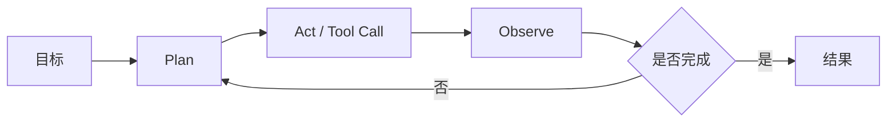

<!-- 本文件由 scripts/generate_course_tutorials.py 生成，请修改阶段计划或生成器后重新生成。 -->

# 第 07 周教程：Spring AI Tool Calling

> 计划来源：[02-java-llm-rag-agent.md](../stages/02-java-llm-rag-agent.md)。阶段文档决定课程任务和验收，本文件解释逐节学习方法；学习状态仍只记录在[第 07 周成果](../../deliverables/week-07/README.md)。

## 本周先理解

### 为什么学

让模型提出工具请求、让应用掌握校验和执行权，从而安全连接确定性业务能力。

### 这是什么

Tool Calling 是模型按 Schema 生成调用意图，由应用校验权限、执行普通函数并回填结果；模型本身不拥有执行权限。

### 本周学习策略

- 每天只完成下面一节，控制在约 1 小时，不提前堆叠下一节的新概念。
- 先预测再实验；先保存原始证据，再写结论；失败样例与正常结果同等重要。
- 首次遇到术语时补齐：一句话定义、输入输出、开发类比、类比边界、反例和“不是什么”。
- 使用 H1→H4 提示阶梯；若使用完整参考答案，必须额外完成一个不同输入或约束的变体。

## 逐节教程

### 周一 · 第 1 节：理解工具选择、参数生成和结果回传

**为什么学**

本周要让模型提出工具请求、让应用掌握校验和执行权，从而安全连接确定性业务能力。本节把“理解工具选择、参数生成和结果回传”推进为可检查成果；如果跳过，后续会缺少“绘制 Tool Calling 流程”这项关键证据。

**这个是什么**

本周核心概念是：Tool Calling 是模型按 Schema 生成调用意图，由应用校验权限、执行普通函数并回填结果；模型本身不拥有执行权限。今天的“理解工具选择、参数生成和结果回传”是这个核心能力的最小学习单元：你会通过“画出模型与应用的责任边界，明确模型只能请求工具，真正执行由代码负责”观察输入如何转化为“绘制 Tool Calling 流程”。它既包含可观察结果，也包含至少一个失败或不适用边界。只读完资料或只跑通正常路径，都不能证明已经掌握。

**怎么学（约 60 分钟）**

1. `0–5 分钟`：不查资料，写下你对本节主题的一句话解释、预期输入输出和一个疑问。
2. `5–15 分钟`：只阅读下方资料中与当前任务直接相关的部分，记录一个关键约束和版本信息。
3. `15–45 分钟`：执行专项任务：画出模型与应用的责任边界，明确模型只能请求工具，真正执行由代码负责
4. `45–55 分钟`：主动制造一个错误输入、边界条件、依赖失败或反例，保存现象并解释原因。
5. `55–60 分钟`：整理命令、输入、输出、Diff、图表或访谈证据，并用自己的语言完成 Teach-back。

专项资料：[Spring AI Tool Calling](https://docs.spring.io/spring-ai/reference/api/tools.html)

**怎么验证学会了**

- 必交证据：绘制 Tool Calling 流程。
- Teach-back：不看资料解释“理解工具选择、参数生成和结果回传”解决什么问题、主要输入输出、一个边界，以及它不是什么。
- 失败证据：展示一个非正常场景，指出失败发生在哪一层，不能只贴错误截图。
- 变体任务：改变一个输入、参数、角色、权限或失败条件，在不照抄原步骤的情况下重新完成。
- 通过标准：以上四项均有证据，且能解释关键取舍；只能照步骤运行时最高算 L1，不能判定本节通过。

**参考答案（独立尝试至少 20 分钟后再看）**

> 这是一份合格答案骨架，不是唯一实现。看完后必须关闭参考答案，换一个输入或约束独立重做。

#### 步骤 1 参考：先写预测

- 一句话解释：Tool Calling 是模型按 Schema 生成调用意图，由应用校验权限、执行普通函数并回填结果；模型本身不拥有执行权限。
- 预测：完成“理解工具选择、参数生成和结果回传”后，应能观察到“绘制 Tool Calling 流程”；失败输入不应产生假成功。

#### 步骤 2 参考：阅读资料

- 链接：[Spring AI Tool Calling](https://docs.spring.io/spring-ai/reference/api/tools.html)
- 指定章节/条目：Function/Tool Calling → Defining tools、Tool execution、Returning tool results
- 阅读方法：只摘录一个定义、一个输入输出约束和一个失败边界；记录页面日期、协议版本或依赖版本。

#### 步骤 3 参考：按专项动作完成产出

- 专项动作：画出模型与应用的责任边界，明确模型只能请求工具，真正执行由代码负责
- 参考图（按实际角色、字段和状态修改）：



#### 步骤 4 参考：制造失败并解释

- 失败注入：加入无答案、非法 Schema、超时或工具失败输入，正确结果应是拒答或稳定失败状态；如果输出看似正常但证据缺失，应判为失败。
- 参考判断：失败必须映射为明确状态、错误、拒答、人工路径或未验证假设；日志和界面不得显示成功。

#### 步骤 5 参考：整理交付与 Teach-back

- 当天交付：绘制 Tool Calling 流程。
- 完整字段：范围与参与者；输入；主路径；异常/拒绝路径；输出；信任或责任边界；版本与图例。
- Teach-back 参考：本节输入是什么、经过了什么处理、输出如何验证、哪种失败最危险、为什么当前方案没有越过课程边界。
- 完成后变体：更换一个输入、参数、角色、权限或失败条件，不看上述样例重新完成。


### 周二 · 第 2 节：使用 `@Tool` 定义 `listFiles`

**为什么学**

本周要让模型提出工具请求、让应用掌握校验和执行权，从而安全连接确定性业务能力。本节把“使用 `@Tool` 定义 `listFiles`”推进为可检查成果；如果跳过，后续会缺少“工具描述和 Schema 清晰”这项关键证据。

**这个是什么**

本周核心概念是：Tool Calling 是模型按 Schema 生成调用意图，由应用校验权限、执行普通函数并回填结果；模型本身不拥有执行权限。今天的“使用 `@Tool` 定义 `listFiles`”是这个核心能力的最小学习单元：你会通过“描述工具何时使用和不适用；直接调用 Java 方法完成单元测试后再接模型”观察输入如何转化为“工具描述和 Schema 清晰”。它既包含可观察结果，也包含至少一个失败或不适用边界。只读完资料或只跑通正常路径，都不能证明已经掌握。

**怎么学（约 60 分钟）**

1. `0–5 分钟`：不查资料，写下你对本节主题的一句话解释、预期输入输出和一个疑问。
2. `5–15 分钟`：只阅读下方资料中与当前任务直接相关的部分，记录一个关键约束和版本信息。
3. `15–45 分钟`：执行专项任务：描述工具何时使用和不适用；直接调用 Java 方法完成单元测试后再接模型
4. `45–55 分钟`：主动制造一个错误输入、边界条件、依赖失败或反例，保存现象并解释原因。
5. `55–60 分钟`：整理命令、输入、输出、Diff、图表或访谈证据，并用自己的语言完成 Teach-back。

专项资料：[Spring AI Tool Calling](https://docs.spring.io/spring-ai/reference/api/tools.html)

**怎么验证学会了**

- 必交证据：工具描述和 Schema 清晰。
- Teach-back：不看资料解释“使用 `@Tool` 定义 `listFiles`”解决什么问题、主要输入输出、一个边界，以及它不是什么。
- 失败证据：展示一个非正常场景，指出失败发生在哪一层，不能只贴错误截图。
- 变体任务：改变一个输入、参数、角色、权限或失败条件，在不照抄原步骤的情况下重新完成。
- 通过标准：以上四项均有证据，且能解释关键取舍；只能照步骤运行时最高算 L1，不能判定本节通过。

**参考答案（独立尝试至少 20 分钟后再看）**

> 这是一份合格答案骨架，不是唯一实现。看完后必须关闭参考答案，换一个输入或约束独立重做。

#### 步骤 1 参考：先写预测

- 一句话解释：Tool Calling 是模型按 Schema 生成调用意图，由应用校验权限、执行普通函数并回填结果；模型本身不拥有执行权限。
- 预测：完成“使用 `@Tool` 定义 `listFiles`”后，应能观察到“工具描述和 Schema 清晰”；失败输入不应产生假成功。

#### 步骤 2 参考：阅读资料

- 链接：[Spring AI Tool Calling](https://docs.spring.io/spring-ai/reference/api/tools.html)
- 指定章节/条目：Function/Tool Calling → Defining tools、Tool execution、Returning tool results
- 阅读方法：只摘录一个定义、一个输入输出约束和一个失败边界；记录页面日期、协议版本或依赖版本。

#### 步骤 3 参考：按专项动作完成产出

- 专项动作：描述工具何时使用和不适用；直接调用 Java 方法完成单元测试后再接模型
- 样例代码（先核对课程链接中的当前 API，再按本仓库边界修改）：

```java
record FileRequest(String path) {}

final class SafeFileTools {
    private final Path root = Path.of("sandbox-workspaces/demo").toAbsolutePath();

    @Tool(description = "Read a UTF-8 file inside the demo workspace")
    String readFile(FileRequest request) throws IOException {
        Path target = root.resolve(request.path()).normalize();
        if (!target.startsWith(root)) throw new IllegalArgumentException("PATH_OUTSIDE_ROOT");
        return Files.readString(target);
    }
}
```

#### 步骤 4 参考：制造失败并解释

- 失败注入：加入无答案、非法 Schema、超时或工具失败输入，正确结果应是拒答或稳定失败状态；如果输出看似正常但证据缺失，应判为失败。
- 参考判断：失败必须映射为明确状态、错误、拒答、人工路径或未验证假设；日志和界面不得显示成功。

#### 步骤 5 参考：整理交付与 Teach-back

- 当天交付：工具描述和 Schema 清晰。
- 完整字段：版本；请求字段；成功响应；稳定错误码；状态变化；traceId；幂等/并发约束；兼容性说明。
- Teach-back 参考：本节输入是什么、经过了什么处理、输出如何验证、哪种失败最危险、为什么当前方案没有越过课程边界。
- 完成后变体：更换一个输入、参数、角色、权限或失败条件，不看上述样例重新完成。


### 周三 · 第 3 节：增加 `readFile` 与 `searchDocs`

**为什么学**

本周要让模型提出工具请求、让应用掌握校验和执行权，从而安全连接确定性业务能力。本节把“增加 `readFile` 与 `searchDocs`”推进为可检查成果；如果跳过，后续会缺少“模型能选择正确工具”这项关键证据。

**这个是什么**

本周核心概念是：Tool Calling 是模型按 Schema 生成调用意图，由应用校验权限、执行普通函数并回填结果；模型本身不拥有执行权限。今天的“增加 `readFile` 与 `searchDocs`”是这个核心能力的最小学习单元：你会通过“设计问题分别触发三个工具，也准备一个完全不应调用工具的问题”观察输入如何转化为“模型能选择正确工具”。它既包含可观察结果，也包含至少一个失败或不适用边界。只读完资料或只跑通正常路径，都不能证明已经掌握。

**怎么学（约 60 分钟）**

1. `0–5 分钟`：不查资料，写下你对本节主题的一句话解释、预期输入输出和一个疑问。
2. `5–15 分钟`：只阅读下方资料中与当前任务直接相关的部分，记录一个关键约束和版本信息。
3. `15–45 分钟`：执行专项任务：设计问题分别触发三个工具，也准备一个完全不应调用工具的问题
4. `45–55 分钟`：主动制造一个错误输入、边界条件、依赖失败或反例，保存现象并解释原因。
5. `55–60 分钟`：整理命令、输入、输出、Diff、图表或访谈证据，并用自己的语言完成 Teach-back。

专项资料：[Spring AI Tool Calling](https://docs.spring.io/spring-ai/reference/api/tools.html)

**怎么验证学会了**

- 必交证据：模型能选择正确工具。
- Teach-back：不看资料解释“增加 `readFile` 与 `searchDocs`”解决什么问题、主要输入输出、一个边界，以及它不是什么。
- 失败证据：展示一个非正常场景，指出失败发生在哪一层，不能只贴错误截图。
- 变体任务：改变一个输入、参数、角色、权限或失败条件，在不照抄原步骤的情况下重新完成。
- 通过标准：以上四项均有证据，且能解释关键取舍；只能照步骤运行时最高算 L1，不能判定本节通过。

**参考答案（独立尝试至少 20 分钟后再看）**

> 这是一份合格答案骨架，不是唯一实现。看完后必须关闭参考答案，换一个输入或约束独立重做。

#### 步骤 1 参考：先写预测

- 一句话解释：Tool Calling 是模型按 Schema 生成调用意图，由应用校验权限、执行普通函数并回填结果；模型本身不拥有执行权限。
- 预测：完成“增加 `readFile` 与 `searchDocs`”后，应能观察到“模型能选择正确工具”；失败输入不应产生假成功。

#### 步骤 2 参考：阅读资料

- 链接：[Spring AI Tool Calling](https://docs.spring.io/spring-ai/reference/api/tools.html)
- 指定章节/条目：该链接指向的“Spring AI Tool Calling”整篇专题/章节；重点阅读与“增加 `readFile` 与 `searchDocs`”直接对应的段落，页面更新时使用课程标题中的英文术语或 API 名页内搜索
- 阅读方法：只摘录一个定义、一个输入输出约束和一个失败边界；记录页面日期、协议版本或依赖版本。

#### 步骤 3 参考：按专项动作完成产出

- 专项动作：设计问题分别触发三个工具，也准备一个完全不应调用工具的问题
- 参考资料/文档产出：

- 主题：增加 `readFile` 与 `searchDocs`
- 建议字段：入口；输入类型；输出类型；依赖版本；校验与权限；超时/错误；日志字段；最小测试命令
- 示例结论：已按统一口径产出“模型能选择正确工具”；证据不足的部分标记为假设或未验证。

#### 步骤 4 参考：制造失败并解释

- 失败注入：加入无答案、非法 Schema、超时或工具失败输入，正确结果应是拒答或稳定失败状态；如果输出看似正常但证据缺失，应判为失败。
- 参考判断：失败必须映射为明确状态、错误、拒答、人工路径或未验证假设；日志和界面不得显示成功。

#### 步骤 5 参考：整理交付与 Teach-back

- 当天交付：模型能选择正确工具。
- 完整字段：入口；输入类型；输出类型；依赖版本；校验与权限；超时/错误；日志字段；最小测试命令。
- Teach-back 参考：本节输入是什么、经过了什么处理、输出如何验证、哪种失败最危险、为什么当前方案没有越过课程边界。
- 完成后变体：更换一个输入、参数、角色、权限或失败条件，不看上述样例重新完成。


### 周四 · 第 4 节：DTO、参数校验和错误处理

**为什么学**

本周要让模型提出工具请求、让应用掌握校验和执行权，从而安全连接确定性业务能力。本节把“DTO、参数校验和错误处理”推进为可检查成果；如果跳过，后续会缺少“非法输入得到稳定错误”这项关键证据。

**这个是什么**

本周核心概念是：Tool Calling 是模型按 Schema 生成调用意图，由应用校验权限、执行普通函数并回填结果；模型本身不拥有执行权限。今天的“DTO、参数校验和错误处理”是这个核心能力的最小学习单元：你会通过“在工具入口校验，不依赖模型自觉；错误信息要可操作但不暴露内部路径”观察输入如何转化为“非法输入得到稳定错误”。它既包含可观察结果，也包含至少一个失败或不适用边界。只读完资料或只跑通正常路径，都不能证明已经掌握。

**怎么学（约 60 分钟）**

1. `0–5 分钟`：不查资料，写下你对本节主题的一句话解释、预期输入输出和一个疑问。
2. `5–15 分钟`：只阅读下方资料中与当前任务直接相关的部分，记录一个关键约束和版本信息。
3. `15–45 分钟`：执行专项任务：在工具入口校验，不依赖模型自觉；错误信息要可操作但不暴露内部路径
4. `45–55 分钟`：主动制造一个错误输入、边界条件、依赖失败或反例，保存现象并解释原因。
5. `55–60 分钟`：整理命令、输入、输出、Diff、图表或访谈证据，并用自己的语言完成 Teach-back。

专项资料：[Spring AI Schema Validation](https://docs.spring.io/spring-ai/reference/api/structured-output/validation.html)

**怎么验证学会了**

- 必交证据：非法输入得到稳定错误。
- Teach-back：不看资料解释“DTO、参数校验和错误处理”解决什么问题、主要输入输出、一个边界，以及它不是什么。
- 失败证据：展示一个非正常场景，指出失败发生在哪一层，不能只贴错误截图。
- 变体任务：改变一个输入、参数、角色、权限或失败条件，在不照抄原步骤的情况下重新完成。
- 通过标准：以上四项均有证据，且能解释关键取舍；只能照步骤运行时最高算 L1，不能判定本节通过。

**参考答案（独立尝试至少 20 分钟后再看）**

> 这是一份合格答案骨架，不是唯一实现。看完后必须关闭参考答案，换一个输入或约束独立重做。

#### 步骤 1 参考：先写预测

- 一句话解释：Tool Calling 是模型按 Schema 生成调用意图，由应用校验权限、执行普通函数并回填结果；模型本身不拥有执行权限。
- 预测：完成“DTO、参数校验和错误处理”后，应能观察到“非法输入得到稳定错误”；失败输入不应产生假成功。

#### 步骤 2 参考：阅读资料

- 链接：[Spring AI Schema Validation](https://docs.spring.io/spring-ai/reference/api/structured-output/validation.html)
- 指定章节/条目：该链接指向的“Spring AI Schema Validation”整篇专题/章节；重点阅读与“DTO、参数校验和错误处理”直接对应的段落，页面更新时使用课程标题中的英文术语或 API 名页内搜索
- 阅读方法：只摘录一个定义、一个输入输出约束和一个失败边界；记录页面日期、协议版本或依赖版本。

#### 步骤 3 参考：按专项动作完成产出

- 专项动作：在工具入口校验，不依赖模型自觉；错误信息要可操作但不暴露内部路径
- 参考资料/文档产出：

- 主题：DTO、参数校验和错误处理
- 建议字段：版本；请求字段；成功响应；稳定错误码；状态变化；traceId；幂等/并发约束；兼容性说明
- 示例结论：已按统一口径产出“非法输入得到稳定错误”；证据不足的部分标记为假设或未验证。

#### 步骤 4 参考：制造失败并解释

- 失败注入：加入无答案、非法 Schema、超时或工具失败输入，正确结果应是拒答或稳定失败状态；如果输出看似正常但证据缺失，应判为失败。
- 参考判断：失败必须映射为明确状态、错误、拒答、人工路径或未验证假设；日志和界面不得显示成功。

#### 步骤 5 参考：整理交付与 Teach-back

- 当天交付：非法输入得到稳定错误。
- 完整字段：版本；请求字段；成功响应；稳定错误码；状态变化；traceId；幂等/并发约束；兼容性说明。
- Teach-back 参考：本节输入是什么、经过了什么处理、输出如何验证、哪种失败最危险、为什么当前方案没有越过课程边界。
- 完成后变体：更换一个输入、参数、角色、权限或失败条件，不看上述样例重新完成。


### 周五 · 第 5 节：路径规范化和目录白名单

**为什么学**

本周要让模型提出工具请求、让应用掌握校验和执行权，从而安全连接确定性业务能力。本节把“路径规范化和目录白名单”推进为可检查成果；如果跳过，后续会缺少“无法越界读取”这项关键证据。

**这个是什么**

本周核心概念是：Tool Calling 是模型按 Schema 生成调用意图，由应用校验权限、执行普通函数并回填结果；模型本身不拥有执行权限。今天的“路径规范化和目录白名单”是这个核心能力的最小学习单元：你会通过“测试 `../`、绝对路径、符号链接和编码变体，比较规范化前后路径”观察输入如何转化为“无法越界读取”。它既包含可观察结果，也包含至少一个失败或不适用边界。只读完资料或只跑通正常路径，都不能证明已经掌握。

**怎么学（约 60 分钟）**

1. `0–5 分钟`：不查资料，写下你对本节主题的一句话解释、预期输入输出和一个疑问。
2. `5–15 分钟`：只阅读下方资料中与当前任务直接相关的部分，记录一个关键约束和版本信息。
3. `15–45 分钟`：执行专项任务：测试 `../`、绝对路径、符号链接和编码变体，比较规范化前后路径
4. `45–55 分钟`：主动制造一个错误输入、边界条件、依赖失败或反例，保存现象并解释原因。
5. `55–60 分钟`：整理命令、输入、输出、Diff、图表或访谈证据，并用自己的语言完成 Teach-back。

专项资料：[OWASP Path Traversal](https://owasp.org/www-community/attacks/Path_Traversal)

**怎么验证学会了**

- 必交证据：无法越界读取。
- Teach-back：不看资料解释“路径规范化和目录白名单”解决什么问题、主要输入输出、一个边界，以及它不是什么。
- 失败证据：展示一个非正常场景，指出失败发生在哪一层，不能只贴错误截图。
- 变体任务：改变一个输入、参数、角色、权限或失败条件，在不照抄原步骤的情况下重新完成。
- 通过标准：以上四项均有证据，且能解释关键取舍；只能照步骤运行时最高算 L1，不能判定本节通过。

**参考答案（独立尝试至少 20 分钟后再看）**

> 这是一份合格答案骨架，不是唯一实现。看完后必须关闭参考答案，换一个输入或约束独立重做。

#### 步骤 1 参考：先写预测

- 一句话解释：Tool Calling 是模型按 Schema 生成调用意图，由应用校验权限、执行普通函数并回填结果；模型本身不拥有执行权限。
- 预测：完成“路径规范化和目录白名单”后，应能观察到“无法越界读取”；失败输入不应产生假成功。

#### 步骤 2 参考：阅读资料

- 链接：[OWASP Path Traversal](https://owasp.org/www-community/attacks/Path_Traversal)
- 指定章节/条目：Path Traversal → Description、Examples、Mitigation
- 阅读方法：只摘录一个定义、一个输入输出约束和一个失败边界；记录页面日期、协议版本或依赖版本。

#### 步骤 3 参考：按专项动作完成产出

- 专项动作：测试 `../`、绝对路径、符号链接和编码变体，比较规范化前后路径
- 参考资料/文档产出：

- 主题：路径规范化和目录白名单
- 建议字段：一句话定义；输入；操作；可观察输出；失败/反例；工程意义；证据位置
- 示例结论：已按统一口径产出“无法越界读取”；证据不足的部分标记为假设或未验证。

#### 步骤 4 参考：制造失败并解释

- 失败注入：删掉一个必填输入或让依赖失败，系统应返回可解释的失败结果且不产生假成功；再根据日志、Diff 或流程证据定位原因。
- 参考判断：失败必须映射为明确状态、错误、拒答、人工路径或未验证假设；日志和界面不得显示成功。

#### 步骤 5 参考：整理交付与 Teach-back

- 当天交付：无法越界读取。
- 完整字段：一句话定义；输入；操作；可观察输出；失败/反例；工程意义；证据位置。
- Teach-back 参考：本节输入是什么、经过了什么处理、输出如何验证、哪种失败最危险、为什么当前方案没有越过课程边界。
- 完成后变体：更换一个输入、参数、角色、权限或失败条件，不看上述样例重新完成。


### 周六 · 第 6 节：完成一次多工具任务

**为什么学**

本周要让模型提出工具请求、让应用掌握校验和执行权，从而安全连接确定性业务能力。本节把“完成一次多工具任务”推进为可检查成果；如果跳过，后续会缺少“工具顺序和结果可追踪”这项关键证据。

**这个是什么**

本周核心概念是：Tool Calling 是模型按 Schema 生成调用意图，由应用校验权限、执行普通函数并回填结果；模型本身不拥有执行权限。今天的“完成一次多工具任务”是这个核心能力的最小学习单元：你会通过“限制最大工具调用次数，保存每次参数、结果状态和耗时”观察输入如何转化为“工具顺序和结果可追踪”。它既包含可观察结果，也包含至少一个失败或不适用边界。只读完资料或只跑通正常路径，都不能证明已经掌握。

**怎么学（约 60 分钟）**

1. `0–5 分钟`：不查资料，写下你对本节主题的一句话解释、预期输入输出和一个疑问。
2. `5–15 分钟`：只阅读下方资料中与当前任务直接相关的部分，记录一个关键约束和版本信息。
3. `15–45 分钟`：执行专项任务：限制最大工具调用次数，保存每次参数、结果状态和耗时
4. `45–55 分钟`：主动制造一个错误输入、边界条件、依赖失败或反例，保存现象并解释原因。
5. `55–60 分钟`：整理命令、输入、输出、Diff、图表或访谈证据，并用自己的语言完成 Teach-back。

专项资料：[Spring AI Tool Calling](https://docs.spring.io/spring-ai/reference/api/tools.html)

**怎么验证学会了**

- 必交证据：工具顺序和结果可追踪。
- Teach-back：不看资料解释“完成一次多工具任务”解决什么问题、主要输入输出、一个边界，以及它不是什么。
- 失败证据：展示一个非正常场景，指出失败发生在哪一层，不能只贴错误截图。
- 变体任务：改变一个输入、参数、角色、权限或失败条件，在不照抄原步骤的情况下重新完成。
- 通过标准：以上四项均有证据，且能解释关键取舍；只能照步骤运行时最高算 L1，不能判定本节通过。

**参考答案（独立尝试至少 20 分钟后再看）**

> 这是一份合格答案骨架，不是唯一实现。看完后必须关闭参考答案，换一个输入或约束独立重做。

#### 步骤 1 参考：先写预测

- 一句话解释：Tool Calling 是模型按 Schema 生成调用意图，由应用校验权限、执行普通函数并回填结果；模型本身不拥有执行权限。
- 预测：完成“完成一次多工具任务”后，应能观察到“工具顺序和结果可追踪”；失败输入不应产生假成功。

#### 步骤 2 参考：阅读资料

- 链接：[Spring AI Tool Calling](https://docs.spring.io/spring-ai/reference/api/tools.html)
- 指定章节/条目：该链接指向的“Spring AI Tool Calling”整篇专题/章节；重点阅读与“完成一次多工具任务”直接对应的段落，页面更新时使用课程标题中的英文术语或 API 名页内搜索
- 阅读方法：只摘录一个定义、一个输入输出约束和一个失败边界；记录页面日期、协议版本或依赖版本。

#### 步骤 3 参考：按专项动作完成产出

- 专项动作：限制最大工具调用次数，保存每次参数、结果状态和耗时
- 参考资料/文档产出：

- 主题：完成一次多工具任务
- 建议字段：入口；输入类型；输出类型；依赖版本；校验与权限；超时/错误；日志字段；最小测试命令
- 示例结论：已按统一口径产出“工具顺序和结果可追踪”；证据不足的部分标记为假设或未验证。

#### 步骤 4 参考：制造失败并解释

- 失败注入：加入无答案、非法 Schema、超时或工具失败输入，正确结果应是拒答或稳定失败状态；如果输出看似正常但证据缺失，应判为失败。
- 参考判断：失败必须映射为明确状态、错误、拒答、人工路径或未验证假设；日志和界面不得显示成功。

#### 步骤 5 参考：整理交付与 Teach-back

- 当天交付：工具顺序和结果可追踪。
- 完整字段：入口；输入类型；输出类型；依赖版本；校验与权限；超时/错误；日志字段；最小测试命令。
- Teach-back 参考：本节输入是什么、经过了什么处理、输出如何验证、哪种失败最危险、为什么当前方案没有越过课程边界。
- 完成后变体：更换一个输入、参数、角色、权限或失败条件，不看上述样例重新完成。


### 周日 · 第 7 节：威胁建模和安全复盘

**为什么学**

本周要让模型提出工具请求、让应用掌握校验和执行权，从而安全连接确定性业务能力。本节把“威胁建模和安全复盘”推进为可检查成果；如果跳过，后续会缺少“完成本周提交”这项关键证据。

**这个是什么**

本周核心概念是：Tool Calling 是模型按 Schema 生成调用意图，由应用校验权限、执行普通函数并回填结果；模型本身不拥有执行权限。今天的“威胁建模和安全复盘”是这个核心能力的最小学习单元：你会通过“从资产、入口、攻击方式和防护四方面整理，不把 Prompt 当安全边界”观察输入如何转化为“完成本周提交”。它既包含可观察结果，也包含至少一个失败或不适用边界。只读完资料或只跑通正常路径，都不能证明已经掌握。

**怎么学（约 60 分钟）**

1. `0–5 分钟`：不查资料，写下你对本节主题的一句话解释、预期输入输出和一个疑问。
2. `5–15 分钟`：只阅读下方资料中与当前任务直接相关的部分，记录一个关键约束和版本信息。
3. `15–45 分钟`：执行专项任务：从资产、入口、攻击方式和防护四方面整理，不把 Prompt 当安全边界
4. `45–55 分钟`：主动制造一个错误输入、边界条件、依赖失败或反例，保存现象并解释原因。
5. `55–60 分钟`：整理命令、输入、输出、Diff、图表或访谈证据，并用自己的语言完成 Teach-back。

专项资料：[OWASP Threat Modeling](https://owasp.org/www-community/Threat_Modeling)

**怎么验证学会了**

- 必交证据：完成本周提交。
- Teach-back：不看资料解释“威胁建模和安全复盘”解决什么问题、主要输入输出、一个边界，以及它不是什么。
- 失败证据：展示一个非正常场景，指出失败发生在哪一层，不能只贴错误截图。
- 变体任务：改变一个输入、参数、角色、权限或失败条件，在不照抄原步骤的情况下重新完成。
- 通过标准：以上四项均有证据，且能解释关键取舍；只能照步骤运行时最高算 L1，不能判定本节通过。

**参考答案（独立尝试至少 20 分钟后再看）**

> 这是一份合格答案骨架，不是唯一实现。看完后必须关闭参考答案，换一个输入或约束独立重做。

#### 步骤 1 参考：先写预测

- 一句话解释：Tool Calling 是模型按 Schema 生成调用意图，由应用校验权限、执行普通函数并回填结果；模型本身不拥有执行权限。
- 预测：完成“威胁建模和安全复盘”后，应能观察到“完成本周提交”；失败输入不应产生假成功。

#### 步骤 2 参考：阅读资料

- 链接：[OWASP Threat Modeling](https://owasp.org/www-community/Threat_Modeling)
- 指定章节/条目：该链接指向的“OWASP Threat Modeling”整篇专题/章节；重点阅读与“威胁建模和安全复盘”直接对应的段落，页面更新时使用课程标题中的英文术语或 API 名页内搜索
- 阅读方法：只摘录一个定义、一个输入输出约束和一个失败边界；记录页面日期、协议版本或依赖版本。

#### 步骤 3 参考：按专项动作完成产出

- 专项动作：从资产、入口、攻击方式和防护四方面整理，不把 Prompt 当安全边界
- 参考资料/文档产出：

- 主题：威胁建模和安全复盘
- 建议字段：指标名称；计算公式；数据来源；样本与时间窗；当前值；目标/阈值；限制与未验证项
- 示例结论：已按统一口径产出“完成本周提交”；证据不足的部分标记为假设或未验证。

#### 步骤 4 参考：制造失败并解释

- 失败注入：删除身份、Scope 或审批后再次执行，正确结果应是执行路径明确拒绝且留下脱敏审计；如果仍成功，就是权限边界失效。
- 参考判断：失败必须映射为明确状态、错误、拒答、人工路径或未验证假设；日志和界面不得显示成功。

#### 步骤 5 参考：整理交付与 Teach-back

- 当天交付：完成本周提交。
- 完整字段：指标名称；计算公式；数据来源；样本与时间窗；当前值；目标/阈值；限制与未验证项。
- Teach-back 参考：本节输入是什么、经过了什么处理、输出如何验证、哪种失败最危险、为什么当前方案没有越过课程边界。
- 完成后变体：更换一个输入、参数、角色、权限或失败条件，不看上述样例重新完成。


## 本周收尾

按[成果与提交标准](../06-deliverable-standards.md)整理本周成果，再由讲师按[监督与掌握度规范](../07-instructor-supervision.md)给出“通过、部分通过、未通过”。教程完成不代表学习者已经掌握，必须以独立运行、排错、Teach-back 和变体证据为准。
