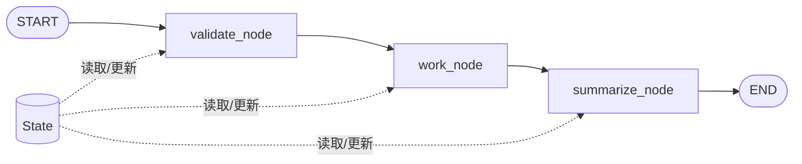

<!-- 本文件由 scripts/generate_course_tutorials.py 生成，请修改阶段计划或生成器后重新生成。 -->

# 第 11 周教程：LangGraph 工作流

> 计划来源：[03-langchain-langgraph.md](../stages/03-langchain-langgraph.md)。阶段文档决定课程任务和验收，本文件解释逐节学习方法；学习状态仍只记录在[第 11 周成果](../../deliverables/week-11/README.md)。

## 本周先理解

### 为什么学

把开放式 Agent 放入显式状态机，实现可路由、可暂停、可恢复和可审计的长流程。

### 这是什么

LangGraph 用 State、Node、Edge 和 Checkpoint 表达有状态工作流；确定性控制留在图和普通代码，模糊判断才交给模型。

### 本周学习策略

- 每天只完成下面一节，控制在约 1 小时，不提前堆叠下一节的新概念。
- 先预测再实验；先保存原始证据，再写结论；失败样例与正常结果同等重要。
- 首次遇到术语时补齐：一句话定义、输入输出、开发类比、类比边界、反例和“不是什么”。
- 使用 H1→H4 提示阶梯；若使用完整参考答案，必须额外完成一个不同输入或约束的变体。

## 逐节教程

### 周一 · 第 1 节：State、Node、Edge

**为什么学**

本周要把开放式 Agent 放入显式状态机，实现可路由、可暂停、可恢复和可审计的长流程。本节把“State、Node、Edge”推进为可检查成果；如果跳过，后续会缺少“完成三节点顺序图”这项关键证据。

**这个是什么**

本周核心概念是：LangGraph 用 State、Node、Edge 和 Checkpoint 表达有状态工作流；确定性控制留在图和普通代码，模糊判断才交给模型。今天的“State、Node、Edge”是这个核心能力的最小学习单元：你会通过“先用不调用 LLM 的普通函数搭图，理解 State 更新和节点边界后再接模型”观察输入如何转化为“完成三节点顺序图”。它既包含可观察结果，也包含至少一个失败或不适用边界。只读完资料或只跑通正常路径，都不能证明已经掌握。

**怎么学（约 60 分钟）**

1. `0–5 分钟`：不查资料，写下你对本节主题的一句话解释、预期输入输出和一个疑问。
2. `5–15 分钟`：只阅读下方资料中与当前任务直接相关的部分，记录一个关键约束和版本信息。
3. `15–45 分钟`：执行专项任务：先用不调用 LLM 的普通函数搭图，理解 State 更新和节点边界后再接模型
4. `45–55 分钟`：主动制造一个错误输入、边界条件、依赖失败或反例，保存现象并解释原因。
5. `55–60 分钟`：整理命令、输入、输出、Diff、图表或访谈证据，并用自己的语言完成 Teach-back。

专项资料：[LangGraph Graph API](https://docs.langchain.com/oss/python/langgraph/graph-api)

**怎么验证学会了**

- 必交证据：完成三节点顺序图。
- Teach-back：不看资料解释“State、Node、Edge”解决什么问题、主要输入输出、一个边界，以及它不是什么。
- 失败证据：展示一个非正常场景，指出失败发生在哪一层，不能只贴错误截图。
- 变体任务：改变一个输入、参数、角色、权限或失败条件，在不照抄原步骤的情况下重新完成。
- 通过标准：以上四项均有证据，且能解释关键取舍；只能照步骤运行时最高算 L1，不能判定本节通过。

**参考答案（独立尝试至少 20 分钟后再看）**

> 这是一份合格答案骨架，不是唯一实现。看完后必须关闭参考答案，换一个输入或约束独立重做。

#### 步骤 1 参考：先写预测

- 一句话解释：LangGraph 用 State、Node、Edge 和 Checkpoint 表达有状态工作流；确定性控制留在图和普通代码，模糊判断才交给模型。
- 预测：完成“State、Node、Edge”后，应能观察到“完成三节点顺序图”；失败输入不应产生假成功。

#### 步骤 2 参考：阅读资料

- 链接：[LangGraph Graph API](https://docs.langchain.com/oss/python/langgraph/graph-api)
- 指定章节/条目：Graph API → State、Nodes、Edges、Conditional edges、Reducers
- 阅读方法：只摘录一个定义、一个输入输出约束和一个失败边界；记录页面日期、协议版本或依赖版本。

#### 步骤 3 参考：按专项动作完成产出

- 专项动作：先用不调用 LLM 的普通函数搭图，理解 State 更新和节点边界后再接模型
- 参考图（按实际角色、字段和状态修改）：



#### 步骤 4 参考：制造失败并解释

- 失败注入：加入无答案、非法 Schema、超时或工具失败输入，正确结果应是拒答或稳定失败状态；如果输出看似正常但证据缺失，应判为失败。
- 参考判断：失败必须映射为明确状态、错误、拒答、人工路径或未验证假设；日志和界面不得显示成功。

#### 步骤 5 参考：整理交付与 Teach-back

- 当天交付：完成三节点顺序图。
- 完整字段：范围与参与者；输入；主路径；异常/拒绝路径；输出；信任或责任边界；版本与图例。
- Teach-back 参考：本节输入是什么、经过了什么处理、输出如何验证、哪种失败最危险、为什么当前方案没有越过课程边界。
- 完成后变体：更换一个输入、参数、角色、权限或失败条件，不看上述样例重新完成。


### 周二 · 第 2 节：条件边与任务分类

**为什么学**

本周要把开放式 Agent 放入显式状态机，实现可路由、可暂停、可恢复和可审计的长流程。本节把“条件边与任务分类”推进为可检查成果；如果跳过，后续会缺少“不同任务进入不同分支”这项关键证据。

**这个是什么**

本周核心概念是：LangGraph 用 State、Node、Edge 和 Checkpoint 表达有状态工作流；确定性控制留在图和普通代码，模糊判断才交给模型。今天的“条件边与任务分类”是这个核心能力的最小学习单元：你会通过“明确规则能判断的情况用代码路由，只把模糊语义分类交给模型”观察输入如何转化为“不同任务进入不同分支”。它既包含可观察结果，也包含至少一个失败或不适用边界。只读完资料或只跑通正常路径，都不能证明已经掌握。

**怎么学（约 60 分钟）**

1. `0–5 分钟`：不查资料，写下你对本节主题的一句话解释、预期输入输出和一个疑问。
2. `5–15 分钟`：只阅读下方资料中与当前任务直接相关的部分，记录一个关键约束和版本信息。
3. `15–45 分钟`：执行专项任务：明确规则能判断的情况用代码路由，只把模糊语义分类交给模型
4. `45–55 分钟`：主动制造一个错误输入、边界条件、依赖失败或反例，保存现象并解释原因。
5. `55–60 分钟`：整理命令、输入、输出、Diff、图表或访谈证据，并用自己的语言完成 Teach-back。

专项资料：[LangGraph Workflows and Agents](https://docs.langchain.com/oss/python/langgraph/workflows-agents)

**怎么验证学会了**

- 必交证据：不同任务进入不同分支。
- Teach-back：不看资料解释“条件边与任务分类”解决什么问题、主要输入输出、一个边界，以及它不是什么。
- 失败证据：展示一个非正常场景，指出失败发生在哪一层，不能只贴错误截图。
- 变体任务：改变一个输入、参数、角色、权限或失败条件，在不照抄原步骤的情况下重新完成。
- 通过标准：以上四项均有证据，且能解释关键取舍；只能照步骤运行时最高算 L1，不能判定本节通过。

**参考答案（独立尝试至少 20 分钟后再看）**

> 这是一份合格答案骨架，不是唯一实现。看完后必须关闭参考答案，换一个输入或约束独立重做。

#### 步骤 1 参考：先写预测

- 一句话解释：LangGraph 用 State、Node、Edge 和 Checkpoint 表达有状态工作流；确定性控制留在图和普通代码，模糊判断才交给模型。
- 预测：完成“条件边与任务分类”后，应能观察到“不同任务进入不同分支”；失败输入不应产生假成功。

#### 步骤 2 参考：阅读资料

- 链接：[LangGraph Workflows and Agents](https://docs.langchain.com/oss/python/langgraph/workflows-agents)
- 指定章节/条目：Graph API → State、Nodes、Edges、Conditional edges、Reducers
- 阅读方法：只摘录一个定义、一个输入输出约束和一个失败边界；记录页面日期、协议版本或依赖版本。

#### 步骤 3 参考：按专项动作完成产出

- 专项动作：明确规则能判断的情况用代码路由，只把模糊语义分类交给模型
- 样例代码（先核对课程链接中的当前 API，再按本仓库边界修改）：

```python
from typing_extensions import TypedDict
from langgraph.graph import StateGraph, START, END

class State(TypedDict):
    task: str
    attempts: int

def validate(state: State) -> dict:
    if not state["task"].strip():
        raise ValueError("EMPTY_TASK")
    return {"attempts": state["attempts"] + 1}

graph = StateGraph(State)
graph.add_node("validate", validate)
graph.add_edge(START, "validate")
graph.add_edge("validate", END)
app = graph.compile()
print(app.invoke({"task": "demo", "attempts": 0}))
```

#### 步骤 4 参考：制造失败并解释

- 失败注入：加入无答案、非法 Schema、超时或工具失败输入，正确结果应是拒答或稳定失败状态；如果输出看似正常但证据缺失，应判为失败。
- 参考判断：失败必须映射为明确状态、错误、拒答、人工路径或未验证假设；日志和界面不得显示成功。

#### 步骤 5 参考：整理交付与 Teach-back

- 当天交付：不同任务进入不同分支。
- 完整字段：对象；Owner/角色；输入或来源；规则/约束；风险；证据；状态；下一步。
- Teach-back 参考：本节输入是什么、经过了什么处理、输出如何验证、哪种失败最危险、为什么当前方案没有越过课程边界。
- 完成后变体：更换一个输入、参数、角色、权限或失败条件，不看上述样例重新完成。


### 周三 · 第 3 节：循环、最大步骤和失败分支

**为什么学**

本周要把开放式 Agent 放入显式状态机，实现可路由、可暂停、可恢复和可审计的长流程。本节把“循环、最大步骤和失败分支”推进为可检查成果；如果跳过，后续会缺少“异常不会无限循环”这项关键证据。

**这个是什么**

本周核心概念是：LangGraph 用 State、Node、Edge 和 Checkpoint 表达有状态工作流；确定性控制留在图和普通代码，模糊判断才交给模型。今天的“循环、最大步骤和失败分支”是这个核心能力的最小学习单元：你会通过“在 State 保存显式计数和错误类型，人为构造循环验证停止逻辑”观察输入如何转化为“异常不会无限循环”。它既包含可观察结果，也包含至少一个失败或不适用边界。只读完资料或只跑通正常路径，都不能证明已经掌握。

**怎么学（约 60 分钟）**

1. `0–5 分钟`：不查资料，写下你对本节主题的一句话解释、预期输入输出和一个疑问。
2. `5–15 分钟`：只阅读下方资料中与当前任务直接相关的部分，记录一个关键约束和版本信息。
3. `15–45 分钟`：执行专项任务：在 State 保存显式计数和错误类型，人为构造循环验证停止逻辑
4. `45–55 分钟`：主动制造一个错误输入、边界条件、依赖失败或反例，保存现象并解释原因。
5. `55–60 分钟`：整理命令、输入、输出、Diff、图表或访谈证据，并用自己的语言完成 Teach-back。

专项资料：[LangGraph Graph API](https://docs.langchain.com/oss/python/langgraph/graph-api)

**怎么验证学会了**

- 必交证据：异常不会无限循环。
- Teach-back：不看资料解释“循环、最大步骤和失败分支”解决什么问题、主要输入输出、一个边界，以及它不是什么。
- 失败证据：展示一个非正常场景，指出失败发生在哪一层，不能只贴错误截图。
- 变体任务：改变一个输入、参数、角色、权限或失败条件，在不照抄原步骤的情况下重新完成。
- 通过标准：以上四项均有证据，且能解释关键取舍；只能照步骤运行时最高算 L1，不能判定本节通过。

**参考答案（独立尝试至少 20 分钟后再看）**

> 这是一份合格答案骨架，不是唯一实现。看完后必须关闭参考答案，换一个输入或约束独立重做。

#### 步骤 1 参考：先写预测

- 一句话解释：LangGraph 用 State、Node、Edge 和 Checkpoint 表达有状态工作流；确定性控制留在图和普通代码，模糊判断才交给模型。
- 预测：完成“循环、最大步骤和失败分支”后，应能观察到“异常不会无限循环”；失败输入不应产生假成功。

#### 步骤 2 参考：阅读资料

- 链接：[LangGraph Graph API](https://docs.langchain.com/oss/python/langgraph/graph-api)
- 指定章节/条目：Graph API → State、Nodes、Edges、Conditional edges、Reducers
- 阅读方法：只摘录一个定义、一个输入输出约束和一个失败边界；记录页面日期、协议版本或依赖版本。

#### 步骤 3 参考：按专项动作完成产出

- 专项动作：在 State 保存显式计数和错误类型，人为构造循环验证停止逻辑
- 样例代码（先核对课程链接中的当前 API，再按本仓库边界修改）：

```python
from typing_extensions import TypedDict
from langgraph.graph import StateGraph, START, END

class State(TypedDict):
    task: str
    attempts: int

def validate(state: State) -> dict:
    if not state["task"].strip():
        raise ValueError("EMPTY_TASK")
    return {"attempts": state["attempts"] + 1}

graph = StateGraph(State)
graph.add_node("validate", validate)
graph.add_edge(START, "validate")
graph.add_edge("validate", END)
app = graph.compile()
print(app.invoke({"task": "demo", "attempts": 0}))
```

#### 步骤 4 参考：制造失败并解释

- 失败注入：加入无答案、非法 Schema、超时或工具失败输入，正确结果应是拒答或稳定失败状态；如果输出看似正常但证据缺失，应判为失败。
- 参考判断：失败必须映射为明确状态、错误、拒答、人工路径或未验证假设；日志和界面不得显示成功。

#### 步骤 5 参考：整理交付与 Teach-back

- 当天交付：异常不会无限循环。
- 完整字段：一句话定义；输入；操作；可观察输出；失败/反例；工程意义；证据位置。
- Teach-back 参考：本节输入是什么、经过了什么处理、输出如何验证、哪种失败最危险、为什么当前方案没有越过课程边界。
- 完成后变体：更换一个输入、参数、角色、权限或失败条件，不看上述样例重新完成。


### 周四 · 第 4 节：Checkpoint 和会话状态

**为什么学**

本周要把开放式 Agent 放入显式状态机，实现可路由、可暂停、可恢复和可审计的长流程。本节把“Checkpoint 和会话状态”推进为可检查成果；如果跳过，后续会缺少“中断后可以恢复”这项关键证据。

**这个是什么**

本周核心概念是：LangGraph 用 State、Node、Edge 和 Checkpoint 表达有状态工作流；确定性控制留在图和普通代码，模糊判断才交给模型。今天的“Checkpoint 和会话状态”是这个核心能力的最小学习单元：你会通过“使用稳定 thread/session ID；在进程退出后恢复，不能只在同一内存运行中测试”观察输入如何转化为“中断后可以恢复”。它既包含可观察结果，也包含至少一个失败或不适用边界。只读完资料或只跑通正常路径，都不能证明已经掌握。

**怎么学（约 60 分钟）**

1. `0–5 分钟`：不查资料，写下你对本节主题的一句话解释、预期输入输出和一个疑问。
2. `5–15 分钟`：只阅读下方资料中与当前任务直接相关的部分，记录一个关键约束和版本信息。
3. `15–45 分钟`：执行专项任务：使用稳定 thread/session ID；在进程退出后恢复，不能只在同一内存运行中测试
4. `45–55 分钟`：主动制造一个错误输入、边界条件、依赖失败或反例，保存现象并解释原因。
5. `55–60 分钟`：整理命令、输入、输出、Diff、图表或访谈证据，并用自己的语言完成 Teach-back。

专项资料：[LangGraph Persistence](https://docs.langchain.com/oss/python/langgraph/persistence)

**怎么验证学会了**

- 必交证据：中断后可以恢复。
- Teach-back：不看资料解释“Checkpoint 和会话状态”解决什么问题、主要输入输出、一个边界，以及它不是什么。
- 失败证据：展示一个非正常场景，指出失败发生在哪一层，不能只贴错误截图。
- 变体任务：改变一个输入、参数、角色、权限或失败条件，在不照抄原步骤的情况下重新完成。
- 通过标准：以上四项均有证据，且能解释关键取舍；只能照步骤运行时最高算 L1，不能判定本节通过。

**参考答案（独立尝试至少 20 分钟后再看）**

> 这是一份合格答案骨架，不是唯一实现。看完后必须关闭参考答案，换一个输入或约束独立重做。

#### 步骤 1 参考：先写预测

- 一句话解释：LangGraph 用 State、Node、Edge 和 Checkpoint 表达有状态工作流；确定性控制留在图和普通代码，模糊判断才交给模型。
- 预测：完成“Checkpoint 和会话状态”后，应能观察到“中断后可以恢复”；失败输入不应产生假成功。

#### 步骤 2 参考：阅读资料

- 链接：[LangGraph Persistence](https://docs.langchain.com/oss/python/langgraph/persistence)
- 指定章节/条目：Persistence → Threads、Checkpoints、Get state history、Replay
- 阅读方法：只摘录一个定义、一个输入输出约束和一个失败边界；记录页面日期、协议版本或依赖版本。

#### 步骤 3 参考：按专项动作完成产出

- 专项动作：使用稳定 thread/session ID；在进程退出后恢复，不能只在同一内存运行中测试
- 样例代码（先核对课程链接中的当前 API，再按本仓库边界修改）：

```python
from typing_extensions import TypedDict
from langgraph.graph import StateGraph, START, END

class State(TypedDict):
    task: str
    attempts: int

def validate(state: State) -> dict:
    if not state["task"].strip():
        raise ValueError("EMPTY_TASK")
    return {"attempts": state["attempts"] + 1}

graph = StateGraph(State)
graph.add_node("validate", validate)
graph.add_edge(START, "validate")
graph.add_edge("validate", END)
app = graph.compile()
print(app.invoke({"task": "demo", "attempts": 0}))
```

#### 步骤 4 参考：制造失败并解释

- 失败注入：加入无答案、非法 Schema、超时或工具失败输入，正确结果应是拒答或稳定失败状态；如果输出看似正常但证据缺失，应判为失败。
- 参考判断：失败必须映射为明确状态、错误、拒答、人工路径或未验证假设；日志和界面不得显示成功。

#### 步骤 5 参考：整理交付与 Teach-back

- 当天交付：中断后可以恢复。
- 完整字段：一句话定义；输入；操作；可观察输出；失败/反例；工程意义；证据位置。
- Teach-back 参考：本节输入是什么、经过了什么处理、输出如何验证、哪种失败最危险、为什么当前方案没有越过课程边界。
- 完成后变体：更换一个输入、参数、角色、权限或失败条件，不看上述样例重新完成。


### 周五 · 第 5 节：Human-in-the-loop

**为什么学**

本周要把开放式 Agent 放入显式状态机，实现可路由、可暂停、可恢复和可审计的长流程。本节把“Human-in-the-loop”推进为可检查成果；如果跳过，后续会缺少“写操作前暂停等待审批”这项关键证据。

**这个是什么**

本周核心概念是：LangGraph 用 State、Node、Edge 和 Checkpoint 表达有状态工作流；确定性控制留在图和普通代码，模糊判断才交给模型。今天的“Human-in-the-loop”是这个核心能力的最小学习单元：你会通过“在副作用前中断；审批信息应展示计划、目标文件、命令和风险”观察输入如何转化为“写操作前暂停等待审批”。它既包含可观察结果，也包含至少一个失败或不适用边界。只读完资料或只跑通正常路径，都不能证明已经掌握。

**怎么学（约 60 分钟）**

1. `0–5 分钟`：不查资料，写下你对本节主题的一句话解释、预期输入输出和一个疑问。
2. `5–15 分钟`：只阅读下方资料中与当前任务直接相关的部分，记录一个关键约束和版本信息。
3. `15–45 分钟`：执行专项任务：在副作用前中断；审批信息应展示计划、目标文件、命令和风险
4. `45–55 分钟`：主动制造一个错误输入、边界条件、依赖失败或反例，保存现象并解释原因。
5. `55–60 分钟`：整理命令、输入、输出、Diff、图表或访谈证据，并用自己的语言完成 Teach-back。

专项资料：[LangGraph Interrupts](https://docs.langchain.com/oss/python/langgraph/interrupts)

**怎么验证学会了**

- 必交证据：写操作前暂停等待审批。
- Teach-back：不看资料解释“Human-in-the-loop”解决什么问题、主要输入输出、一个边界，以及它不是什么。
- 失败证据：展示一个非正常场景，指出失败发生在哪一层，不能只贴错误截图。
- 变体任务：改变一个输入、参数、角色、权限或失败条件，在不照抄原步骤的情况下重新完成。
- 通过标准：以上四项均有证据，且能解释关键取舍；只能照步骤运行时最高算 L1，不能判定本节通过。

**参考答案（独立尝试至少 20 分钟后再看）**

> 这是一份合格答案骨架，不是唯一实现。看完后必须关闭参考答案，换一个输入或约束独立重做。

#### 步骤 1 参考：先写预测

- 一句话解释：LangGraph 用 State、Node、Edge 和 Checkpoint 表达有状态工作流；确定性控制留在图和普通代码，模糊判断才交给模型。
- 预测：完成“Human-in-the-loop”后，应能观察到“写操作前暂停等待审批”；失败输入不应产生假成功。

#### 步骤 2 参考：阅读资料

- 链接：[LangGraph Interrupts](https://docs.langchain.com/oss/python/langgraph/interrupts)
- 指定章节/条目：Interrupts → Pause using interrupt、Resuming interrupts、Approve or reject
- 阅读方法：只摘录一个定义、一个输入输出约束和一个失败边界；记录页面日期、协议版本或依赖版本。

#### 步骤 3 参考：按专项动作完成产出

- 专项动作：在副作用前中断；审批信息应展示计划、目标文件、命令和风险
- 参考资料/文档产出：

- 主题：Human-in-the-loop
- 建议字段：一句话定义；输入；操作；可观察输出；失败/反例；工程意义；证据位置
- 示例结论：已按统一口径产出“写操作前暂停等待审批”；证据不足的部分标记为假设或未验证。

#### 步骤 4 参考：制造失败并解释

- 失败注入：删除身份、Scope 或审批后再次执行，正确结果应是执行路径明确拒绝且留下脱敏审计；如果仍成功，就是权限边界失效。
- 参考判断：失败必须映射为明确状态、错误、拒答、人工路径或未验证假设；日志和界面不得显示成功。

#### 步骤 5 参考：整理交付与 Teach-back

- 当天交付：写操作前暂停等待审批。
- 完整字段：一句话定义；输入；操作；可观察输出；失败/反例；工程意义；证据位置。
- Teach-back 参考：本节输入是什么、经过了什么处理、输出如何验证、哪种失败最危险、为什么当前方案没有越过课程边界。
- 完成后变体：更换一个输入、参数、角色、权限或失败条件，不看上述样例重新完成。


### 周六 · 第 6 节：将 LangChain Agent 作为节点

**为什么学**

本周要把开放式 Agent 放入显式状态机，实现可路由、可暂停、可恢复和可审计的长流程。本节把“将 LangChain Agent 作为节点”推进为可检查成果；如果跳过，后续会缺少“确定性步骤与 Agent 共存”这项关键证据。

**这个是什么**

本周核心概念是：LangGraph 用 State、Node、Edge 和 Checkpoint 表达有状态工作流；确定性控制留在图和普通代码，模糊判断才交给模型。今天的“将 LangChain Agent 作为节点”是这个核心能力的最小学习单元：你会通过“Agent 节点只负责开放式判断，鉴权、路由和状态转换仍由普通节点控制”观察输入如何转化为“确定性步骤与 Agent 共存”。它既包含可观察结果，也包含至少一个失败或不适用边界。只读完资料或只跑通正常路径，都不能证明已经掌握。

**怎么学（约 60 分钟）**

1. `0–5 分钟`：不查资料，写下你对本节主题的一句话解释、预期输入输出和一个疑问。
2. `5–15 分钟`：只阅读下方资料中与当前任务直接相关的部分，记录一个关键约束和版本信息。
3. `15–45 分钟`：执行专项任务：Agent 节点只负责开放式判断，鉴权、路由和状态转换仍由普通节点控制
4. `45–55 分钟`：主动制造一个错误输入、边界条件、依赖失败或反例，保存现象并解释原因。
5. `55–60 分钟`：整理命令、输入、输出、Diff、图表或访谈证据，并用自己的语言完成 Teach-back。

专项资料：[LangGraph Workflows and Agents](https://docs.langchain.com/oss/python/langgraph/workflows-agents)

**怎么验证学会了**

- 必交证据：确定性步骤与 Agent 共存。
- Teach-back：不看资料解释“将 LangChain Agent 作为节点”解决什么问题、主要输入输出、一个边界，以及它不是什么。
- 失败证据：展示一个非正常场景，指出失败发生在哪一层，不能只贴错误截图。
- 变体任务：改变一个输入、参数、角色、权限或失败条件，在不照抄原步骤的情况下重新完成。
- 通过标准：以上四项均有证据，且能解释关键取舍；只能照步骤运行时最高算 L1，不能判定本节通过。

**参考答案（独立尝试至少 20 分钟后再看）**

> 这是一份合格答案骨架，不是唯一实现。看完后必须关闭参考答案，换一个输入或约束独立重做。

#### 步骤 1 参考：先写预测

- 一句话解释：LangGraph 用 State、Node、Edge 和 Checkpoint 表达有状态工作流；确定性控制留在图和普通代码，模糊判断才交给模型。
- 预测：完成“将 LangChain Agent 作为节点”后，应能观察到“确定性步骤与 Agent 共存”；失败输入不应产生假成功。

#### 步骤 2 参考：阅读资料

- 链接：[LangGraph Workflows and Agents](https://docs.langchain.com/oss/python/langgraph/workflows-agents)
- 指定章节/条目：该链接指向的“LangGraph Workflows and Agents”整篇专题/章节；重点阅读与“将 LangChain Agent 作为节点”直接对应的段落，页面更新时使用课程标题中的英文术语或 API 名页内搜索
- 阅读方法：只摘录一个定义、一个输入输出约束和一个失败边界；记录页面日期、协议版本或依赖版本。

#### 步骤 3 参考：按专项动作完成产出

- 专项动作：Agent 节点只负责开放式判断，鉴权、路由和状态转换仍由普通节点控制
- 样例代码（先核对课程链接中的当前 API，再按本仓库边界修改）：

```python
from typing_extensions import TypedDict
from langgraph.graph import StateGraph, START, END

class State(TypedDict):
    task: str
    attempts: int

def validate(state: State) -> dict:
    if not state["task"].strip():
        raise ValueError("EMPTY_TASK")
    return {"attempts": state["attempts"] + 1}

graph = StateGraph(State)
graph.add_node("validate", validate)
graph.add_edge(START, "validate")
graph.add_edge("validate", END)
app = graph.compile()
print(app.invoke({"task": "demo", "attempts": 0}))
```

#### 步骤 4 参考：制造失败并解释

- 失败注入：加入无答案、非法 Schema、超时或工具失败输入，正确结果应是拒答或稳定失败状态；如果输出看似正常但证据缺失，应判为失败。
- 参考判断：失败必须映射为明确状态、错误、拒答、人工路径或未验证假设；日志和界面不得显示成功。

#### 步骤 5 参考：整理交付与 Teach-back

- 当天交付：确定性步骤与 Agent 共存。
- 完整字段：入口；输入类型；输出类型；依赖版本；校验与权限；超时/错误；日志字段；最小测试命令。
- Teach-back 参考：本节输入是什么、经过了什么处理、输出如何验证、哪种失败最危险、为什么当前方案没有越过课程边界。
- 完成后变体：更换一个输入、参数、角色、权限或失败条件，不看上述样例重新完成。


### 周日 · 第 7 节：完成任务路由工作流

**为什么学**

本周要把开放式 Agent 放入显式状态机，实现可路由、可暂停、可恢复和可审计的长流程。本节把“完成任务路由工作流”推进为可检查成果；如果跳过，后续会缺少“完成阶段提交”这项关键证据。

**这个是什么**

本周核心概念是：LangGraph 用 State、Node、Edge 和 Checkpoint 表达有状态工作流；确定性控制留在图和普通代码，模糊判断才交给模型。今天的“完成任务路由工作流”是这个核心能力的最小学习单元：你会通过“运行批准、拒绝、超时、恢复四种情形，并对照状态图检查实际路径”观察输入如何转化为“完成阶段提交”。它既包含可观察结果，也包含至少一个失败或不适用边界。只读完资料或只跑通正常路径，都不能证明已经掌握。

**怎么学（约 60 分钟）**

1. `0–5 分钟`：不查资料，写下你对本节主题的一句话解释、预期输入输出和一个疑问。
2. `5–15 分钟`：只阅读下方资料中与当前任务直接相关的部分，记录一个关键约束和版本信息。
3. `15–45 分钟`：执行专项任务：运行批准、拒绝、超时、恢复四种情形，并对照状态图检查实际路径
4. `45–55 分钟`：主动制造一个错误输入、边界条件、依赖失败或反例，保存现象并解释原因。
5. `55–60 分钟`：整理命令、输入、输出、Diff、图表或访谈证据，并用自己的语言完成 Teach-back。

专项资料：[成果与提交标准](../06-deliverable-standards.md)

**怎么验证学会了**

- 必交证据：完成阶段提交。
- Teach-back：不看资料解释“完成任务路由工作流”解决什么问题、主要输入输出、一个边界，以及它不是什么。
- 失败证据：展示一个非正常场景，指出失败发生在哪一层，不能只贴错误截图。
- 变体任务：改变一个输入、参数、角色、权限或失败条件，在不照抄原步骤的情况下重新完成。
- 通过标准：以上四项均有证据，且能解释关键取舍；只能照步骤运行时最高算 L1，不能判定本节通过。

**参考答案（独立尝试至少 20 分钟后再看）**

> 这是一份合格答案骨架，不是唯一实现。看完后必须关闭参考答案，换一个输入或约束独立重做。

#### 步骤 1 参考：先写预测

- 一句话解释：LangGraph 用 State、Node、Edge 和 Checkpoint 表达有状态工作流；确定性控制留在图和普通代码，模糊判断才交给模型。
- 预测：完成“完成任务路由工作流”后，应能观察到“完成阶段提交”；失败输入不应产生假成功。

#### 步骤 2 参考：阅读资料

- 链接：[成果与提交标准](../06-deliverable-standards.md)
- 指定章节/条目：该链接指向的“成果与提交标准”整篇专题/章节；重点阅读与“完成任务路由工作流”直接对应的段落，页面更新时使用课程标题中的英文术语或 API 名页内搜索
- 阅读方法：只摘录一个定义、一个输入输出约束和一个失败边界；记录页面日期、协议版本或依赖版本。

#### 步骤 3 参考：按专项动作完成产出

- 专项动作：运行批准、拒绝、超时、恢复四种情形，并对照状态图检查实际路径
- 样例代码（先核对课程链接中的当前 API，再按本仓库边界修改）：

```python
from typing_extensions import TypedDict
from langgraph.graph import StateGraph, START, END

class State(TypedDict):
    task: str
    attempts: int

def validate(state: State) -> dict:
    if not state["task"].strip():
        raise ValueError("EMPTY_TASK")
    return {"attempts": state["attempts"] + 1}

graph = StateGraph(State)
graph.add_node("validate", validate)
graph.add_edge(START, "validate")
graph.add_edge("validate", END)
app = graph.compile()
print(app.invoke({"task": "demo", "attempts": 0}))
```

#### 步骤 4 参考：制造失败并解释

- 失败注入：删掉一个必填输入或让依赖失败，系统应返回可解释的失败结果且不产生假成功；再根据日志、Diff 或流程证据定位原因。
- 参考判断：失败必须映射为明确状态、错误、拒答、人工路径或未验证假设；日志和界面不得显示成功。

#### 步骤 5 参考：整理交付与 Teach-back

- 当天交付：完成阶段提交。
- 完整字段：一句话定义；输入；操作；可观察输出；失败/反例；工程意义；证据位置。
- Teach-back 参考：本节输入是什么、经过了什么处理、输出如何验证、哪种失败最危险、为什么当前方案没有越过课程边界。
- 完成后变体：更换一个输入、参数、角色、权限或失败条件，不看上述样例重新完成。


## 本周收尾

按[成果与提交标准](../06-deliverable-standards.md)整理本周成果，再由讲师按[监督与掌握度规范](../07-instructor-supervision.md)给出“通过、部分通过、未通过”。教程完成不代表学习者已经掌握，必须以独立运行、排错、Teach-back 和变体证据为准。
