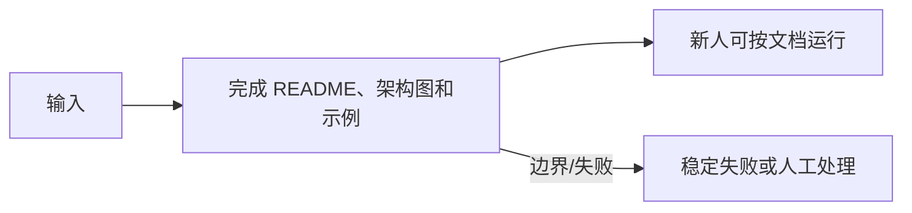

<!-- 本文件由 scripts/generate_course_tutorials.py 生成，请修改阶段计划或生成器后重新生成。 -->

# 第 16 周教程：首个 AI 应用交付

> 计划来源：[05-integration-evaluation-delivery.md](../stages/05-integration-evaluation-delivery.md)。阶段文档决定课程任务和验收，本文件解释逐节学习方法；学习状态仍只记录在[第 16 周成果](../../deliverables/week-16/README.md)。

## 本周先理解

### 为什么学

把分散实验收敛为可安装、可测试、可演示并公开限制的完整应用。

### 这是什么

应用交付包包含代码、配置、启动、测试、架构、安全、演示和已知限制；接口存在不等于交付完成。

### 本周学习策略

- 每天只完成下面一节，控制在约 1 小时，不提前堆叠下一节的新概念。
- 先预测再实验；先保存原始证据，再写结论；失败样例与正常结果同等重要。
- 首次遇到术语时补齐：一句话定义、输入输出、开发类比、类比边界、反例和“不是什么”。
- 使用 H1→H4 提示阶梯；若使用完整参考答案，必须额外完成一个不同输入或约束的变体。

## 逐节教程

### 周一 · 第 1 节：整理模块、依赖和配置

**为什么学**

本周要把分散实验收敛为可安装、可测试、可演示并公开限制的完整应用。本节把“整理模块、依赖和配置”推进为可检查成果；如果跳过，后续会缺少“仓库结构清晰、密钥未入库”这项关键证据。

**这个是什么**

本周核心概念是：应用交付包包含代码、配置、启动、测试、架构、安全、演示和已知限制；接口存在不等于交付完成。今天的“整理模块、依赖和配置”是这个核心能力的最小学习单元：你会通过“删除废弃实验和重复入口，统一配置命名；检查 Git 历史和当前 Diff 中的敏感信息”观察输入如何转化为“仓库结构清晰、密钥未入库”。它既包含可观察结果，也包含至少一个失败或不适用边界。只读完资料或只跑通正常路径，都不能证明已经掌握。

**怎么学（约 60 分钟）**

1. `0–5 分钟`：不查资料，写下你对本节主题的一句话解释、预期输入输出和一个疑问。
2. `5–15 分钟`：只阅读下方资料中与当前任务直接相关的部分，记录一个关键约束和版本信息。
3. `15–45 分钟`：执行专项任务：删除废弃实验和重复入口，统一配置命名；检查 Git 历史和当前 Diff 中的敏感信息
4. `45–55 分钟`：主动制造一个错误输入、边界条件、依赖失败或反例，保存现象并解释原因。
5. `55–60 分钟`：整理命令、输入、输出、Diff、图表或访谈证据，并用自己的语言完成 Teach-back。

专项资料：[The Twelve-Factor App：Config](https://12factor.net/config)

**怎么验证学会了**

- 必交证据：仓库结构清晰、密钥未入库。
- Teach-back：不看资料解释“整理模块、依赖和配置”解决什么问题、主要输入输出、一个边界，以及它不是什么。
- 失败证据：展示一个非正常场景，指出失败发生在哪一层，不能只贴错误截图。
- 变体任务：改变一个输入、参数、角色、权限或失败条件，在不照抄原步骤的情况下重新完成。
- 通过标准：以上四项均有证据，且能解释关键取舍；只能照步骤运行时最高算 L1，不能判定本节通过。

**参考答案（独立尝试至少 20 分钟后再看）**

> 这是一份合格答案骨架，不是唯一实现。看完后必须关闭参考答案，换一个输入或约束独立重做。

#### 步骤 1 参考：先写预测

- 一句话解释：应用交付包包含代码、配置、启动、测试、架构、安全、演示和已知限制；接口存在不等于交付完成。
- 预测：完成“整理模块、依赖和配置”后，应能观察到“仓库结构清晰、密钥未入库”；失败输入不应产生假成功。

#### 步骤 2 参考：阅读资料

- 链接：[The Twelve-Factor App：Config](https://12factor.net/config)
- 指定章节/条目：该链接指向的“The Twelve-Factor App：Config”整篇专题/章节；重点阅读与“整理模块、依赖和配置”直接对应的段落，页面更新时使用课程标题中的英文术语或 API 名页内搜索
- 阅读方法：只摘录一个定义、一个输入输出约束和一个失败边界；记录页面日期、协议版本或依赖版本。

#### 步骤 3 参考：按专项动作完成产出

- 专项动作：删除废弃实验和重复入口，统一配置命名；检查 Git 历史和当前 Diff 中的敏感信息
- 样例代码（先核对课程链接中的当前 API，再按本仓库边界修改）：

```python
def run_case(input_data: dict) -> dict:
    if not input_data:
        return {"status": "FAILED", "error": "EMPTY_INPUT"}
    # Replace this line with the lesson-specific call.
    result = {"observed": input_data, "status": "SUCCEEDED"}
    return result

print(run_case({"case": "normal"}))
print(run_case({}))  # failure case
```

#### 步骤 4 参考：制造失败并解释

- 失败注入：删掉一个必填输入或让依赖失败，系统应返回可解释的失败结果且不产生假成功；再根据日志、Diff 或流程证据定位原因。
- 参考判断：失败必须映射为明确状态、错误、拒答、人工路径或未验证假设；日志和界面不得显示成功。

#### 步骤 5 参考：整理交付与 Teach-back

- 当天交付：仓库结构清晰、密钥未入库。
- 完整字段：运行时与依赖版本；配置键；Secret 引用方式；示例占位值；启动命令；缺失配置的错误；泄露检查。
- Teach-back 参考：本节输入是什么、经过了什么处理、输出如何验证、哪种失败最危险、为什么当前方案没有越过课程边界。
- 完成后变体：更换一个输入、参数、角色、权限或失败条件，不看上述样例重新完成。


### 周二 · 第 2 节：Docker Compose 和启动方式

**为什么学**

本周要把分散实验收敛为可安装、可测试、可演示并公开限制的完整应用。本节把“Docker Compose 和启动方式”推进为可检查成果；如果跳过，后续会缺少“可以启动依赖与服务”这项关键证据。

**这个是什么**

本周核心概念是：应用交付包包含代码、配置、启动、测试、架构、安全、演示和已知限制；接口存在不等于交付完成。今天的“Docker Compose 和启动方式”是这个核心能力的最小学习单元：你会通过“从干净环境按文档启动；设置健康检查、持久化说明和明确的停止方式”观察输入如何转化为“可以启动依赖与服务”。它既包含可观察结果，也包含至少一个失败或不适用边界。只读完资料或只跑通正常路径，都不能证明已经掌握。

**怎么学（约 60 分钟）**

1. `0–5 分钟`：不查资料，写下你对本节主题的一句话解释、预期输入输出和一个疑问。
2. `5–15 分钟`：只阅读下方资料中与当前任务直接相关的部分，记录一个关键约束和版本信息。
3. `15–45 分钟`：执行专项任务：从干净环境按文档启动；设置健康检查、持久化说明和明确的停止方式
4. `45–55 分钟`：主动制造一个错误输入、边界条件、依赖失败或反例，保存现象并解释原因。
5. `55–60 分钟`：整理命令、输入、输出、Diff、图表或访谈证据，并用自己的语言完成 Teach-back。

专项资料：[Docker Compose](https://docs.docker.com/compose/)

**怎么验证学会了**

- 必交证据：可以启动依赖与服务。
- Teach-back：不看资料解释“Docker Compose 和启动方式”解决什么问题、主要输入输出、一个边界，以及它不是什么。
- 失败证据：展示一个非正常场景，指出失败发生在哪一层，不能只贴错误截图。
- 变体任务：改变一个输入、参数、角色、权限或失败条件，在不照抄原步骤的情况下重新完成。
- 通过标准：以上四项均有证据，且能解释关键取舍；只能照步骤运行时最高算 L1，不能判定本节通过。

**参考答案（独立尝试至少 20 分钟后再看）**

> 这是一份合格答案骨架，不是唯一实现。看完后必须关闭参考答案，换一个输入或约束独立重做。

#### 步骤 1 参考：先写预测

- 一句话解释：应用交付包包含代码、配置、启动、测试、架构、安全、演示和已知限制；接口存在不等于交付完成。
- 预测：完成“Docker Compose 和启动方式”后，应能观察到“可以启动依赖与服务”；失败输入不应产生假成功。

#### 步骤 2 参考：阅读资料

- 链接：[Docker Compose](https://docs.docker.com/compose/)
- 指定章节/条目：该链接指向的“Docker Compose”整篇专题/章节；重点阅读与“Docker Compose 和启动方式”直接对应的段落，页面更新时使用课程标题中的英文术语或 API 名页内搜索
- 阅读方法：只摘录一个定义、一个输入输出约束和一个失败边界；记录页面日期、协议版本或依赖版本。

#### 步骤 3 参考：按专项动作完成产出

- 专项动作：从干净环境按文档启动；设置健康检查、持久化说明和明确的停止方式
- 参考资料/文档产出：

- 主题：Docker Compose 和启动方式
- 建议字段：运行时与依赖版本；配置键；Secret 引用方式；示例占位值；启动命令；缺失配置的错误；泄露检查
- 示例结论：已按统一口径产出“可以启动依赖与服务”；证据不足的部分标记为假设或未验证。

#### 步骤 4 参考：制造失败并解释

- 失败注入：删掉一个必填输入或让依赖失败，系统应返回可解释的失败结果且不产生假成功；再根据日志、Diff 或流程证据定位原因。
- 参考判断：失败必须映射为明确状态、错误、拒答、人工路径或未验证假设；日志和界面不得显示成功。

#### 步骤 5 参考：整理交付与 Teach-back

- 当天交付：可以启动依赖与服务。
- 完整字段：运行时与依赖版本；配置键；Secret 引用方式；示例占位值；启动命令；缺失配置的错误；泄露检查。
- Teach-back 参考：本节输入是什么、经过了什么处理、输出如何验证、哪种失败最危险、为什么当前方案没有越过课程边界。
- 完成后变体：更换一个输入、参数、角色、权限或失败条件，不看上述样例重新完成。


### 周三 · 第 3 节：补关键路径自动测试

**为什么学**

本周要把分散实验收敛为可安装、可测试、可演示并公开限制的完整应用。本节把“补关键路径自动测试”推进为可检查成果；如果跳过，后续会缺少“主要场景有回归保护”这项关键证据。

**这个是什么**

本周核心概念是：应用交付包包含代码、配置、启动、测试、架构、安全、演示和已知限制；接口存在不等于交付完成。今天的“补关键路径自动测试”是这个核心能力的最小学习单元：你会通过“优先覆盖用户主流程、权限拒绝和曾经失败的案例，不追求无意义覆盖率”观察输入如何转化为“主要场景有回归保护”。它既包含可观察结果，也包含至少一个失败或不适用边界。只读完资料或只跑通正常路径，都不能证明已经掌握。

**怎么学（约 60 分钟）**

1. `0–5 分钟`：不查资料，写下你对本节主题的一句话解释、预期输入输出和一个疑问。
2. `5–15 分钟`：只阅读下方资料中与当前任务直接相关的部分，记录一个关键约束和版本信息。
3. `15–45 分钟`：执行专项任务：优先覆盖用户主流程、权限拒绝和曾经失败的案例，不追求无意义覆盖率
4. `45–55 分钟`：主动制造一个错误输入、边界条件、依赖失败或反例，保存现象并解释原因。
5. `55–60 分钟`：整理命令、输入、输出、Diff、图表或访谈证据，并用自己的语言完成 Teach-back。

专项资料：[Martin Fowler：Test Pyramid](https://martinfowler.com/articles/practical-test-pyramid.html)

**怎么验证学会了**

- 必交证据：主要场景有回归保护。
- Teach-back：不看资料解释“补关键路径自动测试”解决什么问题、主要输入输出、一个边界，以及它不是什么。
- 失败证据：展示一个非正常场景，指出失败发生在哪一层，不能只贴错误截图。
- 变体任务：改变一个输入、参数、角色、权限或失败条件，在不照抄原步骤的情况下重新完成。
- 通过标准：以上四项均有证据，且能解释关键取舍；只能照步骤运行时最高算 L1，不能判定本节通过。

**参考答案（独立尝试至少 20 分钟后再看）**

> 这是一份合格答案骨架，不是唯一实现。看完后必须关闭参考答案，换一个输入或约束独立重做。

#### 步骤 1 参考：先写预测

- 一句话解释：应用交付包包含代码、配置、启动、测试、架构、安全、演示和已知限制；接口存在不等于交付完成。
- 预测：完成“补关键路径自动测试”后，应能观察到“主要场景有回归保护”；失败输入不应产生假成功。

#### 步骤 2 参考：阅读资料

- 链接：[Martin Fowler：Test Pyramid](https://martinfowler.com/articles/practical-test-pyramid.html)
- 指定章节/条目：Path Traversal → Description、Examples、Mitigation
- 阅读方法：只摘录一个定义、一个输入输出约束和一个失败边界；记录页面日期、协议版本或依赖版本。

#### 步骤 3 参考：按专项动作完成产出

- 专项动作：优先覆盖用户主流程、权限拒绝和曾经失败的案例，不追求无意义覆盖率
- 参考资料/文档产出：

- 主题：补关键路径自动测试
- 建议字段：用例 ID；前置条件；输入/故障；预期状态；关键断言；实际结果；日志或 Trace；是否通过
- 示例结论：已按统一口径产出“主要场景有回归保护”；证据不足的部分标记为假设或未验证。

#### 步骤 4 参考：制造失败并解释

- 失败注入：删除身份、Scope 或审批后再次执行，正确结果应是执行路径明确拒绝且留下脱敏审计；如果仍成功，就是权限边界失效。
- 参考判断：失败必须映射为明确状态、错误、拒答、人工路径或未验证假设；日志和界面不得显示成功。

#### 步骤 5 参考：整理交付与 Teach-back

- 当天交付：主要场景有回归保护。
- 完整字段：用例 ID；前置条件；输入/故障；预期状态；关键断言；实际结果；日志或 Trace；是否通过。
- Teach-back 参考：本节输入是什么、经过了什么处理、输出如何验证、哪种失败最危险、为什么当前方案没有越过课程边界。
- 完成后变体：更换一个输入、参数、角色、权限或失败条件，不看上述样例重新完成。


### 周四 · 第 4 节：完成安全章节和威胁模型

**为什么学**

本周要把分散实验收敛为可安装、可测试、可演示并公开限制的完整应用。本节把“完成安全章节和威胁模型”推进为可检查成果；如果跳过，后续会缺少“权限边界与残余风险明确”这项关键证据。

**这个是什么**

本周核心概念是：应用交付包包含代码、配置、启动、测试、架构、安全、演示和已知限制；接口存在不等于交付完成。今天的“完成安全章节和威胁模型”是这个核心能力的最小学习单元：你会通过“按资产、信任边界、攻击路径、防护和残余风险组织，并确保与真实实现一致”观察输入如何转化为“权限边界与残余风险明确”。它既包含可观察结果，也包含至少一个失败或不适用边界。只读完资料或只跑通正常路径，都不能证明已经掌握。

**怎么学（约 60 分钟）**

1. `0–5 分钟`：不查资料，写下你对本节主题的一句话解释、预期输入输出和一个疑问。
2. `5–15 分钟`：只阅读下方资料中与当前任务直接相关的部分，记录一个关键约束和版本信息。
3. `15–45 分钟`：执行专项任务：按资产、信任边界、攻击路径、防护和残余风险组织，并确保与真实实现一致
4. `45–55 分钟`：主动制造一个错误输入、边界条件、依赖失败或反例，保存现象并解释原因。
5. `55–60 分钟`：整理命令、输入、输出、Diff、图表或访谈证据，并用自己的语言完成 Teach-back。

专项资料：[OWASP Threat Modeling](https://owasp.org/www-community/Threat_Modeling)

**怎么验证学会了**

- 必交证据：权限边界与残余风险明确。
- Teach-back：不看资料解释“完成安全章节和威胁模型”解决什么问题、主要输入输出、一个边界，以及它不是什么。
- 失败证据：展示一个非正常场景，指出失败发生在哪一层，不能只贴错误截图。
- 变体任务：改变一个输入、参数、角色、权限或失败条件，在不照抄原步骤的情况下重新完成。
- 通过标准：以上四项均有证据，且能解释关键取舍；只能照步骤运行时最高算 L1，不能判定本节通过。

**参考答案（独立尝试至少 20 分钟后再看）**

> 这是一份合格答案骨架，不是唯一实现。看完后必须关闭参考答案，换一个输入或约束独立重做。

#### 步骤 1 参考：先写预测

- 一句话解释：应用交付包包含代码、配置、启动、测试、架构、安全、演示和已知限制；接口存在不等于交付完成。
- 预测：完成“完成安全章节和威胁模型”后，应能观察到“权限边界与残余风险明确”；失败输入不应产生假成功。

#### 步骤 2 参考：阅读资料

- 链接：[OWASP Threat Modeling](https://owasp.org/www-community/Threat_Modeling)
- 指定章节/条目：该链接指向的“OWASP Threat Modeling”整篇专题/章节；重点阅读与“完成安全章节和威胁模型”直接对应的段落，页面更新时使用课程标题中的英文术语或 API 名页内搜索
- 阅读方法：只摘录一个定义、一个输入输出约束和一个失败边界；记录页面日期、协议版本或依赖版本。

#### 步骤 3 参考：按专项动作完成产出

- 专项动作：按资产、信任边界、攻击路径、防护和残余风险组织，并确保与真实实现一致
- 参考资料/文档产出：

- 主题：完成安全章节和威胁模型
- 建议字段：一句话定义；输入；操作；可观察输出；失败/反例；工程意义；证据位置
- 示例结论：已按统一口径产出“权限边界与残余风险明确”；证据不足的部分标记为假设或未验证。

#### 步骤 4 参考：制造失败并解释

- 失败注入：删除身份、Scope 或审批后再次执行，正确结果应是执行路径明确拒绝且留下脱敏审计；如果仍成功，就是权限边界失效。
- 参考判断：失败必须映射为明确状态、错误、拒答、人工路径或未验证假设；日志和界面不得显示成功。

#### 步骤 5 参考：整理交付与 Teach-back

- 当天交付：权限边界与残余风险明确。
- 完整字段：一句话定义；输入；操作；可观察输出；失败/反例；工程意义；证据位置。
- Teach-back 参考：本节输入是什么、经过了什么处理、输出如何验证、哪种失败最危险、为什么当前方案没有越过课程边界。
- 完成后变体：更换一个输入、参数、角色、权限或失败条件，不看上述样例重新完成。


### 周五 · 第 5 节：完成 README、架构图和示例

**为什么学**

本周要把分散实验收敛为可安装、可测试、可演示并公开限制的完整应用。本节把“完成 README、架构图和示例”推进为可检查成果；如果跳过，后续会缺少“新人可按文档运行”这项关键证据。

**这个是什么**

本周核心概念是：应用交付包包含代码、配置、启动、测试、架构、安全、演示和已知限制；接口存在不等于交付完成。今天的“完成 README、架构图和示例”是这个核心能力的最小学习单元：你会通过“邀请不了解项目的人按文档尝试，记录所有隐式步骤和过期图示”观察输入如何转化为“新人可按文档运行”。它既包含可观察结果，也包含至少一个失败或不适用边界。只读完资料或只跑通正常路径，都不能证明已经掌握。

**怎么学（约 60 分钟）**

1. `0–5 分钟`：不查资料，写下你对本节主题的一句话解释、预期输入输出和一个疑问。
2. `5–15 分钟`：只阅读下方资料中与当前任务直接相关的部分，记录一个关键约束和版本信息。
3. `15–45 分钟`：执行专项任务：邀请不了解项目的人按文档尝试，记录所有隐式步骤和过期图示
4. `45–55 分钟`：主动制造一个错误输入、边界条件、依赖失败或反例，保存现象并解释原因。
5. `55–60 分钟`：整理命令、输入、输出、Diff、图表或访谈证据，并用自己的语言完成 Teach-back。

专项资料：[Diátaxis 文档框架](https://diataxis.fr/)

**怎么验证学会了**

- 必交证据：新人可按文档运行。
- Teach-back：不看资料解释“完成 README、架构图和示例”解决什么问题、主要输入输出、一个边界，以及它不是什么。
- 失败证据：展示一个非正常场景，指出失败发生在哪一层，不能只贴错误截图。
- 变体任务：改变一个输入、参数、角色、权限或失败条件，在不照抄原步骤的情况下重新完成。
- 通过标准：以上四项均有证据，且能解释关键取舍；只能照步骤运行时最高算 L1，不能判定本节通过。

**参考答案（独立尝试至少 20 分钟后再看）**

> 这是一份合格答案骨架，不是唯一实现。看完后必须关闭参考答案，换一个输入或约束独立重做。

#### 步骤 1 参考：先写预测

- 一句话解释：应用交付包包含代码、配置、启动、测试、架构、安全、演示和已知限制；接口存在不等于交付完成。
- 预测：完成“完成 README、架构图和示例”后，应能观察到“新人可按文档运行”；失败输入不应产生假成功。

#### 步骤 2 参考：阅读资料

- 链接：[Diátaxis 文档框架](https://diataxis.fr/)
- 指定章节/条目：该链接指向的“Diátaxis 文档框架”整篇专题/章节；重点阅读与“完成 README、架构图和示例”直接对应的段落，页面更新时使用课程标题中的英文术语或 API 名页内搜索
- 阅读方法：只摘录一个定义、一个输入输出约束和一个失败边界；记录页面日期、协议版本或依赖版本。

#### 步骤 3 参考：按专项动作完成产出

- 专项动作：邀请不了解项目的人按文档尝试，记录所有隐式步骤和过期图示
- 参考图（按实际角色、字段和状态修改）：



#### 步骤 4 参考：制造失败并解释

- 失败注入：删掉一个必填输入或让依赖失败，系统应返回可解释的失败结果且不产生假成功；再根据日志、Diff 或流程证据定位原因。
- 参考判断：失败必须映射为明确状态、错误、拒答、人工路径或未验证假设；日志和界面不得显示成功。

#### 步骤 5 参考：整理交付与 Teach-back

- 当天交付：新人可按文档运行。
- 完整字段：范围与参与者；输入；主路径；异常/拒绝路径；输出；信任或责任边界；版本与图例。
- Teach-back 参考：本节输入是什么、经过了什么处理、输出如何验证、哪种失败最危险、为什么当前方案没有越过课程边界。
- 完成后变体：更换一个输入、参数、角色、权限或失败条件，不看上述样例重新完成。


### 周六 · 第 6 节：准备 10 分钟演示

**为什么学**

本周要把分散实验收敛为可安装、可测试、可演示并公开限制的完整应用。本节把“准备 10 分钟演示”推进为可检查成果；如果跳过，后续会缺少“能展示成功、失败和阻断场景”这项关键证据。

**这个是什么**

本周核心概念是：应用交付包包含代码、配置、启动、测试、架构、安全、演示和已知限制；接口存在不等于交付完成。今天的“准备 10 分钟演示”是这个核心能力的最小学习单元：你会通过“预先固定数据和命令，依次展示成功、拒答、审批和危险操作阻断”观察输入如何转化为“能展示成功、失败和阻断场景”。它既包含可观察结果，也包含至少一个失败或不适用边界。只读完资料或只跑通正常路径，都不能证明已经掌握。

**怎么学（约 60 分钟）**

1. `0–5 分钟`：不查资料，写下你对本节主题的一句话解释、预期输入输出和一个疑问。
2. `5–15 分钟`：只阅读下方资料中与当前任务直接相关的部分，记录一个关键约束和版本信息。
3. `15–45 分钟`：执行专项任务：预先固定数据和命令，依次展示成功、拒答、审批和危险操作阻断
4. `45–55 分钟`：主动制造一个错误输入、边界条件、依赖失败或反例，保存现象并解释原因。
5. `55–60 分钟`：整理命令、输入、输出、Diff、图表或访谈证据，并用自己的语言完成 Teach-back。

专项资料：[Google SRE：Testing for Reliability](https://sre.google/sre-book/testing-reliability/)

**怎么验证学会了**

- 必交证据：能展示成功、失败和阻断场景。
- Teach-back：不看资料解释“准备 10 分钟演示”解决什么问题、主要输入输出、一个边界，以及它不是什么。
- 失败证据：展示一个非正常场景，指出失败发生在哪一层，不能只贴错误截图。
- 变体任务：改变一个输入、参数、角色、权限或失败条件，在不照抄原步骤的情况下重新完成。
- 通过标准：以上四项均有证据，且能解释关键取舍；只能照步骤运行时最高算 L1，不能判定本节通过。

**参考答案（独立尝试至少 20 分钟后再看）**

> 这是一份合格答案骨架，不是唯一实现。看完后必须关闭参考答案，换一个输入或约束独立重做。

#### 步骤 1 参考：先写预测

- 一句话解释：应用交付包包含代码、配置、启动、测试、架构、安全、演示和已知限制；接口存在不等于交付完成。
- 预测：完成“准备 10 分钟演示”后，应能观察到“能展示成功、失败和阻断场景”；失败输入不应产生假成功。

#### 步骤 2 参考：阅读资料

- 链接：[Google SRE：Testing for Reliability](https://sre.google/sre-book/testing-reliability/)
- 指定章节/条目：该链接指向的“Google SRE：Testing for Reliability”整篇专题/章节；重点阅读与“准备 10 分钟演示”直接对应的段落，页面更新时使用课程标题中的英文术语或 API 名页内搜索
- 阅读方法：只摘录一个定义、一个输入输出约束和一个失败边界；记录页面日期、协议版本或依赖版本。

#### 步骤 3 参考：按专项动作完成产出

- 专项动作：预先固定数据和命令，依次展示成功、拒答、审批和危险操作阻断
- 参考资料/文档产出：

- 主题：准备 10 分钟演示
- 建议字段：一句话定义；输入；操作；可观察输出；失败/反例；工程意义；证据位置
- 示例结论：已按统一口径产出“能展示成功、失败和阻断场景”；证据不足的部分标记为假设或未验证。

#### 步骤 4 参考：制造失败并解释

- 失败注入：删除身份、Scope 或审批后再次执行，正确结果应是执行路径明确拒绝且留下脱敏审计；如果仍成功，就是权限边界失效。
- 参考判断：失败必须映射为明确状态、错误、拒答、人工路径或未验证假设；日志和界面不得显示成功。

#### 步骤 5 参考：整理交付与 Teach-back

- 当天交付：能展示成功、失败和阻断场景。
- 完整字段：一句话定义；输入；操作；可观察输出；失败/反例；工程意义；证据位置。
- Teach-back 参考：本节输入是什么、经过了什么处理、输出如何验证、哪种失败最危险、为什么当前方案没有越过课程边界。
- 完成后变体：更换一个输入、参数、角色、权限或失败条件，不看上述样例重新完成。


### 周日 · 第 7 节：应用复盘和平台化输入

**为什么学**

本周要把分散实验收敛为可安装、可测试、可演示并公开限制的完整应用。本节把“应用复盘和平台化输入”推进为可检查成果；如果跳过，后续会缺少“完成本周提交”这项关键证据。

**这个是什么**

本周核心概念是：应用交付包包含代码、配置、启动、测试、架构、安全、演示和已知限制；接口存在不等于交付完成。今天的“应用复盘和平台化输入”是这个核心能力的最小学习单元：你会通过“用量化证据描述贡献，明确哪些能力应沉淀为平台、哪些仍属于场景实现”观察输入如何转化为“完成本周提交”。它既包含可观察结果，也包含至少一个失败或不适用边界。只读完资料或只跑通正常路径，都不能证明已经掌握。

**怎么学（约 60 分钟）**

1. `0–5 分钟`：不查资料，写下你对本节主题的一句话解释、预期输入输出和一个疑问。
2. `5–15 分钟`：只阅读下方资料中与当前任务直接相关的部分，记录一个关键约束和版本信息。
3. `15–45 分钟`：执行专项任务：用量化证据描述贡献，明确哪些能力应沉淀为平台、哪些仍属于场景实现
4. `45–55 分钟`：主动制造一个错误输入、边界条件、依赖失败或反例，保存现象并解释原因。
5. `55–60 分钟`：整理命令、输入、输出、Diff、图表或访谈证据，并用自己的语言完成 Teach-back。

专项资料：[成果与提交标准](../06-deliverable-standards.md)

**怎么验证学会了**

- 必交证据：完成本周提交。
- Teach-back：不看资料解释“应用复盘和平台化输入”解决什么问题、主要输入输出、一个边界，以及它不是什么。
- 失败证据：展示一个非正常场景，指出失败发生在哪一层，不能只贴错误截图。
- 变体任务：改变一个输入、参数、角色、权限或失败条件，在不照抄原步骤的情况下重新完成。
- 通过标准：以上四项均有证据，且能解释关键取舍；只能照步骤运行时最高算 L1，不能判定本节通过。

**参考答案（独立尝试至少 20 分钟后再看）**

> 这是一份合格答案骨架，不是唯一实现。看完后必须关闭参考答案，换一个输入或约束独立重做。

#### 步骤 1 参考：先写预测

- 一句话解释：应用交付包包含代码、配置、启动、测试、架构、安全、演示和已知限制；接口存在不等于交付完成。
- 预测：完成“应用复盘和平台化输入”后，应能观察到“完成本周提交”；失败输入不应产生假成功。

#### 步骤 2 参考：阅读资料

- 链接：[成果与提交标准](../06-deliverable-standards.md)
- 指定章节/条目：该链接指向的“成果与提交标准”整篇专题/章节；重点阅读与“应用复盘和平台化输入”直接对应的段落，页面更新时使用课程标题中的英文术语或 API 名页内搜索
- 阅读方法：只摘录一个定义、一个输入输出约束和一个失败边界；记录页面日期、协议版本或依赖版本。

#### 步骤 3 参考：按专项动作完成产出

- 专项动作：用量化证据描述贡献，明确哪些能力应沉淀为平台、哪些仍属于场景实现
- 参考资料/文档产出：

- 主题：应用复盘和平台化输入
- 建议字段：指标名称；计算公式；数据来源；样本与时间窗；当前值；目标/阈值；限制与未验证项
- 示例结论：已按统一口径产出“完成本周提交”；证据不足的部分标记为假设或未验证。

#### 步骤 4 参考：制造失败并解释

- 失败注入：当样本、Owner 或数据来源不足时，把结论标为假设并给出验证计划；不能把模拟结果写成真实业务收益。
- 参考判断：失败必须映射为明确状态、错误、拒答、人工路径或未验证假设；日志和界面不得显示成功。

#### 步骤 5 参考：整理交付与 Teach-back

- 当天交付：完成本周提交。
- 完整字段：指标名称；计算公式；数据来源；样本与时间窗；当前值；目标/阈值；限制与未验证项。
- Teach-back 参考：本节输入是什么、经过了什么处理、输出如何验证、哪种失败最危险、为什么当前方案没有越过课程边界。
- 完成后变体：更换一个输入、参数、角色、权限或失败条件，不看上述样例重新完成。


## 本周收尾

按[成果与提交标准](../06-deliverable-standards.md)整理本周成果，再由讲师按[监督与掌握度规范](../07-instructor-supervision.md)给出“通过、部分通过、未通过”。教程完成不代表学习者已经掌握，必须以独立运行、排错、Teach-back 和变体证据为准。
