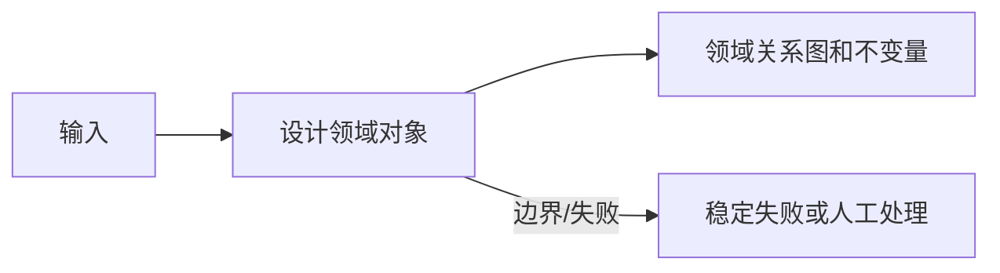
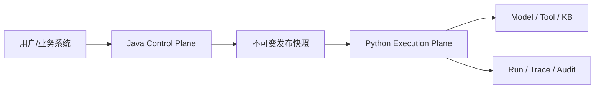

<!-- 本文件由 scripts/generate_course_tutorials.py 生成，请修改阶段计划或生成器后重新生成。 -->

# 第 17 周教程：平台架构

> 计划来源：[06-ai-platform-core.md](../stages/06-ai-platform-core.md)。阶段文档决定课程任务和验收，本文件解释逐节学习方法；学习状态仍只记录在[第 17 周成果](../../deliverables/week-17/README.md)。

## 本周先理解

### 为什么学

从单应用转向多角色、多资源和多版本平台前，先稳定用例、领域边界和 MVP 范围。

### 这是什么

AI 平台架构把控制面和执行面分开，以 Project、资源 ID、版本和运行记录承载治理；第一版采用 API 优先的模块化单体。

### 本周学习策略

- 每天只完成下面一节，控制在约 1 小时，不提前堆叠下一节的新概念。
- 先预测再实验；先保存原始证据，再写结论；失败样例与正常结果同等重要。
- 首次遇到术语时补齐：一句话定义、输入输出、开发类比、类比边界、反例和“不是什么”。
- 使用 H1→H4 提示阶梯；若使用完整参考答案，必须额外完成一个不同输入或约束的变体。

## 逐节教程

### 周一 · 第 1 节：定义平台用户和核心用例

**为什么学**

本周要从单应用转向多角色、多资源和多版本平台前，先稳定用例、领域边界和 MVP 范围。本节把“定义平台用户和核心用例”推进为可检查成果；如果跳过，后续会缺少“用户—任务—权限矩阵”这项关键证据。

**这个是什么**

本周核心概念是：AI 平台架构把控制面和执行面分开，以 Project、资源 ID、版本和运行记录承载治理；第一版采用 API 优先的模块化单体。今天的“定义平台用户和核心用例”是这个核心能力的最小学习单元：你会通过“至少区分平台管理员、Agent 开发者、业务接入方和审计者；每类只写真实任务”观察输入如何转化为“用户—任务—权限矩阵”。它既包含可观察结果，也包含至少一个失败或不适用边界。只读完资料或只跑通正常路径，都不能证明已经掌握。

**怎么学（约 60 分钟）**

1. `0–5 分钟`：不查资料，写下你对本节主题的一句话解释、预期输入输出和一个疑问。
2. `5–15 分钟`：只阅读下方资料中与当前任务直接相关的部分，记录一个关键约束和版本信息。
3. `15–45 分钟`：执行专项任务：至少区分平台管理员、Agent 开发者、业务接入方和审计者；每类只写真实任务
4. `45–55 分钟`：主动制造一个错误输入、边界条件、依赖失败或反例，保存现象并解释原因。
5. `55–60 分钟`：整理命令、输入、输出、Diff、图表或访谈证据，并用自己的语言完成 Teach-back。

专项资料：[GOV.UK Discovery Phase](https://www.gov.uk/service-manual/agile-delivery/how-the-discovery-phase-works)

**怎么验证学会了**

- 必交证据：用户—任务—权限矩阵。
- Teach-back：不看资料解释“定义平台用户和核心用例”解决什么问题、主要输入输出、一个边界，以及它不是什么。
- 失败证据：展示一个非正常场景，指出失败发生在哪一层，不能只贴错误截图。
- 变体任务：改变一个输入、参数、角色、权限或失败条件，在不照抄原步骤的情况下重新完成。
- 通过标准：以上四项均有证据，且能解释关键取舍；只能照步骤运行时最高算 L1，不能判定本节通过。

**参考答案（独立尝试至少 20 分钟后再看）**

> 这是一份合格答案骨架，不是唯一实现。看完后必须关闭参考答案，换一个输入或约束独立重做。

#### 步骤 1 参考：先写预测

- 一句话解释：AI 平台架构把控制面和执行面分开，以 Project、资源 ID、版本和运行记录承载治理；第一版采用 API 优先的模块化单体。
- 预测：完成“定义平台用户和核心用例”后，应能观察到“用户—任务—权限矩阵”；失败输入不应产生假成功。

#### 步骤 2 参考：阅读资料

- 链接：[GOV.UK Discovery Phase](https://www.gov.uk/service-manual/agile-delivery/how-the-discovery-phase-works)
- 指定章节/条目：该链接指向的“GOV.UK Discovery Phase”整篇专题/章节；重点阅读与“定义平台用户和核心用例”直接对应的段落，页面更新时使用课程标题中的英文术语或 API 名页内搜索
- 阅读方法：只摘录一个定义、一个输入输出约束和一个失败边界；记录页面日期、协议版本或依赖版本。

#### 步骤 3 参考：按专项动作完成产出

- 专项动作：至少区分平台管理员、Agent 开发者、业务接入方和审计者；每类只写真实任务
- 参考资料/文档产出：

- 主题：定义平台用户和核心用例
- 建议字段：对象；Owner/角色；输入或来源；规则/约束；风险；证据；状态；下一步
- 示例结论：已按统一口径产出“用户—任务—权限矩阵”；证据不足的部分标记为假设或未验证。

#### 步骤 4 参考：制造失败并解释

- 失败注入：删除身份、Scope 或审批后再次执行，正确结果应是执行路径明确拒绝且留下脱敏审计；如果仍成功，就是权限边界失效。
- 参考判断：失败必须映射为明确状态、错误、拒答、人工路径或未验证假设；日志和界面不得显示成功。

#### 步骤 5 参考：整理交付与 Teach-back

- 当天交付：用户—任务—权限矩阵。
- 完整字段：对象；Owner/角色；输入或来源；规则/约束；风险；证据；状态；下一步。
- Teach-back 参考：本节输入是什么、经过了什么处理、输出如何验证、哪种失败最危险、为什么当前方案没有越过课程边界。
- 完成后变体：更换一个输入、参数、角色、权限或失败条件，不看上述样例重新完成。

### 周二 · 第 2 节：划定 MVP 与非目标

**为什么学**

本周要从单应用转向多角色、多资源和多版本平台前，先稳定用例、领域边界和 MVP 范围。本节把“划定 MVP 与非目标”推进为可检查成果；如果跳过，后续会缺少“MVP/非目标清单有理由”这项关键证据。

**这个是什么**

本周核心概念是：AI 平台架构把控制面和执行面分开，以 Project、资源 ID、版本和运行记录承载治理；第一版采用 API 优先的模块化单体。今天的“划定 MVP 与非目标”是这个核心能力的最小学习单元：你会通过“优先 API、版本和运行闭环；拖拽画布、计费和跨地域先列为非目标”观察输入如何转化为“MVP/非目标清单有理由”。它既包含可观察结果，也包含至少一个失败或不适用边界。只读完资料或只跑通正常路径，都不能证明已经掌握。

**怎么学（约 60 分钟）**

1. `0–5 分钟`：不查资料，写下你对本节主题的一句话解释、预期输入输出和一个疑问。
2. `5–15 分钟`：只阅读下方资料中与当前任务直接相关的部分，记录一个关键约束和版本信息。
3. `15–45 分钟`：执行专项任务：优先 API、版本和运行闭环；拖拽画布、计费和跨地域先列为非目标
4. `45–55 分钟`：主动制造一个错误输入、边界条件、依赖失败或反例，保存现象并解释原因。
5. `55–60 分钟`：整理命令、输入、输出、Diff、图表或访谈证据，并用自己的语言完成 Teach-back。

专项资料：[GOV.UK Discovery Phase](https://www.gov.uk/service-manual/agile-delivery/how-the-discovery-phase-works)

**怎么验证学会了**

- 必交证据：MVP/非目标清单有理由。
- Teach-back：不看资料解释“划定 MVP 与非目标”解决什么问题、主要输入输出、一个边界，以及它不是什么。
- 失败证据：展示一个非正常场景，指出失败发生在哪一层，不能只贴错误截图。
- 变体任务：改变一个输入、参数、角色、权限或失败条件，在不照抄原步骤的情况下重新完成。
- 通过标准：以上四项均有证据，且能解释关键取舍；只能照步骤运行时最高算 L1，不能判定本节通过。

**参考答案（独立尝试至少 20 分钟后再看）**

> 这是一份合格答案骨架，不是唯一实现。看完后必须关闭参考答案，换一个输入或约束独立重做。

#### 步骤 1 参考：先写预测

- 一句话解释：AI 平台架构把控制面和执行面分开，以 Project、资源 ID、版本和运行记录承载治理；第一版采用 API 优先的模块化单体。
- 预测：完成“划定 MVP 与非目标”后，应能观察到“MVP/非目标清单有理由”；失败输入不应产生假成功。

#### 步骤 2 参考：阅读资料

- 链接：[GOV.UK Discovery Phase](https://www.gov.uk/service-manual/agile-delivery/how-the-discovery-phase-works)
- 指定章节/条目：该链接指向的“GOV.UK Discovery Phase”整篇专题/章节；重点阅读与“划定 MVP 与非目标”直接对应的段落，页面更新时使用课程标题中的英文术语或 API 名页内搜索
- 阅读方法：只摘录一个定义、一个输入输出约束和一个失败边界；记录页面日期、协议版本或依赖版本。

#### 步骤 3 参考：按专项动作完成产出

- 专项动作：优先 API、版本和运行闭环；拖拽画布、计费和跨地域先列为非目标
- 参考资料/文档产出：

- 主题：划定 MVP 与非目标
- 建议字段：对象；Owner/角色；输入或来源；规则/约束；风险；证据；状态；下一步
- 示例结论：已按统一口径产出“MVP/非目标清单有理由”；证据不足的部分标记为假设或未验证。

#### 步骤 4 参考：制造失败并解释

- 失败注入：删掉一个必填输入或让依赖失败，系统应返回可解释的失败结果且不产生假成功；再根据日志、Diff 或流程证据定位原因。
- 参考判断：失败必须映射为明确状态、错误、拒答、人工路径或未验证假设；日志和界面不得显示成功。

#### 步骤 5 参考：整理交付与 Teach-back

- 当天交付：MVP/非目标清单有理由。
- 完整字段：对象；Owner/角色；输入或来源；规则/约束；风险；证据；状态；下一步。
- Teach-back 参考：本节输入是什么、经过了什么处理、输出如何验证、哪种失败最危险、为什么当前方案没有越过课程边界。
- 完成后变体：更换一个输入、参数、角色、权限或失败条件，不看上述样例重新完成。

### 周三 · 第 3 节：设计领域对象

**为什么学**

本周要从单应用转向多角色、多资源和多版本平台前，先稳定用例、领域边界和 MVP 范围。本节把“设计领域对象”推进为可检查成果；如果跳过，后续会缺少“领域关系图和不变量”这项关键证据。

**这个是什么**

本周核心概念是：AI 平台架构把控制面和执行面分开，以 Project、资源 ID、版本和运行记录承载治理；第一版采用 API 优先的模块化单体。今天的“设计领域对象”是这个核心能力的最小学习单元：你会通过“建模 Project、Agent、Version、Release、Tool、KnowledgeBase、Workflow、Run；避免直接套数据库表”观察输入如何转化为“领域关系图和不变量”。它既包含可观察结果，也包含至少一个失败或不适用边界。只读完资料或只跑通正常路径，都不能证明已经掌握。

**怎么学（约 60 分钟）**

1. `0–5 分钟`：不查资料，写下你对本节主题的一句话解释、预期输入输出和一个疑问。
2. `5–15 分钟`：只阅读下方资料中与当前任务直接相关的部分，记录一个关键约束和版本信息。
3. `15–45 分钟`：执行专项任务：建模 Project、Agent、Version、Release、Tool、KnowledgeBase、Workflow、Run；避免直接套数据库表
4. `45–55 分钟`：主动制造一个错误输入、边界条件、依赖失败或反例，保存现象并解释原因。
5. `55–60 分钟`：整理命令、输入、输出、Diff、图表或访谈证据，并用自己的语言完成 Teach-back。

专项资料：[Microsoft：Domain-Driven Design](https://learn.microsoft.com/azure/architecture/microservices/model/domain-analysis)

**怎么验证学会了**

- 必交证据：领域关系图和不变量。
- Teach-back：不看资料解释“设计领域对象”解决什么问题、主要输入输出、一个边界，以及它不是什么。
- 失败证据：展示一个非正常场景，指出失败发生在哪一层，不能只贴错误截图。
- 变体任务：改变一个输入、参数、角色、权限或失败条件，在不照抄原步骤的情况下重新完成。
- 通过标准：以上四项均有证据，且能解释关键取舍；只能照步骤运行时最高算 L1，不能判定本节通过。

**参考答案（独立尝试至少 20 分钟后再看）**

> 这是一份合格答案骨架，不是唯一实现。看完后必须关闭参考答案，换一个输入或约束独立重做。

#### 步骤 1 参考：先写预测

- 一句话解释：AI 平台架构把控制面和执行面分开，以 Project、资源 ID、版本和运行记录承载治理；第一版采用 API 优先的模块化单体。
- 预测：完成“设计领域对象”后，应能观察到“领域关系图和不变量”；失败输入不应产生假成功。

#### 步骤 2 参考：阅读资料

- 链接：[Microsoft：Domain-Driven Design](https://learn.microsoft.com/azure/architecture/microservices/model/domain-analysis)
- 指定章节/条目：该链接指向的“Microsoft：Domain-Driven Design”整篇专题/章节；重点阅读与“设计领域对象”直接对应的段落，页面更新时使用课程标题中的英文术语或 API 名页内搜索
- 阅读方法：只摘录一个定义、一个输入输出约束和一个失败边界；记录页面日期、协议版本或依赖版本。

#### 步骤 3 参考：按专项动作完成产出

- 专项动作：建模 Project、Agent、Version、Release、Tool、KnowledgeBase、Workflow、Run；避免直接套数据库表
- 参考图（按实际角色、字段和状态修改）：

#### 步骤 4 参考：制造失败并解释

- 失败注入：加入无答案、非法 Schema、超时或工具失败输入，正确结果应是拒答或稳定失败状态；如果输出看似正常但证据缺失，应判为失败。
- 参考判断：失败必须映射为明确状态、错误、拒答、人工路径或未验证假设；日志和界面不得显示成功。

#### 步骤 5 参考：整理交付与 Teach-back

- 当天交付：领域关系图和不变量。
- 完整字段：范围与参与者；输入；主路径；异常/拒绝路径；输出；信任或责任边界；版本与图例。
- Teach-back 参考：本节输入是什么、经过了什么处理、输出如何验证、哪种失败最危险、为什么当前方案没有越过课程边界。
- 完成后变体：更换一个输入、参数、角色、权限或失败条件，不看上述样例重新完成。

### 周四 · 第 4 节：划分控制面与执行面

**为什么学**

本周要从单应用转向多角色、多资源和多版本平台前，先稳定用例、领域边界和 MVP 范围。本节把“划分控制面与执行面”推进为可检查成果；如果跳过，后续会缺少“控制面/执行面时序图”这项关键证据。

**这个是什么**

本周核心概念是：AI 平台架构把控制面和执行面分开，以 Project、资源 ID、版本和运行记录承载治理；第一版采用 API 优先的模块化单体。今天的“划分控制面与执行面”是这个核心能力的最小学习单元：你会通过“控制面管理可变配置，执行面只消费发布快照；写清调用和失败边界”观察输入如何转化为“控制面/执行面时序图”。它既包含可观察结果，也包含至少一个失败或不适用边界。只读完资料或只跑通正常路径，都不能证明已经掌握。

**怎么学（约 60 分钟）**

1. `0–5 分钟`：不查资料，写下你对本节主题的一句话解释、预期输入输出和一个疑问。
2. `5–15 分钟`：只阅读下方资料中与当前任务直接相关的部分，记录一个关键约束和版本信息。
3. `15–45 分钟`：执行专项任务：控制面管理可变配置，执行面只消费发布快照；写清调用和失败边界
4. `45–55 分钟`：主动制造一个错误输入、边界条件、依赖失败或反例，保存现象并解释原因。
5. `55–60 分钟`：整理命令、输入、输出、Diff、图表或访谈证据，并用自己的语言完成 Teach-back。

专项资料：[AWS：Control Plane and Data Plane](https://docs.aws.amazon.com/whitepapers/latest/aws-fault-isolation-boundaries/control-planes-and-data-planes.html)

**怎么验证学会了**

- 必交证据：控制面/执行面时序图。
- Teach-back：不看资料解释“划分控制面与执行面”解决什么问题、主要输入输出、一个边界，以及它不是什么。
- 失败证据：展示一个非正常场景，指出失败发生在哪一层，不能只贴错误截图。
- 变体任务：改变一个输入、参数、角色、权限或失败条件，在不照抄原步骤的情况下重新完成。
- 通过标准：以上四项均有证据，且能解释关键取舍；只能照步骤运行时最高算 L1，不能判定本节通过。

**参考答案（独立尝试至少 20 分钟后再看）**

> 这是一份合格答案骨架，不是唯一实现。看完后必须关闭参考答案，换一个输入或约束独立重做。

#### 步骤 1 参考：先写预测

- 一句话解释：AI 平台架构把控制面和执行面分开，以 Project、资源 ID、版本和运行记录承载治理；第一版采用 API 优先的模块化单体。
- 预测：完成“划分控制面与执行面”后，应能观察到“控制面/执行面时序图”；失败输入不应产生假成功。

#### 步骤 2 参考：阅读资料

- 链接：[AWS：Control Plane and Data Plane](https://docs.aws.amazon.com/whitepapers/latest/aws-fault-isolation-boundaries/control-planes-and-data-planes.html)
- 指定章节/条目：该链接指向的“AWS：Control Plane and Data Plane”整篇专题/章节；重点阅读与“划分控制面与执行面”直接对应的段落，页面更新时使用课程标题中的英文术语或 API 名页内搜索
- 阅读方法：只摘录一个定义、一个输入输出约束和一个失败边界；记录页面日期、协议版本或依赖版本。

#### 步骤 3 参考：按专项动作完成产出

- 专项动作：控制面管理可变配置，执行面只消费发布快照；写清调用和失败边界
- 参考图（按实际角色、字段和状态修改）：

#### 步骤 4 参考：制造失败并解释

- 失败注入：删掉一个必填输入或让依赖失败，系统应返回可解释的失败结果且不产生假成功；再根据日志、Diff 或流程证据定位原因。
- 参考判断：失败必须映射为明确状态、错误、拒答、人工路径或未验证假设；日志和界面不得显示成功。

#### 步骤 5 参考：整理交付与 Teach-back

- 当天交付：控制面/执行面时序图。
- 完整字段：范围与参与者；输入；主路径；异常/拒绝路径；输出；信任或责任边界；版本与图例。
- Teach-back 参考：本节输入是什么、经过了什么处理、输出如何验证、哪种失败最危险、为什么当前方案没有越过课程边界。
- 完成后变体：更换一个输入、参数、角色、权限或失败条件，不看上述样例重新完成。

### 周五 · 第 5 节：多租户与资源归属

**为什么学**

本周要从单应用转向多角色、多资源和多版本平台前，先稳定用例、领域边界和 MVP 范围。本节把“多租户与资源归属”推进为可检查成果；如果跳过，后续会缺少“两项目隔离测试设计”这项关键证据。

**这个是什么**

本周核心概念是：AI 平台架构把控制面和执行面分开，以 Project、资源 ID、版本和运行记录承载治理；第一版采用 API 优先的模块化单体。今天的“多租户与资源归属”是这个核心能力的最小学习单元：你会通过“第一版可做轻量 Tenant/Project，但所有资源必须带归属且查询默认过滤”观察输入如何转化为“两项目隔离测试设计”。它既包含可观察结果，也包含至少一个失败或不适用边界。只读完资料或只跑通正常路径，都不能证明已经掌握。

**怎么学（约 60 分钟）**

1. `0–5 分钟`：不查资料，写下你对本节主题的一句话解释、预期输入输出和一个疑问。
2. `5–15 分钟`：只阅读下方资料中与当前任务直接相关的部分，记录一个关键约束和版本信息。
3. `15–45 分钟`：执行专项任务：第一版可做轻量 Tenant/Project，但所有资源必须带归属且查询默认过滤
4. `45–55 分钟`：主动制造一个错误输入、边界条件、依赖失败或反例，保存现象并解释原因。
5. `55–60 分钟`：整理命令、输入、输出、Diff、图表或访谈证据，并用自己的语言完成 Teach-back。

专项资料：[OWASP Authorization Cheat Sheet](https://cheatsheetseries.owasp.org/cheatsheets/Authorization_Cheat_Sheet.html)

**怎么验证学会了**

- 必交证据：两项目隔离测试设计。
- Teach-back：不看资料解释“多租户与资源归属”解决什么问题、主要输入输出、一个边界，以及它不是什么。
- 失败证据：展示一个非正常场景，指出失败发生在哪一层，不能只贴错误截图。
- 变体任务：改变一个输入、参数、角色、权限或失败条件，在不照抄原步骤的情况下重新完成。
- 通过标准：以上四项均有证据，且能解释关键取舍；只能照步骤运行时最高算 L1，不能判定本节通过。

**参考答案（独立尝试至少 20 分钟后再看）**

> 这是一份合格答案骨架，不是唯一实现。看完后必须关闭参考答案，换一个输入或约束独立重做。

#### 步骤 1 参考：先写预测

- 一句话解释：AI 平台架构把控制面和执行面分开，以 Project、资源 ID、版本和运行记录承载治理；第一版采用 API 优先的模块化单体。
- 预测：完成“多租户与资源归属”后，应能观察到“两项目隔离测试设计”；失败输入不应产生假成功。

#### 步骤 2 参考：阅读资料

- 链接：[OWASP Authorization Cheat Sheet](https://cheatsheetseries.owasp.org/cheatsheets/Authorization_Cheat_Sheet.html)
- 指定章节/条目：该链接指向的“OWASP Authorization Cheat Sheet”整篇专题/章节；重点阅读与“多租户与资源归属”直接对应的段落，页面更新时使用课程标题中的英文术语或 API 名页内搜索
- 阅读方法：只摘录一个定义、一个输入输出约束和一个失败边界；记录页面日期、协议版本或依赖版本。

#### 步骤 3 参考：按专项动作完成产出

- 专项动作：第一版可做轻量 Tenant/Project，但所有资源必须带归属且查询默认过滤
- 参考资料/文档产出：

- 主题：多租户与资源归属
- 建议字段：用例 ID；前置条件；输入/故障；预期状态；关键断言；实际结果；日志或 Trace；是否通过
- 示例结论：已按统一口径产出“两项目隔离测试设计”；证据不足的部分标记为假设或未验证。

#### 步骤 4 参考：制造失败并解释

- 失败注入：删掉一个必填输入或让依赖失败，系统应返回可解释的失败结果且不产生假成功；再根据日志、Diff 或流程证据定位原因。
- 参考判断：失败必须映射为明确状态、错误、拒答、人工路径或未验证假设；日志和界面不得显示成功。

#### 步骤 5 参考：整理交付与 Teach-back

- 当天交付：两项目隔离测试设计。
- 完整字段：用例 ID；前置条件；输入/故障；预期状态；关键断言；实际结果；日志或 Trace；是否通过。
- Teach-back 参考：本节输入是什么、经过了什么处理、输出如何验证、哪种失败最危险、为什么当前方案没有越过课程边界。
- 完成后变体：更换一个输入、参数、角色、权限或失败条件，不看上述样例重新完成。

### 周六 · 第 6 节：技术选型与 ADR

**为什么学**

本周要从单应用转向多角色、多资源和多版本平台前，先稳定用例、领域边界和 MVP 范围。本节把“技术选型与 ADR”推进为可检查成果；如果跳过，后续会缺少“至少三份 ADR”这项关键证据。

**这个是什么**

本周核心概念是：AI 平台架构把控制面和执行面分开，以 Project、资源 ID、版本和运行记录承载治理；第一版采用 API 优先的模块化单体。今天的“技术选型与 ADR”是这个核心能力的最小学习单元：你会通过“对单体/微服务、同步/异步、PGVector/Qdrant 做证据化取舍，不为展示堆组件”观察输入如何转化为“至少三份 ADR”。它既包含可观察结果，也包含至少一个失败或不适用边界。只读完资料或只跑通正常路径，都不能证明已经掌握。

**怎么学（约 60 分钟）**

1. `0–5 分钟`：不查资料，写下你对本节主题的一句话解释、预期输入输出和一个疑问。
2. `5–15 分钟`：只阅读下方资料中与当前任务直接相关的部分，记录一个关键约束和版本信息。
3. `15–45 分钟`：执行专项任务：对单体/微服务、同步/异步、PGVector/Qdrant 做证据化取舍，不为展示堆组件
4. `45–55 分钟`：主动制造一个错误输入、边界条件、依赖失败或反例，保存现象并解释原因。
5. `55–60 分钟`：整理命令、输入、输出、Diff、图表或访谈证据，并用自己的语言完成 Teach-back。

专项资料：[Architecture Decision Records](https://adr.github.io/)

**怎么验证学会了**

- 必交证据：至少三份 ADR。
- Teach-back：不看资料解释“技术选型与 ADR”解决什么问题、主要输入输出、一个边界，以及它不是什么。
- 失败证据：展示一个非正常场景，指出失败发生在哪一层，不能只贴错误截图。
- 变体任务：改变一个输入、参数、角色、权限或失败条件，在不照抄原步骤的情况下重新完成。
- 通过标准：以上四项均有证据，且能解释关键取舍；只能照步骤运行时最高算 L1，不能判定本节通过。

**参考答案（独立尝试至少 20 分钟后再看）**

> 这是一份合格答案骨架，不是唯一实现。看完后必须关闭参考答案，换一个输入或约束独立重做。

#### 步骤 1 参考：先写预测

- 一句话解释：AI 平台架构把控制面和执行面分开，以 Project、资源 ID、版本和运行记录承载治理；第一版采用 API 优先的模块化单体。
- 预测：完成“技术选型与 ADR”后，应能观察到“至少三份 ADR”；失败输入不应产生假成功。

#### 步骤 2 参考：阅读资料

- 链接：[Architecture Decision Records](https://adr.github.io/)
- 指定章节/条目：该链接指向的“Architecture Decision Records”整篇专题/章节；重点阅读与“技术选型与 ADR”直接对应的段落，页面更新时使用课程标题中的英文术语或 API 名页内搜索
- 阅读方法：只摘录一个定义、一个输入输出约束和一个失败边界；记录页面日期、协议版本或依赖版本。

#### 步骤 3 参考：按专项动作完成产出

- 专项动作：对单体/微服务、同步/异步、PGVector/Qdrant 做证据化取舍，不为展示堆组件
- 参考资料/文档产出：

- 主题：技术选型与 ADR
- 建议字段：目标；事实与证据；关键决定；备选方案；失败与风险；限制；后续动作；负责人/时间
- 示例结论：已按统一口径产出“至少三份 ADR”；证据不足的部分标记为假设或未验证。

#### 步骤 4 参考：制造失败并解释

- 失败注入：删掉一个必填输入或让依赖失败，系统应返回可解释的失败结果且不产生假成功；再根据日志、Diff 或流程证据定位原因。
- 参考判断：失败必须映射为明确状态、错误、拒答、人工路径或未验证假设；日志和界面不得显示成功。

#### 步骤 5 参考：整理交付与 Teach-back

- 当天交付：至少三份 ADR。
- 完整字段：目标；事实与证据；关键决定；备选方案；失败与风险；限制；后续动作；负责人/时间。
- Teach-back 参考：本节输入是什么、经过了什么处理、输出如何验证、哪种失败最危险、为什么当前方案没有越过课程边界。
- 完成后变体：更换一个输入、参数、角色、权限或失败条件，不看上述样例重新完成。

### 周日 · 第 7 节：建平台骨架与健康检查

**为什么学**

本周要从单应用转向多角色、多资源和多版本平台前，先稳定用例、领域边界和 MVP 范围。本节把“建平台骨架与健康检查”推进为可检查成果；如果跳过，后续会缺少“完成本周提交”这项关键证据。

**这个是什么**

本周核心概念是：AI 平台架构把控制面和执行面分开，以 Project、资源 ID、版本和运行记录承载治理；第一版采用 API 优先的模块化单体。今天的“建平台骨架与健康检查”是这个核心能力的最小学习单元：你会通过“先完成模块边界、数据库迁移和健康接口；不提前填充所有功能”观察输入如何转化为“完成本周提交”。它既包含可观察结果，也包含至少一个失败或不适用边界。只读完资料或只跑通正常路径，都不能证明已经掌握。

**怎么学（约 60 分钟）**

1. `0–5 分钟`：不查资料，写下你对本节主题的一句话解释、预期输入输出和一个疑问。
2. `5–15 分钟`：只阅读下方资料中与当前任务直接相关的部分，记录一个关键约束和版本信息。
3. `15–45 分钟`：执行专项任务：先完成模块边界、数据库迁移和健康接口；不提前填充所有功能
4. `45–55 分钟`：主动制造一个错误输入、边界条件、依赖失败或反例，保存现象并解释原因。
5. `55–60 分钟`：整理命令、输入、输出、Diff、图表或访谈证据，并用自己的语言完成 Teach-back。

专项资料：[Spring Modulith](https://docs.spring.io/spring-modulith/reference/)

**怎么验证学会了**

- 必交证据：完成本周提交。
- Teach-back：不看资料解释“建平台骨架与健康检查”解决什么问题、主要输入输出、一个边界，以及它不是什么。
- 失败证据：展示一个非正常场景，指出失败发生在哪一层，不能只贴错误截图。
- 变体任务：改变一个输入、参数、角色、权限或失败条件，在不照抄原步骤的情况下重新完成。
- 通过标准：以上四项均有证据，且能解释关键取舍；只能照步骤运行时最高算 L1，不能判定本节通过。

**参考答案（独立尝试至少 20 分钟后再看）**

> 这是一份合格答案骨架，不是唯一实现。看完后必须关闭参考答案，换一个输入或约束独立重做。

#### 步骤 1 参考：先写预测

- 一句话解释：AI 平台架构把控制面和执行面分开，以 Project、资源 ID、版本和运行记录承载治理；第一版采用 API 优先的模块化单体。
- 预测：完成“建平台骨架与健康检查”后，应能观察到“完成本周提交”；失败输入不应产生假成功。

#### 步骤 2 参考：阅读资料

- 链接：[Spring Modulith](https://docs.spring.io/spring-modulith/reference/)
- 指定章节/条目：该链接指向的“Spring Modulith”整篇专题/章节；重点阅读与“建平台骨架与健康检查”直接对应的段落，页面更新时使用课程标题中的英文术语或 API 名页内搜索
- 阅读方法：只摘录一个定义、一个输入输出约束和一个失败边界；记录页面日期、协议版本或依赖版本。

#### 步骤 3 参考：按专项动作完成产出

- 专项动作：先完成模块边界、数据库迁移和健康接口；不提前填充所有功能
- 参考资料/文档产出：

- 主题：建平台骨架与健康检查
- 建议字段：指标名称；计算公式；数据来源；样本与时间窗；当前值；目标/阈值；限制与未验证项
- 示例结论：已按统一口径产出“完成本周提交”；证据不足的部分标记为假设或未验证。

#### 步骤 4 参考：制造失败并解释

- 失败注入：删掉一个必填输入或让依赖失败，系统应返回可解释的失败结果且不产生假成功；再根据日志、Diff 或流程证据定位原因。
- 参考判断：失败必须映射为明确状态、错误、拒答、人工路径或未验证假设；日志和界面不得显示成功。

#### 步骤 5 参考：整理交付与 Teach-back

- 当天交付：完成本周提交。
- 完整字段：指标名称；计算公式；数据来源；样本与时间窗；当前值；目标/阈值；限制与未验证项。
- Teach-back 参考：本节输入是什么、经过了什么处理、输出如何验证、哪种失败最危险、为什么当前方案没有越过课程边界。
- 完成后变体：更换一个输入、参数、角色、权限或失败条件，不看上述样例重新完成。

## 本周收尾

按[成果与提交标准](../06-deliverable-standards.md)整理本周成果，再由讲师按[监督与掌握度规范](../07-instructor-supervision.md)给出“通过、部分通过、未通过”。教程完成不代表学习者已经掌握，必须以独立运行、排错、Teach-back 和变体证据为准。
