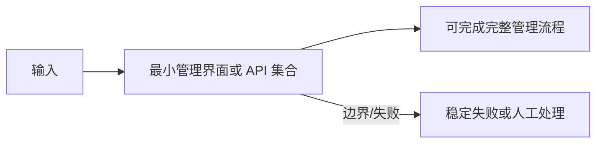

<!-- 本文件由 scripts/generate_course_tutorials.py 生成，请修改阶段计划或生成器后重新生成。 -->

# 第 18 周教程：Agent Registry

> 计划来源：[06-ai-platform-core.md](../stages/06-ai-platform-core.md)。阶段文档决定课程任务和验收，本文件解释逐节学习方法；学习状态仍只记录在[第 18 周成果](../../deliverables/week-18/README.md)。

## 本周先理解

### 为什么学

让 Agent 配置可校验、可发布、可追溯和可回滚，避免线上配置被原地覆盖。

### 这是什么

Agent Registry 管理 Definition、Draft、不可变 Version 和 Release 指针，并解析模型、Prompt、Tool 与知识库依赖。

### 本周学习策略

- 每天只完成下面一节，控制在约 1 小时，不提前堆叠下一节的新概念。
- 先预测再实验；先保存原始证据，再写结论；失败样例与正常结果同等重要。
- 首次遇到术语时补齐：一句话定义、输入输出、开发类比、类比边界、反例和“不是什么”。
- 使用 H1→H4 提示阶梯；若使用完整参考答案，必须额外完成一个不同输入或约束的变体。

## 逐节教程

### 周一 · 第 1 节：设计 Agent Definition

**为什么学**

本周要让 Agent 配置可校验、可发布、可追溯和可回滚，避免线上配置被原地覆盖。本节把“设计 Agent Definition”推进为可检查成果；如果跳过，后续会缺少“Agent Schema 可校验”这项关键证据。

**这个是什么**

本周核心概念是：Agent Registry 管理 Definition、Draft、不可变 Version 和 Release 指针，并解析模型、Prompt、Tool 与知识库依赖。今天的“设计 Agent Definition”是这个核心能力的最小学习单元：你会通过“输入输出 Schema、模型策略、Prompt 引用、工具和知识库都使用显式 ID；不要保存不可审计的大对象”观察输入如何转化为“Agent Schema 可校验”。它既包含可观察结果，也包含至少一个失败或不适用边界。重点边界来自课程原计划：不要保存不可审计的大对象。

**怎么学（约 60 分钟）**

1. `0–5 分钟`：不查资料，写下你对本节主题的一句话解释、预期输入输出和一个疑问。
2. `5–15 分钟`：只阅读下方资料中与当前任务直接相关的部分，记录一个关键约束和版本信息。
3. `15–45 分钟`：执行专项任务：输入输出 Schema、模型策略、Prompt 引用、工具和知识库都使用显式 ID；不要保存不可审计的大对象
4. `45–55 分钟`：主动制造一个错误输入、边界条件、依赖失败或反例，保存现象并解释原因。
5. `55–60 分钟`：整理命令、输入、输出、Diff、图表或访谈证据，并用自己的语言完成 Teach-back。

专项资料：[JSON Schema 入门](https://json-schema.org/learn/getting-started-step-by-step)

**怎么验证学会了**

- 必交证据：Agent Schema 可校验。
- Teach-back：不看资料解释“设计 Agent Definition”解决什么问题、主要输入输出、一个边界，以及它不是什么。
- 失败证据：展示一个非正常场景，指出失败发生在哪一层，不能只贴错误截图。
- 变体任务：改变一个输入、参数、角色、权限或失败条件，在不照抄原步骤的情况下重新完成。
- 通过标准：以上四项均有证据，且能解释关键取舍；只能照步骤运行时最高算 L1，不能判定本节通过。

**参考答案（独立尝试至少 20 分钟后再看）**

> 这是一份合格答案骨架，不是唯一实现。看完后必须关闭参考答案，换一个输入或约束独立重做。

#### 步骤 1 参考：先写预测

- 一句话解释：Agent Registry 管理 Definition、Draft、不可变 Version 和 Release 指针，并解析模型、Prompt、Tool 与知识库依赖。
- 预测：完成“设计 Agent Definition”后，应能观察到“Agent Schema 可校验”；失败输入不应产生假成功。

#### 步骤 2 参考：阅读资料

- 链接：[JSON Schema 入门](https://json-schema.org/learn/getting-started-step-by-step)
- 指定章节/条目：该链接指向的“JSON Schema 入门”整篇专题/章节；重点阅读与“设计 Agent Definition”直接对应的段落，页面更新时使用课程标题中的英文术语或 API 名页内搜索
- 阅读方法：只摘录一个定义、一个输入输出约束和一个失败边界；记录页面日期、协议版本或依赖版本。

#### 步骤 3 参考：按专项动作完成产出

- 专项动作：输入输出 Schema、模型策略、Prompt 引用、工具和知识库都使用显式 ID；不要保存不可审计的大对象
- 样例代码（先核对课程链接中的当前 API，再按本仓库边界修改）：

```json
{
  "schemaVersion": "v1",
  "task": "设计 Agent Definition",
  "input": {"requestId": "req-001"},
  "expected": "Agent Schema 可校验",
  "onError": {"code": "VALIDATION_FAILED", "retryable": false}
}
```

#### 步骤 4 参考：制造失败并解释

- 失败注入：加入无答案、非法 Schema、超时或工具失败输入，正确结果应是拒答或稳定失败状态；如果输出看似正常但证据缺失，应判为失败。
- 参考判断：失败必须映射为明确状态、错误、拒答、人工路径或未验证假设；日志和界面不得显示成功。

#### 步骤 5 参考：整理交付与 Teach-back

- 当天交付：Agent Schema 可校验。
- 完整字段：版本；请求字段；成功响应；稳定错误码；状态变化；traceId；幂等/并发约束；兼容性说明。
- Teach-back 参考：本节输入是什么、经过了什么处理、输出如何验证、哪种失败最危险、为什么当前方案没有越过课程边界。
- 完成后变体：更换一个输入、参数、角色、权限或失败条件，不看上述样例重新完成。


### 周二 · 第 2 节：Draft 与不可变 Version

**为什么学**

本周要让 Agent 配置可校验、可发布、可追溯和可回滚，避免线上配置被原地覆盖。本节把“Draft 与不可变 Version”推进为可检查成果；如果跳过，后续会缺少“已发布版本不可原地修改”这项关键证据。

**这个是什么**

本周核心概念是：Agent Registry 管理 Definition、Draft、不可变 Version 和 Release 指针，并解析模型、Prompt、Tool 与知识库依赖。今天的“Draft 与不可变 Version”是这个核心能力的最小学习单元：你会通过“编辑 Draft，发布时生成不可变快照；相同内容可用 Hash 识别”观察输入如何转化为“已发布版本不可原地修改”。它既包含可观察结果，也包含至少一个失败或不适用边界。只读完资料或只跑通正常路径，都不能证明已经掌握。

**怎么学（约 60 分钟）**

1. `0–5 分钟`：不查资料，写下你对本节主题的一句话解释、预期输入输出和一个疑问。
2. `5–15 分钟`：只阅读下方资料中与当前任务直接相关的部分，记录一个关键约束和版本信息。
3. `15–45 分钟`：执行专项任务：编辑 Draft，发布时生成不可变快照；相同内容可用 Hash 识别
4. `45–55 分钟`：主动制造一个错误输入、边界条件、依赖失败或反例，保存现象并解释原因。
5. `55–60 分钟`：整理命令、输入、输出、Diff、图表或访谈证据，并用自己的语言完成 Teach-back。

专项资料：[Semantic Versioning](https://semver.org/)

**怎么验证学会了**

- 必交证据：已发布版本不可原地修改。
- Teach-back：不看资料解释“Draft 与不可变 Version”解决什么问题、主要输入输出、一个边界，以及它不是什么。
- 失败证据：展示一个非正常场景，指出失败发生在哪一层，不能只贴错误截图。
- 变体任务：改变一个输入、参数、角色、权限或失败条件，在不照抄原步骤的情况下重新完成。
- 通过标准：以上四项均有证据，且能解释关键取舍；只能照步骤运行时最高算 L1，不能判定本节通过。

**参考答案（独立尝试至少 20 分钟后再看）**

> 这是一份合格答案骨架，不是唯一实现。看完后必须关闭参考答案，换一个输入或约束独立重做。

#### 步骤 1 参考：先写预测

- 一句话解释：Agent Registry 管理 Definition、Draft、不可变 Version 和 Release 指针，并解析模型、Prompt、Tool 与知识库依赖。
- 预测：完成“Draft 与不可变 Version”后，应能观察到“已发布版本不可原地修改”；失败输入不应产生假成功。

#### 步骤 2 参考：阅读资料

- 链接：[Semantic Versioning](https://semver.org/)
- 指定章节/条目：该链接指向的“Semantic Versioning”整篇专题/章节；重点阅读与“Draft 与不可变 Version”直接对应的段落，页面更新时使用课程标题中的英文术语或 API 名页内搜索
- 阅读方法：只摘录一个定义、一个输入输出约束和一个失败边界；记录页面日期、协议版本或依赖版本。

#### 步骤 3 参考：按专项动作完成产出

- 专项动作：编辑 Draft，发布时生成不可变快照；相同内容可用 Hash 识别
- 参考资料/文档产出：

- 主题：Draft 与不可变 Version
- 建议字段：一句话定义；输入；操作；可观察输出；失败/反例；工程意义；证据位置
- 示例结论：已按统一口径产出“已发布版本不可原地修改”；证据不足的部分标记为假设或未验证。

#### 步骤 4 参考：制造失败并解释

- 失败注入：删掉一个必填输入或让依赖失败，系统应返回可解释的失败结果且不产生假成功；再根据日志、Diff 或流程证据定位原因。
- 参考判断：失败必须映射为明确状态、错误、拒答、人工路径或未验证假设；日志和界面不得显示成功。

#### 步骤 5 参考：整理交付与 Teach-back

- 当天交付：已发布版本不可原地修改。
- 完整字段：一句话定义；输入；操作；可观察输出；失败/反例；工程意义；证据位置。
- Teach-back 参考：本节输入是什么、经过了什么处理、输出如何验证、哪种失败最危险、为什么当前方案没有越过课程边界。
- 完成后变体：更换一个输入、参数、角色、权限或失败条件，不看上述样例重新完成。


### 周三 · 第 3 节：Publish 与 Rollback

**为什么学**

本周要让 Agent 配置可校验、可发布、可追溯和可回滚，避免线上配置被原地覆盖。本节把“Publish 与 Rollback”推进为可检查成果；如果跳过，后续会缺少“发布和回滚测试通过”这项关键证据。

**这个是什么**

本周核心概念是：Agent Registry 管理 Definition、Draft、不可变 Version 和 Release 指针，并解析模型、Prompt、Tool 与知识库依赖。今天的“Publish 与 Rollback”是这个核心能力的最小学习单元：你会通过“发布前检查依赖版本和 Eval 状态；回滚切换 Release 指针而非覆盖历史”观察输入如何转化为“发布和回滚测试通过”。它既包含可观察结果，也包含至少一个失败或不适用边界。只读完资料或只跑通正常路径，都不能证明已经掌握。

**怎么学（约 60 分钟）**

1. `0–5 分钟`：不查资料，写下你对本节主题的一句话解释、预期输入输出和一个疑问。
2. `5–15 分钟`：只阅读下方资料中与当前任务直接相关的部分，记录一个关键约束和版本信息。
3. `15–45 分钟`：执行专项任务：发布前检查依赖版本和 Eval 状态；回滚切换 Release 指针而非覆盖历史
4. `45–55 分钟`：主动制造一个错误输入、边界条件、依赖失败或反例，保存现象并解释原因。
5. `55–60 分钟`：整理命令、输入、输出、Diff、图表或访谈证据，并用自己的语言完成 Teach-back。

专项资料：[Google SRE：Release Engineering](https://sre.google/sre-book/release-engineering/)

**怎么验证学会了**

- 必交证据：发布和回滚测试通过。
- Teach-back：不看资料解释“Publish 与 Rollback”解决什么问题、主要输入输出、一个边界，以及它不是什么。
- 失败证据：展示一个非正常场景，指出失败发生在哪一层，不能只贴错误截图。
- 变体任务：改变一个输入、参数、角色、权限或失败条件，在不照抄原步骤的情况下重新完成。
- 通过标准：以上四项均有证据，且能解释关键取舍；只能照步骤运行时最高算 L1，不能判定本节通过。

**参考答案（独立尝试至少 20 分钟后再看）**

> 这是一份合格答案骨架，不是唯一实现。看完后必须关闭参考答案，换一个输入或约束独立重做。

#### 步骤 1 参考：先写预测

- 一句话解释：Agent Registry 管理 Definition、Draft、不可变 Version 和 Release 指针，并解析模型、Prompt、Tool 与知识库依赖。
- 预测：完成“Publish 与 Rollback”后，应能观察到“发布和回滚测试通过”；失败输入不应产生假成功。

#### 步骤 2 参考：阅读资料

- 链接：[Google SRE：Release Engineering](https://sre.google/sre-book/release-engineering/)
- 指定章节/条目：该链接指向的“Google SRE：Release Engineering”整篇专题/章节；重点阅读与“Publish 与 Rollback”直接对应的段落，页面更新时使用课程标题中的英文术语或 API 名页内搜索
- 阅读方法：只摘录一个定义、一个输入输出约束和一个失败边界；记录页面日期、协议版本或依赖版本。

#### 步骤 3 参考：按专项动作完成产出

- 专项动作：发布前检查依赖版本和 Eval 状态；回滚切换 Release 指针而非覆盖历史
- 参考资料/文档产出：

- 主题：Publish 与 Rollback
- 建议字段：用例 ID；前置条件；输入/故障；预期状态；关键断言；实际结果；日志或 Trace；是否通过
- 示例结论：已按统一口径产出“发布和回滚测试通过”；证据不足的部分标记为假设或未验证。

#### 步骤 4 参考：制造失败并解释

- 失败注入：删掉一个必填输入或让依赖失败，系统应返回可解释的失败结果且不产生假成功；再根据日志、Diff 或流程证据定位原因。
- 参考判断：失败必须映射为明确状态、错误、拒答、人工路径或未验证假设；日志和界面不得显示成功。

#### 步骤 5 参考：整理交付与 Teach-back

- 当天交付：发布和回滚测试通过。
- 完整字段：用例 ID；前置条件；输入/故障；预期状态；关键断言；实际结果；日志或 Trace；是否通过。
- Teach-back 参考：本节输入是什么、经过了什么处理、输出如何验证、哪种失败最危险、为什么当前方案没有越过课程边界。
- 完成后变体：更换一个输入、参数、角色、权限或失败条件，不看上述样例重新完成。


### 周四 · 第 4 节：Agent CRUD API 与并发控制

**为什么学**

本周要让 Agent 配置可校验、可发布、可追溯和可回滚，避免线上配置被原地覆盖。本节把“Agent CRUD API 与并发控制”推进为可检查成果；如果跳过，后续会缺少“并发冲突和隔离测试”这项关键证据。

**这个是什么**

本周核心概念是：Agent Registry 管理 Definition、Draft、不可变 Version 和 Release 指针，并解析模型、Prompt、Tool 与知识库依赖。今天的“Agent CRUD API 与并发控制”是这个核心能力的最小学习单元：你会通过“使用版本号或 ETag 防止覆盖更新；越权项目不能读取或修改资源”观察输入如何转化为“并发冲突和隔离测试”。它既包含可观察结果，也包含至少一个失败或不适用边界。只读完资料或只跑通正常路径，都不能证明已经掌握。

**怎么学（约 60 分钟）**

1. `0–5 分钟`：不查资料，写下你对本节主题的一句话解释、预期输入输出和一个疑问。
2. `5–15 分钟`：只阅读下方资料中与当前任务直接相关的部分，记录一个关键约束和版本信息。
3. `15–45 分钟`：执行专项任务：使用版本号或 ETag 防止覆盖更新；越权项目不能读取或修改资源
4. `45–55 分钟`：主动制造一个错误输入、边界条件、依赖失败或反例，保存现象并解释原因。
5. `55–60 分钟`：整理命令、输入、输出、Diff、图表或访谈证据，并用自己的语言完成 Teach-back。

专项资料：[RFC 9110：条件请求](https://www.rfc-editor.org/rfc/rfc9110.html#name-preconditions)

**怎么验证学会了**

- 必交证据：并发冲突和隔离测试。
- Teach-back：不看资料解释“Agent CRUD API 与并发控制”解决什么问题、主要输入输出、一个边界，以及它不是什么。
- 失败证据：展示一个非正常场景，指出失败发生在哪一层，不能只贴错误截图。
- 变体任务：改变一个输入、参数、角色、权限或失败条件，在不照抄原步骤的情况下重新完成。
- 通过标准：以上四项均有证据，且能解释关键取舍；只能照步骤运行时最高算 L1，不能判定本节通过。

**参考答案（独立尝试至少 20 分钟后再看）**

> 这是一份合格答案骨架，不是唯一实现。看完后必须关闭参考答案，换一个输入或约束独立重做。

#### 步骤 1 参考：先写预测

- 一句话解释：Agent Registry 管理 Definition、Draft、不可变 Version 和 Release 指针，并解析模型、Prompt、Tool 与知识库依赖。
- 预测：完成“Agent CRUD API 与并发控制”后，应能观察到“并发冲突和隔离测试”；失败输入不应产生假成功。

#### 步骤 2 参考：阅读资料

- 链接：[RFC 9110：条件请求](https://www.rfc-editor.org/rfc/rfc9110.html#name-preconditions)
- 指定章节/条目：该链接指向的“RFC 9110：条件请求”整篇专题/章节；重点阅读与“Agent CRUD API 与并发控制”直接对应的段落，页面更新时使用课程标题中的英文术语或 API 名页内搜索
- 阅读方法：只摘录一个定义、一个输入输出约束和一个失败边界；记录页面日期、协议版本或依赖版本。

#### 步骤 3 参考：按专项动作完成产出

- 专项动作：使用版本号或 ETag 防止覆盖更新；越权项目不能读取或修改资源
- 样例代码（先核对课程链接中的当前 API，再按本仓库边界修改）：

```java
record LessonCommand(String projectId, String requestId, String payload) {}
record LessonResult(String status, String evidence) {}

@Service
final class LessonService {
    LessonResult execute(LessonCommand command) {
        if (command.projectId() == null || command.projectId().isBlank()) {
            throw new IllegalArgumentException("PROJECT_REQUIRED");
        }
        // TODO: 实现“Agent CRUD API 与并发控制”，并在执行路径校验权限、版本和幂等约束。
        return new LessonResult("SUCCEEDED", "并发冲突和隔离测试");
    }
}
```

#### 步骤 4 参考：制造失败并解释

- 失败注入：加入无答案、非法 Schema、超时或工具失败输入，正确结果应是拒答或稳定失败状态；如果输出看似正常但证据缺失，应判为失败。
- 参考判断：失败必须映射为明确状态、错误、拒答、人工路径或未验证假设；日志和界面不得显示成功。

#### 步骤 5 参考：整理交付与 Teach-back

- 当天交付：并发冲突和隔离测试。
- 完整字段：版本；请求字段；成功响应；稳定错误码；状态变化；traceId；幂等/并发约束；兼容性说明。
- Teach-back 参考：本节输入是什么、经过了什么处理、输出如何验证、哪种失败最危险、为什么当前方案没有越过课程边界。
- 完成后变体：更换一个输入、参数、角色、权限或失败条件，不看上述样例重新完成。


### 周五 · 第 5 节：配置校验与依赖解析

**为什么学**

本周要让 Agent 配置可校验、可发布、可追溯和可回滚，避免线上配置被原地覆盖。本节把“配置校验与依赖解析”推进为可检查成果；如果跳过，后续会缺少“无效依赖不能发布”这项关键证据。

**这个是什么**

本周核心概念是：Agent Registry 管理 Definition、Draft、不可变 Version 和 Release 指针，并解析模型、Prompt、Tool 与知识库依赖。今天的“配置校验与依赖解析”是这个核心能力的最小学习单元：你会通过“发布时确认模型、工具、知识库存在且可用；错误应定位到具体依赖”观察输入如何转化为“无效依赖不能发布”。它既包含可观察结果，也包含至少一个失败或不适用边界。只读完资料或只跑通正常路径，都不能证明已经掌握。

**怎么学（约 60 分钟）**

1. `0–5 分钟`：不查资料，写下你对本节主题的一句话解释、预期输入输出和一个疑问。
2. `5–15 分钟`：只阅读下方资料中与当前任务直接相关的部分，记录一个关键约束和版本信息。
3. `15–45 分钟`：执行专项任务：发布时确认模型、工具、知识库存在且可用；错误应定位到具体依赖
4. `45–55 分钟`：主动制造一个错误输入、边界条件、依赖失败或反例，保存现象并解释原因。
5. `55–60 分钟`：整理命令、输入、输出、Diff、图表或访谈证据，并用自己的语言完成 Teach-back。

专项资料：[JSON Schema 入门](https://json-schema.org/learn/getting-started-step-by-step)

**怎么验证学会了**

- 必交证据：无效依赖不能发布。
- Teach-back：不看资料解释“配置校验与依赖解析”解决什么问题、主要输入输出、一个边界，以及它不是什么。
- 失败证据：展示一个非正常场景，指出失败发生在哪一层，不能只贴错误截图。
- 变体任务：改变一个输入、参数、角色、权限或失败条件，在不照抄原步骤的情况下重新完成。
- 通过标准：以上四项均有证据，且能解释关键取舍；只能照步骤运行时最高算 L1，不能判定本节通过。

**参考答案（独立尝试至少 20 分钟后再看）**

> 这是一份合格答案骨架，不是唯一实现。看完后必须关闭参考答案，换一个输入或约束独立重做。

#### 步骤 1 参考：先写预测

- 一句话解释：Agent Registry 管理 Definition、Draft、不可变 Version 和 Release 指针，并解析模型、Prompt、Tool 与知识库依赖。
- 预测：完成“配置校验与依赖解析”后，应能观察到“无效依赖不能发布”；失败输入不应产生假成功。

#### 步骤 2 参考：阅读资料

- 链接：[JSON Schema 入门](https://json-schema.org/learn/getting-started-step-by-step)
- 指定章节/条目：该链接指向的“JSON Schema 入门”整篇专题/章节；重点阅读与“配置校验与依赖解析”直接对应的段落，页面更新时使用课程标题中的英文术语或 API 名页内搜索
- 阅读方法：只摘录一个定义、一个输入输出约束和一个失败边界；记录页面日期、协议版本或依赖版本。

#### 步骤 3 参考：按专项动作完成产出

- 专项动作：发布时确认模型、工具、知识库存在且可用；错误应定位到具体依赖
- 样例代码（先核对课程链接中的当前 API，再按本仓库边界修改）：

```java
record LessonCommand(String projectId, String requestId, String payload) {}
record LessonResult(String status, String evidence) {}

@Service
final class LessonService {
    LessonResult execute(LessonCommand command) {
        if (command.projectId() == null || command.projectId().isBlank()) {
            throw new IllegalArgumentException("PROJECT_REQUIRED");
        }
        // TODO: 实现“配置校验与依赖解析”，并在执行路径校验权限、版本和幂等约束。
        return new LessonResult("SUCCEEDED", "无效依赖不能发布");
    }
}
```

#### 步骤 4 参考：制造失败并解释

- 失败注入：加入无答案、非法 Schema、超时或工具失败输入，正确结果应是拒答或稳定失败状态；如果输出看似正常但证据缺失，应判为失败。
- 参考判断：失败必须映射为明确状态、错误、拒答、人工路径或未验证假设；日志和界面不得显示成功。

#### 步骤 5 参考：整理交付与 Teach-back

- 当天交付：无效依赖不能发布。
- 完整字段：运行时与依赖版本；配置键；Secret 引用方式；示例占位值；启动命令；缺失配置的错误；泄露检查。
- Teach-back 参考：本节输入是什么、经过了什么处理、输出如何验证、哪种失败最危险、为什么当前方案没有越过课程边界。
- 完成后变体：更换一个输入、参数、角色、权限或失败条件，不看上述样例重新完成。


### 周六 · 第 6 节：最小管理界面或 API 集合

**为什么学**

本周要让 Agent 配置可校验、可发布、可追溯和可回滚，避免线上配置被原地覆盖。本节把“最小管理界面或 API 集合”推进为可检查成果；如果跳过，后续会缺少“可完成完整管理流程”这项关键证据。

**这个是什么**

本周核心概念是：Agent Registry 管理 Definition、Draft、不可变 Version 和 Release 指针，并解析模型、Prompt、Tool 与知识库依赖。今天的“最小管理界面或 API 集合”是这个核心能力的最小学习单元：你会通过“先实现列表、详情、编辑、版本、发布和回滚；UI 可简陋但状态必须准确”观察输入如何转化为“可完成完整管理流程”。它既包含可观察结果，也包含至少一个失败或不适用边界。只读完资料或只跑通正常路径，都不能证明已经掌握。

**怎么学（约 60 分钟）**

1. `0–5 分钟`：不查资料，写下你对本节主题的一句话解释、预期输入输出和一个疑问。
2. `5–15 分钟`：只阅读下方资料中与当前任务直接相关的部分，记录一个关键约束和版本信息。
3. `15–45 分钟`：执行专项任务：先实现列表、详情、编辑、版本、发布和回滚；UI 可简陋但状态必须准确
4. `45–55 分钟`：主动制造一个错误输入、边界条件、依赖失败或反例，保存现象并解释原因。
5. `55–60 分钟`：整理命令、输入、输出、Diff、图表或访谈证据，并用自己的语言完成 Teach-back。

专项资料：[OpenAPI Specification](https://spec.openapis.org/oas/latest.html)

**怎么验证学会了**

- 必交证据：可完成完整管理流程。
- Teach-back：不看资料解释“最小管理界面或 API 集合”解决什么问题、主要输入输出、一个边界，以及它不是什么。
- 失败证据：展示一个非正常场景，指出失败发生在哪一层，不能只贴错误截图。
- 变体任务：改变一个输入、参数、角色、权限或失败条件，在不照抄原步骤的情况下重新完成。
- 通过标准：以上四项均有证据，且能解释关键取舍；只能照步骤运行时最高算 L1，不能判定本节通过。

**参考答案（独立尝试至少 20 分钟后再看）**

> 这是一份合格答案骨架，不是唯一实现。看完后必须关闭参考答案，换一个输入或约束独立重做。

#### 步骤 1 参考：先写预测

- 一句话解释：Agent Registry 管理 Definition、Draft、不可变 Version 和 Release 指针，并解析模型、Prompt、Tool 与知识库依赖。
- 预测：完成“最小管理界面或 API 集合”后，应能观察到“可完成完整管理流程”；失败输入不应产生假成功。

#### 步骤 2 参考：阅读资料

- 链接：[OpenAPI Specification](https://spec.openapis.org/oas/latest.html)
- 指定章节/条目：该链接指向的“OpenAPI Specification”整篇专题/章节；重点阅读与“最小管理界面或 API 集合”直接对应的段落，页面更新时使用课程标题中的英文术语或 API 名页内搜索
- 阅读方法：只摘录一个定义、一个输入输出约束和一个失败边界；记录页面日期、协议版本或依赖版本。

#### 步骤 3 参考：按专项动作完成产出

- 专项动作：先实现列表、详情、编辑、版本、发布和回滚；UI 可简陋但状态必须准确
- 参考图（按实际角色、字段和状态修改）：



#### 步骤 4 参考：制造失败并解释

- 失败注入：删掉一个必填输入或让依赖失败，系统应返回可解释的失败结果且不产生假成功；再根据日志、Diff 或流程证据定位原因。
- 参考判断：失败必须映射为明确状态、错误、拒答、人工路径或未验证假设；日志和界面不得显示成功。

#### 步骤 5 参考：整理交付与 Teach-back

- 当天交付：可完成完整管理流程。
- 完整字段：版本；请求字段；成功响应；稳定错误码；状态变化；traceId；幂等/并发约束；兼容性说明。
- Teach-back 参考：本节输入是什么、经过了什么处理、输出如何验证、哪种失败最危险、为什么当前方案没有越过课程边界。
- 完成后变体：更换一个输入、参数、角色、权限或失败条件，不看上述样例重新完成。


### 周日 · 第 7 节：运行两个 Agent 版本

**为什么学**

本周要让 Agent 配置可校验、可发布、可追溯和可回滚，避免线上配置被原地覆盖。本节把“运行两个 Agent 版本”推进为可检查成果；如果跳过，后续会缺少“完成本周提交”这项关键证据。

**这个是什么**

本周核心概念是：Agent Registry 管理 Definition、Draft、不可变 Version 和 Release 指针，并解析模型、Prompt、Tool 与知识库依赖。今天的“运行两个 Agent 版本”是这个核心能力的最小学习单元：你会通过“用固定输入比较旧版和新版；确认 Run 记录绑定具体快照”观察输入如何转化为“完成本周提交”。它既包含可观察结果，也包含至少一个失败或不适用边界。只读完资料或只跑通正常路径，都不能证明已经掌握。

**怎么学（约 60 分钟）**

1. `0–5 分钟`：不查资料，写下你对本节主题的一句话解释、预期输入输出和一个疑问。
2. `5–15 分钟`：只阅读下方资料中与当前任务直接相关的部分，记录一个关键约束和版本信息。
3. `15–45 分钟`：执行专项任务：用固定输入比较旧版和新版；确认 Run 记录绑定具体快照
4. `45–55 分钟`：主动制造一个错误输入、边界条件、依赖失败或反例，保存现象并解释原因。
5. `55–60 分钟`：整理命令、输入、输出、Diff、图表或访谈证据，并用自己的语言完成 Teach-back。

专项资料：[OpenAI Evals 指南](https://platform.openai.com/docs/guides/evals)

**怎么验证学会了**

- 必交证据：完成本周提交。
- Teach-back：不看资料解释“运行两个 Agent 版本”解决什么问题、主要输入输出、一个边界，以及它不是什么。
- 失败证据：展示一个非正常场景，指出失败发生在哪一层，不能只贴错误截图。
- 变体任务：改变一个输入、参数、角色、权限或失败条件，在不照抄原步骤的情况下重新完成。
- 通过标准：以上四项均有证据，且能解释关键取舍；只能照步骤运行时最高算 L1，不能判定本节通过。

**参考答案（独立尝试至少 20 分钟后再看）**

> 这是一份合格答案骨架，不是唯一实现。看完后必须关闭参考答案，换一个输入或约束独立重做。

#### 步骤 1 参考：先写预测

- 一句话解释：Agent Registry 管理 Definition、Draft、不可变 Version 和 Release 指针，并解析模型、Prompt、Tool 与知识库依赖。
- 预测：完成“运行两个 Agent 版本”后，应能观察到“完成本周提交”；失败输入不应产生假成功。

#### 步骤 2 参考：阅读资料

- 链接：[OpenAI Evals 指南](https://platform.openai.com/docs/guides/evals)
- 指定章节/条目：该链接指向的“OpenAI Evals 指南”整篇专题/章节；重点阅读与“运行两个 Agent 版本”直接对应的段落，页面更新时使用课程标题中的英文术语或 API 名页内搜索
- 阅读方法：只摘录一个定义、一个输入输出约束和一个失败边界；记录页面日期、协议版本或依赖版本。

#### 步骤 3 参考：按专项动作完成产出

- 专项动作：用固定输入比较旧版和新版；确认 Run 记录绑定具体快照
- 样例代码（先核对课程链接中的当前 API，再按本仓库边界修改）：

```java
record LessonCommand(String projectId, String requestId, String payload) {}
record LessonResult(String status, String evidence) {}

@Service
final class LessonService {
    LessonResult execute(LessonCommand command) {
        if (command.projectId() == null || command.projectId().isBlank()) {
            throw new IllegalArgumentException("PROJECT_REQUIRED");
        }
        // TODO: 实现“运行两个 Agent 版本”，并在执行路径校验权限、版本和幂等约束。
        return new LessonResult("SUCCEEDED", "完成本周提交");
    }
}
```

#### 步骤 4 参考：制造失败并解释

- 失败注入：加入无答案、非法 Schema、超时或工具失败输入，正确结果应是拒答或稳定失败状态；如果输出看似正常但证据缺失，应判为失败。
- 参考判断：失败必须映射为明确状态、错误、拒答、人工路径或未验证假设；日志和界面不得显示成功。

#### 步骤 5 参考：整理交付与 Teach-back

- 当天交付：完成本周提交。
- 完整字段：指标名称；计算公式；数据来源；样本与时间窗；当前值；目标/阈值；限制与未验证项。
- Teach-back 参考：本节输入是什么、经过了什么处理、输出如何验证、哪种失败最危险、为什么当前方案没有越过课程边界。
- 完成后变体：更换一个输入、参数、角色、权限或失败条件，不看上述样例重新完成。


## 本周收尾

按[成果与提交标准](../06-deliverable-standards.md)整理本周成果，再由讲师按[监督与掌握度规范](../07-instructor-supervision.md)给出“通过、部分通过、未通过”。教程完成不代表学习者已经掌握，必须以独立运行、排错、Teach-back 和变体证据为准。
