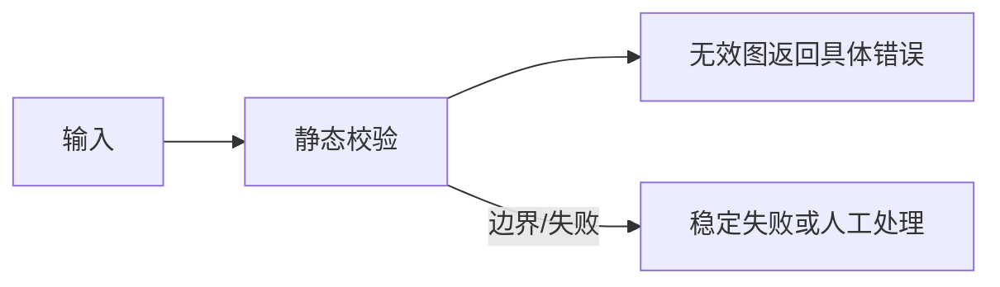

<!-- 本文件由 scripts/generate_course_tutorials.py 生成，请修改阶段计划或生成器后重新生成。 -->

# 第 21 周教程：Workflow Definition

> 计划来源：[07-workflow-governance.md](../stages/07-workflow-governance.md)。阶段文档决定课程任务和验收，[第 21 周公共成果要求](../../deliverables/week-21/README.md)定义门禁；学习状态只记录在个人学习仓库。

## 本周先理解

### 为什么学

让流程在运行前即可静态校验、版本化和编译，减少线上才发现死路或无界循环。

### 这是什么

Workflow Definition 是独立于运行实例的不可变流程描述，包含节点、边、条件、循环上限、输入输出和依赖版本。

### 本周语言定位

Java 承担平台控制面与治理，Python 承担已授权的 Agent/Workflow 执行；TypeScript 只在管理流程需要时提供最小界面。完整职责、切换桥接和替代规则见[开发语言路线](../01-language-roadmap.md)。

### 本周学习策略

- 每天只完成下面一节，控制在约 1 小时，不提前堆叠下一节的新概念。
- 先预测再实验；先保存原始证据，再写结论；失败样例与正常结果同等重要。
- 首次遇到术语时补齐：一句话定义、输入输出、开发类比、类比边界、反例和“不是什么”。
- 使用 H1→H4 提示阶梯；若使用完整参考答案，必须额外完成一个不同输入或约束的变体。

## 逐节教程

### 周一 · 第 1 节：定义 Workflow DSL/Schema

**为什么学**

本周要让流程在运行前即可静态校验、版本化和编译，减少线上才发现死路或无界循环。本节把“定义 Workflow DSL/Schema”推进为可检查成果；如果跳过，后续会缺少“Workflow Schema 和示例”这项关键证据。

**这个是什么**

本周核心概念是：Workflow Definition 是独立于运行实例的不可变流程描述，包含节点、边、条件、循环上限、输入输出和依赖版本。今天的“定义 Workflow DSL/Schema”是这个核心能力的最小学习单元：你会通过“第一版支持 Agent、Tool、Condition、HumanApproval、End；明确不支持项，不直接做拖拽画布”观察输入如何转化为“Workflow Schema 和示例”。它既包含可观察结果，也包含至少一个失败或不适用边界。只读完资料或只跑通正常路径，都不能证明已经掌握。

**怎么学（约 60 分钟）**

1. `0–5 分钟`：不查资料，写下你对本节主题的一句话解释、预期输入输出和一个疑问。
2. `5–15 分钟`：只阅读下方资料中与当前任务直接相关的部分，记录一个关键约束和版本信息。
3. `15–45 分钟`：执行专项任务：第一版支持 Agent、Tool、Condition、HumanApproval、End；明确不支持项，不直接做拖拽画布
4. `45–55 分钟`：主动制造一个错误输入、边界条件、依赖失败或反例，保存现象并解释原因。
5. `55–60 分钟`：整理命令、输入、输出、Diff、图表或访谈证据，并用自己的语言完成 Teach-back。

专项资料：[JSON Schema 入门](https://json-schema.org/learn/getting-started-step-by-step)

**怎么验证学会了**

- 必交证据：Workflow Schema 和示例。
- Teach-back：不看资料解释“定义 Workflow DSL/Schema”解决什么问题、主要输入输出、一个边界，以及它不是什么。
- 失败证据：展示一个非正常场景，指出失败发生在哪一层，不能只贴错误截图。
- 变体任务：改变一个输入、参数、角色、权限或失败条件，在不照抄原步骤的情况下重新完成。
- 通过标准：以上四项均有证据，且能解释关键取舍；只能照步骤运行时最高算 L1，不能判定本节通过。

**参考答案（独立尝试至少 20 分钟后再看）**

> 这是一份合格答案骨架，不是唯一实现。看完后必须关闭参考答案，换一个输入或约束独立重做。

#### 步骤 1 参考：先写预测

- 一句话解释：Workflow Definition 是独立于运行实例的不可变流程描述，包含节点、边、条件、循环上限、输入输出和依赖版本。
- 预测：完成“定义 Workflow DSL/Schema”后，应能观察到“Workflow Schema 和示例”；失败输入不应产生假成功。

#### 步骤 2 参考：阅读资料

- 链接：[JSON Schema 入门](https://json-schema.org/learn/getting-started-step-by-step)
- 指定章节/条目：Structured Outputs → JSON Schema、Handling mistakes / Validation
- 阅读方法：只摘录一个定义、一个输入输出约束和一个失败边界；记录页面日期、协议版本或依赖版本。

#### 步骤 3 参考：按专项动作完成产出

- 专项动作：第一版支持 Agent、Tool、Condition、HumanApproval、End；明确不支持项，不直接做拖拽画布
- 样例代码（先核对课程链接中的当前 API，再按本仓库边界修改）：

```json
{
  "schemaVersion": "v1",
  "task": "定义 Workflow DSL/Schema",
  "input": {"requestId": "req-001"},
  "expected": "Workflow Schema 和示例",
  "onError": {"code": "VALIDATION_FAILED", "retryable": false}
}
```

#### 步骤 4 参考：制造失败并解释

- 失败注入：加入无答案、非法 Schema、超时或工具失败输入，正确结果应是拒答或稳定失败状态；如果输出看似正常但证据缺失，应判为失败。
- 参考判断：失败必须映射为明确状态、错误、拒答、人工路径或未验证假设；日志和界面不得显示成功。

#### 步骤 5 参考：整理交付与 Teach-back

- 当天交付：Workflow Schema 和示例。
- 完整字段：版本；请求字段；成功响应；稳定错误码；状态变化；traceId；幂等/并发约束；兼容性说明。
- Teach-back 参考：本节输入是什么、经过了什么处理、输出如何验证、哪种失败最危险、为什么当前方案没有越过课程边界。
- 完成后变体：更换一个输入、参数、角色、权限或失败条件，不看上述样例重新完成。


### 周二 · 第 2 节：节点输入输出与变量引用

**为什么学**

本周要让流程在运行前即可静态校验、版本化和编译，减少线上才发现死路或无界循环。本节把“节点输入输出与变量引用”推进为可检查成果；如果跳过，后续会缺少“错误引用不能发布”这项关键证据。

**这个是什么**

本周核心概念是：Workflow Definition 是独立于运行实例的不可变流程描述，包含节点、边、条件、循环上限、输入输出和依赖版本。今天的“节点输入输出与变量引用”是这个核心能力的最小学习单元：你会通过“每个节点声明 Schema，变量引用在保存时校验；避免依赖自由文本约定”观察输入如何转化为“错误引用不能发布”。它既包含可观察结果，也包含至少一个失败或不适用边界。只读完资料或只跑通正常路径，都不能证明已经掌握。

**怎么学（约 60 分钟）**

1. `0–5 分钟`：不查资料，写下你对本节主题的一句话解释、预期输入输出和一个疑问。
2. `5–15 分钟`：只阅读下方资料中与当前任务直接相关的部分，记录一个关键约束和版本信息。
3. `15–45 分钟`：执行专项任务：每个节点声明 Schema，变量引用在保存时校验；避免依赖自由文本约定
4. `45–55 分钟`：主动制造一个错误输入、边界条件、依赖失败或反例，保存现象并解释原因。
5. `55–60 分钟`：整理命令、输入、输出、Diff、图表或访谈证据，并用自己的语言完成 Teach-back。

专项资料：[JSON Schema 入门](https://json-schema.org/learn/getting-started-step-by-step)

**怎么验证学会了**

- 必交证据：错误引用不能发布。
- Teach-back：不看资料解释“节点输入输出与变量引用”解决什么问题、主要输入输出、一个边界，以及它不是什么。
- 失败证据：展示一个非正常场景，指出失败发生在哪一层，不能只贴错误截图。
- 变体任务：改变一个输入、参数、角色、权限或失败条件，在不照抄原步骤的情况下重新完成。
- 通过标准：以上四项均有证据，且能解释关键取舍；只能照步骤运行时最高算 L1，不能判定本节通过。

**参考答案（独立尝试至少 20 分钟后再看）**

> 这是一份合格答案骨架，不是唯一实现。看完后必须关闭参考答案，换一个输入或约束独立重做。

#### 步骤 1 参考：先写预测

- 一句话解释：Workflow Definition 是独立于运行实例的不可变流程描述，包含节点、边、条件、循环上限、输入输出和依赖版本。
- 预测：完成“节点输入输出与变量引用”后，应能观察到“错误引用不能发布”；失败输入不应产生假成功。

#### 步骤 2 参考：阅读资料

- 链接：[JSON Schema 入门](https://json-schema.org/learn/getting-started-step-by-step)
- 指定章节/条目：该链接指向的“JSON Schema 入门”整篇专题/章节；重点阅读与“节点输入输出与变量引用”直接对应的段落，页面更新时使用课程标题中的英文术语或 API 名页内搜索
- 阅读方法：只摘录一个定义、一个输入输出约束和一个失败边界；记录页面日期、协议版本或依赖版本。

#### 步骤 3 参考：按专项动作完成产出

- 专项动作：每个节点声明 Schema，变量引用在保存时校验；避免依赖自由文本约定
- 参考资料/文档产出：

- 主题：节点输入输出与变量引用
- 建议字段：一句话定义；输入；操作；可观察输出；失败/反例；工程意义；证据位置
- 示例结论：已按统一口径产出“错误引用不能发布”；证据不足的部分标记为假设或未验证。

#### 步骤 4 参考：制造失败并解释

- 失败注入：删掉一个必填输入或让依赖失败，系统应返回可解释的失败结果且不产生假成功；再根据日志、Diff 或流程证据定位原因。
- 参考判断：失败必须映射为明确状态、错误、拒答、人工路径或未验证假设；日志和界面不得显示成功。

#### 步骤 5 参考：整理交付与 Teach-back

- 当天交付：错误引用不能发布。
- 完整字段：一句话定义；输入；操作；可观察输出；失败/反例；工程意义；证据位置。
- Teach-back 参考：本节输入是什么、经过了什么处理、输出如何验证、哪种失败最危险、为什么当前方案没有越过课程边界。
- 完成后变体：更换一个输入、参数、角色、权限或失败条件，不看上述样例重新完成。


### 周三 · 第 3 节：条件、循环和汇聚

**为什么学**

本周要让流程在运行前即可静态校验、版本化和编译，减少线上才发现死路或无界循环。本节把“条件、循环和汇聚”推进为可检查成果；如果跳过，后续会缺少“分支与循环测试通过”这项关键证据。

**这个是什么**

本周核心概念是：Workflow Definition 是独立于运行实例的不可变流程描述，包含节点、边、条件、循环上限、输入输出和依赖版本。今天的“条件、循环和汇聚”是这个核心能力的最小学习单元：你会通过“确定性条件使用表达式或代码；循环必须有计数和截止条件”观察输入如何转化为“分支与循环测试通过”。它既包含可观察结果，也包含至少一个失败或不适用边界。只读完资料或只跑通正常路径，都不能证明已经掌握。

**怎么学（约 60 分钟）**

1. `0–5 分钟`：不查资料，写下你对本节主题的一句话解释、预期输入输出和一个疑问。
2. `5–15 分钟`：只阅读下方资料中与当前任务直接相关的部分，记录一个关键约束和版本信息。
3. `15–45 分钟`：执行专项任务：确定性条件使用表达式或代码；循环必须有计数和截止条件
4. `45–55 分钟`：主动制造一个错误输入、边界条件、依赖失败或反例，保存现象并解释原因。
5. `55–60 分钟`：整理命令、输入、输出、Diff、图表或访谈证据，并用自己的语言完成 Teach-back。

专项资料：[W3C SCXML 状态机规范](https://www.w3.org/TR/scxml/)

**怎么验证学会了**

- 必交证据：分支与循环测试通过。
- Teach-back：不看资料解释“条件、循环和汇聚”解决什么问题、主要输入输出、一个边界，以及它不是什么。
- 失败证据：展示一个非正常场景，指出失败发生在哪一层，不能只贴错误截图。
- 变体任务：改变一个输入、参数、角色、权限或失败条件，在不照抄原步骤的情况下重新完成。
- 通过标准：以上四项均有证据，且能解释关键取舍；只能照步骤运行时最高算 L1，不能判定本节通过。

**参考答案（独立尝试至少 20 分钟后再看）**

> 这是一份合格答案骨架，不是唯一实现。看完后必须关闭参考答案，换一个输入或约束独立重做。

#### 步骤 1 参考：先写预测

- 一句话解释：Workflow Definition 是独立于运行实例的不可变流程描述，包含节点、边、条件、循环上限、输入输出和依赖版本。
- 预测：完成“条件、循环和汇聚”后，应能观察到“分支与循环测试通过”；失败输入不应产生假成功。

#### 步骤 2 参考：阅读资料

- 链接：[W3C SCXML 状态机规范](https://www.w3.org/TR/scxml/)
- 指定章节/条目：Graph API → State、Nodes、Edges、Conditional edges、Reducers
- 阅读方法：只摘录一个定义、一个输入输出约束和一个失败边界；记录页面日期、协议版本或依赖版本。

#### 步骤 3 参考：按专项动作完成产出

- 专项动作：确定性条件使用表达式或代码；循环必须有计数和截止条件
- 样例代码（先核对课程链接中的当前 API，再按本仓库边界修改）：

```java
record LessonCommand(String projectId, String requestId, String payload) {}
record LessonResult(String status, String evidence) {}

@Service
final class LessonService {
    LessonResult execute(LessonCommand command) {
        if (command.projectId() == null || command.projectId().isBlank()) {
            throw new IllegalArgumentException("PROJECT_REQUIRED");
        }
        // TODO: 实现“条件、循环和汇聚”，并在执行路径校验权限、版本和幂等约束。
        return new LessonResult("SUCCEEDED", "分支与循环测试通过");
    }
}
```

#### 步骤 4 参考：制造失败并解释

- 失败注入：删掉一个必填输入或让依赖失败，系统应返回可解释的失败结果且不产生假成功；再根据日志、Diff 或流程证据定位原因。
- 参考判断：失败必须映射为明确状态、错误、拒答、人工路径或未验证假设；日志和界面不得显示成功。

#### 步骤 5 参考：整理交付与 Teach-back

- 当天交付：分支与循环测试通过。
- 完整字段：用例 ID；前置条件；输入/故障；预期状态；关键断言；实际结果；日志或 Trace；是否通过。
- Teach-back 参考：本节输入是什么、经过了什么处理、输出如何验证、哪种失败最危险、为什么当前方案没有越过课程边界。
- 完成后变体：更换一个输入、参数、角色、权限或失败条件，不看上述样例重新完成。


### 周四 · 第 4 节：工作流版本与发布快照

**为什么学**

本周要让流程在运行前即可静态校验、版本化和编译，减少线上才发现死路或无界循环。本节把“工作流版本与发布快照”推进为可检查成果；如果跳过，后续会缺少“旧运行不受新版本影响”这项关键证据。

**这个是什么**

本周核心概念是：Workflow Definition 是独立于运行实例的不可变流程描述，包含节点、边、条件、循环上限、输入输出和依赖版本。今天的“工作流版本与发布快照”是这个核心能力的最小学习单元：你会通过“发布时锁定节点配置及其 Agent/Tool 版本；运行中不可被 Draft 影响”观察输入如何转化为“旧运行不受新版本影响”。它既包含可观察结果，也包含至少一个失败或不适用边界。只读完资料或只跑通正常路径，都不能证明已经掌握。

**怎么学（约 60 分钟）**

1. `0–5 分钟`：不查资料，写下你对本节主题的一句话解释、预期输入输出和一个疑问。
2. `5–15 分钟`：只阅读下方资料中与当前任务直接相关的部分，记录一个关键约束和版本信息。
3. `15–45 分钟`：执行专项任务：发布时锁定节点配置及其 Agent/Tool 版本；运行中不可被 Draft 影响
4. `45–55 分钟`：主动制造一个错误输入、边界条件、依赖失败或反例，保存现象并解释原因。
5. `55–60 分钟`：整理命令、输入、输出、Diff、图表或访谈证据，并用自己的语言完成 Teach-back。

专项资料：[Semantic Versioning](https://semver.org/)

**怎么验证学会了**

- 必交证据：旧运行不受新版本影响。
- Teach-back：不看资料解释“工作流版本与发布快照”解决什么问题、主要输入输出、一个边界，以及它不是什么。
- 失败证据：展示一个非正常场景，指出失败发生在哪一层，不能只贴错误截图。
- 变体任务：改变一个输入、参数、角色、权限或失败条件，在不照抄原步骤的情况下重新完成。
- 通过标准：以上四项均有证据，且能解释关键取舍；只能照步骤运行时最高算 L1，不能判定本节通过。

**参考答案（独立尝试至少 20 分钟后再看）**

> 这是一份合格答案骨架，不是唯一实现。看完后必须关闭参考答案，换一个输入或约束独立重做。

#### 步骤 1 参考：先写预测

- 一句话解释：Workflow Definition 是独立于运行实例的不可变流程描述，包含节点、边、条件、循环上限、输入输出和依赖版本。
- 预测：完成“工作流版本与发布快照”后，应能观察到“旧运行不受新版本影响”；失败输入不应产生假成功。

#### 步骤 2 参考：阅读资料

- 链接：[Semantic Versioning](https://semver.org/)
- 指定章节/条目：该链接指向的“Semantic Versioning”整篇专题/章节；重点阅读与“工作流版本与发布快照”直接对应的段落，页面更新时使用课程标题中的英文术语或 API 名页内搜索
- 阅读方法：只摘录一个定义、一个输入输出约束和一个失败边界；记录页面日期、协议版本或依赖版本。

#### 步骤 3 参考：按专项动作完成产出

- 专项动作：发布时锁定节点配置及其 Agent/Tool 版本；运行中不可被 Draft 影响
- 样例代码（先核对课程链接中的当前 API，再按本仓库边界修改）：

```java
record LessonCommand(String projectId, String requestId, String payload) {}
record LessonResult(String status, String evidence) {}

@Service
final class LessonService {
    LessonResult execute(LessonCommand command) {
        if (command.projectId() == null || command.projectId().isBlank()) {
            throw new IllegalArgumentException("PROJECT_REQUIRED");
        }
        // TODO: 实现“工作流版本与发布快照”，并在执行路径校验权限、版本和幂等约束。
        return new LessonResult("SUCCEEDED", "旧运行不受新版本影响");
    }
}
```

#### 步骤 4 参考：制造失败并解释

- 失败注入：加入无答案、非法 Schema、超时或工具失败输入，正确结果应是拒答或稳定失败状态；如果输出看似正常但证据缺失，应判为失败。
- 参考判断：失败必须映射为明确状态、错误、拒答、人工路径或未验证假设；日志和界面不得显示成功。

#### 步骤 5 参考：整理交付与 Teach-back

- 当天交付：旧运行不受新版本影响。
- 完整字段：入口；输入类型；输出类型；依赖版本；校验与权限；超时/错误；日志字段；最小测试命令。
- Teach-back 参考：本节输入是什么、经过了什么处理、输出如何验证、哪种失败最危险、为什么当前方案没有越过课程边界。
- 完成后变体：更换一个输入、参数、角色、权限或失败条件，不看上述样例重新完成。


### 周五 · 第 5 节：静态校验

**为什么学**

本周要让流程在运行前即可静态校验、版本化和编译，减少线上才发现死路或无界循环。本节把“静态校验”推进为可检查成果；如果跳过，后续会缺少“无效图返回具体错误”这项关键证据。

**这个是什么**

本周核心概念是：Workflow Definition 是独立于运行实例的不可变流程描述，包含节点、边、条件、循环上限、输入输出和依赖版本。今天的“静态校验”是这个核心能力的最小学习单元：你会通过“检查不可达节点、无结束路径、非法环、缺失权限和 Schema 不匹配”观察输入如何转化为“无效图返回具体错误”。它既包含可观察结果，也包含至少一个失败或不适用边界。只读完资料或只跑通正常路径，都不能证明已经掌握。

**怎么学（约 60 分钟）**

1. `0–5 分钟`：不查资料，写下你对本节主题的一句话解释、预期输入输出和一个疑问。
2. `5–15 分钟`：只阅读下方资料中与当前任务直接相关的部分，记录一个关键约束和版本信息。
3. `15–45 分钟`：执行专项任务：检查不可达节点、无结束路径、非法环、缺失权限和 Schema 不匹配
4. `45–55 分钟`：主动制造一个错误输入、边界条件、依赖失败或反例，保存现象并解释原因。
5. `55–60 分钟`：整理命令、输入、输出、Diff、图表或访谈证据，并用自己的语言完成 Teach-back。

专项资料：[W3C SCXML 状态机规范](https://www.w3.org/TR/scxml/)

**怎么验证学会了**

- 必交证据：无效图返回具体错误。
- Teach-back：不看资料解释“静态校验”解决什么问题、主要输入输出、一个边界，以及它不是什么。
- 失败证据：展示一个非正常场景，指出失败发生在哪一层，不能只贴错误截图。
- 变体任务：改变一个输入、参数、角色、权限或失败条件，在不照抄原步骤的情况下重新完成。
- 通过标准：以上四项均有证据，且能解释关键取舍；只能照步骤运行时最高算 L1，不能判定本节通过。

**参考答案（独立尝试至少 20 分钟后再看）**

> 这是一份合格答案骨架，不是唯一实现。看完后必须关闭参考答案，换一个输入或约束独立重做。

#### 步骤 1 参考：先写预测

- 一句话解释：Workflow Definition 是独立于运行实例的不可变流程描述，包含节点、边、条件、循环上限、输入输出和依赖版本。
- 预测：完成“静态校验”后，应能观察到“无效图返回具体错误”；失败输入不应产生假成功。

#### 步骤 2 参考：阅读资料

- 链接：[W3C SCXML 状态机规范](https://www.w3.org/TR/scxml/)
- 指定章节/条目：该链接指向的“W3C SCXML 状态机规范”整篇专题/章节；重点阅读与“静态校验”直接对应的段落，页面更新时使用课程标题中的英文术语或 API 名页内搜索
- 阅读方法：只摘录一个定义、一个输入输出约束和一个失败边界；记录页面日期、协议版本或依赖版本。

#### 步骤 3 参考：按专项动作完成产出

- 专项动作：检查不可达节点、无结束路径、非法环、缺失权限和 Schema 不匹配
- 参考图（按实际角色、字段和状态修改）：



#### 步骤 4 参考：制造失败并解释

- 失败注入：删除身份、Scope 或审批后再次执行，正确结果应是执行路径明确拒绝且留下脱敏审计；如果仍成功，就是权限边界失效。
- 参考判断：失败必须映射为明确状态、错误、拒答、人工路径或未验证假设；日志和界面不得显示成功。

#### 步骤 5 参考：整理交付与 Teach-back

- 当天交付：无效图返回具体错误。
- 完整字段：范围与参与者；输入；主路径；异常/拒绝路径；输出；信任或责任边界；版本与图例。
- Teach-back 参考：本节输入是什么、经过了什么处理、输出如何验证、哪种失败最危险、为什么当前方案没有越过课程边界。
- 完成后变体：更换一个输入、参数、角色、权限或失败条件，不看上述样例重新完成。


### 周六 · 第 6 节：映射到 LangGraph

**为什么学**

本周要让流程在运行前即可静态校验、版本化和编译，减少线上才发现死路或无界循环。本节把“映射到 LangGraph”推进为可检查成果；如果跳过，后续会缺少“一个工作流可编译运行”这项关键证据。

**这个是什么**

本周核心概念是：Workflow Definition 是独立于运行实例的不可变流程描述，包含节点、边、条件、循环上限、输入输出和依赖版本。今天的“映射到 LangGraph”是这个核心能力的最小学习单元：你会通过“平台 DSL 与 LangGraph State/Node/Edge 分层；不要把平台表结构直接当运行 State”观察输入如何转化为“一个工作流可编译运行”。它既包含可观察结果，也包含至少一个失败或不适用边界。重点边界来自课程原计划：不要把平台表结构直接当运行 State。

**怎么学（约 60 分钟）**

1. `0–5 分钟`：不查资料，写下你对本节主题的一句话解释、预期输入输出和一个疑问。
2. `5–15 分钟`：只阅读下方资料中与当前任务直接相关的部分，记录一个关键约束和版本信息。
3. `15–45 分钟`：执行专项任务：平台 DSL 与 LangGraph State/Node/Edge 分层；不要把平台表结构直接当运行 State
4. `45–55 分钟`：主动制造一个错误输入、边界条件、依赖失败或反例，保存现象并解释原因。
5. `55–60 分钟`：整理命令、输入、输出、Diff、图表或访谈证据，并用自己的语言完成 Teach-back。

专项资料：[LangGraph Graph API](https://docs.langchain.com/oss/python/langgraph/graph-api)

**怎么验证学会了**

- 必交证据：一个工作流可编译运行。
- Teach-back：不看资料解释“映射到 LangGraph”解决什么问题、主要输入输出、一个边界，以及它不是什么。
- 失败证据：展示一个非正常场景，指出失败发生在哪一层，不能只贴错误截图。
- 变体任务：改变一个输入、参数、角色、权限或失败条件，在不照抄原步骤的情况下重新完成。
- 通过标准：以上四项均有证据，且能解释关键取舍；只能照步骤运行时最高算 L1，不能判定本节通过。

**参考答案（独立尝试至少 20 分钟后再看）**

> 这是一份合格答案骨架，不是唯一实现。看完后必须关闭参考答案，换一个输入或约束独立重做。

#### 步骤 1 参考：先写预测

- 一句话解释：Workflow Definition 是独立于运行实例的不可变流程描述，包含节点、边、条件、循环上限、输入输出和依赖版本。
- 预测：完成“映射到 LangGraph”后，应能观察到“一个工作流可编译运行”；失败输入不应产生假成功。

#### 步骤 2 参考：阅读资料

- 链接：[LangGraph Graph API](https://docs.langchain.com/oss/python/langgraph/graph-api)
- 指定章节/条目：该链接指向的“LangGraph Graph API”整篇专题/章节；重点阅读与“映射到 LangGraph”直接对应的段落，页面更新时使用课程标题中的英文术语或 API 名页内搜索
- 阅读方法：只摘录一个定义、一个输入输出约束和一个失败边界；记录页面日期、协议版本或依赖版本。

#### 步骤 3 参考：按专项动作完成产出

- 专项动作：平台 DSL 与 LangGraph State/Node/Edge 分层；不要把平台表结构直接当运行 State
- 样例代码（先核对课程链接中的当前 API，再按本仓库边界修改）：

```java
record LessonCommand(String projectId, String requestId, String payload) {}
record LessonResult(String status, String evidence) {}

@Service
final class LessonService {
    LessonResult execute(LessonCommand command) {
        if (command.projectId() == null || command.projectId().isBlank()) {
            throw new IllegalArgumentException("PROJECT_REQUIRED");
        }
        // TODO: 实现“映射到 LangGraph”，并在执行路径校验权限、版本和幂等约束。
        return new LessonResult("SUCCEEDED", "一个工作流可编译运行");
    }
}
```

#### 步骤 4 参考：制造失败并解释

- 失败注入：加入无答案、非法 Schema、超时或工具失败输入，正确结果应是拒答或稳定失败状态；如果输出看似正常但证据缺失，应判为失败。
- 参考判断：失败必须映射为明确状态、错误、拒答、人工路径或未验证假设；日志和界面不得显示成功。

#### 步骤 5 参考：整理交付与 Teach-back

- 当天交付：一个工作流可编译运行。
- 完整字段：对象；Owner/角色；输入或来源；规则/约束；风险；证据；状态；下一步。
- Teach-back 参考：本节输入是什么、经过了什么处理、输出如何验证、哪种失败最危险、为什么当前方案没有越过课程边界。
- 完成后变体：更换一个输入、参数、角色、权限或失败条件，不看上述样例重新完成。


### 周日 · 第 7 节：管理 API 与最小编辑入口

**为什么学**

本周要让流程在运行前即可静态校验、版本化和编译，减少线上才发现死路或无界循环。本节把“管理 API 与最小编辑入口”推进为可检查成果；如果跳过，后续会缺少“完成本周提交”这项关键证据。

**这个是什么**

本周核心概念是：Workflow Definition 是独立于运行实例的不可变流程描述，包含节点、边、条件、循环上限、输入输出和依赖版本。今天的“管理 API 与最小编辑入口”是这个核心能力的最小学习单元：你会通过“完成创建、校验、版本、发布、回滚和可视化只读图”观察输入如何转化为“完成本周提交”。它既包含可观察结果，也包含至少一个失败或不适用边界。只读完资料或只跑通正常路径，都不能证明已经掌握。

**怎么学（约 60 分钟）**

1. `0–5 分钟`：不查资料，写下你对本节主题的一句话解释、预期输入输出和一个疑问。
2. `5–15 分钟`：只阅读下方资料中与当前任务直接相关的部分，记录一个关键约束和版本信息。
3. `15–45 分钟`：执行专项任务：完成创建、校验、版本、发布、回滚和可视化只读图
4. `45–55 分钟`：主动制造一个错误输入、边界条件、依赖失败或反例，保存现象并解释原因。
5. `55–60 分钟`：整理命令、输入、输出、Diff、图表或访谈证据，并用自己的语言完成 Teach-back。

专项资料：[OpenAPI Specification](https://spec.openapis.org/oas/latest.html)

**怎么验证学会了**

- 必交证据：完成本周提交。
- Teach-back：不看资料解释“管理 API 与最小编辑入口”解决什么问题、主要输入输出、一个边界，以及它不是什么。
- 失败证据：展示一个非正常场景，指出失败发生在哪一层，不能只贴错误截图。
- 变体任务：改变一个输入、参数、角色、权限或失败条件，在不照抄原步骤的情况下重新完成。
- 通过标准：以上四项均有证据，且能解释关键取舍；只能照步骤运行时最高算 L1，不能判定本节通过。

**参考答案（独立尝试至少 20 分钟后再看）**

> 这是一份合格答案骨架，不是唯一实现。看完后必须关闭参考答案，换一个输入或约束独立重做。

#### 步骤 1 参考：先写预测

- 一句话解释：Workflow Definition 是独立于运行实例的不可变流程描述，包含节点、边、条件、循环上限、输入输出和依赖版本。
- 预测：完成“管理 API 与最小编辑入口”后，应能观察到“完成本周提交”；失败输入不应产生假成功。

#### 步骤 2 参考：阅读资料

- 链接：[OpenAPI Specification](https://spec.openapis.org/oas/latest.html)
- 指定章节/条目：该链接指向的“OpenAPI Specification”整篇专题/章节；重点阅读与“管理 API 与最小编辑入口”直接对应的段落，页面更新时使用课程标题中的英文术语或 API 名页内搜索
- 阅读方法：只摘录一个定义、一个输入输出约束和一个失败边界；记录页面日期、协议版本或依赖版本。

#### 步骤 3 参考：按专项动作完成产出

- 专项动作：完成创建、校验、版本、发布、回滚和可视化只读图
- 样例代码（先核对课程链接中的当前 API，再按本仓库边界修改）：

```java
record LessonCommand(String projectId, String requestId, String payload) {}
record LessonResult(String status, String evidence) {}

@Service
final class LessonService {
    LessonResult execute(LessonCommand command) {
        if (command.projectId() == null || command.projectId().isBlank()) {
            throw new IllegalArgumentException("PROJECT_REQUIRED");
        }
        // TODO: 实现“管理 API 与最小编辑入口”，并在执行路径校验权限、版本和幂等约束。
        return new LessonResult("SUCCEEDED", "完成本周提交");
    }
}
```

#### 步骤 4 参考：制造失败并解释

- 失败注入：删掉一个必填输入或让依赖失败，系统应返回可解释的失败结果且不产生假成功；再根据日志、Diff 或流程证据定位原因。
- 参考判断：失败必须映射为明确状态、错误、拒答、人工路径或未验证假设；日志和界面不得显示成功。

#### 步骤 5 参考：整理交付与 Teach-back

- 当天交付：完成本周提交。
- 完整字段：指标名称；计算公式；数据来源；样本与时间窗；当前值；目标/阈值；限制与未验证项。
- Teach-back 参考：本节输入是什么、经过了什么处理、输出如何验证、哪种失败最危险、为什么当前方案没有越过课程边界。
- 完成后变体：更换一个输入、参数、角色、权限或失败条件，不看上述样例重新完成。


## 本周收尾

按[成果与提交标准](../06-deliverable-standards.md)整理本周成果，再由讲师按[监督与掌握度规范](../07-instructor-supervision.md)给出“通过、部分通过、未通过”。教程完成不代表学习者已经掌握，必须以独立运行、排错、Teach-back 和变体证据为准。
