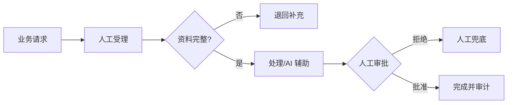
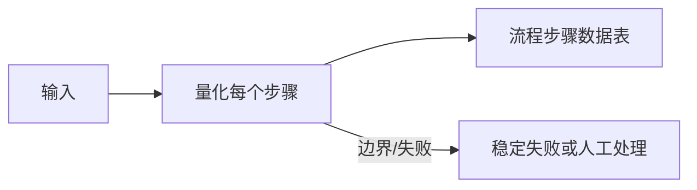

<!-- 本文件由 scripts/generate_course_tutorials.py 生成，请修改阶段计划或生成器后重新生成。 -->

# 第 26 周教程：AS-IS 分析

> 计划来源：[08-business-scenario-process.md](../stages/08-business-scenario-process.md)。阶段文档决定课程任务和验收，本文件解释逐节学习方法；学习状态仍只记录在[第 26 周成果](../../deliverables/week-26/README.md)。

## 本周先理解

### 为什么学

先看清现状的等待、交接、异常、规则和约束，才能优化根因而非自动化低效流程。

### 这是什么

AS-IS 是经流程参与者核对的现状模型，覆盖主流程、异常流程、步骤数据、决策规则和组织合规约束。

### 本周语言定位

本周以业务证据和设计为主，语言中立；技术 Spike 只复用既有 Java/Python/TypeScript 栈，不引入新语言。完整职责、切换桥接和替代规则见[开发语言路线](../01-language-roadmap.md)。

### 本周学习策略

- 每天只完成下面一节，控制在约 1 小时，不提前堆叠下一节的新概念。
- 先预测再实验；先保存原始证据，再写结论；失败样例与正常结果同等重要。
- 首次遇到术语时补齐：一句话定义、输入输出、开发类比、类比边界、反例和“不是什么”。
- 使用 H1→H4 提示阶梯；若使用完整参考答案，必须额外完成一个不同输入或约束的变体。

## 逐节教程

### 周一 · 第 1 节：绘制 AS-IS 主流程

**为什么学**

本周要先看清现状的等待、交接、异常、规则和约束，才能优化根因而非自动化低效流程。本节把“绘制 AS-IS 主流程”推进为可检查成果；如果跳过，后续会缺少“主流程图通过角色核对”这项关键证据。

**这个是什么**

本周核心概念是：AS-IS 是经流程参与者核对的现状模型，覆盖主流程、异常流程、步骤数据、决策规则和组织合规约束。今天的“绘制 AS-IS 主流程”是这个核心能力的最小学习单元：你会通过“使用泳道表示角色和系统，标出输入、输出、等待和交接；不要只画 happy path”观察输入如何转化为“主流程图通过角色核对”。它既包含可观察结果，也包含至少一个失败或不适用边界。重点边界来自课程原计划：不要只画 happy path。

**怎么学（约 60 分钟）**

1. `0–5 分钟`：不查资料，写下你对本节主题的一句话解释、预期输入输出和一个疑问。
2. `5–15 分钟`：只阅读下方资料中与当前任务直接相关的部分，记录一个关键约束和版本信息。
3. `15–45 分钟`：执行专项任务：使用泳道表示角色和系统，标出输入、输出、等待和交接；不要只画 happy path
4. `45–55 分钟`：主动制造一个错误输入、边界条件、依赖失败或反例，保存现象并解释原因。
5. `55–60 分钟`：整理命令、输入、输出、Diff、图表或访谈证据，并用自己的语言完成 Teach-back。

专项资料：[OMG BPMN 2.0.2](https://www.omg.org/spec/BPMN/2.0.2/)

**怎么验证学会了**

- 必交证据：主流程图通过角色核对。
- Teach-back：不看资料解释“绘制 AS-IS 主流程”解决什么问题、主要输入输出、一个边界，以及它不是什么。
- 失败证据：展示一个非正常场景，指出失败发生在哪一层，不能只贴错误截图。
- 变体任务：改变一个输入、参数、角色、权限或失败条件，在不照抄原步骤的情况下重新完成。
- 通过标准：以上四项均有证据，且能解释关键取舍；只能照步骤运行时最高算 L1，不能判定本节通过。

**参考答案（独立尝试至少 20 分钟后再看）**

> 这是一份合格答案骨架，不是唯一实现。看完后必须关闭参考答案，换一个输入或约束独立重做。

#### 步骤 1 参考：先写预测

- 一句话解释：AS-IS 是经流程参与者核对的现状模型，覆盖主流程、异常流程、步骤数据、决策规则和组织合规约束。
- 预测：完成“绘制 AS-IS 主流程”后，应能观察到“主流程图通过角色核对”；失败输入不应产生假成功。

#### 步骤 2 参考：阅读资料

- 链接：[OMG BPMN 2.0.2](https://www.omg.org/spec/BPMN/2.0.2/)
- 指定章节/条目：BPMN 2.0 → Flow Objects、Connecting Objects、Pools and Lanes、Events
- 阅读方法：只摘录一个定义、一个输入输出约束和一个失败边界；记录页面日期、协议版本或依赖版本。

#### 步骤 3 参考：按专项动作完成产出

- 专项动作：使用泳道表示角色和系统，标出输入、输出、等待和交接；不要只画 happy path
- 参考图（按实际角色、字段和状态修改）：



#### 步骤 4 参考：制造失败并解释

- 失败注入：当样本、Owner 或数据来源不足时，把结论标为假设并给出验证计划；不能把模拟结果写成真实业务收益。
- 参考判断：失败必须映射为明确状态、错误、拒答、人工路径或未验证假设；日志和界面不得显示成功。

#### 步骤 5 参考：整理交付与 Teach-back

- 当天交付：主流程图通过角色核对。
- 完整字段：范围与参与者；输入；主路径；异常/拒绝路径；输出；信任或责任边界；版本与图例。
- Teach-back 参考：本节输入是什么、经过了什么处理、输出如何验证、哪种失败最危险、为什么当前方案没有越过课程边界。
- 完成后变体：更换一个输入、参数、角色、权限或失败条件，不看上述样例重新完成。


### 周二 · 第 2 节：补异常和人工兜底

**为什么学**

本周要先看清现状的等待、交接、异常、规则和约束，才能优化根因而非自动化低效流程。本节把“补异常和人工兜底”推进为可检查成果；如果跳过，后续会缺少“至少五个异常分支”这项关键证据。

**这个是什么**

本周核心概念是：AS-IS 是经流程参与者核对的现状模型，覆盖主流程、异常流程、步骤数据、决策规则和组织合规约束。今天的“补异常和人工兜底”是这个核心能力的最小学习单元：你会通过“从历史问题或访谈中提取退回、缺数、超时、重复和紧急处理”观察输入如何转化为“至少五个异常分支”。它既包含可观察结果，也包含至少一个失败或不适用边界。只读完资料或只跑通正常路径，都不能证明已经掌握。

**怎么学（约 60 分钟）**

1. `0–5 分钟`：不查资料，写下你对本节主题的一句话解释、预期输入输出和一个疑问。
2. `5–15 分钟`：只阅读下方资料中与当前任务直接相关的部分，记录一个关键约束和版本信息。
3. `15–45 分钟`：执行专项任务：从历史问题或访谈中提取退回、缺数、超时、重复和紧急处理
4. `45–55 分钟`：主动制造一个错误输入、边界条件、依赖失败或反例，保存现象并解释原因。
5. `55–60 分钟`：整理命令、输入、输出、Diff、图表或访谈证据，并用自己的语言完成 Teach-back。

专项资料：[OMG BPMN 2.0.2](https://www.omg.org/spec/BPMN/2.0.2/)

**怎么验证学会了**

- 必交证据：至少五个异常分支。
- Teach-back：不看资料解释“补异常和人工兜底”解决什么问题、主要输入输出、一个边界，以及它不是什么。
- 失败证据：展示一个非正常场景，指出失败发生在哪一层，不能只贴错误截图。
- 变体任务：改变一个输入、参数、角色、权限或失败条件，在不照抄原步骤的情况下重新完成。
- 通过标准：以上四项均有证据，且能解释关键取舍；只能照步骤运行时最高算 L1，不能判定本节通过。

**参考答案（独立尝试至少 20 分钟后再看）**

> 这是一份合格答案骨架，不是唯一实现。看完后必须关闭参考答案，换一个输入或约束独立重做。

#### 步骤 1 参考：先写预测

- 一句话解释：AS-IS 是经流程参与者核对的现状模型，覆盖主流程、异常流程、步骤数据、决策规则和组织合规约束。
- 预测：完成“补异常和人工兜底”后，应能观察到“至少五个异常分支”；失败输入不应产生假成功。

#### 步骤 2 参考：阅读资料

- 链接：[OMG BPMN 2.0.2](https://www.omg.org/spec/BPMN/2.0.2/)
- 指定章节/条目：该链接指向的“OMG BPMN 2.0.2”整篇专题/章节；重点阅读与“补异常和人工兜底”直接对应的段落，页面更新时使用课程标题中的英文术语或 API 名页内搜索
- 阅读方法：只摘录一个定义、一个输入输出约束和一个失败边界；记录页面日期、协议版本或依赖版本。

#### 步骤 3 参考：按专项动作完成产出

- 专项动作：从历史问题或访谈中提取退回、缺数、超时、重复和紧急处理
- 样例代码（先核对课程链接中的当前 API，再按本仓库边界修改）：

```python
def run_case(input_data: dict) -> dict:
    if not input_data:
        return {"status": "FAILED", "error": "EMPTY_INPUT"}
    # Replace this line with the lesson-specific call.
    result = {"observed": input_data, "status": "SUCCEEDED"}
    return result

print(run_case({"case": "normal"}))
print(run_case({}))  # failure case
```

#### 步骤 4 参考：制造失败并解释

- 失败注入：当样本、Owner 或数据来源不足时，把结论标为假设并给出验证计划；不能把模拟结果写成真实业务收益。
- 参考判断：失败必须映射为明确状态、错误、拒答、人工路径或未验证假设；日志和界面不得显示成功。

#### 步骤 5 参考：整理交付与 Teach-back

- 当天交付：至少五个异常分支。
- 完整字段：一句话定义；输入；操作；可观察输出；失败/反例；工程意义；证据位置。
- Teach-back 参考：本节输入是什么、经过了什么处理、输出如何验证、哪种失败最危险、为什么当前方案没有越过课程边界。
- 完成后变体：更换一个输入、参数、角色、权限或失败条件，不看上述样例重新完成。


### 周三 · 第 3 节：量化每个步骤

**为什么学**

本周要先看清现状的等待、交接、异常、规则和约束，才能优化根因而非自动化低效流程。本节把“量化每个步骤”推进为可检查成果；如果跳过，后续会缺少“流程步骤数据表”这项关键证据。

**这个是什么**

本周核心概念是：AS-IS 是经流程参与者核对的现状模型，覆盖主流程、异常流程、步骤数据、决策规则和组织合规约束。今天的“量化每个步骤”是这个核心能力的最小学习单元：你会通过“区分处理时间与等待时间，记录频次和样本量；无法测量的标记估算”观察输入如何转化为“流程步骤数据表”。它既包含可观察结果，也包含至少一个失败或不适用边界。只读完资料或只跑通正常路径，都不能证明已经掌握。

**怎么学（约 60 分钟）**

1. `0–5 分钟`：不查资料，写下你对本节主题的一句话解释、预期输入输出和一个疑问。
2. `5–15 分钟`：只阅读下方资料中与当前任务直接相关的部分，记录一个关键约束和版本信息。
3. `15–45 分钟`：执行专项任务：区分处理时间与等待时间，记录频次和样本量；无法测量的标记估算
4. `45–55 分钟`：主动制造一个错误输入、边界条件、依赖失败或反例，保存现象并解释原因。
5. `55–60 分钟`：整理命令、输入、输出、Diff、图表或访谈证据，并用自己的语言完成 Teach-back。

专项资料：[GOV.UK Measuring Success](https://www.gov.uk/service-manual/measuring-success)

**怎么验证学会了**

- 必交证据：流程步骤数据表。
- Teach-back：不看资料解释“量化每个步骤”解决什么问题、主要输入输出、一个边界，以及它不是什么。
- 失败证据：展示一个非正常场景，指出失败发生在哪一层，不能只贴错误截图。
- 变体任务：改变一个输入、参数、角色、权限或失败条件，在不照抄原步骤的情况下重新完成。
- 通过标准：以上四项均有证据，且能解释关键取舍；只能照步骤运行时最高算 L1，不能判定本节通过。

**参考答案（独立尝试至少 20 分钟后再看）**

> 这是一份合格答案骨架，不是唯一实现。看完后必须关闭参考答案，换一个输入或约束独立重做。

#### 步骤 1 参考：先写预测

- 一句话解释：AS-IS 是经流程参与者核对的现状模型，覆盖主流程、异常流程、步骤数据、决策规则和组织合规约束。
- 预测：完成“量化每个步骤”后，应能观察到“流程步骤数据表”；失败输入不应产生假成功。

#### 步骤 2 参考：阅读资料

- 链接：[GOV.UK Measuring Success](https://www.gov.uk/service-manual/measuring-success)
- 指定章节/条目：该链接指向的“GOV.UK Measuring Success”整篇专题/章节；重点阅读与“量化每个步骤”直接对应的段落，页面更新时使用课程标题中的英文术语或 API 名页内搜索
- 阅读方法：只摘录一个定义、一个输入输出约束和一个失败边界；记录页面日期、协议版本或依赖版本。

#### 步骤 3 参考：按专项动作完成产出

- 专项动作：区分处理时间与等待时间，记录频次和样本量；无法测量的标记估算
- 参考图（按实际角色、字段和状态修改）：



#### 步骤 4 参考：制造失败并解释

- 失败注入：删掉一个必填输入或让依赖失败，系统应返回可解释的失败结果且不产生假成功；再根据日志、Diff 或流程证据定位原因。
- 参考判断：失败必须映射为明确状态、错误、拒答、人工路径或未验证假设；日志和界面不得显示成功。

#### 步骤 5 参考：整理交付与 Teach-back

- 当天交付：流程步骤数据表。
- 完整字段：范围与参与者；输入；主路径；异常/拒绝路径；输出；信任或责任边界；版本与图例。
- Teach-back 参考：本节输入是什么、经过了什么处理、输出如何验证、哪种失败最危险、为什么当前方案没有越过课程边界。
- 完成后变体：更换一个输入、参数、角色、权限或失败条件，不看上述样例重新完成。


### 周四 · 第 4 节：根因分析

**为什么学**

本周要先看清现状的等待、交接、异常、规则和约束，才能优化根因而非自动化低效流程。本节把“根因分析”推进为可检查成果；如果跳过，后续会缺少“两个痛点根因链”这项关键证据。

**这个是什么**

本周核心概念是：AS-IS 是经流程参与者核对的现状模型，覆盖主流程、异常流程、步骤数据、决策规则和组织合规约束。今天的“根因分析”是这个核心能力的最小学习单元：你会通过“对高耗时/高错误点做 5 Why 或因果分析；不要把“人员能力不足”当默认根因”观察输入如何转化为“两个痛点根因链”。它既包含可观察结果，也包含至少一个失败或不适用边界。重点边界来自课程原计划：不要把“人员能力不足”当默认根因。

**怎么学（约 60 分钟）**

1. `0–5 分钟`：不查资料，写下你对本节主题的一句话解释、预期输入输出和一个疑问。
2. `5–15 分钟`：只阅读下方资料中与当前任务直接相关的部分，记录一个关键约束和版本信息。
3. `15–45 分钟`：执行专项任务：对高耗时/高错误点做 5 Why 或因果分析；不要把“人员能力不足”当默认根因
4. `45–55 分钟`：主动制造一个错误输入、边界条件、依赖失败或反例，保存现象并解释原因。
5. `55–60 分钟`：整理命令、输入、输出、Diff、图表或访谈证据，并用自己的语言完成 Teach-back。

专项资料：[ASQ Five Whys](https://asq.org/quality-resources/five-whys)

**怎么验证学会了**

- 必交证据：两个痛点根因链。
- Teach-back：不看资料解释“根因分析”解决什么问题、主要输入输出、一个边界，以及它不是什么。
- 失败证据：展示一个非正常场景，指出失败发生在哪一层，不能只贴错误截图。
- 变体任务：改变一个输入、参数、角色、权限或失败条件，在不照抄原步骤的情况下重新完成。
- 通过标准：以上四项均有证据，且能解释关键取舍；只能照步骤运行时最高算 L1，不能判定本节通过。

**参考答案（独立尝试至少 20 分钟后再看）**

> 这是一份合格答案骨架，不是唯一实现。看完后必须关闭参考答案，换一个输入或约束独立重做。

#### 步骤 1 参考：先写预测

- 一句话解释：AS-IS 是经流程参与者核对的现状模型，覆盖主流程、异常流程、步骤数据、决策规则和组织合规约束。
- 预测：完成“根因分析”后，应能观察到“两个痛点根因链”；失败输入不应产生假成功。

#### 步骤 2 参考：阅读资料

- 链接：[ASQ Five Whys](https://asq.org/quality-resources/five-whys)
- 指定章节/条目：Five Whys → What is Five Whys、When to use、How to use
- 阅读方法：只摘录一个定义、一个输入输出约束和一个失败边界；记录页面日期、协议版本或依赖版本。

#### 步骤 3 参考：按专项动作完成产出

- 专项动作：对高耗时/高错误点做 5 Why 或因果分析；不要把“人员能力不足”当默认根因
- 参考资料/文档产出：

- 主题：根因分析
- 建议字段：一句话定义；输入；操作；可观察输出；失败/反例；工程意义；证据位置
- 示例结论：已按统一口径产出“两个痛点根因链”；证据不足的部分标记为假设或未验证。

#### 步骤 4 参考：制造失败并解释

- 失败注入：删掉一个必填输入或让依赖失败，系统应返回可解释的失败结果且不产生假成功；再根据日志、Diff 或流程证据定位原因。
- 参考判断：失败必须映射为明确状态、错误、拒答、人工路径或未验证假设；日志和界面不得显示成功。

#### 步骤 5 参考：整理交付与 Teach-back

- 当天交付：两个痛点根因链。
- 完整字段：一句话定义；输入；操作；可观察输出；失败/反例；工程意义；证据位置。
- Teach-back 参考：本节输入是什么、经过了什么处理、输出如何验证、哪种失败最危险、为什么当前方案没有越过课程边界。
- 完成后变体：更换一个输入、参数、角色、权限或失败条件，不看上述样例重新完成。


### 周五 · 第 5 节：决策与规则盘点

**为什么学**

本周要先看清现状的等待、交接、异常、规则和约束，才能优化根因而非自动化低效流程。本节把“决策与规则盘点”推进为可检查成果；如果跳过，后续会缺少“决策表与规则归属”这项关键证据。

**这个是什么**

本周核心概念是：AS-IS 是经流程参与者核对的现状模型，覆盖主流程、异常流程、步骤数据、决策规则和组织合规约束。今天的“决策与规则盘点”是这个核心能力的最小学习单元：你会通过“将确定性规则、经验判断、知识检索、生成和外部动作分类”观察输入如何转化为“决策表与规则归属”。它既包含可观察结果，也包含至少一个失败或不适用边界。只读完资料或只跑通正常路径，都不能证明已经掌握。

**怎么学（约 60 分钟）**

1. `0–5 分钟`：不查资料，写下你对本节主题的一句话解释、预期输入输出和一个疑问。
2. `5–15 分钟`：只阅读下方资料中与当前任务直接相关的部分，记录一个关键约束和版本信息。
3. `15–45 分钟`：执行专项任务：将确定性规则、经验判断、知识检索、生成和外部动作分类
4. `45–55 分钟`：主动制造一个错误输入、边界条件、依赖失败或反例，保存现象并解释原因。
5. `55–60 分钟`：整理命令、输入、输出、Diff、图表或访谈证据，并用自己的语言完成 Teach-back。

专项资料：[OMG Decision Model and Notation](https://www.omg.org/spec/DMN/)

**怎么验证学会了**

- 必交证据：决策表与规则归属。
- Teach-back：不看资料解释“决策与规则盘点”解决什么问题、主要输入输出、一个边界，以及它不是什么。
- 失败证据：展示一个非正常场景，指出失败发生在哪一层，不能只贴错误截图。
- 变体任务：改变一个输入、参数、角色、权限或失败条件，在不照抄原步骤的情况下重新完成。
- 通过标准：以上四项均有证据，且能解释关键取舍；只能照步骤运行时最高算 L1，不能判定本节通过。

**参考答案（独立尝试至少 20 分钟后再看）**

> 这是一份合格答案骨架，不是唯一实现。看完后必须关闭参考答案，换一个输入或约束独立重做。

#### 步骤 1 参考：先写预测

- 一句话解释：AS-IS 是经流程参与者核对的现状模型，覆盖主流程、异常流程、步骤数据、决策规则和组织合规约束。
- 预测：完成“决策与规则盘点”后，应能观察到“决策表与规则归属”；失败输入不应产生假成功。

#### 步骤 2 参考：阅读资料

- 链接：[OMG Decision Model and Notation](https://www.omg.org/spec/DMN/)
- 指定章节/条目：该链接指向的“OMG Decision Model and Notation”整篇专题/章节；重点阅读与“决策与规则盘点”直接对应的段落，页面更新时使用课程标题中的英文术语或 API 名页内搜索
- 阅读方法：只摘录一个定义、一个输入输出约束和一个失败边界；记录页面日期、协议版本或依赖版本。

#### 步骤 3 参考：按专项动作完成产出

- 专项动作：将确定性规则、经验判断、知识检索、生成和外部动作分类
- 参考资料/文档产出：

- 主题：决策与规则盘点
- 建议字段：对象；Owner/角色；输入或来源；规则/约束；风险；证据；状态；下一步
- 示例结论：已按统一口径产出“决策表与规则归属”；证据不足的部分标记为假设或未验证。

#### 步骤 4 参考：制造失败并解释

- 失败注入：删掉一个必填输入或让依赖失败，系统应返回可解释的失败结果且不产生假成功；再根据日志、Diff 或流程证据定位原因。
- 参考判断：失败必须映射为明确状态、错误、拒答、人工路径或未验证假设；日志和界面不得显示成功。

#### 步骤 5 参考：整理交付与 Teach-back

- 当天交付：决策表与规则归属。
- 完整字段：对象；Owner/角色；输入或来源；规则/约束；风险；证据；状态；下一步。
- Teach-back 参考：本节输入是什么、经过了什么处理、输出如何验证、哪种失败最危险、为什么当前方案没有越过课程边界。
- 完成后变体：更换一个输入、参数、角色、权限或失败条件，不看上述样例重新完成。


### 周六 · 第 6 节：合规、权限和组织约束

**为什么学**

本周要先看清现状的等待、交接、异常、规则和约束，才能优化根因而非自动化低效流程。本节把“合规、权限和组织约束”推进为可检查成果；如果跳过，后续会缺少“约束矩阵”这项关键证据。

**这个是什么**

本周核心概念是：AS-IS 是经流程参与者核对的现状模型，覆盖主流程、异常流程、步骤数据、决策规则和组织合规约束。今天的“合规、权限和组织约束”是这个核心能力的最小学习单元：你会通过“识别 PII、审批、审计、职责分离、数据驻留和变更窗口”观察输入如何转化为“约束矩阵”。它既包含可观察结果，也包含至少一个失败或不适用边界。只读完资料或只跑通正常路径，都不能证明已经掌握。

**怎么学（约 60 分钟）**

1. `0–5 分钟`：不查资料，写下你对本节主题的一句话解释、预期输入输出和一个疑问。
2. `5–15 分钟`：只阅读下方资料中与当前任务直接相关的部分，记录一个关键约束和版本信息。
3. `15–45 分钟`：执行专项任务：识别 PII、审批、审计、职责分离、数据驻留和变更窗口
4. `45–55 分钟`：主动制造一个错误输入、边界条件、依赖失败或反例，保存现象并解释原因。
5. `55–60 分钟`：整理命令、输入、输出、Diff、图表或访谈证据，并用自己的语言完成 Teach-back。

专项资料：[NIST Privacy Framework](https://www.nist.gov/privacy-framework)

**怎么验证学会了**

- 必交证据：约束矩阵。
- Teach-back：不看资料解释“合规、权限和组织约束”解决什么问题、主要输入输出、一个边界，以及它不是什么。
- 失败证据：展示一个非正常场景，指出失败发生在哪一层，不能只贴错误截图。
- 变体任务：改变一个输入、参数、角色、权限或失败条件，在不照抄原步骤的情况下重新完成。
- 通过标准：以上四项均有证据，且能解释关键取舍；只能照步骤运行时最高算 L1，不能判定本节通过。

**参考答案（独立尝试至少 20 分钟后再看）**

> 这是一份合格答案骨架，不是唯一实现。看完后必须关闭参考答案，换一个输入或约束独立重做。

#### 步骤 1 参考：先写预测

- 一句话解释：AS-IS 是经流程参与者核对的现状模型，覆盖主流程、异常流程、步骤数据、决策规则和组织合规约束。
- 预测：完成“合规、权限和组织约束”后，应能观察到“约束矩阵”；失败输入不应产生假成功。

#### 步骤 2 参考：阅读资料

- 链接：[NIST Privacy Framework](https://www.nist.gov/privacy-framework)
- 指定章节/条目：该链接指向的“NIST Privacy Framework”整篇专题/章节；重点阅读与“合规、权限和组织约束”直接对应的段落，页面更新时使用课程标题中的英文术语或 API 名页内搜索
- 阅读方法：只摘录一个定义、一个输入输出约束和一个失败边界；记录页面日期、协议版本或依赖版本。

#### 步骤 3 参考：按专项动作完成产出

- 专项动作：识别 PII、审批、审计、职责分离、数据驻留和变更窗口
- 参考资料/文档产出：

- 主题：合规、权限和组织约束
- 建议字段：对象；Owner/角色；输入或来源；规则/约束；风险；证据；状态；下一步
- 示例结论：已按统一口径产出“约束矩阵”；证据不足的部分标记为假设或未验证。

#### 步骤 4 参考：制造失败并解释

- 失败注入：删除身份、Scope 或审批后再次执行，正确结果应是执行路径明确拒绝且留下脱敏审计；如果仍成功，就是权限边界失效。
- 参考判断：失败必须映射为明确状态、错误、拒答、人工路径或未验证假设；日志和界面不得显示成功。

#### 步骤 5 参考：整理交付与 Teach-back

- 当天交付：约束矩阵。
- 完整字段：对象；Owner/角色；输入或来源；规则/约束；风险；证据；状态；下一步。
- Teach-back 参考：本节输入是什么、经过了什么处理、输出如何验证、哪种失败最危险、为什么当前方案没有越过课程边界。
- 完成后变体：更换一个输入、参数、角色、权限或失败条件，不看上述样例重新完成。


### 周日 · 第 7 节：AS-IS 评审与机会排序

**为什么学**

本周要先看清现状的等待、交接、异常、规则和约束，才能优化根因而非自动化低效流程。本节把“AS-IS 评审与机会排序”推进为可检查成果；如果跳过，后续会缺少“完成本周提交”这项关键证据。

**这个是什么**

本周核心概念是：AS-IS 是经流程参与者核对的现状模型，覆盖主流程、异常流程、步骤数据、决策规则和组织合规约束。今天的“AS-IS 评审与机会排序”是这个核心能力的最小学习单元：你会通过“让流程参与者校正；只选最值得优化的 1–2 个环节进入方案”观察输入如何转化为“完成本周提交”。它既包含可观察结果，也包含至少一个失败或不适用边界。只读完资料或只跑通正常路径，都不能证明已经掌握。

**怎么学（约 60 分钟）**

1. `0–5 分钟`：不查资料，写下你对本节主题的一句话解释、预期输入输出和一个疑问。
2. `5–15 分钟`：只阅读下方资料中与当前任务直接相关的部分，记录一个关键约束和版本信息。
3. `15–45 分钟`：执行专项任务：让流程参与者校正；只选最值得优化的 1–2 个环节进入方案
4. `45–55 分钟`：主动制造一个错误输入、边界条件、依赖失败或反例，保存现象并解释原因。
5. `55–60 分钟`：整理命令、输入、输出、Diff、图表或访谈证据，并用自己的语言完成 Teach-back。

专项资料：[GOV.UK 用户全流程映射](https://www.gov.uk/service-manual/design/map-a-users-whole-problem)

**怎么验证学会了**

- 必交证据：完成本周提交。
- Teach-back：不看资料解释“AS-IS 评审与机会排序”解决什么问题、主要输入输出、一个边界，以及它不是什么。
- 失败证据：展示一个非正常场景，指出失败发生在哪一层，不能只贴错误截图。
- 变体任务：改变一个输入、参数、角色、权限或失败条件，在不照抄原步骤的情况下重新完成。
- 通过标准：以上四项均有证据，且能解释关键取舍；只能照步骤运行时最高算 L1，不能判定本节通过。

**参考答案（独立尝试至少 20 分钟后再看）**

> 这是一份合格答案骨架，不是唯一实现。看完后必须关闭参考答案，换一个输入或约束独立重做。

#### 步骤 1 参考：先写预测

- 一句话解释：AS-IS 是经流程参与者核对的现状模型，覆盖主流程、异常流程、步骤数据、决策规则和组织合规约束。
- 预测：完成“AS-IS 评审与机会排序”后，应能观察到“完成本周提交”；失败输入不应产生假成功。

#### 步骤 2 参考：阅读资料

- 链接：[GOV.UK 用户全流程映射](https://www.gov.uk/service-manual/design/map-a-users-whole-problem)
- 指定章节/条目：BPMN 2.0 → Flow Objects、Connecting Objects、Pools and Lanes、Events
- 阅读方法：只摘录一个定义、一个输入输出约束和一个失败边界；记录页面日期、协议版本或依赖版本。

#### 步骤 3 参考：按专项动作完成产出

- 专项动作：让流程参与者校正；只选最值得优化的 1–2 个环节进入方案
- 参考资料/文档产出：

- 主题：AS-IS 评审与机会排序
- 建议字段：指标名称；计算公式；数据来源；样本与时间窗；当前值；目标/阈值；限制与未验证项
- 示例结论：已按统一口径产出“完成本周提交”；证据不足的部分标记为假设或未验证。

#### 步骤 4 参考：制造失败并解释

- 失败注入：当样本、Owner 或数据来源不足时，把结论标为假设并给出验证计划；不能把模拟结果写成真实业务收益。
- 参考判断：失败必须映射为明确状态、错误、拒答、人工路径或未验证假设；日志和界面不得显示成功。

#### 步骤 5 参考：整理交付与 Teach-back

- 当天交付：完成本周提交。
- 完整字段：指标名称；计算公式；数据来源；样本与时间窗；当前值；目标/阈值；限制与未验证项。
- Teach-back 参考：本节输入是什么、经过了什么处理、输出如何验证、哪种失败最危险、为什么当前方案没有越过课程边界。
- 完成后变体：更换一个输入、参数、角色、权限或失败条件，不看上述样例重新完成。


## 本周收尾

按[成果与提交标准](../06-deliverable-standards.md)整理本周成果，再由讲师按[监督与掌握度规范](../07-instructor-supervision.md)给出“通过、部分通过、未通过”。教程完成不代表学习者已经掌握，必须以独立运行、排错、Teach-back 和变体证据为准。
