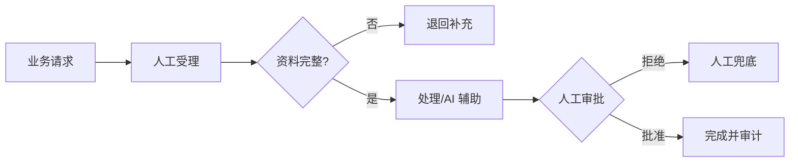

<!-- 本文件由 scripts/generate_course_tutorials.py 生成，请修改阶段计划或生成器后重新生成。 -->

# 第 27 周教程：TO-BE 与人机边界

> 计划来源：[08-business-scenario-process.md](../stages/08-business-scenario-process.md)。阶段文档决定课程任务和验收，本文件解释逐节学习方法；学习状态仍只记录在[第 27 周成果](../../deliverables/week-27/README.md)。

## 本周先理解

### 为什么学

依据任务适用性和风险重设计流程，明确 AI、代码和人工各自承担什么。

### 这是什么

TO-BE 是目标人机协作流程，包含正常路径、降级路径、责任主体、指标阈值和 ROI/TCO 假设。

### 本周语言定位

本周以业务证据和设计为主，语言中立；技术 Spike 只复用既有 Java/Python/TypeScript 栈，不引入新语言。完整职责、切换桥接和替代规则见[开发语言路线](../01-language-roadmap.md)。

### 本周学习策略

- 每天只完成下面一节，控制在约 1 小时，不提前堆叠下一节的新概念。
- 先预测再实验；先保存原始证据，再写结论；失败样例与正常结果同等重要。
- 首次遇到术语时补齐：一句话定义、输入输出、开发类比、类比边界、反例和“不是什么”。
- 使用 H1→H4 提示阶梯；若使用完整参考答案，必须额外完成一个不同输入或约束的变体。

## 逐节教程

### 周一 · 第 1 节：任务适用性分解

**为什么学**

本周要依据任务适用性和风险重设计流程，明确 AI、代码和人工各自承担什么。本节把“任务适用性分解”推进为可检查成果；如果跳过，后续会缺少“任务—实现方式矩阵”这项关键证据。

**这个是什么**

本周核心概念是：TO-BE 是目标人机协作流程，包含正常路径、降级路径、责任主体、指标阈值和 ROI/TCO 假设。今天的“任务适用性分解”是这个核心能力的最小学习单元：你会通过“按检索、分类、抽取、生成、规划、执行判断 AI 价值；确定性强的规则优先代码化”观察输入如何转化为“任务—实现方式矩阵”。它既包含可观察结果，也包含至少一个失败或不适用边界。只读完资料或只跑通正常路径，都不能证明已经掌握。

**怎么学（约 60 分钟）**

1. `0–5 分钟`：不查资料，写下你对本节主题的一句话解释、预期输入输出和一个疑问。
2. `5–15 分钟`：只阅读下方资料中与当前任务直接相关的部分，记录一个关键约束和版本信息。
3. `15–45 分钟`：执行专项任务：按检索、分类、抽取、生成、规划、执行判断 AI 价值；确定性强的规则优先代码化
4. `45–55 分钟`：主动制造一个错误输入、边界条件、依赖失败或反例，保存现象并解释原因。
5. `55–60 分钟`：整理命令、输入、输出、Diff、图表或访谈证据，并用自己的语言完成 Teach-back。

专项资料：[NIST 生成式 AI 风险框架](https://nvlpubs.nist.gov/nistpubs/ai/NIST.AI.600-1.pdf)

**怎么验证学会了**

- 必交证据：任务—实现方式矩阵。
- Teach-back：不看资料解释“任务适用性分解”解决什么问题、主要输入输出、一个边界，以及它不是什么。
- 失败证据：展示一个非正常场景，指出失败发生在哪一层，不能只贴错误截图。
- 变体任务：改变一个输入、参数、角色、权限或失败条件，在不照抄原步骤的情况下重新完成。
- 通过标准：以上四项均有证据，且能解释关键取舍；只能照步骤运行时最高算 L1，不能判定本节通过。

**参考答案（独立尝试至少 20 分钟后再看）**

> 这是一份合格答案骨架，不是唯一实现。看完后必须关闭参考答案，换一个输入或约束独立重做。

#### 步骤 1 参考：先写预测

- 一句话解释：TO-BE 是目标人机协作流程，包含正常路径、降级路径、责任主体、指标阈值和 ROI/TCO 假设。
- 预测：完成“任务适用性分解”后，应能观察到“任务—实现方式矩阵”；失败输入不应产生假成功。

#### 步骤 2 参考：阅读资料

- 链接：[NIST 生成式 AI 风险框架](https://nvlpubs.nist.gov/nistpubs/ai/NIST.AI.600-1.pdf)
- 指定章节/条目：该链接指向的“NIST 生成式 AI 风险框架”整篇专题/章节；重点阅读与“任务适用性分解”直接对应的段落，页面更新时使用课程标题中的英文术语或 API 名页内搜索
- 阅读方法：只摘录一个定义、一个输入输出约束和一个失败边界；记录页面日期、协议版本或依赖版本。

#### 步骤 3 参考：按专项动作完成产出

- 专项动作：按检索、分类、抽取、生成、规划、执行判断 AI 价值；确定性强的规则优先代码化
- 样例代码（先核对课程链接中的当前 API，再按本仓库边界修改）：

```python
def run_case(input_data: dict) -> dict:
    if not input_data:
        return {"status": "FAILED", "error": "EMPTY_INPUT"}
    # Replace this line with the lesson-specific call.
    result = {"observed": input_data, "status": "SUCCEEDED"}
    return result

print(run_case({"case": "normal"}))
print(run_case({}))  # failure case
```

#### 步骤 4 参考：制造失败并解释

- 失败注入：删掉一个必填输入或让依赖失败，系统应返回可解释的失败结果且不产生假成功；再根据日志、Diff 或流程证据定位原因。
- 参考判断：失败必须映射为明确状态、错误、拒答、人工路径或未验证假设；日志和界面不得显示成功。

#### 步骤 5 参考：整理交付与 Teach-back

- 当天交付：任务—实现方式矩阵。
- 完整字段：对象；Owner/角色；输入或来源；规则/约束；风险；证据；状态；下一步。
- Teach-back 参考：本节输入是什么、经过了什么处理、输出如何验证、哪种失败最危险、为什么当前方案没有越过课程边界。
- 完成后变体：更换一个输入、参数、角色、权限或失败条件，不看上述样例重新完成。


### 周二 · 第 2 节：风险与置信度分层

**为什么学**

本周要依据任务适用性和风险重设计流程，明确 AI、代码和人工各自承担什么。本节把“风险与置信度分层”推进为可检查成果；如果跳过，后续会缺少“风险—控制策略矩阵”这项关键证据。

**这个是什么**

本周核心概念是：TO-BE 是目标人机协作流程，包含正常路径、降级路径、责任主体、指标阈值和 ROI/TCO 假设。今天的“风险与置信度分层”是这个核心能力的最小学习单元：你会通过“依据影响和可逆性定义自动执行、抽检、事前审批和人工处理，不迷信模型自报置信度”观察输入如何转化为“风险—控制策略矩阵”。它既包含可观察结果，也包含至少一个失败或不适用边界。只读完资料或只跑通正常路径，都不能证明已经掌握。

**怎么学（约 60 分钟）**

1. `0–5 分钟`：不查资料，写下你对本节主题的一句话解释、预期输入输出和一个疑问。
2. `5–15 分钟`：只阅读下方资料中与当前任务直接相关的部分，记录一个关键约束和版本信息。
3. `15–45 分钟`：执行专项任务：依据影响和可逆性定义自动执行、抽检、事前审批和人工处理，不迷信模型自报置信度
4. `45–55 分钟`：主动制造一个错误输入、边界条件、依赖失败或反例，保存现象并解释原因。
5. `55–60 分钟`：整理命令、输入、输出、Diff、图表或访谈证据，并用自己的语言完成 Teach-back。

专项资料：[NIST 生成式 AI 风险框架](https://nvlpubs.nist.gov/nistpubs/ai/NIST.AI.600-1.pdf)

**怎么验证学会了**

- 必交证据：风险—控制策略矩阵。
- Teach-back：不看资料解释“风险与置信度分层”解决什么问题、主要输入输出、一个边界，以及它不是什么。
- 失败证据：展示一个非正常场景，指出失败发生在哪一层，不能只贴错误截图。
- 变体任务：改变一个输入、参数、角色、权限或失败条件，在不照抄原步骤的情况下重新完成。
- 通过标准：以上四项均有证据，且能解释关键取舍；只能照步骤运行时最高算 L1，不能判定本节通过。

**参考答案（独立尝试至少 20 分钟后再看）**

> 这是一份合格答案骨架，不是唯一实现。看完后必须关闭参考答案，换一个输入或约束独立重做。

#### 步骤 1 参考：先写预测

- 一句话解释：TO-BE 是目标人机协作流程，包含正常路径、降级路径、责任主体、指标阈值和 ROI/TCO 假设。
- 预测：完成“风险与置信度分层”后，应能观察到“风险—控制策略矩阵”；失败输入不应产生假成功。

#### 步骤 2 参考：阅读资料

- 链接：[NIST 生成式 AI 风险框架](https://nvlpubs.nist.gov/nistpubs/ai/NIST.AI.600-1.pdf)
- 指定章节/条目：该链接指向的“NIST 生成式 AI 风险框架”整篇专题/章节；重点阅读与“风险与置信度分层”直接对应的段落，页面更新时使用课程标题中的英文术语或 API 名页内搜索
- 阅读方法：只摘录一个定义、一个输入输出约束和一个失败边界；记录页面日期、协议版本或依赖版本。

#### 步骤 3 参考：按专项动作完成产出

- 专项动作：依据影响和可逆性定义自动执行、抽检、事前审批和人工处理，不迷信模型自报置信度
- 参考资料/文档产出：

- 主题：风险与置信度分层
- 建议字段：对象；Owner/角色；输入或来源；规则/约束；风险；证据；状态；下一步
- 示例结论：已按统一口径产出“风险—控制策略矩阵”；证据不足的部分标记为假设或未验证。

#### 步骤 4 参考：制造失败并解释

- 失败注入：删除身份、Scope 或审批后再次执行，正确结果应是执行路径明确拒绝且留下脱敏审计；如果仍成功，就是权限边界失效。
- 参考判断：失败必须映射为明确状态、错误、拒答、人工路径或未验证假设；日志和界面不得显示成功。

#### 步骤 5 参考：整理交付与 Teach-back

- 当天交付：风险—控制策略矩阵。
- 完整字段：对象；Owner/角色；输入或来源；规则/约束；风险；证据；状态；下一步。
- Teach-back 参考：本节输入是什么、经过了什么处理、输出如何验证、哪种失败最危险、为什么当前方案没有越过课程边界。
- 完成后变体：更换一个输入、参数、角色、权限或失败条件，不看上述样例重新完成。


### 周三 · 第 3 节：设计 TO-BE 主流程

**为什么学**

本周要依据任务适用性和风险重设计流程，明确 AI、代码和人工各自承担什么。本节把“设计 TO-BE 主流程”推进为可检查成果；如果跳过，后续会缺少“TO-BE 泳道图”这项关键证据。

**这个是什么**

本周核心概念是：TO-BE 是目标人机协作流程，包含正常路径、降级路径、责任主体、指标阈值和 ROI/TCO 假设。今天的“设计 TO-BE 主流程”是这个核心能力的最小学习单元：你会通过“先优化流程再插入 Agent；删除无价值交接，保留必要审计和责任主体”观察输入如何转化为“TO-BE 泳道图”。它既包含可观察结果，也包含至少一个失败或不适用边界。只读完资料或只跑通正常路径，都不能证明已经掌握。

**怎么学（约 60 分钟）**

1. `0–5 分钟`：不查资料，写下你对本节主题的一句话解释、预期输入输出和一个疑问。
2. `5–15 分钟`：只阅读下方资料中与当前任务直接相关的部分，记录一个关键约束和版本信息。
3. `15–45 分钟`：执行专项任务：先优化流程再插入 Agent；删除无价值交接，保留必要审计和责任主体
4. `45–55 分钟`：主动制造一个错误输入、边界条件、依赖失败或反例，保存现象并解释原因。
5. `55–60 分钟`：整理命令、输入、输出、Diff、图表或访谈证据，并用自己的语言完成 Teach-back。

专项资料：[GOV.UK 用户全流程映射](https://www.gov.uk/service-manual/design/map-a-users-whole-problem)

**怎么验证学会了**

- 必交证据：TO-BE 泳道图。
- Teach-back：不看资料解释“设计 TO-BE 主流程”解决什么问题、主要输入输出、一个边界，以及它不是什么。
- 失败证据：展示一个非正常场景，指出失败发生在哪一层，不能只贴错误截图。
- 变体任务：改变一个输入、参数、角色、权限或失败条件，在不照抄原步骤的情况下重新完成。
- 通过标准：以上四项均有证据，且能解释关键取舍；只能照步骤运行时最高算 L1，不能判定本节通过。

**参考答案（独立尝试至少 20 分钟后再看）**

> 这是一份合格答案骨架，不是唯一实现。看完后必须关闭参考答案，换一个输入或约束独立重做。

#### 步骤 1 参考：先写预测

- 一句话解释：TO-BE 是目标人机协作流程，包含正常路径、降级路径、责任主体、指标阈值和 ROI/TCO 假设。
- 预测：完成“设计 TO-BE 主流程”后，应能观察到“TO-BE 泳道图”；失败输入不应产生假成功。

#### 步骤 2 参考：阅读资料

- 链接：[GOV.UK 用户全流程映射](https://www.gov.uk/service-manual/design/map-a-users-whole-problem)
- 指定章节/条目：BPMN 2.0 → Flow Objects、Connecting Objects、Pools and Lanes、Events
- 阅读方法：只摘录一个定义、一个输入输出约束和一个失败边界；记录页面日期、协议版本或依赖版本。

#### 步骤 3 参考：按专项动作完成产出

- 专项动作：先优化流程再插入 Agent；删除无价值交接，保留必要审计和责任主体
- 参考图（按实际角色、字段和状态修改）：



#### 步骤 4 参考：制造失败并解释

- 失败注入：当样本、Owner 或数据来源不足时，把结论标为假设并给出验证计划；不能把模拟结果写成真实业务收益。
- 参考判断：失败必须映射为明确状态、错误、拒答、人工路径或未验证假设；日志和界面不得显示成功。

#### 步骤 5 参考：整理交付与 Teach-back

- 当天交付：TO-BE 泳道图。
- 完整字段：范围与参与者；输入；主路径；异常/拒绝路径；输出；信任或责任边界；版本与图例。
- Teach-back 参考：本节输入是什么、经过了什么处理、输出如何验证、哪种失败最危险、为什么当前方案没有越过课程边界。
- 完成后变体：更换一个输入、参数、角色、权限或失败条件，不看上述样例重新完成。


### 周四 · 第 4 节：设计异常和降级流程

**为什么学**

本周要依据任务适用性和风险重设计流程，明确 AI、代码和人工各自承担什么。本节把“设计异常和降级流程”推进为可检查成果；如果跳过，后续会缺少“降级与兜底流程”这项关键证据。

**这个是什么**

本周核心概念是：TO-BE 是目标人机协作流程，包含正常路径、降级路径、责任主体、指标阈值和 ROI/TCO 假设。今天的“设计异常和降级流程”是这个核心能力的最小学习单元：你会通过“覆盖无答案、低质量、系统不可用、超时、权限不足和人工拒绝”观察输入如何转化为“降级与兜底流程”。它既包含可观察结果，也包含至少一个失败或不适用边界。只读完资料或只跑通正常路径，都不能证明已经掌握。

**怎么学（约 60 分钟）**

1. `0–5 分钟`：不查资料，写下你对本节主题的一句话解释、预期输入输出和一个疑问。
2. `5–15 分钟`：只阅读下方资料中与当前任务直接相关的部分，记录一个关键约束和版本信息。
3. `15–45 分钟`：执行专项任务：覆盖无答案、低质量、系统不可用、超时、权限不足和人工拒绝
4. `45–55 分钟`：主动制造一个错误输入、边界条件、依赖失败或反例，保存现象并解释原因。
5. `55–60 分钟`：整理命令、输入、输出、Diff、图表或访谈证据，并用自己的语言完成 Teach-back。

专项资料：[NIST 生成式 AI 风险框架](https://nvlpubs.nist.gov/nistpubs/ai/NIST.AI.600-1.pdf)

**怎么验证学会了**

- 必交证据：降级与兜底流程。
- Teach-back：不看资料解释“设计异常和降级流程”解决什么问题、主要输入输出、一个边界，以及它不是什么。
- 失败证据：展示一个非正常场景，指出失败发生在哪一层，不能只贴错误截图。
- 变体任务：改变一个输入、参数、角色、权限或失败条件，在不照抄原步骤的情况下重新完成。
- 通过标准：以上四项均有证据，且能解释关键取舍；只能照步骤运行时最高算 L1，不能判定本节通过。

**参考答案（独立尝试至少 20 分钟后再看）**

> 这是一份合格答案骨架，不是唯一实现。看完后必须关闭参考答案，换一个输入或约束独立重做。

#### 步骤 1 参考：先写预测

- 一句话解释：TO-BE 是目标人机协作流程，包含正常路径、降级路径、责任主体、指标阈值和 ROI/TCO 假设。
- 预测：完成“设计异常和降级流程”后，应能观察到“降级与兜底流程”；失败输入不应产生假成功。

#### 步骤 2 参考：阅读资料

- 链接：[NIST 生成式 AI 风险框架](https://nvlpubs.nist.gov/nistpubs/ai/NIST.AI.600-1.pdf)
- 指定章节/条目：BPMN 2.0 → Flow Objects、Connecting Objects、Pools and Lanes、Events
- 阅读方法：只摘录一个定义、一个输入输出约束和一个失败边界；记录页面日期、协议版本或依赖版本。

#### 步骤 3 参考：按专项动作完成产出

- 专项动作：覆盖无答案、低质量、系统不可用、超时、权限不足和人工拒绝
- 参考图（按实际角色、字段和状态修改）：


#### 步骤 4 参考：制造失败并解释

- 失败注入：删除身份、Scope 或审批后再次执行，正确结果应是执行路径明确拒绝且留下脱敏审计；如果仍成功，就是权限边界失效。
- 参考判断：失败必须映射为明确状态、错误、拒答、人工路径或未验证假设；日志和界面不得显示成功。

#### 步骤 5 参考：整理交付与 Teach-back

- 当天交付：降级与兜底流程。
- 完整字段：范围与参与者；输入；主路径；异常/拒绝路径；输出；信任或责任边界；版本与图例。
- Teach-back 参考：本节输入是什么、经过了什么处理、输出如何验证、哪种失败最危险、为什么当前方案没有越过课程边界。
- 完成后变体：更换一个输入、参数、角色、权限或失败条件，不看上述样例重新完成。


### 周五 · 第 5 节：定义业务和 AI 验收指标

**为什么学**

本周要依据任务适用性和风险重设计流程，明确 AI、代码和人工各自承担什么。本节把“定义业务和 AI 验收指标”推进为可检查成果；如果跳过，后续会缺少“指标树和验收门槛”这项关键证据。

**这个是什么**

本周核心概念是：TO-BE 是目标人机协作流程，包含正常路径、降级路径、责任主体、指标阈值和 ROI/TCO 假设。今天的“定义业务和 AI 验收指标”是这个核心能力的最小学习单元：你会通过“同时设置业务指标、模型/Agent 指标、安全指标和工程指标，写清口径与阈值”观察输入如何转化为“指标树和验收门槛”。它既包含可观察结果，也包含至少一个失败或不适用边界。只读完资料或只跑通正常路径，都不能证明已经掌握。

**怎么学（约 60 分钟）**

1. `0–5 分钟`：不查资料，写下你对本节主题的一句话解释、预期输入输出和一个疑问。
2. `5–15 分钟`：只阅读下方资料中与当前任务直接相关的部分，记录一个关键约束和版本信息。
3. `15–45 分钟`：执行专项任务：同时设置业务指标、模型/Agent 指标、安全指标和工程指标，写清口径与阈值
4. `45–55 分钟`：主动制造一个错误输入、边界条件、依赖失败或反例，保存现象并解释原因。
5. `55–60 分钟`：整理命令、输入、输出、Diff、图表或访谈证据，并用自己的语言完成 Teach-back。

专项资料：[GOV.UK Measuring Success](https://www.gov.uk/service-manual/measuring-success)

**怎么验证学会了**

- 必交证据：指标树和验收门槛。
- Teach-back：不看资料解释“定义业务和 AI 验收指标”解决什么问题、主要输入输出、一个边界，以及它不是什么。
- 失败证据：展示一个非正常场景，指出失败发生在哪一层，不能只贴错误截图。
- 变体任务：改变一个输入、参数、角色、权限或失败条件，在不照抄原步骤的情况下重新完成。
- 通过标准：以上四项均有证据，且能解释关键取舍；只能照步骤运行时最高算 L1，不能判定本节通过。

**参考答案（独立尝试至少 20 分钟后再看）**

> 这是一份合格答案骨架，不是唯一实现。看完后必须关闭参考答案，换一个输入或约束独立重做。

#### 步骤 1 参考：先写预测

- 一句话解释：TO-BE 是目标人机协作流程，包含正常路径、降级路径、责任主体、指标阈值和 ROI/TCO 假设。
- 预测：完成“定义业务和 AI 验收指标”后，应能观察到“指标树和验收门槛”；失败输入不应产生假成功。

#### 步骤 2 参考：阅读资料

- 链接：[GOV.UK Measuring Success](https://www.gov.uk/service-manual/measuring-success)
- 指定章节/条目：该链接指向的“GOV.UK Measuring Success”整篇专题/章节；重点阅读与“定义业务和 AI 验收指标”直接对应的段落，页面更新时使用课程标题中的英文术语或 API 名页内搜索
- 阅读方法：只摘录一个定义、一个输入输出约束和一个失败边界；记录页面日期、协议版本或依赖版本。

#### 步骤 3 参考：按专项动作完成产出

- 专项动作：同时设置业务指标、模型/Agent 指标、安全指标和工程指标，写清口径与阈值
- 参考资料/文档产出：

- 主题：定义业务和 AI 验收指标
- 建议字段：指标名称；计算公式；数据来源；样本与时间窗；当前值；目标/阈值；限制与未验证项
- 示例结论：已按统一口径产出“指标树和验收门槛”；证据不足的部分标记为假设或未验证。

#### 步骤 4 参考：制造失败并解释

- 失败注入：删除身份、Scope 或审批后再次执行，正确结果应是执行路径明确拒绝且留下脱敏审计；如果仍成功，就是权限边界失效。
- 参考判断：失败必须映射为明确状态、错误、拒答、人工路径或未验证假设；日志和界面不得显示成功。

#### 步骤 5 参考：整理交付与 Teach-back

- 当天交付：指标树和验收门槛。
- 完整字段：指标名称；计算公式；数据来源；样本与时间窗；当前值；目标/阈值；限制与未验证项。
- Teach-back 参考：本节输入是什么、经过了什么处理、输出如何验证、哪种失败最危险、为什么当前方案没有越过课程边界。
- 完成后变体：更换一个输入、参数、角色、权限或失败条件，不看上述样例重新完成。


### 周六 · 第 6 节：估算收益、成本与容量

**为什么学**

本周要依据任务适用性和风险重设计流程，明确 AI、代码和人工各自承担什么。本节把“估算收益、成本与容量”推进为可检查成果；如果跳过，后续会缺少“ROI/TCO 粗算表”这项关键证据。

**这个是什么**

本周核心概念是：TO-BE 是目标人机协作流程，包含正常路径、降级路径、责任主体、指标阈值和 ROI/TCO 假设。今天的“估算收益、成本与容量”是这个核心能力的最小学习单元：你会通过“计算调用量、Token、人工复核、开发运维和失败成本；给出最好/正常/最差区间”观察输入如何转化为“ROI/TCO 粗算表”。它既包含可观察结果，也包含至少一个失败或不适用边界。只读完资料或只跑通正常路径，都不能证明已经掌握。

**怎么学（约 60 分钟）**

1. `0–5 分钟`：不查资料，写下你对本节主题的一句话解释、预期输入输出和一个疑问。
2. `5–15 分钟`：只阅读下方资料中与当前任务直接相关的部分，记录一个关键约束和版本信息。
3. `15–45 分钟`：执行专项任务：计算调用量、Token、人工复核、开发运维和失败成本；给出最好/正常/最差区间
4. `45–55 分钟`：主动制造一个错误输入、边界条件、依赖失败或反例，保存现象并解释原因。
5. `55–60 分钟`：整理命令、输入、输出、Diff、图表或访谈证据，并用自己的语言完成 Teach-back。

专项资料：[AWS Well-Architected Cost Optimization](https://docs.aws.amazon.com/wellarchitected/latest/cost-optimization-pillar/welcome.html)

**怎么验证学会了**

- 必交证据：ROI/TCO 粗算表。
- Teach-back：不看资料解释“估算收益、成本与容量”解决什么问题、主要输入输出、一个边界，以及它不是什么。
- 失败证据：展示一个非正常场景，指出失败发生在哪一层，不能只贴错误截图。
- 变体任务：改变一个输入、参数、角色、权限或失败条件，在不照抄原步骤的情况下重新完成。
- 通过标准：以上四项均有证据，且能解释关键取舍；只能照步骤运行时最高算 L1，不能判定本节通过。

**参考答案（独立尝试至少 20 分钟后再看）**

> 这是一份合格答案骨架，不是唯一实现。看完后必须关闭参考答案，换一个输入或约束独立重做。

#### 步骤 1 参考：先写预测

- 一句话解释：TO-BE 是目标人机协作流程，包含正常路径、降级路径、责任主体、指标阈值和 ROI/TCO 假设。
- 预测：完成“估算收益、成本与容量”后，应能观察到“ROI/TCO 粗算表”；失败输入不应产生假成功。

#### 步骤 2 参考：阅读资料

- 链接：[AWS Well-Architected Cost Optimization](https://docs.aws.amazon.com/wellarchitected/latest/cost-optimization-pillar/welcome.html)
- 指定章节/条目：该链接指向的“AWS Well-Architected Cost Optimization”整篇专题/章节；重点阅读与“估算收益、成本与容量”直接对应的段落，页面更新时使用课程标题中的英文术语或 API 名页内搜索
- 阅读方法：只摘录一个定义、一个输入输出约束和一个失败边界；记录页面日期、协议版本或依赖版本。

#### 步骤 3 参考：按专项动作完成产出

- 专项动作：计算调用量、Token、人工复核、开发运维和失败成本；给出最好/正常/最差区间
- 参考资料/文档产出：

- 主题：估算收益、成本与容量
- 建议字段：指标名称；计算公式；数据来源；样本与时间窗；当前值；目标/阈值；限制与未验证项
- 示例结论：已按统一口径产出“ROI/TCO 粗算表”；证据不足的部分标记为假设或未验证。

#### 步骤 4 参考：制造失败并解释

- 失败注入：当样本、Owner 或数据来源不足时，把结论标为假设并给出验证计划；不能把模拟结果写成真实业务收益。
- 参考判断：失败必须映射为明确状态、错误、拒答、人工路径或未验证假设；日志和界面不得显示成功。

#### 步骤 5 参考：整理交付与 Teach-back

- 当天交付：ROI/TCO 粗算表。
- 完整字段：指标名称；计算公式；数据来源；样本与时间窗；当前值；目标/阈值；限制与未验证项。
- Teach-back 参考：本节输入是什么、经过了什么处理、输出如何验证、哪种失败最危险、为什么当前方案没有越过课程边界。
- 完成后变体：更换一个输入、参数、角色、权限或失败条件，不看上述样例重新完成。


### 周日 · 第 7 节：方案评审和 Go/No-Go

**为什么学**

本周要依据任务适用性和风险重设计流程，明确 AI、代码和人工各自承担什么。本节把“方案评审和 Go/No-Go”推进为可检查成果；如果跳过，后续会缺少“完成本周提交”这项关键证据。

**这个是什么**

本周核心概念是：TO-BE 是目标人机协作流程，包含正常路径、降级路径、责任主体、指标阈值和 ROI/TCO 假设。今天的“方案评审和 Go/No-Go”是这个核心能力的最小学习单元：你会通过“展示 AS-IS/TO-BE 差异、收益、风险、限制和试点范围；允许得出“不该做””观察输入如何转化为“完成本周提交”。它既包含可观察结果，也包含至少一个失败或不适用边界。只读完资料或只跑通正常路径，都不能证明已经掌握。

**怎么学（约 60 分钟）**

1. `0–5 分钟`：不查资料，写下你对本节主题的一句话解释、预期输入输出和一个疑问。
2. `5–15 分钟`：只阅读下方资料中与当前任务直接相关的部分，记录一个关键约束和版本信息。
3. `15–45 分钟`：执行专项任务：展示 AS-IS/TO-BE 差异、收益、风险、限制和试点范围；允许得出“不该做”
4. `45–55 分钟`：主动制造一个错误输入、边界条件、依赖失败或反例，保存现象并解释原因。
5. `55–60 分钟`：整理命令、输入、输出、Diff、图表或访谈证据，并用自己的语言完成 Teach-back。

专项资料：[NIST AI Resource Center](https://airc.nist.gov/)

**怎么验证学会了**

- 必交证据：完成本周提交。
- Teach-back：不看资料解释“方案评审和 Go/No-Go”解决什么问题、主要输入输出、一个边界，以及它不是什么。
- 失败证据：展示一个非正常场景，指出失败发生在哪一层，不能只贴错误截图。
- 变体任务：改变一个输入、参数、角色、权限或失败条件，在不照抄原步骤的情况下重新完成。
- 通过标准：以上四项均有证据，且能解释关键取舍；只能照步骤运行时最高算 L1，不能判定本节通过。

**参考答案（独立尝试至少 20 分钟后再看）**

> 这是一份合格答案骨架，不是唯一实现。看完后必须关闭参考答案，换一个输入或约束独立重做。

#### 步骤 1 参考：先写预测

- 一句话解释：TO-BE 是目标人机协作流程，包含正常路径、降级路径、责任主体、指标阈值和 ROI/TCO 假设。
- 预测：完成“方案评审和 Go/No-Go”后，应能观察到“完成本周提交”；失败输入不应产生假成功。

#### 步骤 2 参考：阅读资料

- 链接：[NIST AI Resource Center](https://airc.nist.gov/)
- 指定章节/条目：该链接指向的“NIST AI Resource Center”整篇专题/章节；重点阅读与“方案评审和 Go/No-Go”直接对应的段落，页面更新时使用课程标题中的英文术语或 API 名页内搜索
- 阅读方法：只摘录一个定义、一个输入输出约束和一个失败边界；记录页面日期、协议版本或依赖版本。

#### 步骤 3 参考：按专项动作完成产出

- 专项动作：展示 AS-IS/TO-BE 差异、收益、风险、限制和试点范围；允许得出“不该做”
- 参考资料/文档产出：

- 主题：方案评审和 Go/No-Go
- 建议字段：指标名称；计算公式；数据来源；样本与时间窗；当前值；目标/阈值；限制与未验证项
- 示例结论：已按统一口径产出“完成本周提交”；证据不足的部分标记为假设或未验证。

#### 步骤 4 参考：制造失败并解释

- 失败注入：当样本、Owner 或数据来源不足时，把结论标为假设并给出验证计划；不能把模拟结果写成真实业务收益。
- 参考判断：失败必须映射为明确状态、错误、拒答、人工路径或未验证假设；日志和界面不得显示成功。

#### 步骤 5 参考：整理交付与 Teach-back

- 当天交付：完成本周提交。
- 完整字段：指标名称；计算公式；数据来源；样本与时间窗；当前值；目标/阈值；限制与未验证项。
- Teach-back 参考：本节输入是什么、经过了什么处理、输出如何验证、哪种失败最危险、为什么当前方案没有越过课程边界。
- 完成后变体：更换一个输入、参数、角色、权限或失败条件，不看上述样例重新完成。


## 本周收尾

按[成果与提交标准](../06-deliverable-standards.md)整理本周成果，再由讲师按[监督与掌握度规范](../07-instructor-supervision.md)给出“通过、部分通过、未通过”。教程完成不代表学习者已经掌握，必须以独立运行、排错、Teach-back 和变体证据为准。
