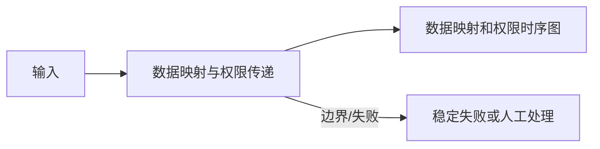

<!-- 本文件由 scripts/generate_course_tutorials.py 生成，请修改阶段计划或生成器后重新生成。 -->

# 第 28 周教程：接入与试点设计

> 计划来源：[08-business-scenario-process.md](../stages/08-business-scenario-process.md)。阶段文档决定课程任务和验收，[第 28 周公共成果要求](../../deliverables/week-28/README.md)定义门禁；学习状态只记录在个人学习仓库。

## 本周先理解

### 为什么学

在编码前把业务契约、数据权限、平台配置、测试和回退方案评审清楚。

### 这是什么

接入设计把 TO-BE 映射为 API/事件、字段、身份、Agent/Workflow 版本和试点计划，不向业务泄露内部模型细节。

### 本周语言定位

本周以业务证据和设计为主，语言中立；技术 Spike 只复用既有 Java/Python/TypeScript 栈，不引入新语言。完整职责、切换桥接和替代规则见[开发语言路线](../01-language-roadmap.md)。

### 本周学习策略

- 每天只完成下面一节，控制在约 1 小时，不提前堆叠下一节的新概念。
- 先预测再实验；先保存原始证据，再写结论；失败样例与正常结果同等重要。
- 首次遇到术语时补齐：一句话定义、输入输出、开发类比、类比边界、反例和“不是什么”。
- 使用 H1→H4 提示阶梯；若使用完整参考答案，必须额外完成一个不同输入或约束的变体。

## 逐节教程

### 周一 · 第 1 节：选择接入模式

**为什么学**

本周要在编码前把业务契约、数据权限、平台配置、测试和回退方案评审清楚。本节把“选择接入模式”推进为可检查成果；如果跳过，后续会缺少“接入模式 ADR”这项关键证据。

**这个是什么**

本周核心概念是：接入设计把 TO-BE 映射为 API/事件、字段、身份、Agent/Workflow 版本和试点计划，不向业务泄露内部模型细节。今天的“选择接入模式”是这个核心能力的最小学习单元：你会通过“比较同步 API、异步事件、嵌入页面、批任务和 Copilot；依据用户流程选择，不按技术偏好”观察输入如何转化为“接入模式 ADR”。它既包含可观察结果，也包含至少一个失败或不适用边界。只读完资料或只跑通正常路径，都不能证明已经掌握。

**怎么学（约 60 分钟）**

1. `0–5 分钟`：不查资料，写下你对本节主题的一句话解释、预期输入输出和一个疑问。
2. `5–15 分钟`：只阅读下方资料中与当前任务直接相关的部分，记录一个关键约束和版本信息。
3. `15–45 分钟`：执行专项任务：比较同步 API、异步事件、嵌入页面、批任务和 Copilot；依据用户流程选择，不按技术偏好
4. `45–55 分钟`：主动制造一个错误输入、边界条件、依赖失败或反例，保存现象并解释原因。
5. `55–60 分钟`：整理命令、输入、输出、Diff、图表或访谈证据，并用自己的语言完成 Teach-back。

专项资料：[OpenAPI Specification](https://spec.openapis.org/oas/latest.html)

**怎么验证学会了**

- 必交证据：接入模式 ADR。
- Teach-back：不看资料解释“选择接入模式”解决什么问题、主要输入输出、一个边界，以及它不是什么。
- 失败证据：展示一个非正常场景，指出失败发生在哪一层，不能只贴错误截图。
- 变体任务：改变一个输入、参数、角色、权限或失败条件，在不照抄原步骤的情况下重新完成。
- 通过标准：以上四项均有证据，且能解释关键取舍；只能照步骤运行时最高算 L1，不能判定本节通过。

**参考答案（独立尝试至少 20 分钟后再看）**

> 这是一份合格答案骨架，不是唯一实现。看完后必须关闭参考答案，换一个输入或约束独立重做。

#### 步骤 1 参考：先写预测

- 一句话解释：接入设计把 TO-BE 映射为 API/事件、字段、身份、Agent/Workflow 版本和试点计划，不向业务泄露内部模型细节。
- 预测：完成“选择接入模式”后，应能观察到“接入模式 ADR”；失败输入不应产生假成功。

#### 步骤 2 参考：阅读资料

- 链接：[OpenAPI Specification](https://spec.openapis.org/oas/latest.html)
- 指定章节/条目：该链接指向的“OpenAPI Specification”整篇专题/章节；重点阅读与“选择接入模式”直接对应的段落，页面更新时使用课程标题中的英文术语或 API 名页内搜索
- 阅读方法：只摘录一个定义、一个输入输出约束和一个失败边界；记录页面日期、协议版本或依赖版本。

#### 步骤 3 参考：按专项动作完成产出

- 专项动作：比较同步 API、异步事件、嵌入页面、批任务和 Copilot；依据用户流程选择，不按技术偏好
- 参考资料/文档产出：

- 主题：选择接入模式
- 建议字段：目标；事实与证据；关键决定；备选方案；失败与风险；限制；后续动作；负责人/时间
- 示例结论：已按统一口径产出“接入模式 ADR”；证据不足的部分标记为假设或未验证。

#### 步骤 4 参考：制造失败并解释

- 失败注入：删掉一个必填输入或让依赖失败，系统应返回可解释的失败结果且不产生假成功；再根据日志、Diff 或流程证据定位原因。
- 参考判断：失败必须映射为明确状态、错误、拒答、人工路径或未验证假设；日志和界面不得显示成功。

#### 步骤 5 参考：整理交付与 Teach-back

- 当天交付：接入模式 ADR。
- 完整字段：目标；事实与证据；关键决定；备选方案；失败与风险；限制；后续动作；负责人/时间。
- Teach-back 参考：本节输入是什么、经过了什么处理、输出如何验证、哪种失败最危险、为什么当前方案没有越过课程边界。
- 完成后变体：更换一个输入、参数、角色、权限或失败条件，不看上述样例重新完成。


### 周二 · 第 2 节：设计领域契约

**为什么学**

本周要在编码前把业务契约、数据权限、平台配置、测试和回退方案评审清楚。本节把“设计领域契约”推进为可检查成果；如果跳过，后续会缺少“OpenAPI/事件 Schema 草案”这项关键证据。

**这个是什么**

本周核心概念是：接入设计把 TO-BE 映射为 API/事件、字段、身份、Agent/Workflow 版本和试点计划，不向业务泄露内部模型细节。今天的“设计领域契约”是这个核心能力的最小学习单元：你会通过“契约使用业务语义，包含版本、幂等、错误、状态和 Trace；不直接暴露内部 Prompt”观察输入如何转化为“OpenAPI/事件 Schema 草案”。它既包含可观察结果，也包含至少一个失败或不适用边界。只读完资料或只跑通正常路径，都不能证明已经掌握。

**怎么学（约 60 分钟）**

1. `0–5 分钟`：不查资料，写下你对本节主题的一句话解释、预期输入输出和一个疑问。
2. `5–15 分钟`：只阅读下方资料中与当前任务直接相关的部分，记录一个关键约束和版本信息。
3. `15–45 分钟`：执行专项任务：契约使用业务语义，包含版本、幂等、错误、状态和 Trace；不直接暴露内部 Prompt
4. `45–55 分钟`：主动制造一个错误输入、边界条件、依赖失败或反例，保存现象并解释原因。
5. `55–60 分钟`：整理命令、输入、输出、Diff、图表或访谈证据，并用自己的语言完成 Teach-back。

专项资料：[OpenAPI Specification](https://spec.openapis.org/oas/latest.html)

**怎么验证学会了**

- 必交证据：OpenAPI/事件 Schema 草案。
- Teach-back：不看资料解释“设计领域契约”解决什么问题、主要输入输出、一个边界，以及它不是什么。
- 失败证据：展示一个非正常场景，指出失败发生在哪一层，不能只贴错误截图。
- 变体任务：改变一个输入、参数、角色、权限或失败条件，在不照抄原步骤的情况下重新完成。
- 通过标准：以上四项均有证据，且能解释关键取舍；只能照步骤运行时最高算 L1，不能判定本节通过。

**参考答案（独立尝试至少 20 分钟后再看）**

> 这是一份合格答案骨架，不是唯一实现。看完后必须关闭参考答案，换一个输入或约束独立重做。

#### 步骤 1 参考：先写预测

- 一句话解释：接入设计把 TO-BE 映射为 API/事件、字段、身份、Agent/Workflow 版本和试点计划，不向业务泄露内部模型细节。
- 预测：完成“设计领域契约”后，应能观察到“OpenAPI/事件 Schema 草案”；失败输入不应产生假成功。

#### 步骤 2 参考：阅读资料

- 链接：[OpenAPI Specification](https://spec.openapis.org/oas/latest.html)
- 指定章节/条目：OpenAPI Specification → Paths、Operation Object、Schema Object、Responses
- 阅读方法：只摘录一个定义、一个输入输出约束和一个失败边界；记录页面日期、协议版本或依赖版本。

#### 步骤 3 参考：按专项动作完成产出

- 专项动作：契约使用业务语义，包含版本、幂等、错误、状态和 Trace；不直接暴露内部 Prompt
- 样例代码（先核对课程链接中的当前 API，再按本仓库边界修改）：

```json
{
  "schemaVersion": "v1",
  "task": "设计领域契约",
  "input": {"requestId": "req-001"},
  "expected": "OpenAPI/事件 Schema 草案",
  "onError": {"code": "VALIDATION_FAILED", "retryable": false}
}
```

#### 步骤 4 参考：制造失败并解释

- 失败注入：当样本、Owner 或数据来源不足时，把结论标为假设并给出验证计划；不能把模拟结果写成真实业务收益。
- 参考判断：失败必须映射为明确状态、错误、拒答、人工路径或未验证假设；日志和界面不得显示成功。

#### 步骤 5 参考：整理交付与 Teach-back

- 当天交付：OpenAPI/事件 Schema 草案。
- 完整字段：版本；请求字段；成功响应；稳定错误码；状态变化；traceId；幂等/并发约束；兼容性说明。
- Teach-back 参考：本节输入是什么、经过了什么处理、输出如何验证、哪种失败最危险、为什么当前方案没有越过课程边界。
- 完成后变体：更换一个输入、参数、角色、权限或失败条件，不看上述样例重新完成。


### 周三 · 第 3 节：数据映射与权限传递

**为什么学**

本周要在编码前把业务契约、数据权限、平台配置、测试和回退方案评审清楚。本节把“数据映射与权限传递”推进为可检查成果；如果跳过，后续会缺少“数据映射和权限时序图”这项关键证据。

**这个是什么**

本周核心概念是：接入设计把 TO-BE 映射为 API/事件、字段、身份、Agent/Workflow 版本和试点计划，不向业务泄露内部模型细节。今天的“数据映射与权限传递”是这个核心能力的最小学习单元：你会通过“明确字段来源、脱敏、最小化、保留期和授权主体；禁止把用户 Token 直接传给 Tool”观察输入如何转化为“数据映射和权限时序图”。它既包含可观察结果，也包含至少一个失败或不适用边界。只读完资料或只跑通正常路径，都不能证明已经掌握。

**怎么学（约 60 分钟）**

1. `0–5 分钟`：不查资料，写下你对本节主题的一句话解释、预期输入输出和一个疑问。
2. `5–15 分钟`：只阅读下方资料中与当前任务直接相关的部分，记录一个关键约束和版本信息。
3. `15–45 分钟`：执行专项任务：明确字段来源、脱敏、最小化、保留期和授权主体；禁止把用户 Token 直接传给 Tool
4. `45–55 分钟`：主动制造一个错误输入、边界条件、依赖失败或反例，保存现象并解释原因。
5. `55–60 分钟`：整理命令、输入、输出、Diff、图表或访谈证据，并用自己的语言完成 Teach-back。

专项资料：[OAuth 2.0 Security Best Current Practice](https://www.rfc-editor.org/rfc/rfc9700.html)

**怎么验证学会了**

- 必交证据：数据映射和权限时序图。
- Teach-back：不看资料解释“数据映射与权限传递”解决什么问题、主要输入输出、一个边界，以及它不是什么。
- 失败证据：展示一个非正常场景，指出失败发生在哪一层，不能只贴错误截图。
- 变体任务：改变一个输入、参数、角色、权限或失败条件，在不照抄原步骤的情况下重新完成。
- 通过标准：以上四项均有证据，且能解释关键取舍；只能照步骤运行时最高算 L1，不能判定本节通过。

**参考答案（独立尝试至少 20 分钟后再看）**

> 这是一份合格答案骨架，不是唯一实现。看完后必须关闭参考答案，换一个输入或约束独立重做。

#### 步骤 1 参考：先写预测

- 一句话解释：接入设计把 TO-BE 映射为 API/事件、字段、身份、Agent/Workflow 版本和试点计划，不向业务泄露内部模型细节。
- 预测：完成“数据映射与权限传递”后，应能观察到“数据映射和权限时序图”；失败输入不应产生假成功。

#### 步骤 2 参考：阅读资料

- 链接：[OAuth 2.0 Security Best Current Practice](https://www.rfc-editor.org/rfc/rfc9700.html)
- 指定章节/条目：该链接指向的“OAuth 2.0 Security Best Current Practice”整篇专题/章节；重点阅读与“数据映射与权限传递”直接对应的段落，页面更新时使用课程标题中的英文术语或 API 名页内搜索
- 阅读方法：只摘录一个定义、一个输入输出约束和一个失败边界；记录页面日期、协议版本或依赖版本。

#### 步骤 3 参考：按专项动作完成产出

- 专项动作：明确字段来源、脱敏、最小化、保留期和授权主体；禁止把用户 Token 直接传给 Tool
- 参考图（按实际角色、字段和状态修改）：



#### 步骤 4 参考：制造失败并解释

- 失败注入：删除身份、Scope 或审批后再次执行，正确结果应是执行路径明确拒绝且留下脱敏审计；如果仍成功，就是权限边界失效。
- 参考判断：失败必须映射为明确状态、错误、拒答、人工路径或未验证假设；日志和界面不得显示成功。

#### 步骤 5 参考：整理交付与 Teach-back

- 当天交付：数据映射和权限时序图。
- 完整字段：范围与参与者；输入；主路径；异常/拒绝路径；输出；信任或责任边界；版本与图例。
- Teach-back 参考：本节输入是什么、经过了什么处理、输出如何验证、哪种失败最危险、为什么当前方案没有越过课程边界。
- 完成后变体：更换一个输入、参数、角色、权限或失败条件，不看上述样例重新完成。


### 周四 · 第 4 节：配置 Agent 与 Workflow

**为什么学**

本周要在编码前把业务契约、数据权限、平台配置、测试和回退方案评审清楚。本节把“配置 Agent 与 Workflow”推进为可检查成果；如果跳过，后续会缺少“场景配置清单”这项关键证据。

**这个是什么**

本周核心概念是：接入设计把 TO-BE 映射为 API/事件、字段、身份、Agent/Workflow 版本和试点计划，不向业务泄露内部模型细节。今天的“配置 Agent 与 Workflow”是这个核心能力的最小学习单元：你会通过“将 TO-BE 步骤映射到平台 Agent、Tool、KB、审批和节点，记录每项版本”观察输入如何转化为“场景配置清单”。它既包含可观察结果，也包含至少一个失败或不适用边界。只读完资料或只跑通正常路径，都不能证明已经掌握。

**怎么学（约 60 分钟）**

1. `0–5 分钟`：不查资料，写下你对本节主题的一句话解释、预期输入输出和一个疑问。
2. `5–15 分钟`：只阅读下方资料中与当前任务直接相关的部分，记录一个关键约束和版本信息。
3. `15–45 分钟`：执行专项任务：将 TO-BE 步骤映射到平台 Agent、Tool、KB、审批和节点，记录每项版本
4. `45–55 分钟`：主动制造一个错误输入、边界条件、依赖失败或反例，保存现象并解释原因。
5. `55–60 分钟`：整理命令、输入、输出、Diff、图表或访谈证据，并用自己的语言完成 Teach-back。

专项资料：[LangGraph Workflows and Agents](https://docs.langchain.com/oss/python/langgraph/workflows-agents)

**怎么验证学会了**

- 必交证据：场景配置清单。
- Teach-back：不看资料解释“配置 Agent 与 Workflow”解决什么问题、主要输入输出、一个边界，以及它不是什么。
- 失败证据：展示一个非正常场景，指出失败发生在哪一层，不能只贴错误截图。
- 变体任务：改变一个输入、参数、角色、权限或失败条件，在不照抄原步骤的情况下重新完成。
- 通过标准：以上四项均有证据，且能解释关键取舍；只能照步骤运行时最高算 L1，不能判定本节通过。

**参考答案（独立尝试至少 20 分钟后再看）**

> 这是一份合格答案骨架，不是唯一实现。看完后必须关闭参考答案，换一个输入或约束独立重做。

#### 步骤 1 参考：先写预测

- 一句话解释：接入设计把 TO-BE 映射为 API/事件、字段、身份、Agent/Workflow 版本和试点计划，不向业务泄露内部模型细节。
- 预测：完成“配置 Agent 与 Workflow”后，应能观察到“场景配置清单”；失败输入不应产生假成功。

#### 步骤 2 参考：阅读资料

- 链接：[LangGraph Workflows and Agents](https://docs.langchain.com/oss/python/langgraph/workflows-agents)
- 指定章节/条目：该链接指向的“LangGraph Workflows and Agents”整篇专题/章节；重点阅读与“配置 Agent 与 Workflow”直接对应的段落，页面更新时使用课程标题中的英文术语或 API 名页内搜索
- 阅读方法：只摘录一个定义、一个输入输出约束和一个失败边界；记录页面日期、协议版本或依赖版本。

#### 步骤 3 参考：按专项动作完成产出

- 专项动作：将 TO-BE 步骤映射到平台 Agent、Tool、KB、审批和节点，记录每项版本
- 样例代码（先核对课程链接中的当前 API，再按本仓库边界修改）：

```python
def run_case(input_data: dict) -> dict:
    if not input_data:
        return {"status": "FAILED", "error": "EMPTY_INPUT"}
    # Replace this line with the lesson-specific call.
    result = {"observed": input_data, "status": "SUCCEEDED"}
    return result

print(run_case({"case": "normal"}))
print(run_case({}))  # failure case
```

#### 步骤 4 参考：制造失败并解释

- 失败注入：删除身份、Scope 或审批后再次执行，正确结果应是执行路径明确拒绝且留下脱敏审计；如果仍成功，就是权限边界失效。
- 参考判断：失败必须映射为明确状态、错误、拒答、人工路径或未验证假设；日志和界面不得显示成功。

#### 步骤 5 参考：整理交付与 Teach-back

- 当天交付：场景配置清单。
- 完整字段：运行时与依赖版本；配置键；Secret 引用方式；示例占位值；启动命令；缺失配置的错误；泄露检查。
- Teach-back 参考：本节输入是什么、经过了什么处理、输出如何验证、哪种失败最危险、为什么当前方案没有越过课程边界。
- 完成后变体：更换一个输入、参数、角色、权限或失败条件，不看上述样例重新完成。


### 周五 · 第 5 节：设计测试金字塔

**为什么学**

本周要在编码前把业务契约、数据权限、平台配置、测试和回退方案评审清楚。本节把“设计测试金字塔”推进为可检查成果；如果跳过，后续会缺少“测试与样例矩阵”这项关键证据。

**这个是什么**

本周核心概念是：接入设计把 TO-BE 映射为 API/事件、字段、身份、Agent/Workflow 版本和试点计划，不向业务泄露内部模型细节。今天的“设计测试金字塔”是这个核心能力的最小学习单元：你会通过“覆盖契约、组件、工作流、Eval、E2E、安全和用户验收；真实外部系统准备 Stub”观察输入如何转化为“测试与样例矩阵”。它既包含可观察结果，也包含至少一个失败或不适用边界。只读完资料或只跑通正常路径，都不能证明已经掌握。

**怎么学（约 60 分钟）**

1. `0–5 分钟`：不查资料，写下你对本节主题的一句话解释、预期输入输出和一个疑问。
2. `5–15 分钟`：只阅读下方资料中与当前任务直接相关的部分，记录一个关键约束和版本信息。
3. `15–45 分钟`：执行专项任务：覆盖契约、组件、工作流、Eval、E2E、安全和用户验收；真实外部系统准备 Stub
4. `45–55 分钟`：主动制造一个错误输入、边界条件、依赖失败或反例，保存现象并解释原因。
5. `55–60 分钟`：整理命令、输入、输出、Diff、图表或访谈证据，并用自己的语言完成 Teach-back。

专项资料：[Martin Fowler：Test Pyramid](https://martinfowler.com/articles/practical-test-pyramid.html)

**怎么验证学会了**

- 必交证据：测试与样例矩阵。
- Teach-back：不看资料解释“设计测试金字塔”解决什么问题、主要输入输出、一个边界，以及它不是什么。
- 失败证据：展示一个非正常场景，指出失败发生在哪一层，不能只贴错误截图。
- 变体任务：改变一个输入、参数、角色、权限或失败条件，在不照抄原步骤的情况下重新完成。
- 通过标准：以上四项均有证据，且能解释关键取舍；只能照步骤运行时最高算 L1，不能判定本节通过。

**参考答案（独立尝试至少 20 分钟后再看）**

> 这是一份合格答案骨架，不是唯一实现。看完后必须关闭参考答案，换一个输入或约束独立重做。

#### 步骤 1 参考：先写预测

- 一句话解释：接入设计把 TO-BE 映射为 API/事件、字段、身份、Agent/Workflow 版本和试点计划，不向业务泄露内部模型细节。
- 预测：完成“设计测试金字塔”后，应能观察到“测试与样例矩阵”；失败输入不应产生假成功。

#### 步骤 2 参考：阅读资料

- 链接：[Martin Fowler：Test Pyramid](https://martinfowler.com/articles/practical-test-pyramid.html)
- 指定章节/条目：该链接指向的“Martin Fowler：Test Pyramid”整篇专题/章节；重点阅读与“设计测试金字塔”直接对应的段落，页面更新时使用课程标题中的英文术语或 API 名页内搜索
- 阅读方法：只摘录一个定义、一个输入输出约束和一个失败边界；记录页面日期、协议版本或依赖版本。

#### 步骤 3 参考：按专项动作完成产出

- 专项动作：覆盖契约、组件、工作流、Eval、E2E、安全和用户验收；真实外部系统准备 Stub
- 参考资料/文档产出：

- 主题：设计测试金字塔
- 建议字段：用例 ID；前置条件；输入/故障；预期状态；关键断言；实际结果；日志或 Trace；是否通过
- 示例结论：已按统一口径产出“测试与样例矩阵”；证据不足的部分标记为假设或未验证。

#### 步骤 4 参考：制造失败并解释

- 失败注入：删除身份、Scope 或审批后再次执行，正确结果应是执行路径明确拒绝且留下脱敏审计；如果仍成功，就是权限边界失效。
- 参考判断：失败必须映射为明确状态、错误、拒答、人工路径或未验证假设；日志和界面不得显示成功。

#### 步骤 5 参考：整理交付与 Teach-back

- 当天交付：测试与样例矩阵。
- 完整字段：用例 ID；前置条件；输入/故障；预期状态；关键断言；实际结果；日志或 Trace；是否通过。
- Teach-back 参考：本节输入是什么、经过了什么处理、输出如何验证、哪种失败最危险、为什么当前方案没有越过课程边界。
- 完成后变体：更换一个输入、参数、角色、权限或失败条件，不看上述样例重新完成。


### 周六 · 第 6 节：制定试点和灰度计划

**为什么学**

本周要在编码前把业务契约、数据权限、平台配置、测试和回退方案评审清楚。本节把“制定试点和灰度计划”推进为可检查成果；如果跳过，后续会缺少“Pilot Plan”这项关键证据。

**这个是什么**

本周核心概念是：接入设计把 TO-BE 映射为 API/事件、字段、身份、Agent/Workflow 版本和试点计划，不向业务泄露内部模型细节。今天的“制定试点和灰度计划”是这个核心能力的最小学习单元：你会通过“明确人群、流量、时长、观察指标、回退、人工值守和停止条件”观察输入如何转化为“Pilot Plan”。它既包含可观察结果，也包含至少一个失败或不适用边界。只读完资料或只跑通正常路径，都不能证明已经掌握。

**怎么学（约 60 分钟）**

1. `0–5 分钟`：不查资料，写下你对本节主题的一句话解释、预期输入输出和一个疑问。
2. `5–15 分钟`：只阅读下方资料中与当前任务直接相关的部分，记录一个关键约束和版本信息。
3. `15–45 分钟`：执行专项任务：明确人群、流量、时长、观察指标、回退、人工值守和停止条件
4. `45–55 分钟`：主动制造一个错误输入、边界条件、依赖失败或反例，保存现象并解释原因。
5. `55–60 分钟`：整理命令、输入、输出、Diff、图表或访谈证据，并用自己的语言完成 Teach-back。

专项资料：[GOV.UK Beta Phase](https://www.gov.uk/service-manual/agile-delivery/how-the-beta-phase-works)

**怎么验证学会了**

- 必交证据：Pilot Plan。
- Teach-back：不看资料解释“制定试点和灰度计划”解决什么问题、主要输入输出、一个边界，以及它不是什么。
- 失败证据：展示一个非正常场景，指出失败发生在哪一层，不能只贴错误截图。
- 变体任务：改变一个输入、参数、角色、权限或失败条件，在不照抄原步骤的情况下重新完成。
- 通过标准：以上四项均有证据，且能解释关键取舍；只能照步骤运行时最高算 L1，不能判定本节通过。

**参考答案（独立尝试至少 20 分钟后再看）**

> 这是一份合格答案骨架，不是唯一实现。看完后必须关闭参考答案，换一个输入或约束独立重做。

#### 步骤 1 参考：先写预测

- 一句话解释：接入设计把 TO-BE 映射为 API/事件、字段、身份、Agent/Workflow 版本和试点计划，不向业务泄露内部模型细节。
- 预测：完成“制定试点和灰度计划”后，应能观察到“Pilot Plan”；失败输入不应产生假成功。

#### 步骤 2 参考：阅读资料

- 链接：[GOV.UK Beta Phase](https://www.gov.uk/service-manual/agile-delivery/how-the-beta-phase-works)
- 指定章节/条目：该链接指向的“GOV.UK Beta Phase”整篇专题/章节；重点阅读与“制定试点和灰度计划”直接对应的段落，页面更新时使用课程标题中的英文术语或 API 名页内搜索
- 阅读方法：只摘录一个定义、一个输入输出约束和一个失败边界；记录页面日期、协议版本或依赖版本。

#### 步骤 3 参考：按专项动作完成产出

- 专项动作：明确人群、流量、时长、观察指标、回退、人工值守和停止条件
- 参考资料/文档产出：

- 主题：制定试点和灰度计划
- 建议字段：目标；事实与证据；关键决定；备选方案；失败与风险；限制；后续动作；负责人/时间
- 示例结论：已按统一口径产出“Pilot Plan”；证据不足的部分标记为假设或未验证。

#### 步骤 4 参考：制造失败并解释

- 失败注入：当样本、Owner 或数据来源不足时，把结论标为假设并给出验证计划；不能把模拟结果写成真实业务收益。
- 参考判断：失败必须映射为明确状态、错误、拒答、人工路径或未验证假设；日志和界面不得显示成功。

#### 步骤 5 参考：整理交付与 Teach-back

- 当天交付：Pilot Plan。
- 完整字段：目标；事实与证据；关键决定；备选方案；失败与风险；限制；后续动作；负责人/时间。
- Teach-back 参考：本节输入是什么、经过了什么处理、输出如何验证、哪种失败最危险、为什么当前方案没有越过课程边界。
- 完成后变体：更换一个输入、参数、角色、权限或失败条件，不看上述样例重新完成。


### 周日 · 第 7 节：接入设计评审

**为什么学**

本周要在编码前把业务契约、数据权限、平台配置、测试和回退方案评审清楚。本节把“接入设计评审”推进为可检查成果；如果跳过，后续会缺少“完成阶段提交”这项关键证据。

**这个是什么**

本周核心概念是：接入设计把 TO-BE 映射为 API/事件、字段、身份、Agent/Workflow 版本和试点计划，不向业务泄露内部模型细节。今天的“接入设计评审”是这个核心能力的最小学习单元：你会通过“业务、平台、安全和运维视角逐项审查，未通过项形成明确闭环”观察输入如何转化为“完成阶段提交”。它既包含可观察结果，也包含至少一个失败或不适用边界。只读完资料或只跑通正常路径，都不能证明已经掌握。

**怎么学（约 60 分钟）**

1. `0–5 分钟`：不查资料，写下你对本节主题的一句话解释、预期输入输出和一个疑问。
2. `5–15 分钟`：只阅读下方资料中与当前任务直接相关的部分，记录一个关键约束和版本信息。
3. `15–45 分钟`：执行专项任务：业务、平台、安全和运维视角逐项审查，未通过项形成明确闭环
4. `45–55 分钟`：主动制造一个错误输入、边界条件、依赖失败或反例，保存现象并解释原因。
5. `55–60 分钟`：整理命令、输入、输出、Diff、图表或访谈证据，并用自己的语言完成 Teach-back。

专项资料：[成果与提交标准](../06-deliverable-standards.md)

**怎么验证学会了**

- 必交证据：完成阶段提交。
- Teach-back：不看资料解释“接入设计评审”解决什么问题、主要输入输出、一个边界，以及它不是什么。
- 失败证据：展示一个非正常场景，指出失败发生在哪一层，不能只贴错误截图。
- 变体任务：改变一个输入、参数、角色、权限或失败条件，在不照抄原步骤的情况下重新完成。
- 通过标准：以上四项均有证据，且能解释关键取舍；只能照步骤运行时最高算 L1，不能判定本节通过。

**参考答案（独立尝试至少 20 分钟后再看）**

> 这是一份合格答案骨架，不是唯一实现。看完后必须关闭参考答案，换一个输入或约束独立重做。

#### 步骤 1 参考：先写预测

- 一句话解释：接入设计把 TO-BE 映射为 API/事件、字段、身份、Agent/Workflow 版本和试点计划，不向业务泄露内部模型细节。
- 预测：完成“接入设计评审”后，应能观察到“完成阶段提交”；失败输入不应产生假成功。

#### 步骤 2 参考：阅读资料

- 链接：[成果与提交标准](../06-deliverable-standards.md)
- 指定章节/条目：该链接指向的“成果与提交标准”整篇专题/章节；重点阅读与“接入设计评审”直接对应的段落，页面更新时使用课程标题中的英文术语或 API 名页内搜索
- 阅读方法：只摘录一个定义、一个输入输出约束和一个失败边界；记录页面日期、协议版本或依赖版本。

#### 步骤 3 参考：按专项动作完成产出

- 专项动作：业务、平台、安全和运维视角逐项审查，未通过项形成明确闭环
- 参考资料/文档产出：

- 主题：接入设计评审
- 建议字段：目标；事实与证据；关键决定；备选方案；失败与风险；限制；后续动作；负责人/时间
- 示例结论：已按统一口径产出“完成阶段提交”；证据不足的部分标记为假设或未验证。

#### 步骤 4 参考：制造失败并解释

- 失败注入：删除身份、Scope 或审批后再次执行，正确结果应是执行路径明确拒绝且留下脱敏审计；如果仍成功，就是权限边界失效。
- 参考判断：失败必须映射为明确状态、错误、拒答、人工路径或未验证假设；日志和界面不得显示成功。

#### 步骤 5 参考：整理交付与 Teach-back

- 当天交付：完成阶段提交。
- 完整字段：目标；事实与证据；关键决定；备选方案；失败与风险；限制；后续动作；负责人/时间。
- Teach-back 参考：本节输入是什么、经过了什么处理、输出如何验证、哪种失败最危险、为什么当前方案没有越过课程边界。
- 完成后变体：更换一个输入、参数、角色、权限或失败条件，不看上述样例重新完成。


## 本周收尾

按[成果与提交标准](../06-deliverable-standards.md)整理本周成果，再由讲师按[监督与掌握度规范](../07-instructor-supervision.md)给出“通过、部分通过、未通过”。教程完成不代表学习者已经掌握，必须以独立运行、排错、Teach-back 和变体证据为准。
