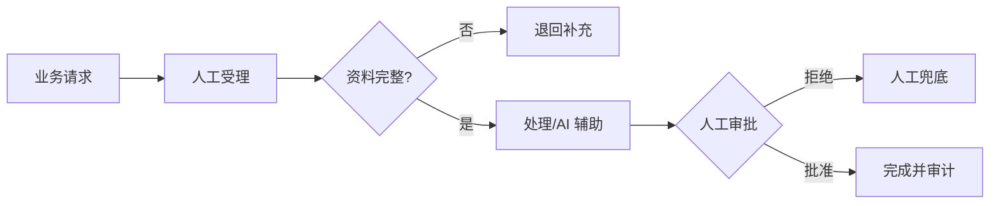

<!-- 本文件由 scripts/generate_course_tutorials.py 生成，请修改阶段计划或生成器后重新生成。 -->

# 第 29 周教程：业务系统集成

> 计划来源：[09-pilot-production-capstone.md](../stages/09-pilot-production-capstone.md)。阶段文档决定课程任务和验收，[第 29 周公共成果要求](../../deliverables/week-29/README.md)定义门禁；学习状态只记录在个人学习仓库。

## 本周先理解

### 为什么学

用契约、身份、幂等和端到端测试证明业务系统与平台能够安全协作。

### 这是什么

系统集成通过 Connector/Adapter 隔离业务 DTO 与平台协议，并把身份、Trace、版本和副作用结果贯穿全链路。

### 本周语言定位

组合 Java 控制面/业务 Connector、Python Agent 执行面和按需 TypeScript 控制台，所有端到端状态与回滚必须可验证。完整职责、切换桥接和替代规则见[开发语言路线](../01-language-roadmap.md)。

### 本周学习策略

- 每天只完成下面一节，控制在约 1 小时，不提前堆叠下一节的新概念。
- 先预测再实验；先保存原始证据，再写结论；失败样例与正常结果同等重要。
- 首次遇到术语时补齐：一句话定义、输入输出、开发类比、类比边界、反例和“不是什么”。
- 使用 H1→H4 提示阶梯；若使用完整参考答案，必须额外完成一个不同输入或约束的变体。

## 逐节教程

### 周一 · 第 1 节：建业务 Connector/Adapter

**为什么学**

本周要用契约、身份、幂等和端到端测试证明业务系统与平台能够安全协作。本节把“建业务 Connector/Adapter”推进为可检查成果；如果跳过，后续会缺少“Connector 契约测试通过”这项关键证据。

**这个是什么**

本周核心概念是：系统集成通过 Connector/Adapter 隔离业务 DTO 与平台协议，并把身份、Trace、版本和副作用结果贯穿全链路。今天的“建业务 Connector/Adapter”是这个核心能力的最小学习单元：你会通过“将业务 DTO 与平台契约隔离；先实现 Stub 和契约测试，再连接真实测试环境”观察输入如何转化为“Connector 契约测试通过”。它既包含可观察结果，也包含至少一个失败或不适用边界。只读完资料或只跑通正常路径，都不能证明已经掌握。

**怎么学（约 60 分钟）**

1. `0–5 分钟`：不查资料，写下你对本节主题的一句话解释、预期输入输出和一个疑问。
2. `5–15 分钟`：只阅读下方资料中与当前任务直接相关的部分，记录一个关键约束和版本信息。
3. `15–45 分钟`：执行专项任务：将业务 DTO 与平台契约隔离；先实现 Stub 和契约测试，再连接真实测试环境
4. `45–55 分钟`：主动制造一个错误输入、边界条件、依赖失败或反例，保存现象并解释原因。
5. `55–60 分钟`：整理命令、输入、输出、Diff、图表或访谈证据，并用自己的语言完成 Teach-back。

专项资料：[Microsoft Anti-corruption Layer](https://learn.microsoft.com/azure/architecture/patterns/anti-corruption-layer)

**怎么验证学会了**

- 必交证据：Connector 契约测试通过。
- Teach-back：不看资料解释“建业务 Connector/Adapter”解决什么问题、主要输入输出、一个边界，以及它不是什么。
- 失败证据：展示一个非正常场景，指出失败发生在哪一层，不能只贴错误截图。
- 变体任务：改变一个输入、参数、角色、权限或失败条件，在不照抄原步骤的情况下重新完成。
- 通过标准：以上四项均有证据，且能解释关键取舍；只能照步骤运行时最高算 L1，不能判定本节通过。

**参考答案（独立尝试至少 20 分钟后再看）**

> 这是一份合格答案骨架，不是唯一实现。看完后必须关闭参考答案，换一个输入或约束独立重做。

#### 步骤 1 参考：先写预测

- 一句话解释：系统集成通过 Connector/Adapter 隔离业务 DTO 与平台协议，并把身份、Trace、版本和副作用结果贯穿全链路。
- 预测：完成“建业务 Connector/Adapter”后，应能观察到“Connector 契约测试通过”；失败输入不应产生假成功。

#### 步骤 2 参考：阅读资料

- 链接：[Microsoft Anti-corruption Layer](https://learn.microsoft.com/azure/architecture/patterns/anti-corruption-layer)
- 指定章节/条目：该链接指向的“Microsoft Anti-corruption Layer”整篇专题/章节；重点阅读与“建业务 Connector/Adapter”直接对应的段落，页面更新时使用课程标题中的英文术语或 API 名页内搜索
- 阅读方法：只摘录一个定义、一个输入输出约束和一个失败边界；记录页面日期、协议版本或依赖版本。

#### 步骤 3 参考：按专项动作完成产出

- 专项动作：将业务 DTO 与平台契约隔离；先实现 Stub 和契约测试，再连接真实测试环境
- 参考资料/文档产出：

- 主题：建业务 Connector/Adapter
- 建议字段：版本；请求字段；成功响应；稳定错误码；状态变化；traceId；幂等/并发约束；兼容性说明
- 示例结论：已按统一口径产出“Connector 契约测试通过”；证据不足的部分标记为假设或未验证。

#### 步骤 4 参考：制造失败并解释

- 失败注入：当样本、Owner 或数据来源不足时，把结论标为假设并给出验证计划；不能把模拟结果写成真实业务收益。
- 参考判断：失败必须映射为明确状态、错误、拒答、人工路径或未验证假设；日志和界面不得显示成功。

#### 步骤 5 参考：整理交付与 Teach-back

- 当天交付：Connector 契约测试通过。
- 完整字段：版本；请求字段；成功响应；稳定错误码；状态变化；traceId；幂等/并发约束；兼容性说明。
- Teach-back 参考：本节输入是什么、经过了什么处理、输出如何验证、哪种失败最危险、为什么当前方案没有越过课程边界。
- 完成后变体：更换一个输入、参数、角色、权限或失败条件，不看上述样例重新完成。


### 周二 · 第 2 节：身份、权限与租户上下文

**为什么学**

本周要用契约、身份、幂等和端到端测试证明业务系统与平台能够安全协作。本节把“身份、权限与租户上下文”推进为可检查成果；如果跳过，后续会缺少“越权和缺失身份测试”这项关键证据。

**这个是什么**

本周核心概念是：系统集成通过 Connector/Adapter 隔离业务 DTO 与平台协议，并把身份、Trace、版本和副作用结果贯穿全链路。今天的“身份、权限与租户上下文”是这个核心能力的最小学习单元：你会通过“用户、Project、Scope 和审计主体端到端传播；缺失上下文默认拒绝”观察输入如何转化为“越权和缺失身份测试”。它既包含可观察结果，也包含至少一个失败或不适用边界。只读完资料或只跑通正常路径，都不能证明已经掌握。

**怎么学（约 60 分钟）**

1. `0–5 分钟`：不查资料，写下你对本节主题的一句话解释、预期输入输出和一个疑问。
2. `5–15 分钟`：只阅读下方资料中与当前任务直接相关的部分，记录一个关键约束和版本信息。
3. `15–45 分钟`：执行专项任务：用户、Project、Scope 和审计主体端到端传播；缺失上下文默认拒绝
4. `45–55 分钟`：主动制造一个错误输入、边界条件、依赖失败或反例，保存现象并解释原因。
5. `55–60 分钟`：整理命令、输入、输出、Diff、图表或访谈证据，并用自己的语言完成 Teach-back。

专项资料：[OAuth 2.0 Security Best Current Practice](https://www.rfc-editor.org/rfc/rfc9700.html)

**怎么验证学会了**

- 必交证据：越权和缺失身份测试。
- Teach-back：不看资料解释“身份、权限与租户上下文”解决什么问题、主要输入输出、一个边界，以及它不是什么。
- 失败证据：展示一个非正常场景，指出失败发生在哪一层，不能只贴错误截图。
- 变体任务：改变一个输入、参数、角色、权限或失败条件，在不照抄原步骤的情况下重新完成。
- 通过标准：以上四项均有证据，且能解释关键取舍；只能照步骤运行时最高算 L1，不能判定本节通过。

**参考答案（独立尝试至少 20 分钟后再看）**

> 这是一份合格答案骨架，不是唯一实现。看完后必须关闭参考答案，换一个输入或约束独立重做。

#### 步骤 1 参考：先写预测

- 一句话解释：系统集成通过 Connector/Adapter 隔离业务 DTO 与平台协议，并把身份、Trace、版本和副作用结果贯穿全链路。
- 预测：完成“身份、权限与租户上下文”后，应能观察到“越权和缺失身份测试”；失败输入不应产生假成功。

#### 步骤 2 参考：阅读资料

- 链接：[OAuth 2.0 Security Best Current Practice](https://www.rfc-editor.org/rfc/rfc9700.html)
- 指定章节/条目：该链接指向的“OAuth 2.0 Security Best Current Practice”整篇专题/章节；重点阅读与“身份、权限与租户上下文”直接对应的段落，页面更新时使用课程标题中的英文术语或 API 名页内搜索
- 阅读方法：只摘录一个定义、一个输入输出约束和一个失败边界；记录页面日期、协议版本或依赖版本。

#### 步骤 3 参考：按专项动作完成产出

- 专项动作：用户、Project、Scope 和审计主体端到端传播；缺失上下文默认拒绝
- 参考资料/文档产出：

- 主题：身份、权限与租户上下文
- 建议字段：用例 ID；前置条件；输入/故障；预期状态；关键断言；实际结果；日志或 Trace；是否通过
- 示例结论：已按统一口径产出“越权和缺失身份测试”；证据不足的部分标记为假设或未验证。

#### 步骤 4 参考：制造失败并解释

- 失败注入：删除身份、Scope 或审批后再次执行，正确结果应是执行路径明确拒绝且留下脱敏审计；如果仍成功，就是权限边界失效。
- 参考判断：失败必须映射为明确状态、错误、拒答、人工路径或未验证假设；日志和界面不得显示成功。

#### 步骤 5 参考：整理交付与 Teach-back

- 当天交付：越权和缺失身份测试。
- 完整字段：用例 ID；前置条件；输入/故障；预期状态；关键断言；实际结果；日志或 Trace；是否通过。
- Teach-back 参考：本节输入是什么、经过了什么处理、输出如何验证、哪种失败最危险、为什么当前方案没有越过课程边界。
- 完成后变体：更换一个输入、参数、角色、权限或失败条件，不看上述样例重新完成。


### 周三 · 第 3 节：数据读写与幂等

**为什么学**

本周要用契约、身份、幂等和端到端测试证明业务系统与平台能够安全协作。本节把“数据读写与幂等”推进为可检查成果；如果跳过，后续会缺少“重试不重复创建业务数据”这项关键证据。

**这个是什么**

本周核心概念是：系统集成通过 Connector/Adapter 隔离业务 DTO 与平台协议，并把身份、Trace、版本和副作用结果贯穿全链路。今天的“数据读写与幂等”是这个核心能力的最小学习单元：你会通过“读工具和写工具分离；写入前后保存业务 ID、幂等键和结果状态”观察输入如何转化为“重试不重复创建业务数据”。它既包含可观察结果，也包含至少一个失败或不适用边界。只读完资料或只跑通正常路径，都不能证明已经掌握。

**怎么学（约 60 分钟）**

1. `0–5 分钟`：不查资料，写下你对本节主题的一句话解释、预期输入输出和一个疑问。
2. `5–15 分钟`：只阅读下方资料中与当前任务直接相关的部分，记录一个关键约束和版本信息。
3. `15–45 分钟`：执行专项任务：读工具和写工具分离；写入前后保存业务 ID、幂等键和结果状态
4. `45–55 分钟`：主动制造一个错误输入、边界条件、依赖失败或反例，保存现象并解释原因。
5. `55–60 分钟`：整理命令、输入、输出、Diff、图表或访谈证据，并用自己的语言完成 Teach-back。

专项资料：[RFC 9110：幂等方法](https://www.rfc-editor.org/rfc/rfc9110.html#name-idempotent-methods)

**怎么验证学会了**

- 必交证据：重试不重复创建业务数据。
- Teach-back：不看资料解释“数据读写与幂等”解决什么问题、主要输入输出、一个边界，以及它不是什么。
- 失败证据：展示一个非正常场景，指出失败发生在哪一层，不能只贴错误截图。
- 变体任务：改变一个输入、参数、角色、权限或失败条件，在不照抄原步骤的情况下重新完成。
- 通过标准：以上四项均有证据，且能解释关键取舍；只能照步骤运行时最高算 L1，不能判定本节通过。

**参考答案（独立尝试至少 20 分钟后再看）**

> 这是一份合格答案骨架，不是唯一实现。看完后必须关闭参考答案，换一个输入或约束独立重做。

#### 步骤 1 参考：先写预测

- 一句话解释：系统集成通过 Connector/Adapter 隔离业务 DTO 与平台协议，并把身份、Trace、版本和副作用结果贯穿全链路。
- 预测：完成“数据读写与幂等”后，应能观察到“重试不重复创建业务数据”；失败输入不应产生假成功。

#### 步骤 2 参考：阅读资料

- 链接：[RFC 9110：幂等方法](https://www.rfc-editor.org/rfc/rfc9110.html#name-idempotent-methods)
- 指定章节/条目：RFC 9110 → 9.2.2 Idempotent Methods
- 阅读方法：只摘录一个定义、一个输入输出约束和一个失败边界；记录页面日期、协议版本或依赖版本。

#### 步骤 3 参考：按专项动作完成产出

- 专项动作：读工具和写工具分离；写入前后保存业务 ID、幂等键和结果状态
- 参考资料/文档产出：

- 主题：数据读写与幂等
- 建议字段：一句话定义；输入；操作；可观察输出；失败/反例；工程意义；证据位置
- 示例结论：已按统一口径产出“重试不重复创建业务数据”；证据不足的部分标记为假设或未验证。

#### 步骤 4 参考：制造失败并解释

- 失败注入：当样本、Owner 或数据来源不足时，把结论标为假设并给出验证计划；不能把模拟结果写成真实业务收益。
- 参考判断：失败必须映射为明确状态、错误、拒答、人工路径或未验证假设；日志和界面不得显示成功。

#### 步骤 5 参考：整理交付与 Teach-back

- 当天交付：重试不重复创建业务数据。
- 完整字段：一句话定义；输入；操作；可观察输出；失败/反例；工程意义；证据位置。
- Teach-back 参考：本节输入是什么、经过了什么处理、输出如何验证、哪种失败最危险、为什么当前方案没有越过课程边界。
- 完成后变体：更换一个输入、参数、角色、权限或失败条件，不看上述样例重新完成。


### 周四 · 第 4 节：场景 Agent 与 Workflow 发布

**为什么学**

本周要用契约、身份、幂等和端到端测试证明业务系统与平台能够安全协作。本节把“场景 Agent 与 Workflow 发布”推进为可检查成果；如果跳过，后续会缺少“发布清单可追溯”这项关键证据。

**这个是什么**

本周核心概念是：系统集成通过 Connector/Adapter 隔离业务 DTO 与平台协议，并把身份、Trace、版本和副作用结果贯穿全链路。今天的“场景 Agent 与 Workflow 发布”是这个核心能力的最小学习单元：你会通过“从平台发布不可变版本，绑定模型、Prompt、Tool、KB 和 Workflow 版本”观察输入如何转化为“发布清单可追溯”。它既包含可观察结果，也包含至少一个失败或不适用边界。只读完资料或只跑通正常路径，都不能证明已经掌握。

**怎么学（约 60 分钟）**

1. `0–5 分钟`：不查资料，写下你对本节主题的一句话解释、预期输入输出和一个疑问。
2. `5–15 分钟`：只阅读下方资料中与当前任务直接相关的部分，记录一个关键约束和版本信息。
3. `15–45 分钟`：执行专项任务：从平台发布不可变版本，绑定模型、Prompt、Tool、KB 和 Workflow 版本
4. `45–55 分钟`：主动制造一个错误输入、边界条件、依赖失败或反例，保存现象并解释原因。
5. `55–60 分钟`：整理命令、输入、输出、Diff、图表或访谈证据，并用自己的语言完成 Teach-back。

专项资料：[Semantic Versioning](https://semver.org/)

**怎么验证学会了**

- 必交证据：发布清单可追溯。
- Teach-back：不看资料解释“场景 Agent 与 Workflow 发布”解决什么问题、主要输入输出、一个边界，以及它不是什么。
- 失败证据：展示一个非正常场景，指出失败发生在哪一层，不能只贴错误截图。
- 变体任务：改变一个输入、参数、角色、权限或失败条件，在不照抄原步骤的情况下重新完成。
- 通过标准：以上四项均有证据，且能解释关键取舍；只能照步骤运行时最高算 L1，不能判定本节通过。

**参考答案（独立尝试至少 20 分钟后再看）**

> 这是一份合格答案骨架，不是唯一实现。看完后必须关闭参考答案，换一个输入或约束独立重做。

#### 步骤 1 参考：先写预测

- 一句话解释：系统集成通过 Connector/Adapter 隔离业务 DTO 与平台协议，并把身份、Trace、版本和副作用结果贯穿全链路。
- 预测：完成“场景 Agent 与 Workflow 发布”后，应能观察到“发布清单可追溯”；失败输入不应产生假成功。

#### 步骤 2 参考：阅读资料

- 链接：[Semantic Versioning](https://semver.org/)
- 指定章节/条目：该链接指向的“Semantic Versioning”整篇专题/章节；重点阅读与“场景 Agent 与 Workflow 发布”直接对应的段落，页面更新时使用课程标题中的英文术语或 API 名页内搜索
- 阅读方法：只摘录一个定义、一个输入输出约束和一个失败边界；记录页面日期、协议版本或依赖版本。

#### 步骤 3 参考：按专项动作完成产出

- 专项动作：从平台发布不可变版本，绑定模型、Prompt、Tool、KB 和 Workflow 版本
- 样例代码（先核对课程链接中的当前 API，再按本仓库边界修改）：

```java
record LessonCommand(String projectId, String requestId, String payload) {}
record LessonResult(String status, String evidence) {}

@Service
final class LessonService {
    LessonResult execute(LessonCommand command) {
        if (command.projectId() == null || command.projectId().isBlank()) {
            throw new IllegalArgumentException("PROJECT_REQUIRED");
        }
        // TODO: 实现“场景 Agent 与 Workflow 发布”，并在执行路径校验权限、版本和幂等约束。
        return new LessonResult("SUCCEEDED", "发布清单可追溯");
    }
}
```

#### 步骤 4 参考：制造失败并解释

- 失败注入：当样本、Owner 或数据来源不足时，把结论标为假设并给出验证计划；不能把模拟结果写成真实业务收益。
- 参考判断：失败必须映射为明确状态、错误、拒答、人工路径或未验证假设；日志和界面不得显示成功。

#### 步骤 5 参考：整理交付与 Teach-back

- 当天交付：发布清单可追溯。
- 完整字段：对象；Owner/角色；输入或来源；规则/约束；风险；证据；状态；下一步。
- Teach-back 参考：本节输入是什么、经过了什么处理、输出如何验证、哪种失败最危险、为什么当前方案没有越过课程边界。
- 完成后变体：更换一个输入、参数、角色、权限或失败条件，不看上述样例重新完成。


### 周五 · 第 5 节：正常主流程 E2E

**为什么学**

本周要用契约、身份、幂等和端到端测试证明业务系统与平台能够安全协作。本节把“正常主流程 E2E”推进为可检查成果；如果跳过，后续会缺少“主流程自动化通过”这项关键证据。

**这个是什么**

本周核心概念是：系统集成通过 Connector/Adapter 隔离业务 DTO 与平台协议，并把身份、Trace、版本和副作用结果贯穿全链路。今天的“正常主流程 E2E”是这个核心能力的最小学习单元：你会通过“从业务入口触发到结果回写，全链路传播 traceId；不靠手工改库”观察输入如何转化为“主流程自动化通过”。它既包含可观察结果，也包含至少一个失败或不适用边界。只读完资料或只跑通正常路径，都不能证明已经掌握。

**怎么学（约 60 分钟）**

1. `0–5 分钟`：不查资料，写下你对本节主题的一句话解释、预期输入输出和一个疑问。
2. `5–15 分钟`：只阅读下方资料中与当前任务直接相关的部分，记录一个关键约束和版本信息。
3. `15–45 分钟`：执行专项任务：从业务入口触发到结果回写，全链路传播 traceId；不靠手工改库
4. `45–55 分钟`：主动制造一个错误输入、边界条件、依赖失败或反例，保存现象并解释原因。
5. `55–60 分钟`：整理命令、输入、输出、Diff、图表或访谈证据，并用自己的语言完成 Teach-back。

专项资料：[W3C Trace Context](https://www.w3.org/TR/trace-context/)

**怎么验证学会了**

- 必交证据：主流程自动化通过。
- Teach-back：不看资料解释“正常主流程 E2E”解决什么问题、主要输入输出、一个边界，以及它不是什么。
- 失败证据：展示一个非正常场景，指出失败发生在哪一层，不能只贴错误截图。
- 变体任务：改变一个输入、参数、角色、权限或失败条件，在不照抄原步骤的情况下重新完成。
- 通过标准：以上四项均有证据，且能解释关键取舍；只能照步骤运行时最高算 L1，不能判定本节通过。

**参考答案（独立尝试至少 20 分钟后再看）**

> 这是一份合格答案骨架，不是唯一实现。看完后必须关闭参考答案，换一个输入或约束独立重做。

#### 步骤 1 参考：先写预测

- 一句话解释：系统集成通过 Connector/Adapter 隔离业务 DTO 与平台协议，并把身份、Trace、版本和副作用结果贯穿全链路。
- 预测：完成“正常主流程 E2E”后，应能观察到“主流程自动化通过”；失败输入不应产生假成功。

#### 步骤 2 参考：阅读资料

- 链接：[W3C Trace Context](https://www.w3.org/TR/trace-context/)
- 指定章节/条目：BPMN 2.0 → Flow Objects、Connecting Objects、Pools and Lanes、Events
- 阅读方法：只摘录一个定义、一个输入输出约束和一个失败边界；记录页面日期、协议版本或依赖版本。

#### 步骤 3 参考：按专项动作完成产出

- 专项动作：从业务入口触发到结果回写，全链路传播 traceId；不靠手工改库
- 参考图（按实际角色、字段和状态修改）：



#### 步骤 4 参考：制造失败并解释

- 失败注入：当样本、Owner 或数据来源不足时，把结论标为假设并给出验证计划；不能把模拟结果写成真实业务收益。
- 参考判断：失败必须映射为明确状态、错误、拒答、人工路径或未验证假设；日志和界面不得显示成功。

#### 步骤 5 参考：整理交付与 Teach-back

- 当天交付：主流程自动化通过。
- 完整字段：范围与参与者；输入；主路径；异常/拒绝路径；输出；信任或责任边界；版本与图例。
- Teach-back 参考：本节输入是什么、经过了什么处理、输出如何验证、哪种失败最危险、为什么当前方案没有越过课程边界。
- 完成后变体：更换一个输入、参数、角色、权限或失败条件，不看上述样例重新完成。


### 周六 · 第 6 节：异常、超时和人工路径 E2E

**为什么学**

本周要用契约、身份、幂等和端到端测试证明业务系统与平台能够安全协作。本节把“异常、超时和人工路径 E2E”推进为可检查成果；如果跳过，后续会缺少“五类异常不假成功”这项关键证据。

**这个是什么**

本周核心概念是：系统集成通过 Connector/Adapter 隔离业务 DTO 与平台协议，并把身份、Trace、版本和副作用结果贯穿全链路。今天的“异常、超时和人工路径 E2E”是这个核心能力的最小学习单元：你会通过“覆盖资料不足、权限不足、工具失败、审批拒绝和取消”观察输入如何转化为“五类异常不假成功”。它既包含可观察结果，也包含至少一个失败或不适用边界。只读完资料或只跑通正常路径，都不能证明已经掌握。

**怎么学（约 60 分钟）**

1. `0–5 分钟`：不查资料，写下你对本节主题的一句话解释、预期输入输出和一个疑问。
2. `5–15 分钟`：只阅读下方资料中与当前任务直接相关的部分，记录一个关键约束和版本信息。
3. `15–45 分钟`：执行专项任务：覆盖资料不足、权限不足、工具失败、审批拒绝和取消
4. `45–55 分钟`：主动制造一个错误输入、边界条件、依赖失败或反例，保存现象并解释原因。
5. `55–60 分钟`：整理命令、输入、输出、Diff、图表或访谈证据，并用自己的语言完成 Teach-back。

专项资料：[Google SRE：Testing for Reliability](https://sre.google/sre-book/testing-reliability/)

**怎么验证学会了**

- 必交证据：五类异常不假成功。
- Teach-back：不看资料解释“异常、超时和人工路径 E2E”解决什么问题、主要输入输出、一个边界，以及它不是什么。
- 失败证据：展示一个非正常场景，指出失败发生在哪一层，不能只贴错误截图。
- 变体任务：改变一个输入、参数、角色、权限或失败条件，在不照抄原步骤的情况下重新完成。
- 通过标准：以上四项均有证据，且能解释关键取舍；只能照步骤运行时最高算 L1，不能判定本节通过。

**参考答案（独立尝试至少 20 分钟后再看）**

> 这是一份合格答案骨架，不是唯一实现。看完后必须关闭参考答案，换一个输入或约束独立重做。

#### 步骤 1 参考：先写预测

- 一句话解释：系统集成通过 Connector/Adapter 隔离业务 DTO 与平台协议，并把身份、Trace、版本和副作用结果贯穿全链路。
- 预测：完成“异常、超时和人工路径 E2E”后，应能观察到“五类异常不假成功”；失败输入不应产生假成功。

#### 步骤 2 参考：阅读资料

- 链接：[Google SRE：Testing for Reliability](https://sre.google/sre-book/testing-reliability/)
- 指定章节/条目：Path Traversal → Description、Examples、Mitigation
- 阅读方法：只摘录一个定义、一个输入输出约束和一个失败边界；记录页面日期、协议版本或依赖版本。

#### 步骤 3 参考：按专项动作完成产出

- 专项动作：覆盖资料不足、权限不足、工具失败、审批拒绝和取消
- 参考资料/文档产出：

- 主题：异常、超时和人工路径 E2E
- 建议字段：一句话定义；输入；操作；可观察输出；失败/反例；工程意义；证据位置
- 示例结论：已按统一口径产出“五类异常不假成功”；证据不足的部分标记为假设或未验证。

#### 步骤 4 参考：制造失败并解释

- 失败注入：删除身份、Scope 或审批后再次执行，正确结果应是执行路径明确拒绝且留下脱敏审计；如果仍成功，就是权限边界失效。
- 参考判断：失败必须映射为明确状态、错误、拒答、人工路径或未验证假设；日志和界面不得显示成功。

#### 步骤 5 参考：整理交付与 Teach-back

- 当天交付：五类异常不假成功。
- 完整字段：一句话定义；输入；操作；可观察输出；失败/反例；工程意义；证据位置。
- Teach-back 参考：本节输入是什么、经过了什么处理、输出如何验证、哪种失败最危险、为什么当前方案没有越过课程边界。
- 完成后变体：更换一个输入、参数、角色、权限或失败条件，不看上述样例重新完成。


### 周日 · 第 7 节：联调问题复盘

**为什么学**

本周要用契约、身份、幂等和端到端测试证明业务系统与平台能够安全协作。本节把“联调问题复盘”推进为可检查成果；如果跳过，后续会缺少“完成本周提交”这项关键证据。

**这个是什么**

本周核心概念是：系统集成通过 Connector/Adapter 隔离业务 DTO 与平台协议，并把身份、Trace、版本和副作用结果贯穿全链路。今天的“联调问题复盘”是这个核心能力的最小学习单元：你会通过“区分契约、数据、权限、模型、流程和环境问题，记录根因和回归用例”观察输入如何转化为“完成本周提交”。它既包含可观察结果，也包含至少一个失败或不适用边界。只读完资料或只跑通正常路径，都不能证明已经掌握。

**怎么学（约 60 分钟）**

1. `0–5 分钟`：不查资料，写下你对本节主题的一句话解释、预期输入输出和一个疑问。
2. `5–15 分钟`：只阅读下方资料中与当前任务直接相关的部分，记录一个关键约束和版本信息。
3. `15–45 分钟`：执行专项任务：区分契约、数据、权限、模型、流程和环境问题，记录根因和回归用例
4. `45–55 分钟`：主动制造一个错误输入、边界条件、依赖失败或反例，保存现象并解释原因。
5. `55–60 分钟`：整理命令、输入、输出、Diff、图表或访谈证据，并用自己的语言完成 Teach-back。

专项资料：[Google SRE：Effective Troubleshooting](https://sre.google/sre-book/effective-troubleshooting/)

**怎么验证学会了**

- 必交证据：完成本周提交。
- Teach-back：不看资料解释“联调问题复盘”解决什么问题、主要输入输出、一个边界，以及它不是什么。
- 失败证据：展示一个非正常场景，指出失败发生在哪一层，不能只贴错误截图。
- 变体任务：改变一个输入、参数、角色、权限或失败条件，在不照抄原步骤的情况下重新完成。
- 通过标准：以上四项均有证据，且能解释关键取舍；只能照步骤运行时最高算 L1，不能判定本节通过。

**参考答案（独立尝试至少 20 分钟后再看）**

> 这是一份合格答案骨架，不是唯一实现。看完后必须关闭参考答案，换一个输入或约束独立重做。

#### 步骤 1 参考：先写预测

- 一句话解释：系统集成通过 Connector/Adapter 隔离业务 DTO 与平台协议，并把身份、Trace、版本和副作用结果贯穿全链路。
- 预测：完成“联调问题复盘”后，应能观察到“完成本周提交”；失败输入不应产生假成功。

#### 步骤 2 参考：阅读资料

- 链接：[Google SRE：Effective Troubleshooting](https://sre.google/sre-book/effective-troubleshooting/)
- 指定章节/条目：该链接指向的“Google SRE：Effective Troubleshooting”整篇专题/章节；重点阅读与“联调问题复盘”直接对应的段落，页面更新时使用课程标题中的英文术语或 API 名页内搜索
- 阅读方法：只摘录一个定义、一个输入输出约束和一个失败边界；记录页面日期、协议版本或依赖版本。

#### 步骤 3 参考：按专项动作完成产出

- 专项动作：区分契约、数据、权限、模型、流程和环境问题，记录根因和回归用例
- 参考资料/文档产出：

- 主题：联调问题复盘
- 建议字段：指标名称；计算公式；数据来源；样本与时间窗；当前值；目标/阈值；限制与未验证项
- 示例结论：已按统一口径产出“完成本周提交”；证据不足的部分标记为假设或未验证。

#### 步骤 4 参考：制造失败并解释

- 失败注入：删除身份、Scope 或审批后再次执行，正确结果应是执行路径明确拒绝且留下脱敏审计；如果仍成功，就是权限边界失效。
- 参考判断：失败必须映射为明确状态、错误、拒答、人工路径或未验证假设；日志和界面不得显示成功。

#### 步骤 5 参考：整理交付与 Teach-back

- 当天交付：完成本周提交。
- 完整字段：指标名称；计算公式；数据来源；样本与时间窗；当前值；目标/阈值；限制与未验证项。
- Teach-back 参考：本节输入是什么、经过了什么处理、输出如何验证、哪种失败最危险、为什么当前方案没有越过课程边界。
- 完成后变体：更换一个输入、参数、角色、权限或失败条件，不看上述样例重新完成。


## 本周收尾

按[成果与提交标准](../06-deliverable-standards.md)整理本周成果，再由讲师按[监督与掌握度规范](../07-instructor-supervision.md)给出“通过、部分通过、未通过”。教程完成不代表学习者已经掌握，必须以独立运行、排错、Teach-back 和变体证据为准。
