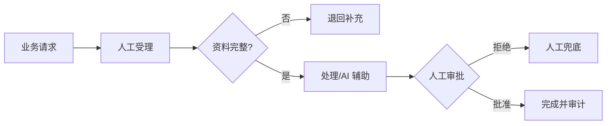

<!-- 本文件由 scripts/generate_course_tutorials.py 生成，请修改阶段计划或生成器后重新生成。 -->

# 第 30 周教程：UAT 与试点

> 计划来源：[09-pilot-production-capstone.md](../stages/09-pilot-production-capstone.md)。阶段文档决定课程任务和验收，本文件解释逐节学习方法；学习状态仍只记录在[第 30 周成果](../../deliverables/week-30/README.md)。

## 本周先理解

### 为什么学

让真实用户和受控流量验证流程价值、可用性与失败恢复，而不只验证模型答案。

### 这是什么

UAT 验证用户任务能否完成；试点在限定人群、流量、版本和停止条件下比较 Baseline、收益、风险与成本。

### 本周学习策略

- 每天只完成下面一节，控制在约 1 小时，不提前堆叠下一节的新概念。
- 先预测再实验；先保存原始证据，再写结论；失败样例与正常结果同等重要。
- 首次遇到术语时补齐：一句话定义、输入输出、开发类比、类比边界、反例和“不是什么”。
- 使用 H1→H4 提示阶梯；若使用完整参考答案，必须额外完成一个不同输入或约束的变体。

## 逐节教程

### 周一 · 第 1 节：准备 UAT 数据和脚本

**为什么学**

本周要让真实用户和受控流量验证流程价值、可用性与失败恢复，而不只验证模型答案。本节把“准备 UAT 数据和脚本”推进为可检查成果；如果跳过，后续会缺少“UAT 数据集和操作脚本”这项关键证据。

**这个是什么**

本周核心概念是：UAT 验证用户任务能否完成；试点在限定人群、流量、版本和停止条件下比较 Baseline、收益、风险与成本。今天的“准备 UAT 数据和脚本”是这个核心能力的最小学习单元：你会通过“从 AS-IS 的真实分布抽取正常、边界和失败案例；脱敏后固定版本”观察输入如何转化为“UAT 数据集和操作脚本”。它既包含可观察结果，也包含至少一个失败或不适用边界。只读完资料或只跑通正常路径，都不能证明已经掌握。

**怎么学（约 60 分钟）**

1. `0–5 分钟`：不查资料，写下你对本节主题的一句话解释、预期输入输出和一个疑问。
2. `5–15 分钟`：只阅读下方资料中与当前任务直接相关的部分，记录一个关键约束和版本信息。
3. `15–45 分钟`：执行专项任务：从 AS-IS 的真实分布抽取正常、边界和失败案例；脱敏后固定版本
4. `45–55 分钟`：主动制造一个错误输入、边界条件、依赖失败或反例，保存现象并解释原因。
5. `55–60 分钟`：整理命令、输入、输出、Diff、图表或访谈证据，并用自己的语言完成 Teach-back。

专项资料：[GOV.UK Moderated Usability Testing](https://www.gov.uk/service-manual/user-research/using-moderated-usability-testing)

**怎么验证学会了**

- 必交证据：UAT 数据集和操作脚本。
- Teach-back：不看资料解释“准备 UAT 数据和脚本”解决什么问题、主要输入输出、一个边界，以及它不是什么。
- 失败证据：展示一个非正常场景，指出失败发生在哪一层，不能只贴错误截图。
- 变体任务：改变一个输入、参数、角色、权限或失败条件，在不照抄原步骤的情况下重新完成。
- 通过标准：以上四项均有证据，且能解释关键取舍；只能照步骤运行时最高算 L1，不能判定本节通过。

**参考答案（独立尝试至少 20 分钟后再看）**

> 这是一份合格答案骨架，不是唯一实现。看完后必须关闭参考答案，换一个输入或约束独立重做。

#### 步骤 1 参考：先写预测

- 一句话解释：UAT 验证用户任务能否完成；试点在限定人群、流量、版本和停止条件下比较 Baseline、收益、风险与成本。
- 预测：完成“准备 UAT 数据和脚本”后，应能观察到“UAT 数据集和操作脚本”；失败输入不应产生假成功。

#### 步骤 2 参考：阅读资料

- 链接：[GOV.UK Moderated Usability Testing](https://www.gov.uk/service-manual/user-research/using-moderated-usability-testing)
- 指定章节/条目：Moderated usability testing → Prepare、Run sessions、Analyse findings
- 阅读方法：只摘录一个定义、一个输入输出约束和一个失败边界；记录页面日期、协议版本或依赖版本。

#### 步骤 3 参考：按专项动作完成产出

- 专项动作：从 AS-IS 的真实分布抽取正常、边界和失败案例；脱敏后固定版本
- 样例代码（先核对课程链接中的当前 API，再按本仓库边界修改）：

```python
def run_case(input_data: dict) -> dict:
    if not input_data:
        return {"status": "FAILED", "error": "EMPTY_INPUT"}
    # Replace this line with the lesson-specific call.
    result = {"observed": input_data, "status": "SUCCEEDED"}
    return result

print(run_case({"case": "normal"}))
print(run_case({}))  # failure case
```

#### 步骤 4 参考：制造失败并解释

- 失败注入：当样本、Owner 或数据来源不足时，把结论标为假设并给出验证计划；不能把模拟结果写成真实业务收益。
- 参考判断：失败必须映射为明确状态、错误、拒答、人工路径或未验证假设；日志和界面不得显示成功。

#### 步骤 5 参考：整理交付与 Teach-back

- 当天交付：UAT 数据集和操作脚本。
- 完整字段：入口；输入类型；输出类型；依赖版本；校验与权限；超时/错误；日志字段；最小测试命令。
- Teach-back 参考：本节输入是什么、经过了什么处理、输出如何验证、哪种失败最危险、为什么当前方案没有越过课程边界。
- 完成后变体：更换一个输入、参数、角色、权限或失败条件，不看上述样例重新完成。


### 周二 · 第 2 节：执行内部 UAT

**为什么学**

本周要让真实用户和受控流量验证流程价值、可用性与失败恢复，而不只验证模型答案。本节把“执行内部 UAT”推进为可检查成果；如果跳过，后续会缺少“问题按严重度分类”这项关键证据。

**这个是什么**

本周核心概念是：UAT 验证用户任务能否完成；试点在限定人群、流量、版本和停止条件下比较 Baseline、收益、风险与成本。今天的“执行内部 UAT”是这个核心能力的最小学习单元：你会通过“观察用户操作路径、理解成本和错误恢复，不只问“好不好用””观察输入如何转化为“问题按严重度分类”。它既包含可观察结果，也包含至少一个失败或不适用边界。只读完资料或只跑通正常路径，都不能证明已经掌握。

**怎么学（约 60 分钟）**

1. `0–5 分钟`：不查资料，写下你对本节主题的一句话解释、预期输入输出和一个疑问。
2. `5–15 分钟`：只阅读下方资料中与当前任务直接相关的部分，记录一个关键约束和版本信息。
3. `15–45 分钟`：执行专项任务：观察用户操作路径、理解成本和错误恢复，不只问“好不好用”
4. `45–55 分钟`：主动制造一个错误输入、边界条件、依赖失败或反例，保存现象并解释原因。
5. `55–60 分钟`：整理命令、输入、输出、Diff、图表或访谈证据，并用自己的语言完成 Teach-back。

专项资料：[GOV.UK Moderated Usability Testing](https://www.gov.uk/service-manual/user-research/using-moderated-usability-testing)

**怎么验证学会了**

- 必交证据：问题按严重度分类。
- Teach-back：不看资料解释“执行内部 UAT”解决什么问题、主要输入输出、一个边界，以及它不是什么。
- 失败证据：展示一个非正常场景，指出失败发生在哪一层，不能只贴错误截图。
- 变体任务：改变一个输入、参数、角色、权限或失败条件，在不照抄原步骤的情况下重新完成。
- 通过标准：以上四项均有证据，且能解释关键取舍；只能照步骤运行时最高算 L1，不能判定本节通过。

**参考答案（独立尝试至少 20 分钟后再看）**

> 这是一份合格答案骨架，不是唯一实现。看完后必须关闭参考答案，换一个输入或约束独立重做。

#### 步骤 1 参考：先写预测

- 一句话解释：UAT 验证用户任务能否完成；试点在限定人群、流量、版本和停止条件下比较 Baseline、收益、风险与成本。
- 预测：完成“执行内部 UAT”后，应能观察到“问题按严重度分类”；失败输入不应产生假成功。

#### 步骤 2 参考：阅读资料

- 链接：[GOV.UK Moderated Usability Testing](https://www.gov.uk/service-manual/user-research/using-moderated-usability-testing)
- 指定章节/条目：Moderated usability testing → Prepare、Run sessions、Analyse findings
- 阅读方法：只摘录一个定义、一个输入输出约束和一个失败边界；记录页面日期、协议版本或依赖版本。

#### 步骤 3 参考：按专项动作完成产出

- 专项动作：观察用户操作路径、理解成本和错误恢复，不只问“好不好用”
- 参考资料/文档产出：

- 主题：执行内部 UAT
- 建议字段：对象；Owner/角色；输入或来源；规则/约束；风险；证据；状态；下一步
- 示例结论：已按统一口径产出“问题按严重度分类”；证据不足的部分标记为假设或未验证。

#### 步骤 4 参考：制造失败并解释

- 失败注入：删掉一个必填输入或让依赖失败，系统应返回可解释的失败结果且不产生假成功；再根据日志、Diff 或流程证据定位原因。
- 参考判断：失败必须映射为明确状态、错误、拒答、人工路径或未验证假设；日志和界面不得显示成功。

#### 步骤 5 参考：整理交付与 Teach-back

- 当天交付：问题按严重度分类。
- 完整字段：对象；Owner/角色；输入或来源；规则/约束；风险；证据；状态；下一步。
- Teach-back 参考：本节输入是什么、经过了什么处理、输出如何验证、哪种失败最危险、为什么当前方案没有越过课程边界。
- 完成后变体：更换一个输入、参数、角色、权限或失败条件，不看上述样例重新完成。


### 周三 · 第 3 节：修复 P0/P1 并回归

**为什么学**

本周要让真实用户和受控流量验证流程价值、可用性与失败恢复，而不只验证模型答案。本节把“修复 P0/P1 并回归”推进为可检查成果；如果跳过，后续会缺少“关键问题关闭有证据”这项关键证据。

**这个是什么**

本周核心概念是：UAT 验证用户任务能否完成；试点在限定人群、流量、版本和停止条件下比较 Baseline、收益、风险与成本。今天的“修复 P0/P1 并回归”是这个核心能力的最小学习单元：你会通过“每个修复先增加回归用例；不要在试点前大范围更换模型或架构”观察输入如何转化为“关键问题关闭有证据”。它既包含可观察结果，也包含至少一个失败或不适用边界。重点边界来自课程原计划：不要在试点前大范围更换模型或架构。

**怎么学（约 60 分钟）**

1. `0–5 分钟`：不查资料，写下你对本节主题的一句话解释、预期输入输出和一个疑问。
2. `5–15 分钟`：只阅读下方资料中与当前任务直接相关的部分，记录一个关键约束和版本信息。
3. `15–45 分钟`：执行专项任务：每个修复先增加回归用例；不要在试点前大范围更换模型或架构
4. `45–55 分钟`：主动制造一个错误输入、边界条件、依赖失败或反例，保存现象并解释原因。
5. `55–60 分钟`：整理命令、输入、输出、Diff、图表或访谈证据，并用自己的语言完成 Teach-back。

专项资料：[Google SRE：Testing for Reliability](https://sre.google/sre-book/testing-reliability/)

**怎么验证学会了**

- 必交证据：关键问题关闭有证据。
- Teach-back：不看资料解释“修复 P0/P1 并回归”解决什么问题、主要输入输出、一个边界，以及它不是什么。
- 失败证据：展示一个非正常场景，指出失败发生在哪一层，不能只贴错误截图。
- 变体任务：改变一个输入、参数、角色、权限或失败条件，在不照抄原步骤的情况下重新完成。
- 通过标准：以上四项均有证据，且能解释关键取舍；只能照步骤运行时最高算 L1，不能判定本节通过。

**参考答案（独立尝试至少 20 分钟后再看）**

> 这是一份合格答案骨架，不是唯一实现。看完后必须关闭参考答案，换一个输入或约束独立重做。

#### 步骤 1 参考：先写预测

- 一句话解释：UAT 验证用户任务能否完成；试点在限定人群、流量、版本和停止条件下比较 Baseline、收益、风险与成本。
- 预测：完成“修复 P0/P1 并回归”后，应能观察到“关键问题关闭有证据”；失败输入不应产生假成功。

#### 步骤 2 参考：阅读资料

- 链接：[Google SRE：Testing for Reliability](https://sre.google/sre-book/testing-reliability/)
- 指定章节/条目：该链接指向的“Google SRE：Testing for Reliability”整篇专题/章节；重点阅读与“修复 P0/P1 并回归”直接对应的段落，页面更新时使用课程标题中的英文术语或 API 名页内搜索
- 阅读方法：只摘录一个定义、一个输入输出约束和一个失败边界；记录页面日期、协议版本或依赖版本。

#### 步骤 3 参考：按专项动作完成产出

- 专项动作：每个修复先增加回归用例；不要在试点前大范围更换模型或架构
- 参考资料/文档产出：

- 主题：修复 P0/P1 并回归
- 建议字段：用例 ID；前置条件；输入/故障；预期状态；关键断言；实际结果；日志或 Trace；是否通过
- 示例结论：已按统一口径产出“关键问题关闭有证据”；证据不足的部分标记为假设或未验证。

#### 步骤 4 参考：制造失败并解释

- 失败注入：当样本、Owner 或数据来源不足时，把结论标为假设并给出验证计划；不能把模拟结果写成真实业务收益。
- 参考判断：失败必须映射为明确状态、错误、拒答、人工路径或未验证假设；日志和界面不得显示成功。

#### 步骤 5 参考：整理交付与 Teach-back

- 当天交付：关键问题关闭有证据。
- 完整字段：用例 ID；前置条件；输入/故障；预期状态；关键断言；实际结果；日志或 Trace；是否通过。
- Teach-back 参考：本节输入是什么、经过了什么处理、输出如何验证、哪种失败最危险、为什么当前方案没有越过课程边界。
- 完成后变体：更换一个输入、参数、角色、权限或失败条件，不看上述样例重新完成。


### 周四 · 第 4 节：小流量或影子试点

**为什么学**

本周要让真实用户和受控流量验证流程价值、可用性与失败恢复，而不只验证模型答案。本节把“小流量或影子试点”推进为可检查成果；如果跳过，后续会缺少“试点流量和版本可追踪”这项关键证据。

**这个是什么**

本周核心概念是：UAT 验证用户任务能否完成；试点在限定人群、流量、版本和停止条件下比较 Baseline、收益、风险与成本。今天的“小流量或影子试点”是这个核心能力的最小学习单元：你会通过“首选建议模式或影子模式验证准确性；高风险动作继续人工审批”观察输入如何转化为“试点流量和版本可追踪”。它既包含可观察结果，也包含至少一个失败或不适用边界。只读完资料或只跑通正常路径，都不能证明已经掌握。

**怎么学（约 60 分钟）**

1. `0–5 分钟`：不查资料，写下你对本节主题的一句话解释、预期输入输出和一个疑问。
2. `5–15 分钟`：只阅读下方资料中与当前任务直接相关的部分，记录一个关键约束和版本信息。
3. `15–45 分钟`：执行专项任务：首选建议模式或影子模式验证准确性；高风险动作继续人工审批
4. `45–55 分钟`：主动制造一个错误输入、边界条件、依赖失败或反例，保存现象并解释原因。
5. `55–60 分钟`：整理命令、输入、输出、Diff、图表或访谈证据，并用自己的语言完成 Teach-back。

专项资料：[GOV.UK Beta Phase](https://www.gov.uk/service-manual/agile-delivery/how-the-beta-phase-works)

**怎么验证学会了**

- 必交证据：试点流量和版本可追踪。
- Teach-back：不看资料解释“小流量或影子试点”解决什么问题、主要输入输出、一个边界，以及它不是什么。
- 失败证据：展示一个非正常场景，指出失败发生在哪一层，不能只贴错误截图。
- 变体任务：改变一个输入、参数、角色、权限或失败条件，在不照抄原步骤的情况下重新完成。
- 通过标准：以上四项均有证据，且能解释关键取舍；只能照步骤运行时最高算 L1，不能判定本节通过。

**参考答案（独立尝试至少 20 分钟后再看）**

> 这是一份合格答案骨架，不是唯一实现。看完后必须关闭参考答案，换一个输入或约束独立重做。

#### 步骤 1 参考：先写预测

- 一句话解释：UAT 验证用户任务能否完成；试点在限定人群、流量、版本和停止条件下比较 Baseline、收益、风险与成本。
- 预测：完成“小流量或影子试点”后，应能观察到“试点流量和版本可追踪”；失败输入不应产生假成功。

#### 步骤 2 参考：阅读资料

- 链接：[GOV.UK Beta Phase](https://www.gov.uk/service-manual/agile-delivery/how-the-beta-phase-works)
- 指定章节/条目：该链接指向的“GOV.UK Beta Phase”整篇专题/章节；重点阅读与“小流量或影子试点”直接对应的段落，页面更新时使用课程标题中的英文术语或 API 名页内搜索
- 阅读方法：只摘录一个定义、一个输入输出约束和一个失败边界；记录页面日期、协议版本或依赖版本。

#### 步骤 3 参考：按专项动作完成产出

- 专项动作：首选建议模式或影子模式验证准确性；高风险动作继续人工审批
- 参考资料/文档产出：

- 主题：小流量或影子试点
- 建议字段：一句话定义；输入；操作；可观察输出；失败/反例；工程意义；证据位置
- 示例结论：已按统一口径产出“试点流量和版本可追踪”；证据不足的部分标记为假设或未验证。

#### 步骤 4 参考：制造失败并解释

- 失败注入：删除身份、Scope 或审批后再次执行，正确结果应是执行路径明确拒绝且留下脱敏审计；如果仍成功，就是权限边界失效。
- 参考判断：失败必须映射为明确状态、错误、拒答、人工路径或未验证假设；日志和界面不得显示成功。

#### 步骤 5 参考：整理交付与 Teach-back

- 当天交付：试点流量和版本可追踪。
- 完整字段：一句话定义；输入；操作；可观察输出；失败/反例；工程意义；证据位置。
- Teach-back 参考：本节输入是什么、经过了什么处理、输出如何验证、哪种失败最危险、为什么当前方案没有越过课程边界。
- 完成后变体：更换一个输入、参数、角色、权限或失败条件，不看上述样例重新完成。


### 周五 · 第 5 节：监控业务与 AI 指标

**为什么学**

本周要让真实用户和受控流量验证流程价值、可用性与失败恢复，而不只验证模型答案。本节把“监控业务与 AI 指标”推进为可检查成果；如果跳过，后续会缺少“日报可从数据生成”这项关键证据。

**这个是什么**

本周核心概念是：UAT 验证用户任务能否完成；试点在限定人群、流量、版本和停止条件下比较 Baseline、收益、风险与成本。今天的“监控业务与 AI 指标”是这个核心能力的最小学习单元：你会通过“同时观察处理时间、返工、采纳率、完成率、越权、延迟和成本”观察输入如何转化为“日报可从数据生成”。它既包含可观察结果，也包含至少一个失败或不适用边界。只读完资料或只跑通正常路径，都不能证明已经掌握。

**怎么学（约 60 分钟）**

1. `0–5 分钟`：不查资料，写下你对本节主题的一句话解释、预期输入输出和一个疑问。
2. `5–15 分钟`：只阅读下方资料中与当前任务直接相关的部分，记录一个关键约束和版本信息。
3. `15–45 分钟`：执行专项任务：同时观察处理时间、返工、采纳率、完成率、越权、延迟和成本
4. `45–55 分钟`：主动制造一个错误输入、边界条件、依赖失败或反例，保存现象并解释原因。
5. `55–60 分钟`：整理命令、输入、输出、Diff、图表或访谈证据，并用自己的语言完成 Teach-back。

专项资料：[GOV.UK Measuring Success](https://www.gov.uk/service-manual/measuring-success)

**怎么验证学会了**

- 必交证据：日报可从数据生成。
- Teach-back：不看资料解释“监控业务与 AI 指标”解决什么问题、主要输入输出、一个边界，以及它不是什么。
- 失败证据：展示一个非正常场景，指出失败发生在哪一层，不能只贴错误截图。
- 变体任务：改变一个输入、参数、角色、权限或失败条件，在不照抄原步骤的情况下重新完成。
- 通过标准：以上四项均有证据，且能解释关键取舍；只能照步骤运行时最高算 L1，不能判定本节通过。

**参考答案（独立尝试至少 20 分钟后再看）**

> 这是一份合格答案骨架，不是唯一实现。看完后必须关闭参考答案，换一个输入或约束独立重做。

#### 步骤 1 参考：先写预测

- 一句话解释：UAT 验证用户任务能否完成；试点在限定人群、流量、版本和停止条件下比较 Baseline、收益、风险与成本。
- 预测：完成“监控业务与 AI 指标”后，应能观察到“日报可从数据生成”；失败输入不应产生假成功。

#### 步骤 2 参考：阅读资料

- 链接：[GOV.UK Measuring Success](https://www.gov.uk/service-manual/measuring-success)
- 指定章节/条目：该链接指向的“GOV.UK Measuring Success”整篇专题/章节；重点阅读与“监控业务与 AI 指标”直接对应的段落，页面更新时使用课程标题中的英文术语或 API 名页内搜索
- 阅读方法：只摘录一个定义、一个输入输出约束和一个失败边界；记录页面日期、协议版本或依赖版本。

#### 步骤 3 参考：按专项动作完成产出

- 专项动作：同时观察处理时间、返工、采纳率、完成率、越权、延迟和成本
- 参考资料/文档产出：

- 主题：监控业务与 AI 指标
- 建议字段：指标名称；计算公式；数据来源；样本与时间窗；当前值；目标/阈值；限制与未验证项
- 示例结论：已按统一口径产出“日报可从数据生成”；证据不足的部分标记为假设或未验证。

#### 步骤 4 参考：制造失败并解释

- 失败注入：当样本、Owner 或数据来源不足时，把结论标为假设并给出验证计划；不能把模拟结果写成真实业务收益。
- 参考判断：失败必须映射为明确状态、错误、拒答、人工路径或未验证假设；日志和界面不得显示成功。

#### 步骤 5 参考：整理交付与 Teach-back

- 当天交付：日报可从数据生成。
- 完整字段：指标名称；计算公式；数据来源；样本与时间窗；当前值；目标/阈值；限制与未验证项。
- Teach-back 参考：本节输入是什么、经过了什么处理、输出如何验证、哪种失败最危险、为什么当前方案没有越过课程边界。
- 完成后变体：更换一个输入、参数、角色、权限或失败条件，不看上述样例重新完成。


### 周六 · 第 6 节：用户反馈与失败分析

**为什么学**

本周要让真实用户和受控流量验证流程价值、可用性与失败恢复，而不只验证模型答案。本节把“用户反馈与失败分析”推进为可检查成果；如果跳过，后续会缺少“失败分类和优先级”这项关键证据。

**这个是什么**

本周核心概念是：UAT 验证用户任务能否完成；试点在限定人群、流量、版本和停止条件下比较 Baseline、收益、风险与成本。今天的“用户反馈与失败分析”是这个核心能力的最小学习单元：你会通过“将反馈映射到流程、知识、模型、工具、界面或培训，不把所有问题归因于 Prompt”观察输入如何转化为“失败分类和优先级”。它既包含可观察结果，也包含至少一个失败或不适用边界。只读完资料或只跑通正常路径，都不能证明已经掌握。

**怎么学（约 60 分钟）**

1. `0–5 分钟`：不查资料，写下你对本节主题的一句话解释、预期输入输出和一个疑问。
2. `5–15 分钟`：只阅读下方资料中与当前任务直接相关的部分，记录一个关键约束和版本信息。
3. `15–45 分钟`：执行专项任务：将反馈映射到流程、知识、模型、工具、界面或培训，不把所有问题归因于 Prompt
4. `45–55 分钟`：主动制造一个错误输入、边界条件、依赖失败或反例，保存现象并解释原因。
5. `55–60 分钟`：整理命令、输入、输出、Diff、图表或访谈证据，并用自己的语言完成 Teach-back。

专项资料：[GOV.UK Discovery 用户研究](https://www.gov.uk/service-manual/user-research/user-research-in-discovery)

**怎么验证学会了**

- 必交证据：失败分类和优先级。
- Teach-back：不看资料解释“用户反馈与失败分析”解决什么问题、主要输入输出、一个边界，以及它不是什么。
- 失败证据：展示一个非正常场景，指出失败发生在哪一层，不能只贴错误截图。
- 变体任务：改变一个输入、参数、角色、权限或失败条件，在不照抄原步骤的情况下重新完成。
- 通过标准：以上四项均有证据，且能解释关键取舍；只能照步骤运行时最高算 L1，不能判定本节通过。

**参考答案（独立尝试至少 20 分钟后再看）**

> 这是一份合格答案骨架，不是唯一实现。看完后必须关闭参考答案，换一个输入或约束独立重做。

#### 步骤 1 参考：先写预测

- 一句话解释：UAT 验证用户任务能否完成；试点在限定人群、流量、版本和停止条件下比较 Baseline、收益、风险与成本。
- 预测：完成“用户反馈与失败分析”后，应能观察到“失败分类和优先级”；失败输入不应产生假成功。

#### 步骤 2 参考：阅读资料

- 链接：[GOV.UK Discovery 用户研究](https://www.gov.uk/service-manual/user-research/user-research-in-discovery)
- 指定章节/条目：该链接指向的“GOV.UK Discovery 用户研究”整篇专题/章节；重点阅读与“用户反馈与失败分析”直接对应的段落，页面更新时使用课程标题中的英文术语或 API 名页内搜索
- 阅读方法：只摘录一个定义、一个输入输出约束和一个失败边界；记录页面日期、协议版本或依赖版本。

#### 步骤 3 参考：按专项动作完成产出

- 专项动作：将反馈映射到流程、知识、模型、工具、界面或培训，不把所有问题归因于 Prompt
- 参考资料/文档产出：

- 主题：用户反馈与失败分析
- 建议字段：对象；Owner/角色；输入或来源；规则/约束；风险；证据；状态；下一步
- 示例结论：已按统一口径产出“失败分类和优先级”；证据不足的部分标记为假设或未验证。

#### 步骤 4 参考：制造失败并解释

- 失败注入：加入无答案、非法 Schema、超时或工具失败输入，正确结果应是拒答或稳定失败状态；如果输出看似正常但证据缺失，应判为失败。
- 参考判断：失败必须映射为明确状态、错误、拒答、人工路径或未验证假设；日志和界面不得显示成功。

#### 步骤 5 参考：整理交付与 Teach-back

- 当天交付：失败分类和优先级。
- 完整字段：对象；Owner/角色；输入或来源；规则/约束；风险；证据；状态；下一步。
- Teach-back 参考：本节输入是什么、经过了什么处理、输出如何验证、哪种失败最危险、为什么当前方案没有越过课程边界。
- 完成后变体：更换一个输入、参数、角色、权限或失败条件，不看上述样例重新完成。


### 周日 · 第 7 节：TO-BE 流程验证

**为什么学**

本周要让真实用户和受控流量验证流程价值、可用性与失败恢复，而不只验证模型答案。本节把“TO-BE 流程验证”推进为可检查成果；如果跳过，后续会缺少“完成本周提交”这项关键证据。

**这个是什么**

本周核心概念是：UAT 验证用户任务能否完成；试点在限定人群、流量、版本和停止条件下比较 Baseline、收益、风险与成本。今天的“TO-BE 流程验证”是这个核心能力的最小学习单元：你会通过“对比 Baseline，检查流程是否真的减少等待和交接；收益不足则调整或停止”观察输入如何转化为“完成本周提交”。它既包含可观察结果，也包含至少一个失败或不适用边界。只读完资料或只跑通正常路径，都不能证明已经掌握。

**怎么学（约 60 分钟）**

1. `0–5 分钟`：不查资料，写下你对本节主题的一句话解释、预期输入输出和一个疑问。
2. `5–15 分钟`：只阅读下方资料中与当前任务直接相关的部分，记录一个关键约束和版本信息。
3. `15–45 分钟`：执行专项任务：对比 Baseline，检查流程是否真的减少等待和交接；收益不足则调整或停止
4. `45–55 分钟`：主动制造一个错误输入、边界条件、依赖失败或反例，保存现象并解释原因。
5. `55–60 分钟`：整理命令、输入、输出、Diff、图表或访谈证据，并用自己的语言完成 Teach-back。

专项资料：[GOV.UK Measuring Success](https://www.gov.uk/service-manual/measuring-success)

**怎么验证学会了**

- 必交证据：完成本周提交。
- Teach-back：不看资料解释“TO-BE 流程验证”解决什么问题、主要输入输出、一个边界，以及它不是什么。
- 失败证据：展示一个非正常场景，指出失败发生在哪一层，不能只贴错误截图。
- 变体任务：改变一个输入、参数、角色、权限或失败条件，在不照抄原步骤的情况下重新完成。
- 通过标准：以上四项均有证据，且能解释关键取舍；只能照步骤运行时最高算 L1，不能判定本节通过。

**参考答案（独立尝试至少 20 分钟后再看）**

> 这是一份合格答案骨架，不是唯一实现。看完后必须关闭参考答案，换一个输入或约束独立重做。

#### 步骤 1 参考：先写预测

- 一句话解释：UAT 验证用户任务能否完成；试点在限定人群、流量、版本和停止条件下比较 Baseline、收益、风险与成本。
- 预测：完成“TO-BE 流程验证”后，应能观察到“完成本周提交”；失败输入不应产生假成功。

#### 步骤 2 参考：阅读资料

- 链接：[GOV.UK Measuring Success](https://www.gov.uk/service-manual/measuring-success)
- 指定章节/条目：BPMN 2.0 → Flow Objects、Connecting Objects、Pools and Lanes、Events
- 阅读方法：只摘录一个定义、一个输入输出约束和一个失败边界；记录页面日期、协议版本或依赖版本。

#### 步骤 3 参考：按专项动作完成产出

- 专项动作：对比 Baseline，检查流程是否真的减少等待和交接；收益不足则调整或停止
- 参考图（按实际角色、字段和状态修改）：



#### 步骤 4 参考：制造失败并解释

- 失败注入：当样本、Owner 或数据来源不足时，把结论标为假设并给出验证计划；不能把模拟结果写成真实业务收益。
- 参考判断：失败必须映射为明确状态、错误、拒答、人工路径或未验证假设；日志和界面不得显示成功。

#### 步骤 5 参考：整理交付与 Teach-back

- 当天交付：完成本周提交。
- 完整字段：指标名称；计算公式；数据来源；样本与时间窗；当前值；目标/阈值；限制与未验证项。
- Teach-back 参考：本节输入是什么、经过了什么处理、输出如何验证、哪种失败最危险、为什么当前方案没有越过课程边界。
- 完成后变体：更换一个输入、参数、角色、权限或失败条件，不看上述样例重新完成。


## 本周收尾

按[成果与提交标准](../06-deliverable-standards.md)整理本周成果，再由讲师按[监督与掌握度规范](../07-instructor-supervision.md)给出“通过、部分通过、未通过”。教程完成不代表学习者已经掌握，必须以独立运行、排错、Teach-back 和变体证据为准。
