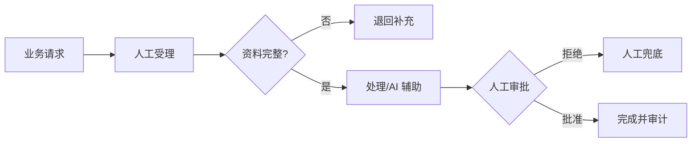

<!-- 本文件由 scripts/generate_course_tutorials.py 生成，请修改阶段计划或生成器后重新生成。 -->

# 第 31 周教程：生产硬化

> 计划来源：[09-pilot-production-capstone.md](../stages/09-pilot-production-capstone.md)。阶段文档决定课程任务和验收，本文件解释逐节学习方法；学习状态仍只记录在[第 31 周成果](../../deliverables/week-31/README.md)。

## 本周先理解

### 为什么学

在发布前通过压测、攻击、恢复和运行交接证明关键故障可发现、可止损、可恢复。

### 这是什么

生产硬化覆盖环境与 Secret、容量、限流、安全回归、备份恢复、告警、Runbook 和发布门禁。

### 本周语言定位

组合 Java 控制面/业务 Connector、Python Agent 执行面和按需 TypeScript 控制台，所有端到端状态与回滚必须可验证。完整职责、切换桥接和替代规则见[开发语言路线](../01-language-roadmap.md)。

### 本周学习策略

- 每天只完成下面一节，控制在约 1 小时，不提前堆叠下一节的新概念。
- 先预测再实验；先保存原始证据，再写结论；失败样例与正常结果同等重要。
- 首次遇到术语时补齐：一句话定义、输入输出、开发类比、类比边界、反例和“不是什么”。
- 使用 H1→H4 提示阶梯；若使用完整参考答案，必须额外完成一个不同输入或约束的变体。

## 逐节教程

### 周一 · 第 1 节：配置、Secret 与环境隔离

**为什么学**

本周要在发布前通过压测、攻击、恢复和运行交接证明关键故障可发现、可止损、可恢复。本节把“配置、Secret 与环境隔离”推进为可检查成果；如果跳过，后续会缺少“密钥扫描和配置审查通过”这项关键证据。

**这个是什么**

本周核心概念是：生产硬化覆盖环境与 Secret、容量、限流、安全回归、备份恢复、告警、Runbook 和发布门禁。今天的“配置、Secret 与环境隔离”是这个核心能力的最小学习单元：你会通过“开发、测试、生产配置分离；Secret 只用引用；检查日志、Trace 和错误响应泄露”观察输入如何转化为“密钥扫描和配置审查通过”。它既包含可观察结果，也包含至少一个失败或不适用边界。只读完资料或只跑通正常路径，都不能证明已经掌握。

**怎么学（约 60 分钟）**

1. `0–5 分钟`：不查资料，写下你对本节主题的一句话解释、预期输入输出和一个疑问。
2. `5–15 分钟`：只阅读下方资料中与当前任务直接相关的部分，记录一个关键约束和版本信息。
3. `15–45 分钟`：执行专项任务：开发、测试、生产配置分离；Secret 只用引用；检查日志、Trace 和错误响应泄露
4. `45–55 分钟`：主动制造一个错误输入、边界条件、依赖失败或反例，保存现象并解释原因。
5. `55–60 分钟`：整理命令、输入、输出、Diff、图表或访谈证据，并用自己的语言完成 Teach-back。

专项资料：[OWASP Secrets Management](https://cheatsheetseries.owasp.org/cheatsheets/Secrets_Management_Cheat_Sheet.html)

**怎么验证学会了**

- 必交证据：密钥扫描和配置审查通过。
- Teach-back：不看资料解释“配置、Secret 与环境隔离”解决什么问题、主要输入输出、一个边界，以及它不是什么。
- 失败证据：展示一个非正常场景，指出失败发生在哪一层，不能只贴错误截图。
- 变体任务：改变一个输入、参数、角色、权限或失败条件，在不照抄原步骤的情况下重新完成。
- 通过标准：以上四项均有证据，且能解释关键取舍；只能照步骤运行时最高算 L1，不能判定本节通过。

**参考答案（独立尝试至少 20 分钟后再看）**

> 这是一份合格答案骨架，不是唯一实现。看完后必须关闭参考答案，换一个输入或约束独立重做。

#### 步骤 1 参考：先写预测

- 一句话解释：生产硬化覆盖环境与 Secret、容量、限流、安全回归、备份恢复、告警、Runbook 和发布门禁。
- 预测：完成“配置、Secret 与环境隔离”后，应能观察到“密钥扫描和配置审查通过”；失败输入不应产生假成功。

#### 步骤 2 参考：阅读资料

- 链接：[OWASP Secrets Management](https://cheatsheetseries.owasp.org/cheatsheets/Secrets_Management_Cheat_Sheet.html)
- 指定章节/条目：该链接指向的“OWASP Secrets Management”整篇专题/章节；重点阅读与“配置、Secret 与环境隔离”直接对应的段落，页面更新时使用课程标题中的英文术语或 API 名页内搜索
- 阅读方法：只摘录一个定义、一个输入输出约束和一个失败边界；记录页面日期、协议版本或依赖版本。

#### 步骤 3 参考：按专项动作完成产出

- 专项动作：开发、测试、生产配置分离；Secret 只用引用；检查日志、Trace 和错误响应泄露
- 样例代码（先核对课程链接中的当前 API，再按本仓库边界修改）：

```java
record LessonCommand(String projectId, String requestId, String payload) {}
record LessonResult(String status, String evidence) {}

@Service
final class LessonService {
    LessonResult execute(LessonCommand command) {
        if (command.projectId() == null || command.projectId().isBlank()) {
            throw new IllegalArgumentException("PROJECT_REQUIRED");
        }
        // TODO: 实现“配置、Secret 与环境隔离”，并在执行路径校验权限、版本和幂等约束。
        return new LessonResult("SUCCEEDED", "密钥扫描和配置审查通过");
    }
}
```

#### 步骤 4 参考：制造失败并解释

- 失败注入：删除身份、Scope 或审批后再次执行，正确结果应是执行路径明确拒绝且留下脱敏审计；如果仍成功，就是权限边界失效。
- 参考判断：失败必须映射为明确状态、错误、拒答、人工路径或未验证假设；日志和界面不得显示成功。

#### 步骤 5 参考：整理交付与 Teach-back

- 当天交付：密钥扫描和配置审查通过。
- 完整字段：运行时与依赖版本；配置键；Secret 引用方式；示例占位值；启动命令；缺失配置的错误；泄露检查。
- Teach-back 参考：本节输入是什么、经过了什么处理、输出如何验证、哪种失败最危险、为什么当前方案没有越过课程边界。
- 完成后变体：更换一个输入、参数、角色、权限或失败条件，不看上述样例重新完成。


### 周二 · 第 2 节：容量、限流与降级演练

**为什么学**

本周要在发布前通过压测、攻击、恢复和运行交接证明关键故障可发现、可止损、可恢复。本节把“容量、限流与降级演练”推进为可检查成果；如果跳过，后续会缺少“有容量边界和降级证据”这项关键证据。

**这个是什么**

本周核心概念是：生产硬化覆盖环境与 Secret、容量、限流、安全回归、备份恢复、告警、Runbook 和发布门禁。今天的“容量、限流与降级演练”是这个核心能力的最小学习单元：你会通过“按试点峰值倍数压测；触发模型限流和外部系统慢响应，验证队列和用户提示”观察输入如何转化为“有容量边界和降级证据”。它既包含可观察结果，也包含至少一个失败或不适用边界。只读完资料或只跑通正常路径，都不能证明已经掌握。

**怎么学（约 60 分钟）**

1. `0–5 分钟`：不查资料，写下你对本节主题的一句话解释、预期输入输出和一个疑问。
2. `5–15 分钟`：只阅读下方资料中与当前任务直接相关的部分，记录一个关键约束和版本信息。
3. `15–45 分钟`：执行专项任务：按试点峰值倍数压测；触发模型限流和外部系统慢响应，验证队列和用户提示
4. `45–55 分钟`：主动制造一个错误输入、边界条件、依赖失败或反例，保存现象并解释原因。
5. `55–60 分钟`：整理命令、输入、输出、Diff、图表或访谈证据，并用自己的语言完成 Teach-back。

专项资料：[Grafana k6 Documentation](https://grafana.com/docs/k6/latest/)

**怎么验证学会了**

- 必交证据：有容量边界和降级证据。
- Teach-back：不看资料解释“容量、限流与降级演练”解决什么问题、主要输入输出、一个边界，以及它不是什么。
- 失败证据：展示一个非正常场景，指出失败发生在哪一层，不能只贴错误截图。
- 变体任务：改变一个输入、参数、角色、权限或失败条件，在不照抄原步骤的情况下重新完成。
- 通过标准：以上四项均有证据，且能解释关键取舍；只能照步骤运行时最高算 L1，不能判定本节通过。

**参考答案（独立尝试至少 20 分钟后再看）**

> 这是一份合格答案骨架，不是唯一实现。看完后必须关闭参考答案，换一个输入或约束独立重做。

#### 步骤 1 参考：先写预测

- 一句话解释：生产硬化覆盖环境与 Secret、容量、限流、安全回归、备份恢复、告警、Runbook 和发布门禁。
- 预测：完成“容量、限流与降级演练”后，应能观察到“有容量边界和降级证据”；失败输入不应产生假成功。

#### 步骤 2 参考：阅读资料

- 链接：[Grafana k6 Documentation](https://grafana.com/docs/k6/latest/)
- 指定章节/条目：RFC 9333 → RateLimit-Limit、RateLimit-Remaining、RateLimit-Reset
- 阅读方法：只摘录一个定义、一个输入输出约束和一个失败边界；记录页面日期、协议版本或依赖版本。

#### 步骤 3 参考：按专项动作完成产出

- 专项动作：按试点峰值倍数压测；触发模型限流和外部系统慢响应，验证队列和用户提示
- 参考资料/文档产出：

- 主题：容量、限流与降级演练
- 建议字段：指标名称；计算公式；数据来源；样本与时间窗；当前值；目标/阈值；限制与未验证项
- 示例结论：已按统一口径产出“有容量边界和降级证据”；证据不足的部分标记为假设或未验证。

#### 步骤 4 参考：制造失败并解释

- 失败注入：当样本、Owner 或数据来源不足时，把结论标为假设并给出验证计划；不能把模拟结果写成真实业务收益。
- 参考判断：失败必须映射为明确状态、错误、拒答、人工路径或未验证假设；日志和界面不得显示成功。

#### 步骤 5 参考：整理交付与 Teach-back

- 当天交付：有容量边界和降级证据。
- 完整字段：指标名称；计算公式；数据来源；样本与时间窗；当前值；目标/阈值；限制与未验证项。
- Teach-back 参考：本节输入是什么、经过了什么处理、输出如何验证、哪种失败最危险、为什么当前方案没有越过课程边界。
- 完成后变体：更换一个输入、参数、角色、权限或失败条件，不看上述样例重新完成。


### 周三 · 第 3 节：安全攻击回归

**为什么学**

本周要在发布前通过压测、攻击、恢复和运行交接证明关键故障可发现、可止损、可恢复。本节把“安全攻击回归”推进为可检查成果；如果跳过，后续会缺少“安全回归报告”这项关键证据。

**这个是什么**

本周核心概念是：生产硬化覆盖环境与 Secret、容量、限流、安全回归、备份恢复、告警、Runbook 和发布门禁。今天的“安全攻击回归”是这个核心能力的最小学习单元：你会通过“运行 Prompt Injection、越权、工具投毒、路径和命令攻击集；新版本不得降低阻断率”观察输入如何转化为“安全回归报告”。它既包含可观察结果，也包含至少一个失败或不适用边界。只读完资料或只跑通正常路径，都不能证明已经掌握。

**怎么学（约 60 分钟）**

1. `0–5 分钟`：不查资料，写下你对本节主题的一句话解释、预期输入输出和一个疑问。
2. `5–15 分钟`：只阅读下方资料中与当前任务直接相关的部分，记录一个关键约束和版本信息。
3. `15–45 分钟`：执行专项任务：运行 Prompt Injection、越权、工具投毒、路径和命令攻击集；新版本不得降低阻断率
4. `45–55 分钟`：主动制造一个错误输入、边界条件、依赖失败或反例，保存现象并解释原因。
5. `55–60 分钟`：整理命令、输入、输出、Diff、图表或访谈证据，并用自己的语言完成 Teach-back。

专项资料：[OWASP Agentic AI Top 10](https://genai.owasp.org/resource/owasp-top-10-for-agentic-applications-for-2026/)

**怎么验证学会了**

- 必交证据：安全回归报告。
- Teach-back：不看资料解释“安全攻击回归”解决什么问题、主要输入输出、一个边界，以及它不是什么。
- 失败证据：展示一个非正常场景，指出失败发生在哪一层，不能只贴错误截图。
- 变体任务：改变一个输入、参数、角色、权限或失败条件，在不照抄原步骤的情况下重新完成。
- 通过标准：以上四项均有证据，且能解释关键取舍；只能照步骤运行时最高算 L1，不能判定本节通过。

**参考答案（独立尝试至少 20 分钟后再看）**

> 这是一份合格答案骨架，不是唯一实现。看完后必须关闭参考答案，换一个输入或约束独立重做。

#### 步骤 1 参考：先写预测

- 一句话解释：生产硬化覆盖环境与 Secret、容量、限流、安全回归、备份恢复、告警、Runbook 和发布门禁。
- 预测：完成“安全攻击回归”后，应能观察到“安全回归报告”；失败输入不应产生假成功。

#### 步骤 2 参考：阅读资料

- 链接：[OWASP Agentic AI Top 10](https://genai.owasp.org/resource/owasp-top-10-for-agentic-applications-for-2026/)
- 指定章节/条目：该链接指向的“OWASP Agentic AI Top 10”整篇专题/章节；重点阅读与“安全攻击回归”直接对应的段落，页面更新时使用课程标题中的英文术语或 API 名页内搜索
- 阅读方法：只摘录一个定义、一个输入输出约束和一个失败边界；记录页面日期、协议版本或依赖版本。

#### 步骤 3 参考：按专项动作完成产出

- 专项动作：运行 Prompt Injection、越权、工具投毒、路径和命令攻击集；新版本不得降低阻断率
- 参考资料/文档产出：

- 主题：安全攻击回归
- 建议字段：用例 ID；前置条件；输入/故障；预期状态；关键断言；实际结果；日志或 Trace；是否通过
- 示例结论：已按统一口径产出“安全回归报告”；证据不足的部分标记为假设或未验证。

#### 步骤 4 参考：制造失败并解释

- 失败注入：删除身份、Scope 或审批后再次执行，正确结果应是执行路径明确拒绝且留下脱敏审计；如果仍成功，就是权限边界失效。
- 参考判断：失败必须映射为明确状态、错误、拒答、人工路径或未验证假设；日志和界面不得显示成功。

#### 步骤 5 参考：整理交付与 Teach-back

- 当天交付：安全回归报告。
- 完整字段：用例 ID；前置条件；输入/故障；预期状态；关键断言；实际结果；日志或 Trace；是否通过。
- Teach-back 参考：本节输入是什么、经过了什么处理、输出如何验证、哪种失败最危险、为什么当前方案没有越过课程边界。
- 完成后变体：更换一个输入、参数、角色、权限或失败条件，不看上述样例重新完成。


### 周四 · 第 4 节：备份、恢复和回滚

**为什么学**

本周要在发布前通过压测、攻击、恢复和运行交接证明关键故障可发现、可止损、可恢复。本节把“备份、恢复和回滚”推进为可检查成果；如果跳过，后续会缺少“RTO/RPO 或实测恢复时间”这项关键证据。

**这个是什么**

本周核心概念是：生产硬化覆盖环境与 Secret、容量、限流、安全回归、备份恢复、告警、Runbook 和发布门禁。今天的“备份、恢复和回滚”是这个核心能力的最小学习单元：你会通过“恢复元数据、Checkpoint 与关键配置；演练 Agent/Workflow 回滚和业务开关”观察输入如何转化为“RTO/RPO 或实测恢复时间”。它既包含可观察结果，也包含至少一个失败或不适用边界。只读完资料或只跑通正常路径，都不能证明已经掌握。

**怎么学（约 60 分钟）**

1. `0–5 分钟`：不查资料，写下你对本节主题的一句话解释、预期输入输出和一个疑问。
2. `5–15 分钟`：只阅读下方资料中与当前任务直接相关的部分，记录一个关键约束和版本信息。
3. `15–45 分钟`：执行专项任务：恢复元数据、Checkpoint 与关键配置；演练 Agent/Workflow 回滚和业务开关
4. `45–55 分钟`：主动制造一个错误输入、边界条件、依赖失败或反例，保存现象并解释原因。
5. `55–60 分钟`：整理命令、输入、输出、Diff、图表或访谈证据，并用自己的语言完成 Teach-back。

专项资料：[PostgreSQL Backup and Restore](https://www.postgresql.org/docs/current/backup.html)

**怎么验证学会了**

- 必交证据：RTO/RPO 或实测恢复时间。
- Teach-back：不看资料解释“备份、恢复和回滚”解决什么问题、主要输入输出、一个边界，以及它不是什么。
- 失败证据：展示一个非正常场景，指出失败发生在哪一层，不能只贴错误截图。
- 变体任务：改变一个输入、参数、角色、权限或失败条件，在不照抄原步骤的情况下重新完成。
- 通过标准：以上四项均有证据，且能解释关键取舍；只能照步骤运行时最高算 L1，不能判定本节通过。

**参考答案（独立尝试至少 20 分钟后再看）**

> 这是一份合格答案骨架，不是唯一实现。看完后必须关闭参考答案，换一个输入或约束独立重做。

#### 步骤 1 参考：先写预测

- 一句话解释：生产硬化覆盖环境与 Secret、容量、限流、安全回归、备份恢复、告警、Runbook 和发布门禁。
- 预测：完成“备份、恢复和回滚”后，应能观察到“RTO/RPO 或实测恢复时间”；失败输入不应产生假成功。

#### 步骤 2 参考：阅读资料

- 链接：[PostgreSQL Backup and Restore](https://www.postgresql.org/docs/current/backup.html)
- 指定章节/条目：Persistence → Threads、Checkpoints、Get state history、Replay
- 阅读方法：只摘录一个定义、一个输入输出约束和一个失败边界；记录页面日期、协议版本或依赖版本。

#### 步骤 3 参考：按专项动作完成产出

- 专项动作：恢复元数据、Checkpoint 与关键配置；演练 Agent/Workflow 回滚和业务开关
- 参考资料/文档产出：

- 主题：备份、恢复和回滚
- 建议字段：一句话定义；输入；操作；可观察输出；失败/反例；工程意义；证据位置
- 示例结论：已按统一口径产出“RTO/RPO 或实测恢复时间”；证据不足的部分标记为假设或未验证。

#### 步骤 4 参考：制造失败并解释

- 失败注入：当样本、Owner 或数据来源不足时，把结论标为假设并给出验证计划；不能把模拟结果写成真实业务收益。
- 参考判断：失败必须映射为明确状态、错误、拒答、人工路径或未验证假设；日志和界面不得显示成功。

#### 步骤 5 参考：整理交付与 Teach-back

- 当天交付：RTO/RPO 或实测恢复时间。
- 完整字段：一句话定义；输入；操作；可观察输出；失败/反例；工程意义；证据位置。
- Teach-back 参考：本节输入是什么、经过了什么处理、输出如何验证、哪种失败最危险、为什么当前方案没有越过课程边界。
- 完成后变体：更换一个输入、参数、角色、权限或失败条件，不看上述样例重新完成。


### 周五 · 第 5 节：告警、Runbook 与值守

**为什么学**

本周要在发布前通过压测、攻击、恢复和运行交接证明关键故障可发现、可止损、可恢复。本节把“告警、Runbook 与值守”推进为可检查成果；如果跳过，后续会缺少“至少三份 Runbook”这项关键证据。

**这个是什么**

本周核心概念是：生产硬化覆盖环境与 Secret、容量、限流、安全回归、备份恢复、告警、Runbook 和发布门禁。今天的“告警、Runbook 与值守”是这个核心能力的最小学习单元：你会通过“每条告警关联影响、确认方式、止损、恢复和升级联系人；删除无法行动的告警”观察输入如何转化为“至少三份 Runbook”。它既包含可观察结果，也包含至少一个失败或不适用边界。只读完资料或只跑通正常路径，都不能证明已经掌握。

**怎么学（约 60 分钟）**

1. `0–5 分钟`：不查资料，写下你对本节主题的一句话解释、预期输入输出和一个疑问。
2. `5–15 分钟`：只阅读下方资料中与当前任务直接相关的部分，记录一个关键约束和版本信息。
3. `15–45 分钟`：执行专项任务：每条告警关联影响、确认方式、止损、恢复和升级联系人；删除无法行动的告警
4. `45–55 分钟`：主动制造一个错误输入、边界条件、依赖失败或反例，保存现象并解释原因。
5. `55–60 分钟`：整理命令、输入、输出、Diff、图表或访谈证据，并用自己的语言完成 Teach-back。

专项资料：[Google SRE：Practical Alerting](https://sre.google/sre-book/practical-alerting/)

**怎么验证学会了**

- 必交证据：至少三份 Runbook。
- Teach-back：不看资料解释“告警、Runbook 与值守”解决什么问题、主要输入输出、一个边界，以及它不是什么。
- 失败证据：展示一个非正常场景，指出失败发生在哪一层，不能只贴错误截图。
- 变体任务：改变一个输入、参数、角色、权限或失败条件，在不照抄原步骤的情况下重新完成。
- 通过标准：以上四项均有证据，且能解释关键取舍；只能照步骤运行时最高算 L1，不能判定本节通过。

**参考答案（独立尝试至少 20 分钟后再看）**

> 这是一份合格答案骨架，不是唯一实现。看完后必须关闭参考答案，换一个输入或约束独立重做。

#### 步骤 1 参考：先写预测

- 一句话解释：生产硬化覆盖环境与 Secret、容量、限流、安全回归、备份恢复、告警、Runbook 和发布门禁。
- 预测：完成“告警、Runbook 与值守”后，应能观察到“至少三份 Runbook”；失败输入不应产生假成功。

#### 步骤 2 参考：阅读资料

- 链接：[Google SRE：Practical Alerting](https://sre.google/sre-book/practical-alerting/)
- 指定章节/条目：该链接指向的“Google SRE：Practical Alerting”整篇专题/章节；重点阅读与“告警、Runbook 与值守”直接对应的段落，页面更新时使用课程标题中的英文术语或 API 名页内搜索
- 阅读方法：只摘录一个定义、一个输入输出约束和一个失败边界；记录页面日期、协议版本或依赖版本。

#### 步骤 3 参考：按专项动作完成产出

- 专项动作：每条告警关联影响、确认方式、止损、恢复和升级联系人；删除无法行动的告警
- 参考资料/文档产出：

- 主题：告警、Runbook 与值守
- 建议字段：一句话定义；输入；操作；可观察输出；失败/反例；工程意义；证据位置
- 示例结论：已按统一口径产出“至少三份 Runbook”；证据不足的部分标记为假设或未验证。

#### 步骤 4 参考：制造失败并解释

- 失败注入：删掉一个必填输入或让依赖失败，系统应返回可解释的失败结果且不产生假成功；再根据日志、Diff 或流程证据定位原因。
- 参考判断：失败必须映射为明确状态、错误、拒答、人工路径或未验证假设；日志和界面不得显示成功。

#### 步骤 5 参考：整理交付与 Teach-back

- 当天交付：至少三份 Runbook。
- 完整字段：一句话定义；输入；操作；可观察输出；失败/反例；工程意义；证据位置。
- Teach-back 参考：本节输入是什么、经过了什么处理、输出如何验证、哪种失败最危险、为什么当前方案没有越过课程边界。
- 完成后变体：更换一个输入、参数、角色、权限或失败条件，不看上述样例重新完成。


### 周六 · 第 6 节：发布和变更流程

**为什么学**

本周要在发布前通过压测、攻击、恢复和运行交接证明关键故障可发现、可止损、可恢复。本节把“发布和变更流程”推进为可检查成果；如果跳过，后续会缺少“发布 Checklist 可执行”这项关键证据。

**这个是什么**

本周核心概念是：生产硬化覆盖环境与 Secret、容量、限流、安全回归、备份恢复、告警、Runbook 和发布门禁。今天的“发布和变更流程”是这个核心能力的最小学习单元：你会通过“建立 Eval、安全、审批、灰度、观察和回滚门禁；Prompt 变更也按版本发布”观察输入如何转化为“发布 Checklist 可执行”。它既包含可观察结果，也包含至少一个失败或不适用边界。只读完资料或只跑通正常路径，都不能证明已经掌握。

**怎么学（约 60 分钟）**

1. `0–5 分钟`：不查资料，写下你对本节主题的一句话解释、预期输入输出和一个疑问。
2. `5–15 分钟`：只阅读下方资料中与当前任务直接相关的部分，记录一个关键约束和版本信息。
3. `15–45 分钟`：执行专项任务：建立 Eval、安全、审批、灰度、观察和回滚门禁；Prompt 变更也按版本发布
4. `45–55 分钟`：主动制造一个错误输入、边界条件、依赖失败或反例，保存现象并解释原因。
5. `55–60 分钟`：整理命令、输入、输出、Diff、图表或访谈证据，并用自己的语言完成 Teach-back。

专项资料：[Google SRE：Release Engineering](https://sre.google/sre-book/release-engineering/)

**怎么验证学会了**

- 必交证据：发布 Checklist 可执行。
- Teach-back：不看资料解释“发布和变更流程”解决什么问题、主要输入输出、一个边界，以及它不是什么。
- 失败证据：展示一个非正常场景，指出失败发生在哪一层，不能只贴错误截图。
- 变体任务：改变一个输入、参数、角色、权限或失败条件，在不照抄原步骤的情况下重新完成。
- 通过标准：以上四项均有证据，且能解释关键取舍；只能照步骤运行时最高算 L1，不能判定本节通过。

**参考答案（独立尝试至少 20 分钟后再看）**

> 这是一份合格答案骨架，不是唯一实现。看完后必须关闭参考答案，换一个输入或约束独立重做。

#### 步骤 1 参考：先写预测

- 一句话解释：生产硬化覆盖环境与 Secret、容量、限流、安全回归、备份恢复、告警、Runbook 和发布门禁。
- 预测：完成“发布和变更流程”后，应能观察到“发布 Checklist 可执行”；失败输入不应产生假成功。

#### 步骤 2 参考：阅读资料

- 链接：[Google SRE：Release Engineering](https://sre.google/sre-book/release-engineering/)
- 指定章节/条目：BPMN 2.0 → Flow Objects、Connecting Objects、Pools and Lanes、Events
- 阅读方法：只摘录一个定义、一个输入输出约束和一个失败边界；记录页面日期、协议版本或依赖版本。

#### 步骤 3 参考：按专项动作完成产出

- 专项动作：建立 Eval、安全、审批、灰度、观察和回滚门禁；Prompt 变更也按版本发布
- 参考图（按实际角色、字段和状态修改）：



#### 步骤 4 参考：制造失败并解释

- 失败注入：删除身份、Scope 或审批后再次执行，正确结果应是执行路径明确拒绝且留下脱敏审计；如果仍成功，就是权限边界失效。
- 参考判断：失败必须映射为明确状态、错误、拒答、人工路径或未验证假设；日志和界面不得显示成功。

#### 步骤 5 参考：整理交付与 Teach-back

- 当天交付：发布 Checklist 可执行。
- 完整字段：范围与参与者；输入；主路径；异常/拒绝路径；输出；信任或责任边界；版本与图例。
- Teach-back 参考：本节输入是什么、经过了什么处理、输出如何验证、哪种失败最危险、为什么当前方案没有越过课程边界。
- 完成后变体：更换一个输入、参数、角色、权限或失败条件，不看上述样例重新完成。


### 周日 · 第 7 节：生产就绪评审

**为什么学**

本周要在发布前通过压测、攻击、恢复和运行交接证明关键故障可发现、可止损、可恢复。本节把“生产就绪评审”推进为可检查成果；如果跳过，后续会缺少“完成本周提交”这项关键证据。

**这个是什么**

本周核心概念是：生产硬化覆盖环境与 Secret、容量、限流、安全回归、备份恢复、告警、Runbook 和发布门禁。今天的“生产就绪评审”是这个核心能力的最小学习单元：你会通过“逐项审查功能、质量、安全、容量、恢复和业务 Owner；未通过项不得粉饰”观察输入如何转化为“完成本周提交”。它既包含可观察结果，也包含至少一个失败或不适用边界。只读完资料或只跑通正常路径，都不能证明已经掌握。

**怎么学（约 60 分钟）**

1. `0–5 分钟`：不查资料，写下你对本节主题的一句话解释、预期输入输出和一个疑问。
2. `5–15 分钟`：只阅读下方资料中与当前任务直接相关的部分，记录一个关键约束和版本信息。
3. `15–45 分钟`：执行专项任务：逐项审查功能、质量、安全、容量、恢复和业务 Owner；未通过项不得粉饰
4. `45–55 分钟`：主动制造一个错误输入、边界条件、依赖失败或反例，保存现象并解释原因。
5. `55–60 分钟`：整理命令、输入、输出、Diff、图表或访谈证据，并用自己的语言完成 Teach-back。

专项资料：[Google SRE：Reliable Product Launches](https://sre.google/sre-book/reliable-product-launches/)

**怎么验证学会了**

- 必交证据：完成本周提交。
- Teach-back：不看资料解释“生产就绪评审”解决什么问题、主要输入输出、一个边界，以及它不是什么。
- 失败证据：展示一个非正常场景，指出失败发生在哪一层，不能只贴错误截图。
- 变体任务：改变一个输入、参数、角色、权限或失败条件，在不照抄原步骤的情况下重新完成。
- 通过标准：以上四项均有证据，且能解释关键取舍；只能照步骤运行时最高算 L1，不能判定本节通过。

**参考答案（独立尝试至少 20 分钟后再看）**

> 这是一份合格答案骨架，不是唯一实现。看完后必须关闭参考答案，换一个输入或约束独立重做。

#### 步骤 1 参考：先写预测

- 一句话解释：生产硬化覆盖环境与 Secret、容量、限流、安全回归、备份恢复、告警、Runbook 和发布门禁。
- 预测：完成“生产就绪评审”后，应能观察到“完成本周提交”；失败输入不应产生假成功。

#### 步骤 2 参考：阅读资料

- 链接：[Google SRE：Reliable Product Launches](https://sre.google/sre-book/reliable-product-launches/)
- 指定章节/条目：该链接指向的“Google SRE：Reliable Product Launches”整篇专题/章节；重点阅读与“生产就绪评审”直接对应的段落，页面更新时使用课程标题中的英文术语或 API 名页内搜索
- 阅读方法：只摘录一个定义、一个输入输出约束和一个失败边界；记录页面日期、协议版本或依赖版本。

#### 步骤 3 参考：按专项动作完成产出

- 专项动作：逐项审查功能、质量、安全、容量、恢复和业务 Owner；未通过项不得粉饰
- 参考资料/文档产出：

- 主题：生产就绪评审
- 建议字段：指标名称；计算公式；数据来源；样本与时间窗；当前值；目标/阈值；限制与未验证项
- 示例结论：已按统一口径产出“完成本周提交”；证据不足的部分标记为假设或未验证。

#### 步骤 4 参考：制造失败并解释

- 失败注入：删除身份、Scope 或审批后再次执行，正确结果应是执行路径明确拒绝且留下脱敏审计；如果仍成功，就是权限边界失效。
- 参考判断：失败必须映射为明确状态、错误、拒答、人工路径或未验证假设；日志和界面不得显示成功。

#### 步骤 5 参考：整理交付与 Teach-back

- 当天交付：完成本周提交。
- 完整字段：指标名称；计算公式；数据来源；样本与时间窗；当前值；目标/阈值；限制与未验证项。
- Teach-back 参考：本节输入是什么、经过了什么处理、输出如何验证、哪种失败最危险、为什么当前方案没有越过课程边界。
- 完成后变体：更换一个输入、参数、角色、权限或失败条件，不看上述样例重新完成。


## 本周收尾

按[成果与提交标准](../06-deliverable-standards.md)整理本周成果，再由讲师按[监督与掌握度规范](../07-instructor-supervision.md)给出“通过、部分通过、未通过”。教程完成不代表学习者已经掌握，必须以独立运行、排错、Teach-back 和变体证据为准。
