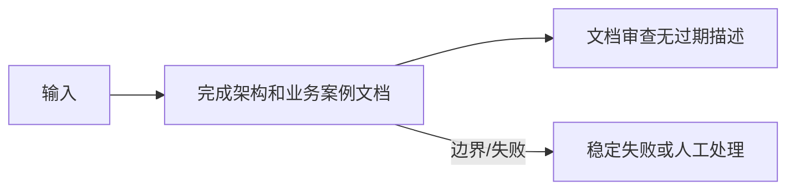

<!-- 本文件由 scripts/generate_course_tutorials.py 生成，请修改阶段计划或生成器后重新生成。 -->

# 第 32 周教程：最终发布与复盘

> 计划来源：[09-pilot-production-capstone.md](../stages/09-pilot-production-capstone.md)。阶段文档决定课程任务和验收，本文件解释逐节学习方法；学习状态仍只记录在[第 32 周成果](../../deliverables/week-32/README.md)。

## 本周先理解

### 为什么学

用统一证据回答平台是否可交付、业务是否值得推广以及能力边界在哪里。

### 这是什么

最终发布把可复现平台包、业务案例、指标、成本、风险、决策和答辩串成完整证据链，允许得出调整或停止结论。

### 本周学习策略

- 每天只完成下面一节，控制在约 1 小时，不提前堆叠下一节的新概念。
- 先预测再实验；先保存原始证据，再写结论；失败样例与正常结果同等重要。
- 首次遇到术语时补齐：一句话定义、输入输出、开发类比、类比边界、反例和“不是什么”。
- 使用 H1→H4 提示阶梯；若使用完整参考答案，必须额外完成一个不同输入或约束的变体。

## 逐节教程

### 周一 · 第 1 节：复核运行和业务数据

**为什么学**

本周要用统一证据回答平台是否可交付、业务是否值得推广以及能力边界在哪里。本节把“复核运行和业务数据”推进为可检查成果；如果跳过，后续会缺少“最终指标数据包”这项关键证据。

**这个是什么**

本周核心概念是：最终发布把可复现平台包、业务案例、指标、成本、风险、决策和答辩串成完整证据链，允许得出调整或停止结论。今天的“复核运行和业务数据”是这个核心能力的最小学习单元：你会通过“固定统计区间、样本和口径；区分相关性与因果，不把试点波动都归功于 AI”观察输入如何转化为“最终指标数据包”。它既包含可观察结果，也包含至少一个失败或不适用边界。只读完资料或只跑通正常路径，都不能证明已经掌握。

**怎么学（约 60 分钟）**

1. `0–5 分钟`：不查资料，写下你对本节主题的一句话解释、预期输入输出和一个疑问。
2. `5–15 分钟`：只阅读下方资料中与当前任务直接相关的部分，记录一个关键约束和版本信息。
3. `15–45 分钟`：执行专项任务：固定统计区间、样本和口径；区分相关性与因果，不把试点波动都归功于 AI
4. `45–55 分钟`：主动制造一个错误输入、边界条件、依赖失败或反例，保存现象并解释原因。
5. `55–60 分钟`：整理命令、输入、输出、Diff、图表或访谈证据，并用自己的语言完成 Teach-back。

专项资料：[GOV.UK Measuring Success](https://www.gov.uk/service-manual/measuring-success)

**怎么验证学会了**

- 必交证据：最终指标数据包。
- Teach-back：不看资料解释“复核运行和业务数据”解决什么问题、主要输入输出、一个边界，以及它不是什么。
- 失败证据：展示一个非正常场景，指出失败发生在哪一层，不能只贴错误截图。
- 变体任务：改变一个输入、参数、角色、权限或失败条件，在不照抄原步骤的情况下重新完成。
- 通过标准：以上四项均有证据，且能解释关键取舍；只能照步骤运行时最高算 L1，不能判定本节通过。

**参考答案（独立尝试至少 20 分钟后再看）**

> 这是一份合格答案骨架，不是唯一实现。看完后必须关闭参考答案，换一个输入或约束独立重做。

#### 步骤 1 参考：先写预测

- 一句话解释：最终发布把可复现平台包、业务案例、指标、成本、风险、决策和答辩串成完整证据链，允许得出调整或停止结论。
- 预测：完成“复核运行和业务数据”后，应能观察到“最终指标数据包”；失败输入不应产生假成功。

#### 步骤 2 参考：阅读资料

- 链接：[GOV.UK Measuring Success](https://www.gov.uk/service-manual/measuring-success)
- 指定章节/条目：该链接指向的“GOV.UK Measuring Success”整篇专题/章节；重点阅读与“复核运行和业务数据”直接对应的段落，页面更新时使用课程标题中的英文术语或 API 名页内搜索
- 阅读方法：只摘录一个定义、一个输入输出约束和一个失败边界；记录页面日期、协议版本或依赖版本。

#### 步骤 3 参考：按专项动作完成产出

- 专项动作：固定统计区间、样本和口径；区分相关性与因果，不把试点波动都归功于 AI
- 样例代码（先核对课程链接中的当前 API，再按本仓库边界修改）：

```python
def run_case(input_data: dict) -> dict:
    if not input_data:
        return {"status": "FAILED", "error": "EMPTY_INPUT"}
    # Replace this line with the lesson-specific call.
    result = {"observed": input_data, "status": "SUCCEEDED"}
    return result

print(run_case({"case": "normal"}))
print(run_case({}))  # failure case
```

#### 步骤 4 参考：制造失败并解释

- 失败注入：当样本、Owner 或数据来源不足时，把结论标为假设并给出验证计划；不能把模拟结果写成真实业务收益。
- 参考判断：失败必须映射为明确状态、错误、拒答、人工路径或未验证假设；日志和界面不得显示成功。

#### 步骤 5 参考：整理交付与 Teach-back

- 当天交付：最终指标数据包。
- 完整字段：指标名称；计算公式；数据来源；样本与时间窗；当前值；目标/阈值；限制与未验证项。
- Teach-back 参考：本节输入是什么、经过了什么处理、输出如何验证、哪种失败最危险、为什么当前方案没有越过课程边界。
- 完成后变体：更换一个输入、参数、角色、权限或失败条件，不看上述样例重新完成。


### 周二 · 第 2 节：计算收益、成本和风险

**为什么学**

本周要用统一证据回答平台是否可交付、业务是否值得推广以及能力边界在哪里。本节把“计算收益、成本和风险”推进为可检查成果；如果跳过，后续会缺少“ROI/TCO 复盘”这项关键证据。

**这个是什么**

本周核心概念是：最终发布把可复现平台包、业务案例、指标、成本、风险、决策和答辩串成完整证据链，允许得出调整或停止结论。今天的“计算收益、成本和风险”是这个核心能力的最小学习单元：你会通过“汇总节省时间、返工变化、调用成本、复核成本和事故风险，报告区间而非假精确值”观察输入如何转化为“ROI/TCO 复盘”。它既包含可观察结果，也包含至少一个失败或不适用边界。只读完资料或只跑通正常路径，都不能证明已经掌握。

**怎么学（约 60 分钟）**

1. `0–5 分钟`：不查资料，写下你对本节主题的一句话解释、预期输入输出和一个疑问。
2. `5–15 分钟`：只阅读下方资料中与当前任务直接相关的部分，记录一个关键约束和版本信息。
3. `15–45 分钟`：执行专项任务：汇总节省时间、返工变化、调用成本、复核成本和事故风险，报告区间而非假精确值
4. `45–55 分钟`：主动制造一个错误输入、边界条件、依赖失败或反例，保存现象并解释原因。
5. `55–60 分钟`：整理命令、输入、输出、Diff、图表或访谈证据，并用自己的语言完成 Teach-back。

专项资料：[AWS Well-Architected Cost Optimization](https://docs.aws.amazon.com/wellarchitected/latest/cost-optimization-pillar/welcome.html)

**怎么验证学会了**

- 必交证据：ROI/TCO 复盘。
- Teach-back：不看资料解释“计算收益、成本和风险”解决什么问题、主要输入输出、一个边界，以及它不是什么。
- 失败证据：展示一个非正常场景，指出失败发生在哪一层，不能只贴错误截图。
- 变体任务：改变一个输入、参数、角色、权限或失败条件，在不照抄原步骤的情况下重新完成。
- 通过标准：以上四项均有证据，且能解释关键取舍；只能照步骤运行时最高算 L1，不能判定本节通过。

**参考答案（独立尝试至少 20 分钟后再看）**

> 这是一份合格答案骨架，不是唯一实现。看完后必须关闭参考答案，换一个输入或约束独立重做。

#### 步骤 1 参考：先写预测

- 一句话解释：最终发布把可复现平台包、业务案例、指标、成本、风险、决策和答辩串成完整证据链，允许得出调整或停止结论。
- 预测：完成“计算收益、成本和风险”后，应能观察到“ROI/TCO 复盘”；失败输入不应产生假成功。

#### 步骤 2 参考：阅读资料

- 链接：[AWS Well-Architected Cost Optimization](https://docs.aws.amazon.com/wellarchitected/latest/cost-optimization-pillar/welcome.html)
- 指定章节/条目：该链接指向的“AWS Well-Architected Cost Optimization”整篇专题/章节；重点阅读与“计算收益、成本和风险”直接对应的段落，页面更新时使用课程标题中的英文术语或 API 名页内搜索
- 阅读方法：只摘录一个定义、一个输入输出约束和一个失败边界；记录页面日期、协议版本或依赖版本。

#### 步骤 3 参考：按专项动作完成产出

- 专项动作：汇总节省时间、返工变化、调用成本、复核成本和事故风险，报告区间而非假精确值
- 参考资料/文档产出：

- 主题：计算收益、成本和风险
- 建议字段：指标名称；计算公式；数据来源；样本与时间窗；当前值；目标/阈值；限制与未验证项
- 示例结论：已按统一口径产出“ROI/TCO 复盘”；证据不足的部分标记为假设或未验证。

#### 步骤 4 参考：制造失败并解释

- 失败注入：当样本、Owner 或数据来源不足时，把结论标为假设并给出验证计划；不能把模拟结果写成真实业务收益。
- 参考判断：失败必须映射为明确状态、错误、拒答、人工路径或未验证假设；日志和界面不得显示成功。

#### 步骤 5 参考：整理交付与 Teach-back

- 当天交付：ROI/TCO 复盘。
- 完整字段：指标名称；计算公式；数据来源；样本与时间窗；当前值；目标/阈值；限制与未验证项。
- Teach-back 参考：本节输入是什么、经过了什么处理、输出如何验证、哪种失败最危险、为什么当前方案没有越过课程边界。
- 完成后变体：更换一个输入、参数、角色、权限或失败条件，不看上述样例重新完成。


### 周三 · 第 3 节：决定推广、调整或停止

**为什么学**

本周要用统一证据回答平台是否可交付、业务是否值得推广以及能力边界在哪里。本节把“决定推广、调整或停止”推进为可检查成果；如果跳过，后续会缺少“决策记录和后续路线”这项关键证据。

**这个是什么**

本周核心概念是：最终发布把可复现平台包、业务案例、指标、成本、风险、决策和答辩串成完整证据链，允许得出调整或停止结论。今天的“决定推广、调整或停止”是这个核心能力的最小学习单元：你会通过“依据预设阈值作决策；推广必须说明适用边界和新增容量/治理需求”观察输入如何转化为“决策记录和后续路线”。它既包含可观察结果，也包含至少一个失败或不适用边界。只读完资料或只跑通正常路径，都不能证明已经掌握。

**怎么学（约 60 分钟）**

1. `0–5 分钟`：不查资料，写下你对本节主题的一句话解释、预期输入输出和一个疑问。
2. `5–15 分钟`：只阅读下方资料中与当前任务直接相关的部分，记录一个关键约束和版本信息。
3. `15–45 分钟`：执行专项任务：依据预设阈值作决策；推广必须说明适用边界和新增容量/治理需求
4. `45–55 分钟`：主动制造一个错误输入、边界条件、依赖失败或反例，保存现象并解释原因。
5. `55–60 分钟`：整理命令、输入、输出、Diff、图表或访谈证据，并用自己的语言完成 Teach-back。

专项资料：[NIST AI Resource Center](https://airc.nist.gov/)

**怎么验证学会了**

- 必交证据：决策记录和后续路线。
- Teach-back：不看资料解释“决定推广、调整或停止”解决什么问题、主要输入输出、一个边界，以及它不是什么。
- 失败证据：展示一个非正常场景，指出失败发生在哪一层，不能只贴错误截图。
- 变体任务：改变一个输入、参数、角色、权限或失败条件，在不照抄原步骤的情况下重新完成。
- 通过标准：以上四项均有证据，且能解释关键取舍；只能照步骤运行时最高算 L1，不能判定本节通过。

**参考答案（独立尝试至少 20 分钟后再看）**

> 这是一份合格答案骨架，不是唯一实现。看完后必须关闭参考答案，换一个输入或约束独立重做。

#### 步骤 1 参考：先写预测

- 一句话解释：最终发布把可复现平台包、业务案例、指标、成本、风险、决策和答辩串成完整证据链，允许得出调整或停止结论。
- 预测：完成“决定推广、调整或停止”后，应能观察到“决策记录和后续路线”；失败输入不应产生假成功。

#### 步骤 2 参考：阅读资料

- 链接：[NIST AI Resource Center](https://airc.nist.gov/)
- 指定章节/条目：该链接指向的“NIST AI Resource Center”整篇专题/章节；重点阅读与“决定推广、调整或停止”直接对应的段落，页面更新时使用课程标题中的英文术语或 API 名页内搜索
- 阅读方法：只摘录一个定义、一个输入输出约束和一个失败边界；记录页面日期、协议版本或依赖版本。

#### 步骤 3 参考：按专项动作完成产出

- 专项动作：依据预设阈值作决策；推广必须说明适用边界和新增容量/治理需求
- 参考资料/文档产出：

- 主题：决定推广、调整或停止
- 建议字段：一句话定义；输入；操作；可观察输出；失败/反例；工程意义；证据位置
- 示例结论：已按统一口径产出“决策记录和后续路线”；证据不足的部分标记为假设或未验证。

#### 步骤 4 参考：制造失败并解释

- 失败注入：删掉一个必填输入或让依赖失败，系统应返回可解释的失败结果且不产生假成功；再根据日志、Diff 或流程证据定位原因。
- 参考判断：失败必须映射为明确状态、错误、拒答、人工路径或未验证假设；日志和界面不得显示成功。

#### 步骤 5 参考：整理交付与 Teach-back

- 当天交付：决策记录和后续路线。
- 完整字段：一句话定义；输入；操作；可观察输出；失败/反例；工程意义；证据位置。
- Teach-back 参考：本节输入是什么、经过了什么处理、输出如何验证、哪种失败最危险、为什么当前方案没有越过课程边界。
- 完成后变体：更换一个输入、参数、角色、权限或失败条件，不看上述样例重新完成。


### 周四 · 第 4 节：整理平台发布包

**为什么学**

本周要用统一证据回答平台是否可交付、业务是否值得推广以及能力边界在哪里。本节把“整理平台发布包”推进为可检查成果；如果跳过，后续会缺少“发布包可复现”这项关键证据。

**这个是什么**

本周核心概念是：最终发布把可复现平台包、业务案例、指标、成本、风险、决策和答辩串成完整证据链，允许得出调整或停止结论。今天的“整理平台发布包”是这个核心能力的最小学习单元：你会通过“从干净环境安装、迁移、启动、创建 Agent、发布工作流和运行案例”观察输入如何转化为“发布包可复现”。它既包含可观察结果，也包含至少一个失败或不适用边界。只读完资料或只跑通正常路径，都不能证明已经掌握。

**怎么学（约 60 分钟）**

1. `0–5 分钟`：不查资料，写下你对本节主题的一句话解释、预期输入输出和一个疑问。
2. `5–15 分钟`：只阅读下方资料中与当前任务直接相关的部分，记录一个关键约束和版本信息。
3. `15–45 分钟`：执行专项任务：从干净环境安装、迁移、启动、创建 Agent、发布工作流和运行案例
4. `45–55 分钟`：主动制造一个错误输入、边界条件、依赖失败或反例，保存现象并解释原因。
5. `55–60 分钟`：整理命令、输入、输出、Diff、图表或访谈证据，并用自己的语言完成 Teach-back。

专项资料：[Reproducible Builds](https://reproducible-builds.org/docs/)

**怎么验证学会了**

- 必交证据：发布包可复现。
- Teach-back：不看资料解释“整理平台发布包”解决什么问题、主要输入输出、一个边界，以及它不是什么。
- 失败证据：展示一个非正常场景，指出失败发生在哪一层，不能只贴错误截图。
- 变体任务：改变一个输入、参数、角色、权限或失败条件，在不照抄原步骤的情况下重新完成。
- 通过标准：以上四项均有证据，且能解释关键取舍；只能照步骤运行时最高算 L1，不能判定本节通过。

**参考答案（独立尝试至少 20 分钟后再看）**

> 这是一份合格答案骨架，不是唯一实现。看完后必须关闭参考答案，换一个输入或约束独立重做。

#### 步骤 1 参考：先写预测

- 一句话解释：最终发布把可复现平台包、业务案例、指标、成本、风险、决策和答辩串成完整证据链，允许得出调整或停止结论。
- 预测：完成“整理平台发布包”后，应能观察到“发布包可复现”；失败输入不应产生假成功。

#### 步骤 2 参考：阅读资料

- 链接：[Reproducible Builds](https://reproducible-builds.org/docs/)
- 指定章节/条目：该链接指向的“Reproducible Builds”整篇专题/章节；重点阅读与“整理平台发布包”直接对应的段落，页面更新时使用课程标题中的英文术语或 API 名页内搜索
- 阅读方法：只摘录一个定义、一个输入输出约束和一个失败边界；记录页面日期、协议版本或依赖版本。

#### 步骤 3 参考：按专项动作完成产出

- 专项动作：从干净环境安装、迁移、启动、创建 Agent、发布工作流和运行案例
- 参考资料/文档产出：

- 主题：整理平台发布包
- 建议字段：一句话定义；输入；操作；可观察输出；失败/反例；工程意义；证据位置
- 示例结论：已按统一口径产出“发布包可复现”；证据不足的部分标记为假设或未验证。

#### 步骤 4 参考：制造失败并解释

- 失败注入：加入无答案、非法 Schema、超时或工具失败输入，正确结果应是拒答或稳定失败状态；如果输出看似正常但证据缺失，应判为失败。
- 参考判断：失败必须映射为明确状态、错误、拒答、人工路径或未验证假设；日志和界面不得显示成功。

#### 步骤 5 参考：整理交付与 Teach-back

- 当天交付：发布包可复现。
- 完整字段：一句话定义；输入；操作；可观察输出；失败/反例；工程意义；证据位置。
- Teach-back 参考：本节输入是什么、经过了什么处理、输出如何验证、哪种失败最危险、为什么当前方案没有越过课程边界。
- 完成后变体：更换一个输入、参数、角色、权限或失败条件，不看上述样例重新完成。


### 周五 · 第 5 节：完成架构和业务案例文档

**为什么学**

本周要用统一证据回答平台是否可交付、业务是否值得推广以及能力边界在哪里。本节把“完成架构和业务案例文档”推进为可检查成果；如果跳过，后续会缺少“文档审查无过期描述”这项关键证据。

**这个是什么**

本周核心概念是：最终发布把可复现平台包、业务案例、指标、成本、风险、决策和答辩串成完整证据链，允许得出调整或停止结论。今天的“完成架构和业务案例文档”是这个核心能力的最小学习单元：你会通过“图和字段必须与当前实现一致；分别写平台设计与业务过程，避免只列框架”观察输入如何转化为“文档审查无过期描述”。它既包含可观察结果，也包含至少一个失败或不适用边界。只读完资料或只跑通正常路径，都不能证明已经掌握。

**怎么学（约 60 分钟）**

1. `0–5 分钟`：不查资料，写下你对本节主题的一句话解释、预期输入输出和一个疑问。
2. `5–15 分钟`：只阅读下方资料中与当前任务直接相关的部分，记录一个关键约束和版本信息。
3. `15–45 分钟`：执行专项任务：图和字段必须与当前实现一致；分别写平台设计与业务过程，避免只列框架
4. `45–55 分钟`：主动制造一个错误输入、边界条件、依赖失败或反例，保存现象并解释原因。
5. `55–60 分钟`：整理命令、输入、输出、Diff、图表或访谈证据，并用自己的语言完成 Teach-back。

专项资料：[C4 Model](https://c4model.com/)

**怎么验证学会了**

- 必交证据：文档审查无过期描述。
- Teach-back：不看资料解释“完成架构和业务案例文档”解决什么问题、主要输入输出、一个边界，以及它不是什么。
- 失败证据：展示一个非正常场景，指出失败发生在哪一层，不能只贴错误截图。
- 变体任务：改变一个输入、参数、角色、权限或失败条件，在不照抄原步骤的情况下重新完成。
- 通过标准：以上四项均有证据，且能解释关键取舍；只能照步骤运行时最高算 L1，不能判定本节通过。

**参考答案（独立尝试至少 20 分钟后再看）**

> 这是一份合格答案骨架，不是唯一实现。看完后必须关闭参考答案，换一个输入或约束独立重做。

#### 步骤 1 参考：先写预测

- 一句话解释：最终发布把可复现平台包、业务案例、指标、成本、风险、决策和答辩串成完整证据链，允许得出调整或停止结论。
- 预测：完成“完成架构和业务案例文档”后，应能观察到“文档审查无过期描述”；失败输入不应产生假成功。

#### 步骤 2 参考：阅读资料

- 链接：[C4 Model](https://c4model.com/)
- 指定章节/条目：该链接指向的“C4 Model”整篇专题/章节；重点阅读与“完成架构和业务案例文档”直接对应的段落，页面更新时使用课程标题中的英文术语或 API 名页内搜索
- 阅读方法：只摘录一个定义、一个输入输出约束和一个失败边界；记录页面日期、协议版本或依赖版本。

#### 步骤 3 参考：按专项动作完成产出

- 专项动作：图和字段必须与当前实现一致；分别写平台设计与业务过程，避免只列框架
- 参考图（按实际角色、字段和状态修改）：



#### 步骤 4 参考：制造失败并解释

- 失败注入：当样本、Owner 或数据来源不足时，把结论标为假设并给出验证计划；不能把模拟结果写成真实业务收益。
- 参考判断：失败必须映射为明确状态、错误、拒答、人工路径或未验证假设；日志和界面不得显示成功。

#### 步骤 5 参考：整理交付与 Teach-back

- 当天交付：文档审查无过期描述。
- 完整字段：范围与参与者；输入；主路径；异常/拒绝路径；输出；信任或责任边界；版本与图例。
- Teach-back 参考：本节输入是什么、经过了什么处理、输出如何验证、哪种失败最危险、为什么当前方案没有越过课程边界。
- 完成后变体：更换一个输入、参数、角色、权限或失败条件，不看上述样例重新完成。


### 周六 · 第 6 节：准备最终演示与故障场景

**为什么学**

本周要用统一证据回答平台是否可交付、业务是否值得推广以及能力边界在哪里。本节把“准备最终演示与故障场景”推进为可检查成果；如果跳过，后续会缺少“20 分钟内稳定演示”这项关键证据。

**这个是什么**

本周核心概念是：最终发布把可复现平台包、业务案例、指标、成本、风险、决策和答辩串成完整证据链，允许得出调整或停止结论。今天的“准备最终演示与故障场景”是这个核心能力的最小学习单元：你会通过“依次展示管理、发布、业务触发、审批、恢复、评测、攻击阻断和回滚”观察输入如何转化为“20 分钟内稳定演示”。它既包含可观察结果，也包含至少一个失败或不适用边界。只读完资料或只跑通正常路径，都不能证明已经掌握。

**怎么学（约 60 分钟）**

1. `0–5 分钟`：不查资料，写下你对本节主题的一句话解释、预期输入输出和一个疑问。
2. `5–15 分钟`：只阅读下方资料中与当前任务直接相关的部分，记录一个关键约束和版本信息。
3. `15–45 分钟`：执行专项任务：依次展示管理、发布、业务触发、审批、恢复、评测、攻击阻断和回滚
4. `45–55 分钟`：主动制造一个错误输入、边界条件、依赖失败或反例，保存现象并解释原因。
5. `55–60 分钟`：整理命令、输入、输出、Diff、图表或访谈证据，并用自己的语言完成 Teach-back。

专项资料：[Google SRE：Testing for Reliability](https://sre.google/sre-book/testing-reliability/)

**怎么验证学会了**

- 必交证据：20 分钟内稳定演示。
- Teach-back：不看资料解释“准备最终演示与故障场景”解决什么问题、主要输入输出、一个边界，以及它不是什么。
- 失败证据：展示一个非正常场景，指出失败发生在哪一层，不能只贴错误截图。
- 变体任务：改变一个输入、参数、角色、权限或失败条件，在不照抄原步骤的情况下重新完成。
- 通过标准：以上四项均有证据，且能解释关键取舍；只能照步骤运行时最高算 L1，不能判定本节通过。

**参考答案（独立尝试至少 20 分钟后再看）**

> 这是一份合格答案骨架，不是唯一实现。看完后必须关闭参考答案，换一个输入或约束独立重做。

#### 步骤 1 参考：先写预测

- 一句话解释：最终发布把可复现平台包、业务案例、指标、成本、风险、决策和答辩串成完整证据链，允许得出调整或停止结论。
- 预测：完成“准备最终演示与故障场景”后，应能观察到“20 分钟内稳定演示”；失败输入不应产生假成功。

#### 步骤 2 参考：阅读资料

- 链接：[Google SRE：Testing for Reliability](https://sre.google/sre-book/testing-reliability/)
- 指定章节/条目：该链接指向的“Google SRE：Testing for Reliability”整篇专题/章节；重点阅读与“准备最终演示与故障场景”直接对应的段落，页面更新时使用课程标题中的英文术语或 API 名页内搜索
- 阅读方法：只摘录一个定义、一个输入输出约束和一个失败边界；记录页面日期、协议版本或依赖版本。

#### 步骤 3 参考：按专项动作完成产出

- 专项动作：依次展示管理、发布、业务触发、审批、恢复、评测、攻击阻断和回滚
- 参考资料/文档产出：

- 主题：准备最终演示与故障场景
- 建议字段：用例 ID；前置条件；输入/故障；预期状态；关键断言；实际结果；日志或 Trace；是否通过
- 示例结论：已按统一口径产出“20 分钟内稳定演示”；证据不足的部分标记为假设或未验证。

#### 步骤 4 参考：制造失败并解释

- 失败注入：删除身份、Scope 或审批后再次执行，正确结果应是执行路径明确拒绝且留下脱敏审计；如果仍成功，就是权限边界失效。
- 参考判断：失败必须映射为明确状态、错误、拒答、人工路径或未验证假设；日志和界面不得显示成功。

#### 步骤 5 参考：整理交付与 Teach-back

- 当天交付：20 分钟内稳定演示。
- 完整字段：用例 ID；前置条件；输入/故障；预期状态；关键断言；实际结果；日志或 Trace；是否通过。
- Teach-back 参考：本节输入是什么、经过了什么处理、输出如何验证、哪种失败最危险、为什么当前方案没有越过课程边界。
- 完成后变体：更换一个输入、参数、角色、权限或失败条件，不看上述样例重新完成。


### 周日 · 第 7 节：能力答辩与学习复盘

**为什么学**

本周要用统一证据回答平台是否可交付、业务是否值得推广以及能力边界在哪里。本节把“能力答辩与学习复盘”推进为可检查成果；如果跳过，后续会缺少“完成最终提交”这项关键证据。

**这个是什么**

本周核心概念是：最终发布把可复现平台包、业务案例、指标、成本、风险、决策和答辩串成完整证据链，允许得出调整或停止结论。今天的“能力答辩与学习复盘”是这个核心能力的最小学习单元：你会通过“按原理、实现、取舍、证据、失败、优化和限制回答；列出下一阶段真实流量目标”观察输入如何转化为“完成最终提交”。它既包含可观察结果，也包含至少一个失败或不适用边界。只读完资料或只跑通正常路径，都不能证明已经掌握。

**怎么学（约 60 分钟）**

1. `0–5 分钟`：不查资料，写下你对本节主题的一句话解释、预期输入输出和一个疑问。
2. `5–15 分钟`：只阅读下方资料中与当前任务直接相关的部分，记录一个关键约束和版本信息。
3. `15–45 分钟`：执行专项任务：按原理、实现、取舍、证据、失败、优化和限制回答；列出下一阶段真实流量目标
4. `45–55 分钟`：主动制造一个错误输入、边界条件、依赖失败或反例，保存现象并解释原因。
5. `55–60 分钟`：整理命令、输入、输出、Diff、图表或访谈证据，并用自己的语言完成 Teach-back。

专项资料：[讲师监督与掌握度评估](../07-instructor-supervision.md)

**怎么验证学会了**

- 必交证据：完成最终提交。
- Teach-back：不看资料解释“能力答辩与学习复盘”解决什么问题、主要输入输出、一个边界，以及它不是什么。
- 失败证据：展示一个非正常场景，指出失败发生在哪一层，不能只贴错误截图。
- 变体任务：改变一个输入、参数、角色、权限或失败条件，在不照抄原步骤的情况下重新完成。
- 通过标准：以上四项均有证据，且能解释关键取舍；只能照步骤运行时最高算 L1，不能判定本节通过。

**参考答案（独立尝试至少 20 分钟后再看）**

> 这是一份合格答案骨架，不是唯一实现。看完后必须关闭参考答案，换一个输入或约束独立重做。

#### 步骤 1 参考：先写预测

- 一句话解释：最终发布把可复现平台包、业务案例、指标、成本、风险、决策和答辩串成完整证据链，允许得出调整或停止结论。
- 预测：完成“能力答辩与学习复盘”后，应能观察到“完成最终提交”；失败输入不应产生假成功。

#### 步骤 2 参考：阅读资料

- 链接：[讲师监督与掌握度评估](../07-instructor-supervision.md)
- 指定章节/条目：该链接指向的“讲师监督与掌握度评估”整篇专题/章节；重点阅读与“能力答辩与学习复盘”直接对应的段落，页面更新时使用课程标题中的英文术语或 API 名页内搜索
- 阅读方法：只摘录一个定义、一个输入输出约束和一个失败边界；记录页面日期、协议版本或依赖版本。

#### 步骤 3 参考：按专项动作完成产出

- 专项动作：按原理、实现、取舍、证据、失败、优化和限制回答；列出下一阶段真实流量目标
- 参考资料/文档产出：

- 主题：能力答辩与学习复盘
- 建议字段：目标；事实与证据；关键决定；备选方案；失败与风险；限制；后续动作；负责人/时间
- 示例结论：已按统一口径产出“完成最终提交”；证据不足的部分标记为假设或未验证。

#### 步骤 4 参考：制造失败并解释

- 失败注入：删掉一个必填输入或让依赖失败，系统应返回可解释的失败结果且不产生假成功；再根据日志、Diff 或流程证据定位原因。
- 参考判断：失败必须映射为明确状态、错误、拒答、人工路径或未验证假设；日志和界面不得显示成功。

#### 步骤 5 参考：整理交付与 Teach-back

- 当天交付：完成最终提交。
- 完整字段：目标；事实与证据；关键决定；备选方案；失败与风险；限制；后续动作；负责人/时间。
- Teach-back 参考：本节输入是什么、经过了什么处理、输出如何验证、哪种失败最危险、为什么当前方案没有越过课程边界。
- 完成后变体：更换一个输入、参数、角色、权限或失败条件，不看上述样例重新完成。


## 本周收尾

按[成果与提交标准](../06-deliverable-standards.md)整理本周成果，再由讲师按[监督与掌握度规范](../07-instructor-supervision.md)给出“通过、部分通过、未通过”。教程完成不代表学习者已经掌握，必须以独立运行、排错、Teach-back 和变体证据为准。
